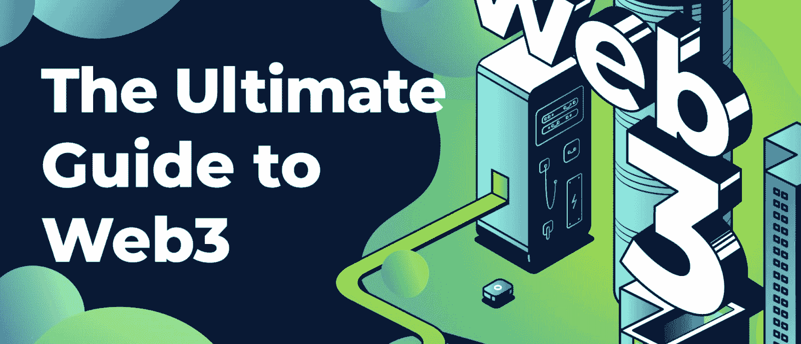
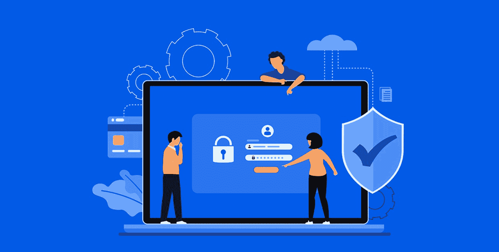
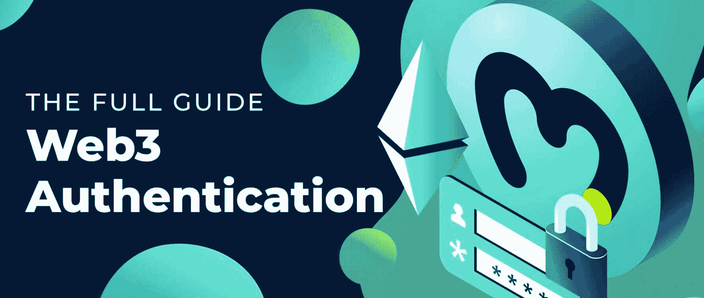
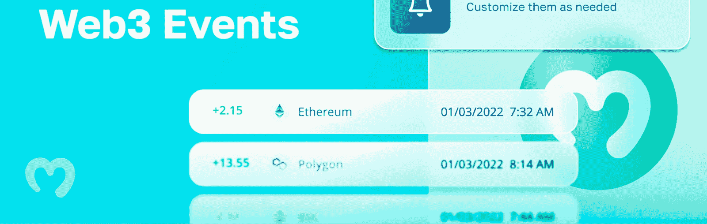

# 面向企业的 web 3–web 3 中的业务应用

> 原文：<https://moralis.io/web3-for-enterprise-business-applications-in-web3/>

随着区块链应用的迅速增加，对面向商业应用的 Web3 解决方案的需求也在增加。有了 Moralis 提供的可扩展 Web3 基础设施，任何寻求进入 Web3 的企业都可以轻松实现。

**受到行业领导者的信任**

借助 Moralis 的 Web3 for enterprise，企业可以利用以下优势:

*   ✅业界领先的 web3 apis
*   ✅跨链兼容性
*   ✅多技术堆栈集成
*   ✅游戏引擎支持

[**Get Started with Moralis’ Web3 Infrastructure**](https://moralis.io/scale/)

### 概观

严肃的公司和企业正急切地探索向 Web3 转变的意义。然而，企业将如何利用这项技术呢？这是一个万亿美元的问题，我们将在本文中重点关注，同时深入探讨 Web3 for enterprise 的复杂性！

在探索 Web3 for enterprise 之前，我们先来仔细看看 Web3 以及 Web3 行业需要什么。通过这样做，我们将展示互联网发展下一步的潜力。更重要的是，一旦我们对 Web3 for enterprise 的内涵有了更深刻的理解，我们也会更仔细地研究[Moralis 观](https://moralis.io)。Moralis 提供了一套开发工具，使得企业进入 Web3 比以往任何时候都更容易。

例如，Moralis 提供了各种 API，比如 NFT API。这是一个跨链兼容的工具，这意味着您可以为各种不同的区块链网络创建 NFT。因此，这一个 API，例如，充当一个完美的[以太坊 NFT API](https://moralis.io/what-is-an-ethereum-nft-api-ethereum-nft-apis-explained/) 、[多边形 NFT API](https://moralis.io/what-is-a-polygon-nft-api-polygon-nft-apis-explained/) 等。如果这听起来很有趣，仔细看看我们的指南[如何创建一个 NFT 项目](https://moralis.io/how-to-create-an-nft-project-get-started-and-launch-successfully/)，它探索了如何开始并成功启动！

作为一个令人兴奋的新兴行业，现在是成为区块链开发者的时候了，最好的方式就是[注册 Moralis](https://admin.moralis.io/register) ！

### 什么是 Web3？

在探索 Web3 for enterprise 之前，我们首先需要弄清楚“Web3”意味着什么。因此，本节将探讨什么是 Web3 以及互联网的下一阶段可能产生的影响。所以，事不宜迟，让我们来回答这个问题，“[web 3](https://moralis.io/the-ultimate-guide-to-web3-what-is-web3/)是什么？”。

定义 Web3 可能很有挑战性，因为互联网上有数百种不同的定义。然而，简而言之，Web3 是“第三代互联网”。这一新网络的最清晰定义可能是去中心化区块链技术的使用——这一术语最常与以太坊和比特币等加密货币联系在一起。然而，作为 Web3 的核心部分，我们需要理解区块链的复杂性。

本质上，区块链基本上是一个由节点网络共享的分布式分类帐或数据库。节点对网络至关重要，因为它们负责链的安全。此外，节点通过保持网络上发生的事务和事件的不变记录来实现这一点。此外，这项技术允许更高程度的去中心化，这是 Web3 的一个重要特征。

Web3 为用户提供了巨大的好处，并有可能瓦解大型企业集团。一个例子是用户能够将他们的活动货币化，并为不同的平台和项目做出贡献。对于大公司来说，区块链技术提供了对不变数据库的便捷访问，并且在物流和金融等领域有着数不清的应用。

此外，Web3 的去中心化特征使得平台的民主管理成为可能。这将把决策权分配给平台的实际用户，并剥夺个人的权力。此外，Web3 的去中心化特征消除了中心化带来的单点故障问题。不过，这只是三个例子，优点还多着呢！

## 什么是 Web3 for Enterprise？

为 Web3 奠定基础的突破性技术有可能改变互联网的基础设施。此外，它还可能改变未来购买和交付服务的方式。因此，我们将在接下来的章节中探讨它将如何影响业务，以及它在企业环境中意味着什么。

Web3 几乎肯定会对我们的 IT 系统未来的工作方式产生重大影响。权力下放已经是一个突出的商业趋势，持续增长，没有停止的迹象。因此，更大份额的应用程序很可能是开源的，并通过使用[智能合约](https://moralis.io/smart-contracts-explained-what-are-smart-contracts/)来运行。这将提供更大的透明度，允许利益相关者查看、验证和决定平台或网络上发生的事情。

对于面向企业的 Web3 来说，这仅仅是个开始。密码术和不可变的分类账现在多少经受住了时间的考验，并为去中心化奠定了基础。然而，尽管去中心化本身是革命性的，但它远不是 Web3 将影响的唯一事物。许多人认为，Web3 将进一步影响企业使用的核心技术，并最终影响企业的运营方式。这包括从 IT 到客户体验、商业模式和管理结构的一切。

这展示了 Web3 的重要性，并给出了为什么企业越来越希望采用 Web3 技术的一些背景。这可能是一个有趣的机会来获得巨大的市场份额和竞争优势，并最终成为生存的必需品。

现在，随着对什么是 Web3 for enterprise 有了更深入的了解，让我们继续探索这个领域中组织的更多机会。

## 企业的 Web3 机会

对于任何组织来说，进入一个新的领域并采用全新的技术似乎都是一项艰巨的任务。然而，Web3 的好处和机会大于风险，即使这个领域仍然处于起步阶段。因此，企业现在可以开始朝着几个目标努力。因此，本节将探讨组织可以开始应用 Web3 的一些关键领域。

我们将进一步了解以下三个方面:

1.  区块链和分布式账本技术
2.  分散自治组织
3.  Web3 身份验证

### 区块链和分布式账本技术

很长一段时间以来，在几个行业内都有在几个领域使用区块链技术的呼声。例如，组织已经尝试使用区块链进行供应链跟踪、存储数据、检测假冒产品等。这些都是目前正在成熟的用例，我们甚至看到特定行业的区块链财团正在出现。

### 道斯

DAO 是“分散自治组织”的缩写，一般指基于 Web3 的项目或协议的治理主体。在 DAO 启动时，令牌被分发，并且利益相关者具有良好建立的决策过程，通常在智能契约中指定。此外，令牌持有者有权参与组织的治理。

然而，Dao 并不局限于整个组织的治理，而是可以应用于其他类似的企业环境中。例如，从投资和创新到基于 IP 的服务，都可以使用 DAOs。

假设您想了解更多关于 DAOs 的知识，并想知道如何创建一个 DAOs。如果是这样，请查看我们的指南[如何建立一个分散的自治组织](https://moralis.io/how-to-build-a-decentralized-autonomous-organization-dao/)！

### Web3 身份验证

Web3 应用程序(又名 dapps)越来越受欢迎，为用户提供了更流畅、更简单的登录体验。对于各种不同的平台，客户有不同的登录详细信息，这可能会使登录过程变得混乱和零碎。然而，在某些情况下，例如，我们可以使用我们的谷歌账户登录其他网站。在这些情况下，谷歌拥有用户信息和数据。

Web3 认证允许用户使用他们的 [Web3 钱包](https://moralis.io/what-is-a-web3-wallet-web3-wallets-explained/)登录。因此，没有必要为所有不同的 dapps 创建帐户。然而，实现 Web3 认证或[基于区块链的认证](https://moralis.io/blockchain-based-authentication-how-to-integrate/)可能相当棘手，这就是为什么您可能会发现利用 Moralis 很有帮助。此外，这只是三个突出的例子，说明了 Web3 在企业中可能会发挥重要作用。面向企业的 Web3 还有更多功能！

## 通过 Moralis 使企业的 Web3 变得可访问

尽管面向企业的 Web3 肯定会成为一个越来越有吸引力的机会，但该领域的进入壁垒仍然很高。从传统的角度来看，组织和企业不总是很容易愿意冒险采用新技术，因为它可能成本高昂。

然而，这正是 Moralis 的切入点，它降低了准入门槛，允许企业更无缝地采用 Web3 技术。此外，Moralis 使 Web3 开发变得更加容易，其重点是 Web3 认证、Web3 流和 API。因此，我们将在接下来的三个部分中更深入地探索这三个领域，从 Web3 身份验证开始。

### Web3 身份验证

乍一看，Web3 认证似乎有点复杂。然而，也不尽然。本质上，它本质上只是一个登录机制。此外，在使用 Moralis 时，认证 Web3 用户并不一定很困难。

从传统的角度来看，建立基础设施来[认证 Web3 用户](https://moralis.io/how-to-authenticate-web3-users/)是非常具有挑战性的。现在，有了 Moralis 的 Web3 Auth API，您可以用单行代码实现这一功能！

无论您想要连接 Web3 身份验证的现有 Web3 数据库，想要将 Web3 身份验证聚合器用于您组织的身份验证流程，还是想要从头开始创建 Web3 dapp，Auth API 都将在所有这些工作中提供帮助。此外，Moralis 的 Web3 身份验证 API 允许您避免理解身份验证流程的传统麻烦，了解钱包如何签名和验证消息，将用户重定向到第三方身份验证接口等。因此，当使用 Moralis 时，您可以节省大量的开发时间，因为 API 会为您处理这些。

如果你想了解更多关于 Web3 认证的知识，请查看 Moralis 网站上的官方文档。

### Web3 流

随着区块链不断促进交易，区块链网络的状态也在不断变化。因此，每当你处理实时链上数据时，确保我们利用正确的同步是至关重要的。因此，这就是 Moralis 的亮点，它允许你以一种更容易理解的方式实现 [Web3 streams](https://moralis.io/streams/) 。

如果您需要从 NFT 余额到用户交易的任何东西，您的最佳选择是使用 Moralis 的 Web3 Streams API。此外，选择 Moralis 的 Web3 Streams API 的众多原因之一是与其他特性的互操作性，例如前面提到的 Web3 Auth API。

因此，无论你是从零开始创建一个新的 Web3 项目，还是将你已经存在的公司连接到 Web3，都没有关系；Moralis 的 Web3 Streams API 将为您节省大量时间！

### 面向企业的 web 3–API

最后，结合使 Web3 认证和流更易访问，Moralis 提供了一系列 Web3 APIs，使 Web3 tech for enterprise 的实现更加无缝。

Moralis 的 NFT API 是使 Web3 开发更容易的众多特性之一。沿着 NFT API，你还会发现 [EVM API](https://moralis.io/evm-api/) 允许你轻松地创建 dapps。此外，EVM API 是跨链兼容的，使企业无需额外的努力就可以为多个 EVM 兼容链创建 dapps。

所以，不管你是想要[创造一个以太坊 dapp](https://moralis.io/how-to-create-an-ethereum-dapp-instantly/) 还是想要[建造多边形 dapp](https://moralis.io/how-to-build-polygon-dapps-easily/)；API 将帮助这两个过程。因此，该工具作为[以太坊 dapp API](https://moralis.io/what-is-an-ethereum-dapp-api-build-ethereum-dapps-easily/) 和[多边形 dapp API](https://moralis.io/polygon-dapp-api-how-to-efficiently-create-polygon-dapps/) 都能完美工作！

## 面向企业的 web 3–摘要

随着 Web3 行业的成熟，大型组织和企业进入该领域并采用该技术变得越来越有吸引力。因此，面向企业的 Web3 正成为一个越来越令人兴奋的领域，有待进一步探索。出于这个原因，我们通过这篇文章来更深入地探究 Web3 for enterprise 的复杂性。在此过程中，我们讨论了它所包含的内容以及它将如何影响全球的企业。

此外，去中心化似乎是最突出的商业趋势之一，这是由于像区块链这样的 Web3 技术才成为可能的。因此，面向企业的 Web3 将为利益相关者提供更多的去中心化和透明度。然而，这似乎是一个开始，我们可能会在从 IT 到管理结构、客户体验等领域看到更多的创新。

然而，从传统的角度来看，企业模型很难进入区块链空间。因此，降低这一领域的准入门槛至关重要，这也是 Moralis 的切入点。Moralis 提供了更无缝的开发体验，例如，通过其 Web3 Streams API，可以更容易地认证 Web3 用户和创建 [Web3 webhooks](https://moralis.io/web3-webhooks-the-ultimate-guide-to-blockchain-webhooks/) 。

假设你对这个领域感兴趣，想成为一名区块链开发者。如果是这样的话，你可以在[Moralis 博客](https://moralis.io/blog/)这里获得新鲜相关的 [Web3 开发](https://moralis.io/how-to-build-decentralized-apps-dapps-quickly-and-easily/)内容。例如，探索更多关于 [Web3 栈](https://moralis.io/web3-stack-the-full-guide-to-web3-development/)或者如何[构建一个 Solana dapp](https://moralis.io/how-to-build-a-solana-dapp-in-3-steps/) ！

因此，如果您对 Web3 for enterprise 感兴趣，[注册 Moralis](https://admin.moralis.io/register) 并获得一些最佳功能，让您轻松创建 Web3 兼容的项目，并弥合 Web2 和 Web3 之间的差距！