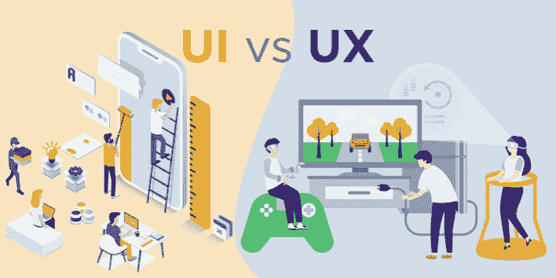

# Web3 前端——构建 Dapp 前端所需的一切

> 原文：<https://moralis.io/web3-frontend-everything-you-need-to-learn-about-building-dapp-frontends/>

最近，每个人都在谈论去中心化网络的到来。此外，新的 [**dapps**](https://moralis.io/decentralized-applications-explained-what-are-dapps/) **(去中心化应用)、游戏、网页和其他 Web3 项目正在到处涌现。作为一名区块链开发人员，前端开发是你需要掌握的必要技能之一。然而，如果你是密码行业的新手，你可能不完全确定 Web3 前端开发需要什么。在本文中，我们深入探讨了 Web3 前端开发的复杂性，以及构建 dapp 前端需要学习的一切。此外，我们将探索一些 Web3 前端工作，让您了解潜在的工作机会！**

我们将从近距离了解什么是前端开始。接下来，我们将更深入地研究前端开发以及成为一名熟练的前端开发人员所必需的技能。我们还将探讨 Web2 和 Web3 的前端开发有何不同。最后，我们将通过查看潜在的 Web3 前端工作来结束一切！

从传统的角度来看，当涉及到去中心化的 web 时，通常是 dapps 的前端缺乏适当的 ui。这并不奇怪，因为区块链开发通常是由开发人员为开发人员完成的。然而，现在 [Web3](https://moralis.io/the-ultimate-guide-to-web3-what-is-web3/) 越来越接近主流采用，开发者需要将更多的注意力放在应用前端。幸运的是，Web2 和 Web3 的前端开发并没有太大的不同。尽管如此，这两个空间之间仍然有明显的区别，我们将在本文后面进一步探讨。

此外，Web3 的前端开发疏忽部分源于时间限制。后端开发通常是最乏味的区块链开发任务；然而，随着[基础设施即服务](https://moralis.io/iaas-explained-what-is-infrastructure-as-a-service/) (IaaS)平台(如 [Moralis](https://moralis.io/) )的出现，开发人员现在可以更加专注于前端开发！

## 什么是前端？

应用程序、网站、dapps、游戏等的前端。，构成了用户可以看到并与之交互的一切。此外，我们经常称之为“客户端”。这包括颜色、样式、图像、动画、图表、表格、按钮、文本、菜单等等。举个例子，你在 Moralis 的互动，比如你正在阅读的文本，顶部的“免费开始”和“登录”按钮，以及图片都是 Moralis 前端的一部分。

dapp 前端的两个基本组件是用户界面(UI)和用户体验(UX)。然而，这两个概念到底是什么，它们有什么不同？为了回答这个问题，我们将继续探索 UI 设计的复杂性。之后，也许你会下一步去寻找 Web3 前端的工作，成为一名 Web3 UI 设计师？

### 前端组件:用户界面

网页、应用程序或 dapp 的 UI 是用户交互发生的空间。UI 的主要目标是促进无缝 UX，这是通过使界面直观和易于导航来实现的。创建一个好的 UI 可能相当棘手；然而，如果使用正确的工具，这个过程就像是轻而易举的事情(稍后将详细介绍)！现在，让我们看看三个基本的 UI 元素:交互设计、信息架构和视觉设计。

*   交互设计–用户界面应该是交互的，因为它将被动的读者转化为主动的参与者。这可以通过为用户提供输入信息的机会来实现。
*   **信息架构**–以逻辑方式呈现信息，让用户更容易浏览网页或应用程序，这一点至关重要。
*   **视觉** **设计**–ui 需要美观，需要考虑颜色、合约、字体等几个方面。网页或 dapps 必须针对其他平台进行优化，这是视觉设计元素的一部分。

由于 UI 设计相对来说比较复杂，所以在这个过程中使用一些工具是有益的。说到 Web3 前端开发，你应该看看 Moralis 的 [web3uikit](https://moralis.io/web3ui-kit-the-ultimate-web3-user-interface-kit/) 。这是一个 Moralis 为 Web3 构建的 UI 工具包，让开发者创建好看的 Web3 应用程序变得非常容易！现在，让我们更深入地挖掘和了解另一个你在搜索 Web3 前端工作时可能感兴趣的前端组件:用户体验。

### 前端组件:用户体验

同时，UI 主要关注用户与应用程序或网站交互的空间；UX 涵盖了整个顾客旅程。相应地，UX 设计更倾向于客户研究、测试设计和创建客户角色。这表明，从事各种 Web3 前端工作的 UX 设计师在做出任何战略决策时，都需要时刻牢记客户。

然而，重要的是要知道 UI 和 UX 是两个紧密相连的概念，两者之间的界限会变得有些模糊。但是，通常的区别是 UI 设计主要关注产品的外观和功能；与此同时，UX 更注重使用产品时的整体感受。

对什么是前端有了更好的理解，我们可以继续前进，更仔细地看看前端开发需要什么。然而，在此之前，如果你对 UI 设计感兴趣，请查看我们关于如何[创建一个伟大的 dapp UI](https://moralis.io/web3-ui-how-to-create-a-great-dapp-ui/) 的文章！

## 什么是前端开发？

应用程序、网站或 dapp 前端构成了从用户可以看到的到更多交互式元素(如按钮和输入字段)的一切，前端开发本质上需要实现这些组件。

因此，前端开发人员负责构建、设计和实现对用户可见的一切。此外，前端开发人员的主要目标是响应能力和性能。这意味着他们的任务是创建一个有效且高效的用户界面，让用户可以轻松地导航和交互。在这种情况下，如果一个前端开发人员与 UX 设计紧密合作是有益的，因为它与应用程序或网页的用户界面紧密相连。

此外，前端开发人员通常有责任确保应用程序或网站的响应性。这意味着它可以在各种设备上正确显示。此外，应用程序或网站需要在各种尺寸的屏幕上正常运行和显示。

所以，现在我们知道了什么是前端开发人员以及在这个领域中的职责，让我们来看看精通前端开发的必要技能！

### 前端开发技能

说到 web 开发，开发人员基本上需要精通 HTML、CSS 和 JavaScript。这三个是前端开发的重要组成部分。这一节将从 HTML 开始，对它们进行更深入的探讨。

*   **HTML**–HTML 代表“超文本标记语言”，前端开发者使用这种语言来结构化网页的内容。在这里我们可以找到输入字段、按钮、标题等的代码。
*   CSS–[CSS](https://moralis.io/cascading-style-sheets-what-is-css/)是“层叠样式表”的缩写，程序员用它来设计网页和应用程序。该工具使 web 开发人员更容易定制网页，包括颜色、布局、动画等的定制。
*   JavaScript–[JavaScript](https://moralis.io/javascript-explained-what-is-javascript/)(JS)是一种主要用于 web 开发的编程语言，它已经成为最成熟的前端开发工具之一。JS 可以更新 CSS 和 HTML 元素，这表明这种编程语言在使网站更具交互性方面至关重要。

除了 HTML、CSS 和 JavaScript，前端开发人员也可以从理解框架和库中受益。这些都是重要的工具，使得前端开发更加容易，效率也显著提高。框架是预先编写的代码模块，用于搜索和登录界面等重复出现的元素。框架很容易合并，两个流行的例子是 AngularJS 和 [React](https://moralis.io/react-explained-what-is-react/) 。

库是扩展和插件的集合，它们帮助将已经构建的元素添加到网页中。有许多不同的库可供使用；然而，在下一节中，我们将更仔细地研究 Web3.js，因为这是 Web2 和 Web3 前端开发之间最显著的区别！

## Web3 前端开发

对我们来说幸运的是，Web2 和 Web3 前端开发之间有一些显著的差异。即使是这样，dapps 和其他 Web3 项目在前端方面也很不幸地缺乏，这有点矛盾。

然而，这部分源于开发者通常为其他开发者创建 dapps。更重要的是，Web3 后端开发相当繁琐，这表明开发人员在前端开发上的时间分配受到了限制，使这成为一个相对年轻的领域。

幸运的是，由于 Moralis 等 IaaS 平台，这种情况不再存在。Moralis 操作系统负责大部分繁重的后端开发，允许区块链开发人员将更多时间分配给前端。

尽管如此，Web3 前端开发人员的主要任务仍然与 Web2 相同，在 web 2 中，他们实现对用户可见的一切。由于 Web2 和 Web3 前端开发人员通常有相同的任务，他们也需要相同的技能，包括精通 HTML、CSS 和 JavaScript。

然而，即使这些字段之间有许多相似之处，我们仍需要考虑一些差异，主要差异是 web 3 . js。web 3 . js 是 JavaScript 库的集合，允许开发人员例如与本地或远程[以太坊](https://moralis.io/full-guide-what-is-ethereum/)节点进行交互。通过 HTTP 或 IPC 连接发生的交互。

这意味着 Web2 和 Web3 前端开发的最大区别是对这个库的了解。因此，熟练掌握 Web3.js 对于成功驾驭加密领域的前端开发是非常有益的。你可以在我们名为“[什么是 JavaScript 和 Web3.js”的文章中了解更多关于 Web3.js 的内容。](https://moralis.io/web3-and-javascript-what-is-javascript-and-web3-js/)”。更重要的是，你可以查看[Moralis 博客](https://moralis.io/blog/)，阅读更多的 [JavaScript 库](https://moralis.io/javascript-libraries-ethers-js-vs-web3-js/)。

## Web3 前端作业

随着 Web3 越来越接近主流采用，创建伟大的前端变得比以往任何时候都更加紧迫。随着不太懂技术的人进入加密领域，该行业需要能够创建更直观的 ui 的前端开发人员。因此，Web3 前端开发的机会比以往任何时候都多。因此，在下一节中，我们将介绍三种不同类型的 Web3 前端作业。

1.  **前端开发人员**——web 3 前端三个工作中第一个也是最明显的就是前端开发人员。Web3 前端开发人员实现了 dapp 或网页用户看到的和与之交互的一切。这意味着他们负责实现按钮、搜索栏、输入框等元素。此外，在上一节中，我们介绍了 Web3 前端开发所必需的所有复杂性和技能。
2.  前端设计师(Frontend Designer)——你可能还记得以前的事情，UI 和 UX 都是构建前端的重要部分，这也是前端设计师进入画面的地方。设计师从 UX 的角度来考虑，以确保用户界面是直观的，并适合终端消费者。更何况前端设计师一般也有一定的开发经验，可以自己写代码。
3.  艺术家——web 3 前端工作的最后一个例子是艺术家。虽然前端开发人员和设计师对于前端的实现是必不可少的，但我们还需要艺术家来提供图形和艺术品。例如，艺术家可能负责为网页提供图像或图标。

这只是 Web3 前端工作的三个例子，还有更多需要你自己去探索！

## Web3 前端开发–总结

由于 Web3 后端开发固有的复杂性，从传统的角度来看，这是区块链开发者必须分配大部分时间的地方。因此，dapps 通常缺乏前端、UI 和 UX 开发的某些方面。然而，随着 Moralis 等操作系统的出现，开发人员现在有机会更多地关注前端开发。

由于 Moralis 提供的底层后端基础设施，这一切都是可能的。以此为前提，结合 Moralis' [NFT API](https://moralis.io/ultimate-nft-api-exploring-moralis-nft-api/) 等开发工具。，有可能大大减少开发时间。事实上，作为一个用户，你将有可能减少平均开发时间高达 87%！

此外，现在 Web3 走向大规模采用，开发直观的前端变得越来越重要。更重要的是，随着对 Web3 开发人员需求的增加，这为程序员提供了机会。因此，我们更深入地研究了 Web3 前端开发的复杂性，为您提供了它所需要的内容和必要技能的概述。此外，我们仔细研究了一些 Web3 前端工作，让你了解这个领域需要什么。

如果你渴望成为一名熟练的 Web3 前端开发者，你可以在[Moralis 学院](https://academy.moralis.io/)学习基本技能。Moralis 学院提供市场上最好的[区块链开发课程](https://academy.moralis.io/all-courses)，是进入前端开发的最佳场所。例如，你可以注册 [JavaScript 编程 101](https://academy.moralis.io/courses/javascript-programming-for-blockchain-developers) 来开始学习！

此外，如果你有进入区块链发展的雄心，你会在 Moralis 找到你需要的一切！因此，[与 Moralis](https://admin.moralis.io/register) 签约，马上开始开发你的第一个 Web3 项目！