# Web3 游戏设计–解释 Web3 游戏设计流程

> 原文：<https://moralis.io/web3-game-design-explaining-the-web3-game-design-process/>

Web3 游戏的结构和设计包括许多不同的元素。当考虑 Web3 游戏设计时，你必须考虑项目的细节，特定的阶段，以及实现什么样的加密功能。包括金钱方面是许多用户更喜欢的。例如，我们在 [**GameFi 和 play-to-earn (P2E)**](https://moralis.io/what-is-gamefi-and-play-to-earn-p2e/) **概念中看到了这一点，用户可以在参与 Web3 游戏的同时赚取密码。随着加密领域的不断扩大和加密游戏活跃用户数量的激增，现在是深入区块链编程和学习 Web3 游戏设计的绝佳时机。如果这是你想参与的事情，那你来对地方了。在这篇文章中，我们将以一种简化的方式解释 Web3 游戏的设计过程。**

在过去的几年里，Web3 技术已经取得了长足的进步。因此，Web3 游戏设计现在比你想象的要简单得多。今天， [JavaScript](https://moralis.io/javascript-explained-what-is-javascript/) 和 Unity 精通的开发者，没有之前 [Web3](https://moralis.io/the-ultimate-guide-to-web3-what-is-web3/) 的知识，正在创造杀手级的 dapp([去中心化应用](https://moralis.io/decentralized-applications-explained-what-are-dapps/))。怎么会？他们正在使用终极的 [Web3 后端平台](https://moralis.io/exploring-the-best-web3-backend-platform/)–[Moralis](https://moralis.io/)。这个“ [Firebase for crypto](https://moralis.io/firebase-for-crypto-the-best-blockchain-firebase-alternative/) ”操作系统是跨链和跨平台可互操作的。因此，它为前端开发人员提供了无数的机会。现在，随着我们向前推进，我们将首先介绍 Web3 和 Web3 游戏的基础知识，以便让大家快速了解。此外，我们将提到 Web3 游戏的核心优势。然后，我们将仔细看看 Web3 游戏的设计过程。在此过程中，我们将涵盖玩家类型和游戏循环。此外，我们还将了解 Moralis 如何帮助您参与 Web3 游戏。

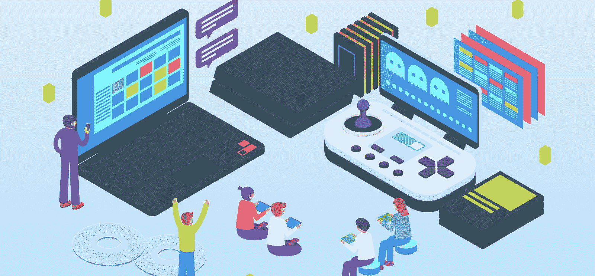

## 什么是 Web3 和 Web3 游戏？

Web3 是利用区块链技术的下一代互联网。它融入了金融工具，增加了一个全新的维度。Web3 的一些关键特征是去中心化、透明性和不变性。因此，没有单一的公司或实体持有数据。相反，数据的所有者控制着数据的使用方式。要更深入地探讨 Web3，请使用前面提到的“Web3”链接。此外，请务必阅读我们的文章，回答“[为什么 Web3 很重要？](https://moralis.io/why-is-web3-important-a-beginners-guide/)、【Web3 是如何工作的？“提问。

当我们谈论 Web3 游戏时，我们指的是基于相同技术构建的游戏。因此，玩家可以拥有自己的参与权和其他与开放数据生态系统相关的资产。此外，所有交易都是永久的，并可公开验证。这些关键的方面也允许游戏进行根本性的改变。因此，我们可以从“付费游戏”过渡到“游戏赚钱”。除了玩得开心，玩家还可以从游戏时间中获得经济利益。此外，通过内部或外部市场，玩家也可以交易他们在游戏中的资产。后者通常是可替换的或[不可替换的令牌](https://moralis.io/non-fungible-tokens-explained-what-are-nfts/) (NFTs)。Web3 游戏设计中的所有这些新特性代表了我们这个时代最重要的机遇之一。

### 网页和游戏世代

在我们把重点转移到 Web3 游戏设计之前，我们想快速回顾一下几代互联网技术和游戏。先说前者:

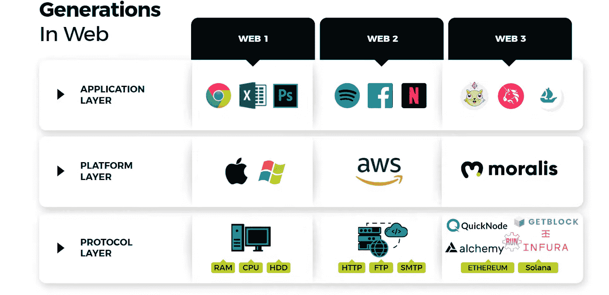

上图显示了所有 web stages 的三个底层。这些包括协议、平台和应用层。虽然目标是产生最好的应用程序，但是没有平台和协议，这些应用程序就无法存在。然而，可靠的平台使开发人员能够跳过直接处理协议。反过来，他们可以在前端投入更多的时间，从而创建更好的应用程序，或者在 Web3 的情况下，dapps。此外，我们可以用类似的类比来看游戏中的世代:

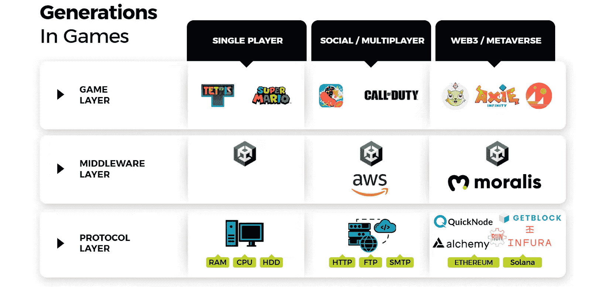

正如你在上面的图片中看到的，我们仍然在底部有协议层。然而，向上移动，我们在顶部有中间件层和游戏层。此外，请注意，Moralis 及其与 Unity 的集成使开发者能够创建 [Web3 元宇宙](https://moralis.io/web3-metaverse-how-do-web3-and-the-metaverse-fit-together/)和 Web3 游戏。

## Web3 游戏设计

有了以上基础，我们就可以专注于 Web3 游戏设计了。此外，区块链技术的独特优势和机遇也需要独特的游戏设计。当然，就像传统的游戏设计一样，没有“一刀切”的解决方案。这完全取决于项目的细节。因此，这些项目在人员规模和人员专业方面可能有很大差异。这些人包括艺术家、动画师、音频专家、平面设计师、开发人员、营销人员、制作人、QA 专家、销售专家、分析师、翻译、作家等。最终，随着用户期望的不断提高，如今视频游戏变得相当复杂。当然，这种复杂性在 Web3 中也是意料之中的。然而，多亏了 GameFi，Web3 游戏可以凭借更简单的游戏特性获得成功，尤其是在我们仍处于游戏早期的时候。

最典型的 Web3 游戏设计流程遵循传统游戏的模式:

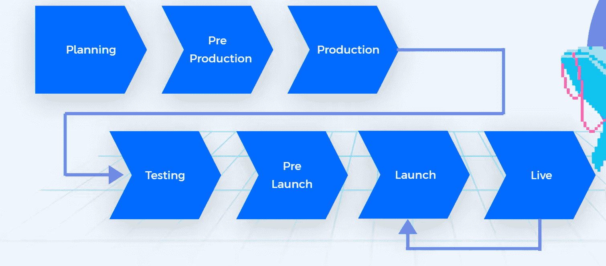

上图显示了典型的标志性阶段。规划阶段是团队通常决定游戏是什么以及用户如何互动的阶段。这个阶段在 Web3 游戏设计中尤为重要。这是团队决定包括哪些加密特性的地方。预生产处理原型和世界将会是什么样子的实验。生产是大部分游戏被创造的地方。因此，这是开发人员通常输入最终代码和最终资产的地方。接下来，是测试的时候了。通常，在测试之后，我们有预发布阶段。这是一个潜在的测试版发布的地方。最后，团队启动游戏。然而，这很少是 Web3 游戏设计过程的结束。今天，用户期待游戏发布后的变化和发展。因此，开发人员倾向于不断地经历前面的一些或所有步骤。

## Web3 游戏设计和玩家

好的软件必须以用户为中心；然而，游戏更进一步。因此，主要的焦点必须是给玩家带来快乐。因此，它们以玩家为中心:

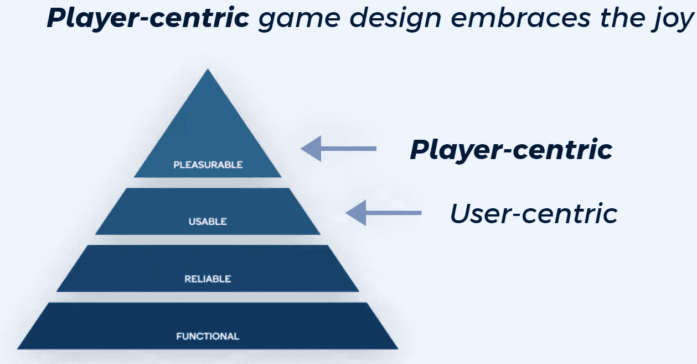

为了知道如何给你的玩家提供他们想要的快乐，你需要考虑玩家的角色。下图展示了社交游戏或多人游戏中四种常见的玩家类型:

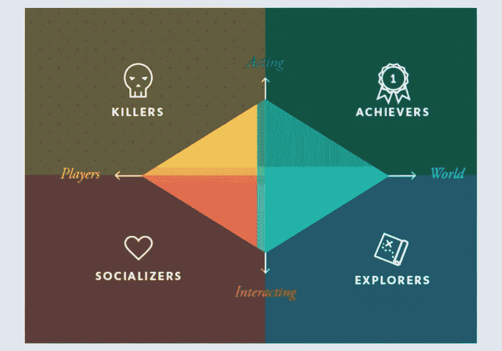

例如，上面的图像表明，成功者都是在世界上走来走去，同时达到不同的基准。此外，他们也喜欢为他们的成就获得奖励。另一方面，探险者对通过与世界互动来探索世界更感兴趣。因此，探险者对成就并不感兴趣。

此外，玩家可以根据他们的消费习惯进行分类(见下图)。当考虑游戏的经济性和盈利性时，这一点也很重要。特别是在免费游戏的情况下，微交易起着重要的作用。

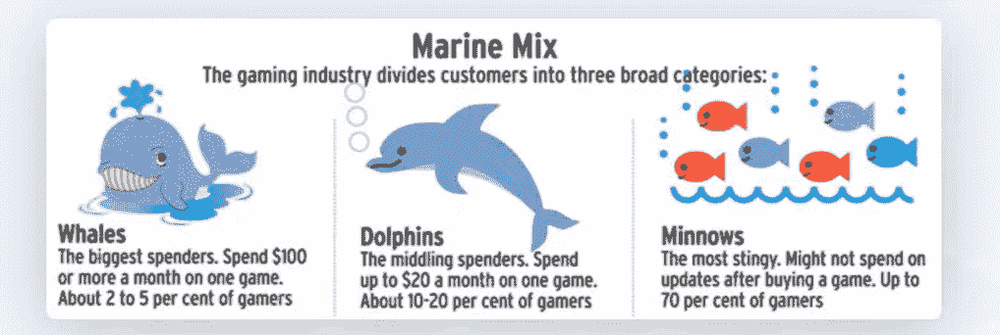

### Web3 播放器类型

当我们专注于 Web3 游戏时，我们获得了一些新的玩家类型:

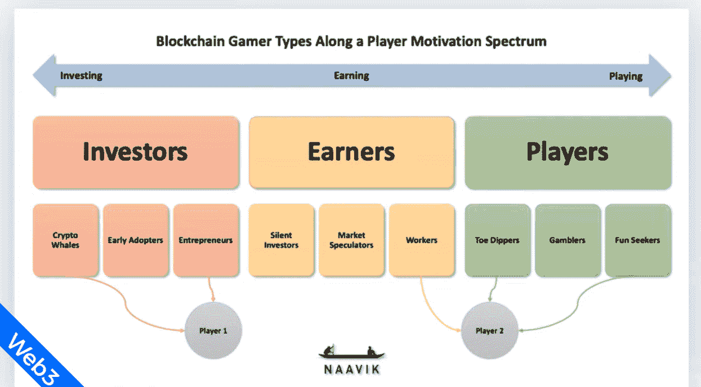

如上图所示，除了玩家之外，我们还有赚钱者和投资者。这三个类别中的每一个都可以进一步划分。因此，我们在玩家中有“泡吧者”、“赌徒”和“寻欢作乐者”。然后，我们有“沉默的投资者”，“市场投机者”，以及工薪族中的“工人”。然后，我们在投资者中有“加密鲸”、“早期采用者”和“企业家”。对于 Web3 游戏设计来说，考虑这些玩家类型是非常重要的。因此，我们可以选择满足或不满足特定玩家的需求。这一切都始于决定我们要瞄准哪种类型的球员。然后，我们需要了解他们的定义因素、关键动机、关键资产活动和保留策略。有了这四个方面，我们决定了是什么让我们的目标玩家与众不同，他们想做什么，他们将如何参与，以及如何保持他们的兴趣。

## 游戏设计中的循环

每当我们想要恰当地组织 Web3 游戏设计过程时，我们都需要考虑“玩家参与度”。重要的是，要把这种参与看作一系列重复的动作——循环。在最简单的形式中，我们有一个循环的行动、奖励和扩展阶段。让我们看看帕克曼的例子。在那里，动作是用户输入他们想要移动他们的背包的方向。奖励以硬币和能量球的形式出现，它们是在移动时收集的。此外，这些小球也扩展了玩家的能力，因此覆盖了循环的“扩展”部分。

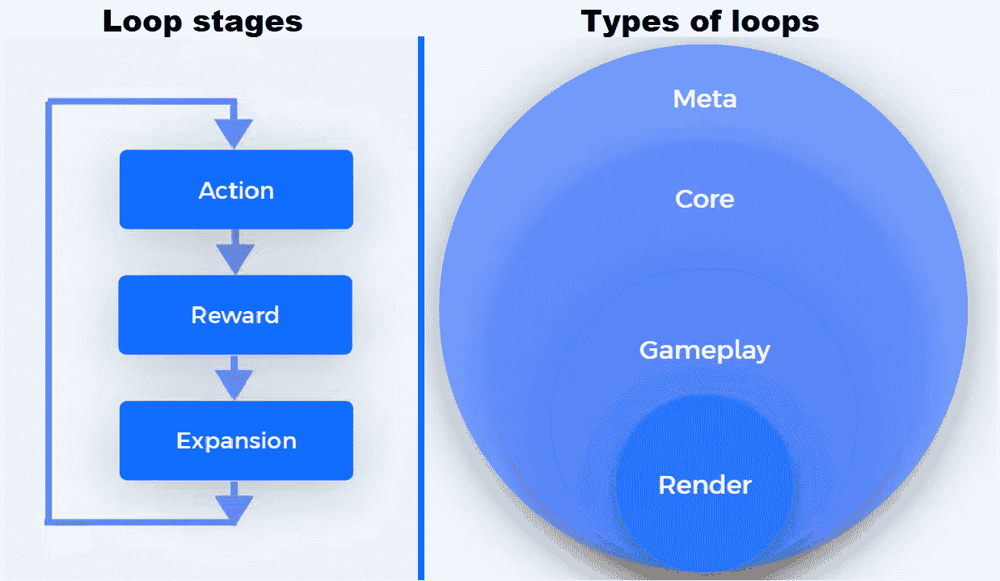

此外，一个普通的传统或 Web3 游戏也包含几个循环。这些循环通常包括渲染循环、游戏循环、核心循环和元循环。以下是每种循环类型的概述:

*   **渲染循环**:
    *   它专注于一个游戏引擎。
    *   时间范围:通常以毫秒为单位。
    *   开发人员通常比设计人员更关注这个循环。
    *   它提供了一个创造光滑度的机会。
    *   你希望它对玩家透明。
*   **游戏循环**:
    *   它关注玩家的动作。
    *   时间范围:通常以秒为单位。
    *   它提供了一个为玩家创造乐趣的机会。
    *   它包括控制、节奏、外观/感觉等。
*   **核心循环**:
    *   这是游戏的核心。
    *   时间范围:通常以分钟为单位。
    *   这就是引入游戏规则的地方。
    *   包括参与度、转化度、深度/多样性等。
*   **Meta Loop** :
    *   它建立了游戏的长期愿景。
    *   时间范围:通常从几天到几年。
    *   这是创建上下文的地方。
    *   它包括进步、经济、度量等。

### Web3 游戏设计中的循环

当专注于 Web3 游戏设计时，上述所有循环都起着重要作用。然而，元循环提供了最多的机会。此外，在 Web3 中，我们得到了一个典型循环的附加扩展:

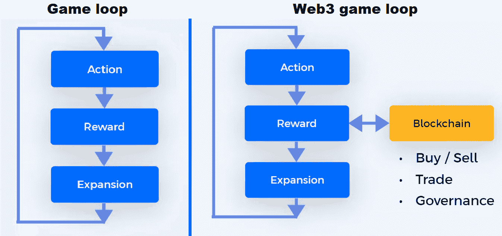

随着 Web3 游戏中财务方面的整合，游戏循环的奖励阶段变得更加有趣。因此，玩家可以交易他们的加密资产或使用它们进行治理。要深入了解 Web3 loops 提供的扩展，请查看下面 09:08 的视频。这也是你可以学习一些循环平衡战术的地方(10:16)。此外，您可以跳到 11:37 了解更多关于 Web3 采用的信息。

https://www.youtube.com/watch?v=A5Pt_juydwQ

## 基于 Moralis 的 Web3 游戏设计

正如简介中提到的，Moralis 是最终的 Web3 开发平台。感谢 [Moralis 的元宇宙 SDK](https://moralis.io/metaverse/) ，它也是潜入 Web3 游戏设计的最佳工具。如果你了解 Unity，你可以毫不费力地连接到 [Moralis 的 SDK](https://moralis.io/exploring-moralis-sdk-the-ultimate-web3-sdk/) 。因此，您可以通过复制粘贴操作来解决与区块链相关的后端挑战。使用来自 [Moralis 文档](https://docs.moralis.io/)的简短代码片段可以加快你的进度。因此，你可以将你的资源投入到创建一个令人惊叹的 Web3 UI 上。

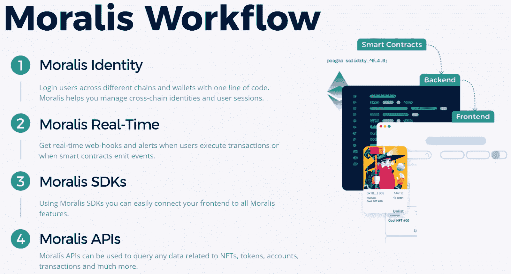

Moralis 为您提供构建高性能 dapps 的单一工作流程。这个一站式平台帮助您绕过 RPC 节点的所有[限制。此外，Moralis 还集成了其他出色的 Web3 工具。其中包括](https://moralis.io/exploring-the-limitations-of-rpc-nodes-and-the-solution-to-them/) [IPFS](https://moralis.io/what-is-ipfs-interplanetary-file-system/) 、[元蒙版](https://moralis.io/metamask-explained-what-is-metamask/)和 [WalletConnect](https://moralis.io/what-is-walletconnect-the-ultimate-walletconnect-guide/) 。反过来，你可以[用 WalletConnect](https://moralis.io/how-to-connect-users-with-walletconnect/) 连接用户或者[用 MetaMask](https://moralis.io/how-to-authenticate-with-metamask/) 认证。此外，你可以毫不费力地将文件夹上传到 IPFS。因此，您可以使用单行代码满足 dapps 的 [Web3 认证](https://moralis.io/web3-authentication-the-full-guide/)和分散的文件存储需求。尽管如此，Moralis 的其他集成使您能够通过电子邮件和 [Web3 社交登录](https://moralis.io/web3-social-login-sign-in-dapp-users-with-google-email-or-twitter/)进行 [Web3 认证。因此，](https://moralis.io/how-to-do-web3-authentication-via-email/)[将 Web3 钱包连接到 Twitter 账户](https://moralis.io/connecting-web3-wallet-to-twitter-account/)变得不再神秘。此外，通过这种方式，你可以很容易地[提升 Web3 用户的参与度](https://moralis.io/how-to-boost-web3-user-onboarding-success-rates/)。

一旦你实现了 [Web3 登录](https://moralis.io/connecting-a-unity-game-with-web3-login/)，Moralis 还可以帮助你管理用户会话和跨链身份。您还可以访问 Moralis 仪表板(数据库)。因此，您可以[同步和指数化智能合约事件](https://moralis.io/sync-and-index-smart-contract-events-full-guide/)和[指数化区块链](https://moralis.io/how-to-index-the-blockchain-the-ultimate-guide/)。这个数据库也可以[存储链外数据](https://moralis.io/how-to-store-off-chain-data-unity-web3-database/)。从本质上讲，Moralis 元宇宙 SDK 使 Web3 游戏设计变得更加简单。因此，[今天就创建你的免费 Moralis 账户](https://admin.moralis.io/register)并应对来自 Moralis 项目的[每周网络 3 挑战！](https://moralis.io/projects)

## Web3 游戏设计–解释 Web3 游戏设计流程–总结

在今天的文章中，你会发现 Web3 游戏设计与传统游戏设计没有太大的不同。然而，由于它引入了金融方面和可转移的加密资产，它增加了复杂性和机会。因此，适当的规划变得更加重要。Web3 游戏也可以设计成让玩家参与管理的方式。这通常通过[治理令牌](https://moralis.io/what-are-governance-tokens-full-guide/)来完成。在此过程中，您还学习了 Web3 和 Web3 游戏的基础知识。你已经看到了网络和游戏的发展，了解了 Moralis。因此，你现在已经准备好在区块链编程中迈出下一步。如果您精通 JavaScript 或 Unity，我们建议您参与一些实际的示例项目。例如，你可以[制作一个中世纪的元宇宙游戏](https://moralis.io/how-to-build-a-medieval-metaverse-game/)，一个 [Web3 MMORPG](https://moralis.io/build-a-web3-mmorpg-with-unity-in-10-minutes/) ，或者一个简单的 [2D Web3 游戏](https://moralis.io/how-to-build-a-2d-web3-game-full-guide%ef%bf%bc/)。

另一方面，您可能渴望探索其他区块链发展主题。如果是这样的话，请访问 YouTube 频道和[Moralis 博客](https://moralis.io/blog/)。一些最新的话题集中在如何[将一个 Web3 钱包连接到一个网站](https://moralis.io/how-to-connect-a-web3-wallet-to-a-website/)， [NFT 实用程序](https://moralis.io/nft-utility-exploring-nft-use-cases-in-2022/)，回答了“[什么是索拉纳？](https://moralis.io/what-is-solana-the-full-2022-guide/)问题，探讨如何开发一个 [Web3 网飞克隆](https://moralis.io/how-to-develop-a-web3-netflix-clone/)或一个 [Web3 视频流服务](https://moralis.io/how-to-create-a-web3-video-streaming-service/)，如何建立一个 [BNB 钱包](https://moralis.io/binance-coin-wallet-guide-how-to-set-up-a-bnb-wallet/)，一个 [ETH 钱包](https://moralis.io/how-to-create-an-eth-wallet-full-guide/)，或一个[多链钱包](https://moralis.io/how-to-build-a-multi-chain-wallet-in-5-steps/)。此外，这两个出口可以满足您的免费持续加密教育的需求。尽管如此，你可能渴望尽快成为一名 Web3 开发者。在这种情况下，我们建议你采取更专业的方法。因此，考虑报名参加 Moralis 学院。在那里，你将接触到顶级的[区块链发展课程](https://academy.moralis.io/all-courses)，一个不断进步的社区，以及专家指导。

