# Web3 游戏化——创建一个共同市场钻石 dApp

> 原文：<https://moralis.io/web3-gamification-creating-a-coinmarketcap-diamonds-dapp/>

游戏化几乎可以让任何事情变得更吸引人。此外，它有助于提高生产率、记忆力、缓解紧张情绪等等。此外，利用游戏化的应用程序将更令人兴奋，并为用户增加额外的价值。在其他选择中，附加值可以是潜在奖励的形式。因此，dApp 开发者应该考虑在他们的分散式应用程序中加入 Web3 游戏化功能([**【dApps】**](https://moralis.io/decentralized-applications-explained-what-are-dapps/)**)。Web3 游戏化的一个很好的例子是 CoinMarketCap Diamonds dApp。在这里，我们将在我们的示例项目中模拟该应用程序，并且我们将通过使用一些优秀的工具来这样做。**

如果你用的是 CoinMarketCap，那么你一定见过他们的“钻石”。通过引入这一功能，他们鼓励用户完成一些简单的日常任务。因此，他们获得了更多的参与度和更多的固定用户。因此，如果 CoinMarketCap 使用游戏化策略，你可以打赌它正在起作用。因此，CoinMarketCap 钻石特性是一个值得复制的很好的实用示例。

接下来，我们将使用[Moralis](https://moralis.io/)‘ultimate[web 3](https://moralis.io/how-does-web3-work-web3-explained/)开发平台结合最好的[以太坊 dApp 样板](https://moralis.io/ethereum-dapp-boilerplate-full-ethereum-react-boilerplate-tutorial/)。这两个区块链开发捷径的强大组合将使我们能够在不到一个小时的时间内实现 Web3 游戏化。此外，在接下来的部分中，您将有机会加入我们创建 CoinMarketCap Diamonds dApp 克隆的过程。因此，你将学习如何设置 Moralis 和最终的 [Web3 样板文件](https://moralis.io/web3-boilerplate-beginners-guide-to-web3/)来加速你的 Web3 开发。无论是创建 [NFT 游戏角色](https://moralis.io/nft-game-characters-how-to-mint-in-game-nft-characters/)还是构建其他 [GameFi](https://moralis.io/what-is-gamefi-and-play-to-earn-p2e/) 项目，请务必先阅读这篇文章以了解更多关于 Web3 游戏化的信息！

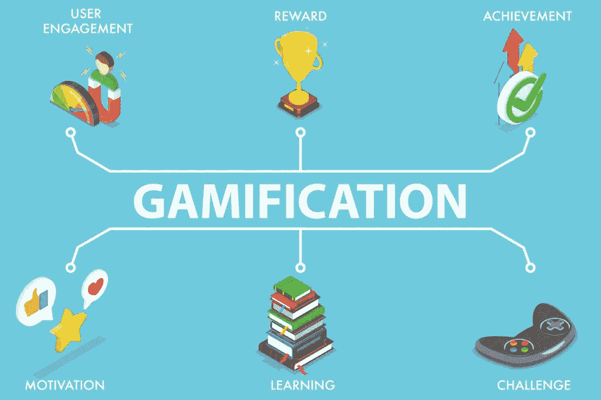

## Web3 游戏化——一个示例项目

我们坚信通过行动来学习。因此，我们尽可能包括示例项目。因此，我们强烈鼓励你跟随我们的领导，创造一个 CoinMarketCap 钻石 dApp 克隆。这样做，你会学到很多关于 Web3 游戏化的知识。此外，您将能够使用这些知识，并将其实现到更独特的 dApps 中。此外，一旦你学会如何与 Moralis 和最终的 Web3 样板合作，你将拥有额外的优势，使你的 dApps 比竞争对手的更有吸引力。有了这些非凡的工具，您将节省大量的时间、精力和资金。因为我们在这个 Web3 游戏化的探索中有相当多的领域要涉及，所以让我们直接进入主题吧。

### Web3 游戏化示例 dApp

在我们处理与我们的示例项目相关的初始设置和实际编码之前，我们希望您对我们的 CoinMarketCap Diamonds dApp 示例做一个简要的预览。如果你还没有见过 CoinMarketCap 的钻石，请随意查看。*您需要登录您的 CoinMarketCap 账户，然后点击右上角的“钻石”图标:*

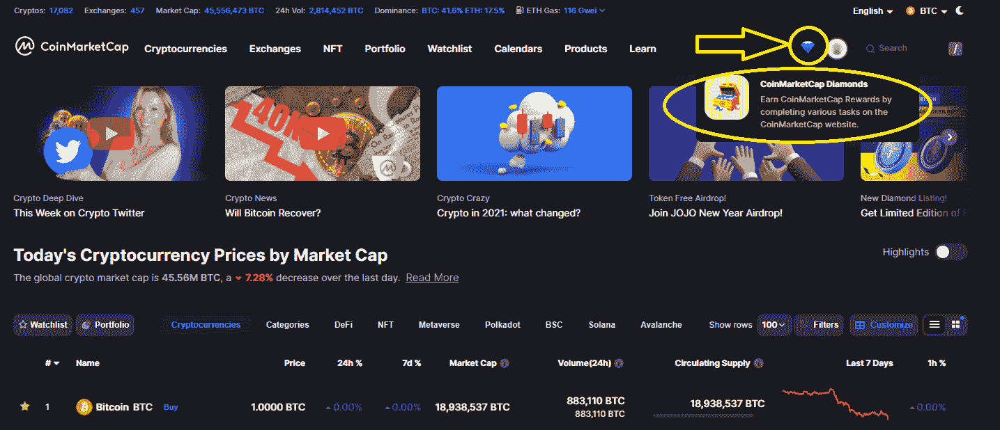

*点击钻石图标后，您将进入“我的 CoinMarketCap 钻石”页面(见下图)。在那里，你会看到三个标签(在左手边)和这个游戏化例子的细节:*

*欢迎进一步探索 CoinMarketCap 钻石。*不过，现在让我们来关注一下我们的 CoinMarketCap 钻石 dApp 预览版。与上面的 Web3 游戏化一样，我们的 dApp 在左侧有三个选项卡。我们有“我的符文”、“排行榜”和“奖励”标签。*以下是“我的符文”标签的截图:*

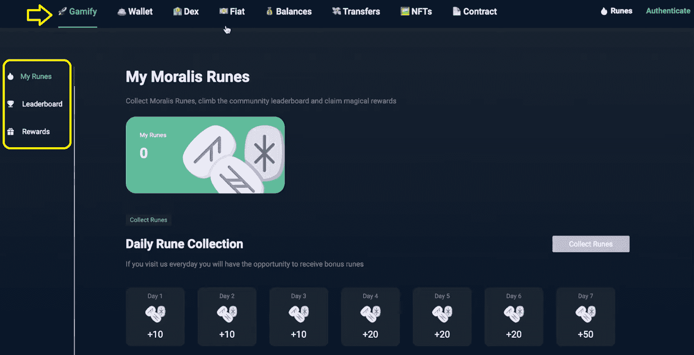

在我们的 Web3 游戏化的例子中，用户将有机会每天收集符文。连续几天这样做会增加可收集符文的数量(如上所示)。此外，使用排行榜，用户可以看到最活跃的用户收集了多少符文。此外，收集的符文可以用来兑换奖励。

## CoinMarketCap 钻石 dApp 克隆预览

当用户登陆我们的 Web3 页面时，他们会看到上面截图中显示的选项。然而，为了与我们的 dApp 合作，他们需要使用 [Web3 认证](https://moralis.io/web3-authentication-the-full-guide/) ( [Web3 登录](https://moralis.io/how-to-build-a-web3-login-in-5-steps/))来认证他们自己。幸运的是，Moralis 规范和样板文件使得整合这个重要的 Web3 特性变得简单明了。因此，用户只需点击“认证”按钮，并选择他们的首选方法。*为了这个预览，我们用了* [*元蒙版*](https://moralis.io/metamask-explained-what-is-metamask/) *，这是我们* [*Web3 钱包*](https://moralis.io/what-is-a-web3-wallet-web3-wallets-explained/) *的选择:*

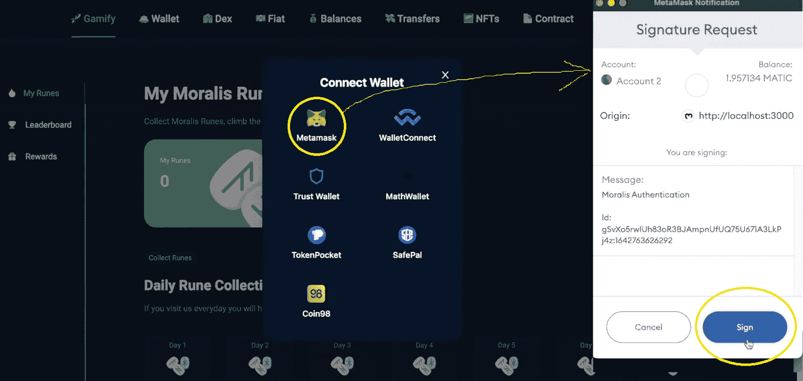

一旦用户确认了他们的登录尝试，他们就可以访问我们的示例 dApp 的特性。除此之外，他们还可以收集符文并查看目前收集的符文数量:

此外，他们还可以查看排行榜:

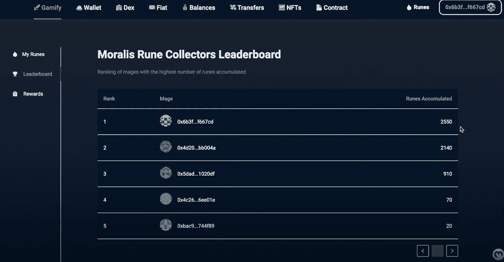

此外，如前所述，我们还增加了“奖励”页面，用户可以使用他们收集的符文获得一定的奖励:

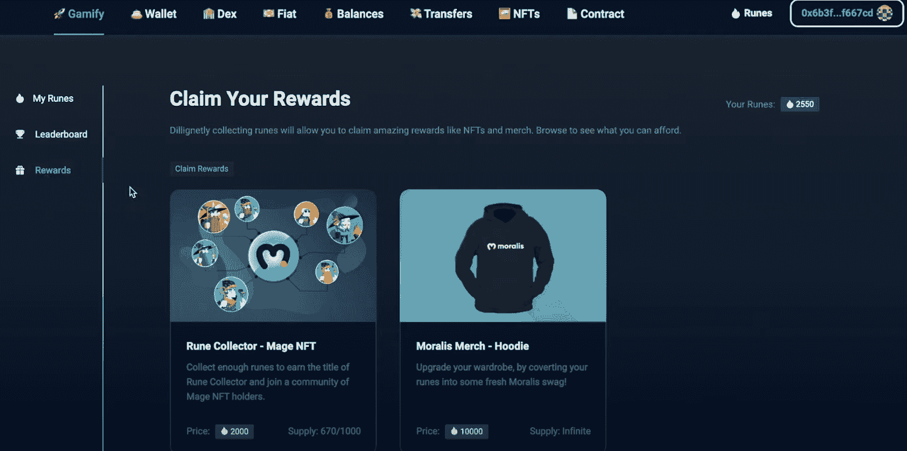

如果收集的符文数量足够，用户可以点击特定的奖励并收集它。此外，看上面的截图，你可以看到一个奖励是“法师 NFT”。由于用户可以选择奖励，我们还加入了一个功能，使用户能够[懒惰薄荷 NFTs](https://moralis.io/how-to-lazy-mint-nfts/) 。*在文章的最后，你将有机会找到如何做到这一点。当然，如果你对* [*NFT 令牌开发*](https://moralis.io/nft-token-development-the-ultimate-guide/) *有进一步的兴趣，一定要了解一下* [*NFT API 替代品*](https://moralis.io/nft-api-alternatives-comparing-alchemys-nft-api-with-moralis-nft-api/) *。另外，仔细看看* [*NFT 生成和*](https://moralis.io/nft-generate-and-mint-how-to-generate-non-fungible-tokens/) *造币的特性。后者是* [*NFT 编程*](https://moralis.io/nft-programming-for-beginners/)[*NFT 游戏开发*](https://moralis.io/nft-game-development-how-to-build-an-nft-game-app-in-minutes/) *，以及任何* [*NFT 市集*](https://moralis.io/develop-your-own-nft-marketplace-step-by-step-guide/) *的必备部分。*

## 创造一个共同市场

既然你已经对我们将要创造的东西有了清晰的愿景，是时候卷起袖子了。如上所述，我们将从一些初始设置步骤开始。这将包括创建一个 Moralis 服务器和初始化 Moralis SDK。此外，您将学习如何覆盖以太坊 dApp 样板的初始设置。

### Moralis 初始设置

如果您决定从头构建 dApps 或使用 Web3 样板文件，您必须首先完成一个简单的 Moralis 设置。以下是您需要遵循的步骤:

1.  [**创建您的免费 Moralis 账户**](https://admin.moralis.io/register)——使用左边的链接进入注册页面。在那里，输入您的电子邮件并创建您的密码。要确认流程，请确保点击确认链接，该链接将发送到您的电子邮件地址。*当然，如果你已经有一个活跃的 Moralis 账号，只需* [*登录*](https://admin.moralis.io/login) *。*

2.  [**创建一个 Moralis 服务器**](https://docs.moralis.io/moralis-server/getting-started/create-a-moralis-server)–一旦登录到您的 Moralis 管理区域，选择“服务器”选项卡。然后，单击右上角的“+创建新服务器”按钮。从出现的下拉菜单中，选择最适合您需求的网络类型(参见下面的屏幕截图)。*在示例项目或测试你的 dApps 的情况下，最好关注“Testnet 服务器”(* [*以太坊 Testnet*](https://moralis.io/ethereum-testnet-guide-connect-to-ethereum-testnets/)*)或“本地 Devchain 服务器”选项。*

选择网络类型后，您会看到一个弹出窗口，要求您输入服务器的详细信息。因此，输入您的服务器名称(这可以是您想要的任何名称)，选择您的区域、网络类型和链。点击“添加实例”完成设置:

3.  **访问服务器详细信息**–服务器启动并运行后，您可以通过点击“查看详细信息”来访问其详细信息(服务器 URL 和应用程序 ID):

然后，只需将详细信息(“服务器 URL”和“应用程序 ID”)复制到代码文件中。*使用样板文件时，请使用“.env "文件。*您可以使用右侧的复制图标来复制所需的详细信息:

4.  **初始化 Moralis** *(* *暂时跳过这一步**)**–*初始化 Moralis 及其 SDK，从而最终访问 Moralis 的能力，填充。env "文件。只需将您服务器的详细信息粘贴到指定位置:

### 以太坊 dApp 样板设置

到目前为止，您已经知道我们将使用这个最终的 Web3 样板来简化我们的工作。如果你对创建一个独特的用户界面不感兴趣，使用这个快捷方式会节省你很多时间。此外，它使您能够在几分钟内启动并运行一个全功能的 dApp。GitHub 上有这个样板文件(用谷歌搜索“以太坊样板文件”就行)。然而，对于这个示例项目，您有一个更简单的路线可用。你可以使用一个稍微“调整”的样板文件，名为“[游戏化-开始代码](https://github.com/IAmJaysWay/Gamification-StarterCode)”。当后者被克隆时，你可以很容易地跟随这个指南和下面的视频指令。*当然，你也可以访问完成的代码(* [*【游戏化】-dApp*](https://github.com/IAmJaysWay/Gamification-dApp) *)。*

以下是使用我们修改过的样板文件需要完成的步骤:

1.  使用上面的“游戏化-StarterCode”链接访问 GitHub 上的代码。

2.  点击“代码”按钮，然后点击“复制”图标复制地址:

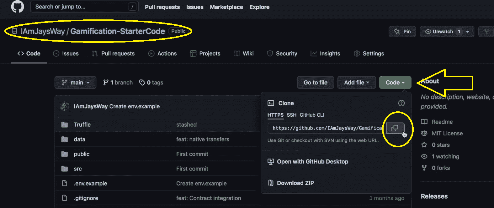

3.  然后，使用你的代码编辑器终端(我们更喜欢使用 Visual Studio 代码[VSC])，克隆上面复制的代码:

    ***git 克隆[*** *将复制的 HTTPS 地址粘贴到这里****】***

**   在代码编辑器的终端中使用以下命令安装所有依赖项:*

**   ***cd 游戏化-startercode****   ***纱线安装****

**   将“. env.example”文件重命名为”。env”并完成上一节中的最后一步(步骤四)。这意味着您将填充您的”。env "文件，其中包含服务器的详细信息。*

**   在 VSC 的终端中粘贴或键入“ ***纱开始*** ”来运行您的应用程序:*

*

一旦你完成了上面的设置，你就会有一个空的深色主题的“游戏化”标签。这是您将添加元素的地方，以获得与上述预览相同的结果。

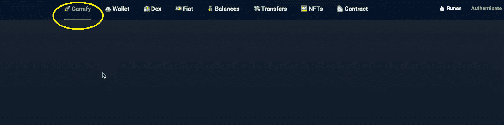

## Web3 游戏化–代码演练

为了涵盖我们的 Web3 游戏化示例 dApp 的前端，您需要设置很多行代码。幸运的是，Moralis 的一位专家准备了一个视频教程，你可以很容易地跟随(视频如下)。如果教程进展太快，暂停一下，坚持自己的节奏。他将首先指导您创建相关前端的细节。因此，您将看到如何轻松地添加 CoinMarketCap Diamonds dApp (3:52)的所有三个选项卡。创建选项卡的侧菜单后，您将创建三个页面中的每一个。要关注“我的符文”页面，跳到 6:15。对于“排行榜”页面，转到 12:36，对于“奖励”页面，转到 15:05。

此外，如果你精通 JavaScript，创建前端对你来说就像在公园散步。然而，Moralis 的力量在后端闪耀。从 20:49 开始，你会看到使用 Moralis 的仪表板(数据库)来索引区块链是多么容易。此功能使您能够高效、顺利地使用链上数据:

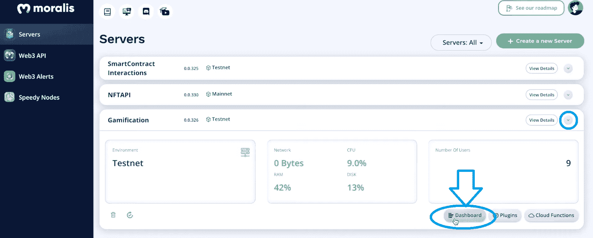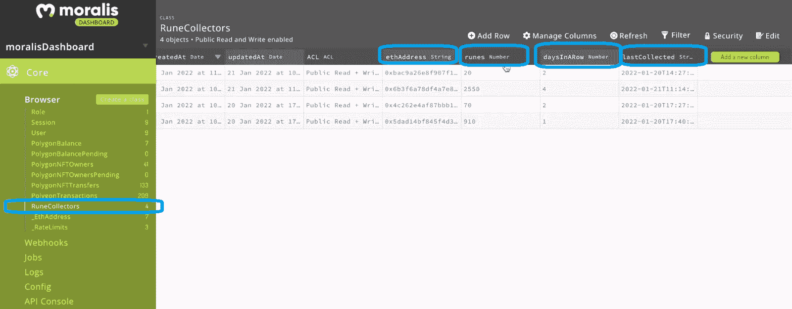

此外，这是你将学习如何实现“符文收集”功能的地方。从 41:05 开始，您还将了解实施排行榜所需的详细信息。尽管如此，在 45:50，作为奖励的一部分，你将有机会学习如何设置 NFT 铸造功能。

这是我们在整篇文章中引用的视频:

https://www.youtube.com/watch?v=hufjWlGDvRA

## Web3 游戏化–创建共同市场钻石 dApp–总结

我们今天已经走了很多路。在这一点上，你知道 Web3 游戏化功能可以帮助你的 dApp 获得流行和采用。此外，你已经知道，使用正确的工具，实现 Web3 游戏化是相当简单的。尽管如此，使用最终的 Web3 开发平台——Moralis(又名 [Firebase for crypto](https://moralis.io/firebase-for-crypto-the-best-blockchain-firebase-alternative/) )和最终的 Web3 样板文件，你就有机会创建自己的 CoinMarketCap Diamonds dApp。因此，您现在也知道如何涵盖初始 Moralis 和样板设置步骤。当您接手其他示例项目或处理自己的想法时，后者将会派上用场。

接下来，我们建议您访问 [Moralis 博客](https://moralis.io/blog/)和 [Moralis YouTube 频道](https://www.youtube.com/c/MoralisWeb3)，利用这两个渠道获得免费的区块链发展教育。这两个内容平台都提供了各种加密方面的高质量解释。例如，我们的一些最新文章涵盖了 [Web3.js vs Ethers.js](https://moralis.io/web3-js-vs-ethers-js-guide-to-eth-javascript-libraries/) 、[无汽油交易](https://moralis.io/gasless-transactions-exploring-gasless-transactions-on-ethereum/)、[以太坊汽油费](https://moralis.io/ethereum-gas-fees-the-ultimate-2022-guide/)、 [GameFi 和 play-to-earn (P2E)](https://moralis.io/what-is-gamefi-and-play-to-earn-p2e/) 等等。此外，在这里你还可以找到很多其他的示例项目，包括如何[创建一个优秀的 Web3 UI](https://moralis.io/web3-ui-how-to-create-a-great-dapp-ui/) 的指南。

如果你想尽早成为区块链开发者，我们建议你采取更专业的方法。因此，报名参加[Moralis 学院](https://academy.moralis.io/)。通过这样做，你将有机会接触到[专业课程](https://academy.moralis.io/all-courses)，一个最支持的社区，并体验区块链发展导师。有了这一切，你将很容易通过所有潜在的障碍，并在任何时候全职加密。

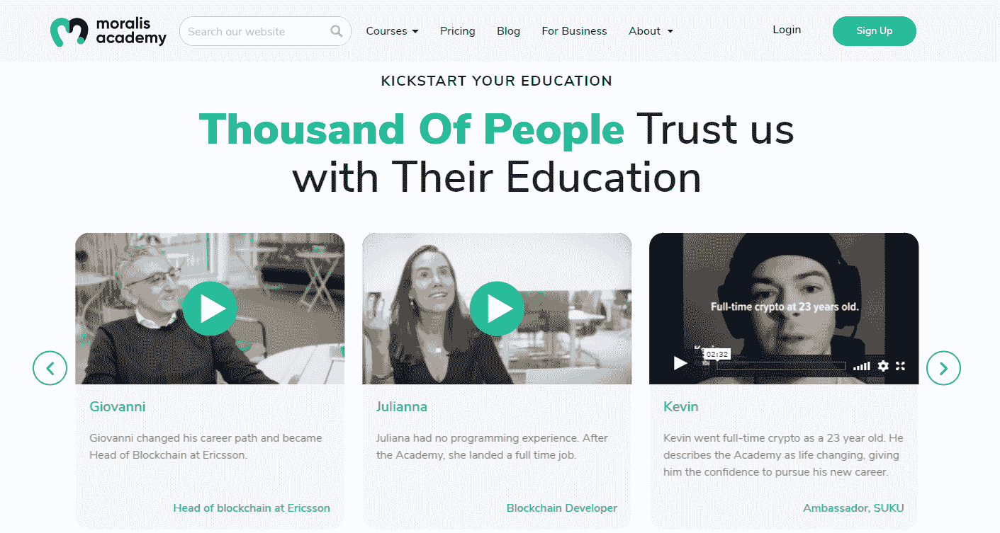*