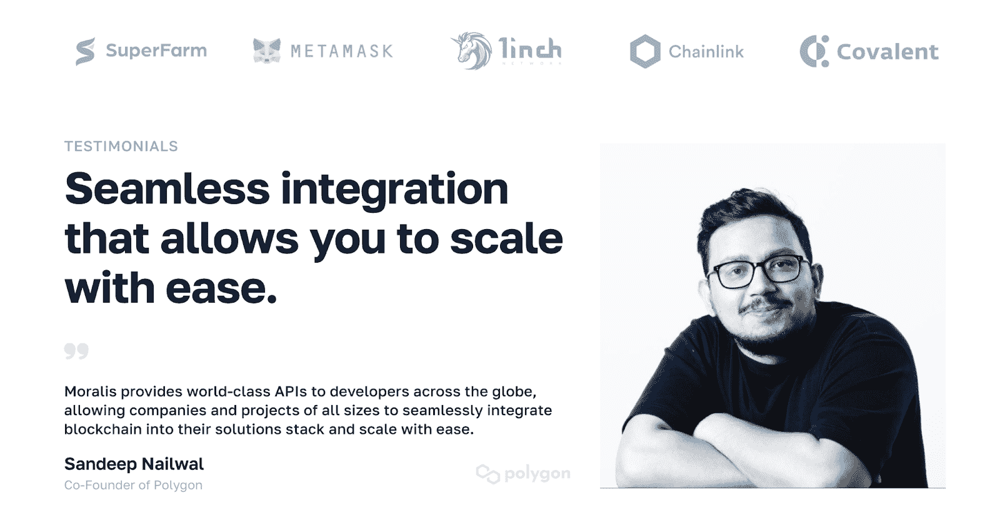
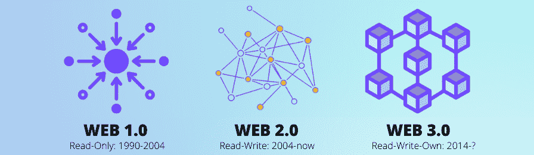
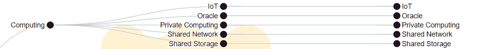
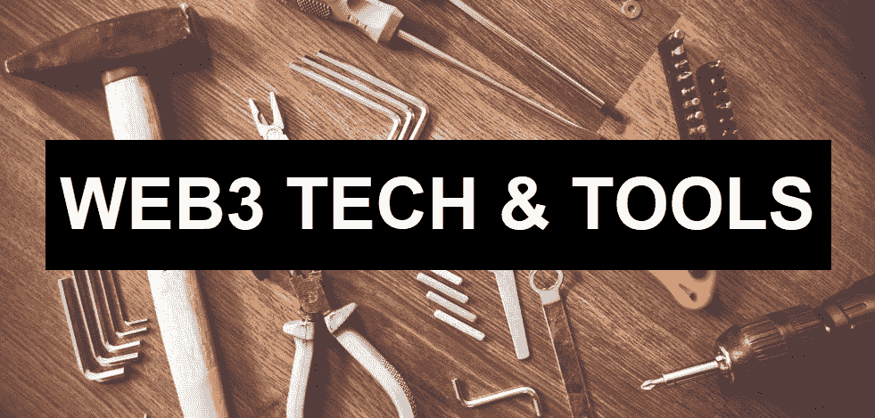

# Web3 基础设施–探索 Web3 开发的最佳解决方案

> 原文：<https://moralis.io/web3-infrastructure-exploring-the-best-solution-for-web3-development/>

借助企业级 Web3 基础设施，您可以毫不费力地构建和扩展您的项目。通过采用市场领先的 Web3 基础设施解决方案 Moralis，您可以利用以下优势:

*   ✅世界级的 web 3 API–从 EVM 网络和非 EVM 链获取 NFT、令牌和交易数据。
*   ✅跨链兼容性–利用 Moralis 对链和 L2(如以太坊、Polygon、Avalanche、Solana、Cronos 等)的多重网络支持，让您的项目面向未来。
*   ✅多技术栈集成–将您的 Web3 项目与 Firebase 和 Supabase 等技术栈集成。
*   ✅游戏引擎支持–将 Web3 功能添加到 PlayFab 游戏中，并将 Web3 功能集成到 Unity 中。
*   ✅的稳定性和可靠性–moralis 提供定制的 SLA，并拥有为市场上最大的 dapps 运行关键任务区块链基础设施的长期记录。
*   ✅客户的困扰 moralis 客户成功团队在 40 多个国家提供 24/7 的支持，一个开发者论坛和一个开发者不和谐社区。

[**Get Started with Moralis’ Web3 Infrastructure**](https://moralis.io/scale/)

### 概观

开发人员需要可靠、有效和高效的 web 3.0 基础设施。已经有许多优秀的工具供您使用，新的工具也在不断涌现。然而，想象一下，一个工具箱可以让 Web2 开发人员使用他们的知识和技能快速、轻松地过渡到 Web3。幸运的是，你不需要去想象。相反，你可以[创建你的免费 Moralis 账户](https://admin.moralis.io/register),从今天开始连接 Web2 和 Web3！

接下来，我们将从基础开始，解释 Web3 是什么。然后，我们将确保您知道什么是 Web3 基础架构。此外，为了帮助您正确理解 web 3.0 基础设施，我们还将了解一下 web 3 中使用的技术。有了适当的基础，您将能够欣赏一些最受欢迎的 Web3 基础设施项目。最后但同样重要的是，我们将对 dapp 开发的最佳 web 3.0 基础设施解决方案做一个适当的概述。

## web 3–这是什么？

在我们深入讨论 Web3 基础设施之前，您需要知道什么是 Web3。因此，简而言之，Web3 或 web 3.0 被广泛认为是互联网的第三个——也是最新的——“阶段”(见上图)。同样值得指出的是，在这些阶段的背后没有单一的控制实体；这是互联网无计划的演变。此外，Web3 的每个阶段都有一个特定的特征:

*   网站 1–静态
*   web 2–动态
*   web 3–分散化

此外，Web3 旨在解决所有权、数字经济和集中化的问题。它通过分散互联网来解决这三个方面的问题。Web2 主要关注前端，而 Web3 主要致力于改进后端功能。此外，Web3 时代的一个显著特征是分散应用(dapps)的出现，它将取代传统应用。

最终，去中心化、可编程区块链和对对等(P2P)事务的本地支持是 web 3.0 和区块链技术的核心方面。然而，请记住，Web3 仍处于起步阶段，在大规模采用之前，我们还有很长的路要走。也就是说，区块链网络是 Web3 基础设施的基础。但是，作为一名 dapp 开发人员，您应该避免与区块链技术堆栈的底层直接交互。相反，您希望专注于使用 Web3 APIs 以简单的方式构建 dapps。

## 什么是 Web3 基础设施？

从最普遍的意义上来说，Web3 基础设施包括设备、区块链和区块链技术堆栈的所有其他层。然而，当我们在本文中提到“Web3 基础设施”时，我们指的是开发人员构建和操作 dapps 所需的技术、工具和解决方案。值得指出的是，区块链术语和分类尚未统一。因此，经常会有不同的术语指代相同的方面。但是有一些团队、公司和组织正在努力引入更高层次的清晰度，CoinDesk 的“*数字资产分类标准*”(DACS)就是这样一种努力。因此，我们称之为 DAC 向前发展。毕竟它可以帮助你掌握 web 3.0 基础设施的复杂性。

看上面的图像，你可以看到 DACS 目前定义了 Web3 的六个部门:计算、货币、DeFi、文化和娱乐、智能合约平台和数字化。在这些领域中，计算和智能合约平台主要代表 Web3 基础设施。当然，界限可能是模糊的，其他部门也可能涉及 web 3.0 基础设施的某些特定方面。

此外，我们之前解释过智能合约平台(可编程区块链的另一个术语)是 Web3 基础设施的基础。作为一名 dapp 开发人员，您不需要直接处理该层。因此，让我们更仔细地看看计算部门及其提供的技术。

### Web3 中使用的技术

Web3 的核心技术是区块链。然而，区块链只不过是分布式数字分类账(数据库的类型)。因此，他们需要其他技术和工具，或 Web3 基础设施解决方案，以形成一个适当的生态系统。例如，上面介绍的计算部门带来了一些技术，这些技术已经在这个新的、分散的互联网中发挥了重要作用。然而，还涉及到其他技术。这些包括许多遗留编程语言和平台来为 dapps 创建前端。另一方面，也有一些专门用于智能合约开发的编程语言。因此，除了剖析 DAC 的计算部分，我们还将讨论其他一些重要的技术和工具。

#### 计算机行业

计算领域(根据 DAC)包括专注于构建和支持 Web3 和分布式计算基础设施的协议。因此，他们的目标是分散和消除云存储、计算、网络和数据库等服务的中介。通过成功实现其目标，该领域的协议有能力将数据和信息的所有权归还给网络参与者。此外，它们中的一些使用户能够通过对这些 Web3 技术的操作做出贡献来获得收入。

此外，计算机行业包括五个行业组，它们也是新兴行业:

*   **共享存储**–共享存储协议专注于分散传统上由集中实体拥有和运营的存储服务器。这些协议通过经济激励系统将存储责任分散到矿工/利益相关者的开源网络来实现。因此，这支持分散网络上的匿名、私有文件共享。

*   **甲骨文**–区块链甲骨文是专注于收集、组织和传输数据的协议。他们可以实时处理“链上数据到链上数据”或“链外数据到链上数据”。通常，这些类型的协议使用用于支付交易成本和治理权限的本机令牌进行操作。

*   **物联网**–物联网协议通过将区块链融入现实世界，为“物联网”和 Web3 的发展做出了贡献。本质上，这些类型的协议实现了物联网网络和区块链之间的应用互操作性。

*   **私有计算—**私有计算协议致力于建立一个免费的、分散的云计算能力、剩余带宽、安全即服务和其他按需提供的一次性计算服务市场。

*   **共享网络**–共享网络是分布式云计算的开放网络。这些类型的网络允许参与者以不同的价格向匿名买家提供能源和计算资源。

#### 其他重要的 Web3 技术和工具

如上所述，当涉及到 Web3 的前端时，HTML、CSS 和 JavaScript 等技术/语言继续扮演着关键角色。然而，当您关注 Web3 后端功能时，您可以(在某些情况下，应该)使用其他几种 Web3 技术。它们如下:

*   **节点提供商**–他们是运行节点的公司，使您能够使用他们的服务，而不是运行自己的节点。毕竟，节点使您能够与区块链对话并访问其数据；然而，运行自己的节点是一项全职工作。因此，如果您决定深入研究智能契约开发，您可能希望使用一个或两个节点提供者(用于冗余)。

*   **Web3 API 提供者**–不同的 Web3 API 提供者提供不同的 API。然而，在许多情况下，这些提供者在幕后连接到节点。因此，它们使您能够获得各种有用的预编译和预先计算的链上数据。此外，它们为您提供了一种在各种软件之间建立可靠通信/交互的简单方法。此外，高质量的 API 可以在稳定的环境中实现一致的编码。因此，可靠的 Web3 APIs 是 dapp 开发最重要的工具。

*   **智能合约编程语言**–它们根据你想要关注的可编程链而有所不同。

*   智能合同开发框架和 ide–这些工具使您能够编写、编译、部署、验证和测试智能合同。

*   **Web3 钱包**–这些工具主要用于管理、发送、接收和存储加密货币。然而，它们也是完成 Web3 认证过程(大多数 dapp 的网关)、确认所有链上交易、测试 dapp 等的最流行的方式。

*   **区块链探索者**–这些是特殊类型的 dapps，使用户和开发人员能够探索链上数据，甚至与智能合同互动。当然，每个区块链都需要自己的探险家。

## Web3 基础设施项目

上面，我们介绍了 web 3.0 基础设施中涉及的主要技术和工具类别。但是，我们鼓励您进一步探索，甚至使用特定的项目。因此，让我们来看看主要的例子:

*   **计算行业代表**–计算行业一些最著名的协议包括 Filecoin(共享存储)、Chainlink(甲骨文)、Helium(物联网)、IPFS(一种流行的分散存储解决方案，但不基于区块链)等。

*   **节点提供商**–一些最著名的节点提供商包括 Infura、Alchemy、QuickNode、Chainstack、GetBlock、Pocket Network 和 RunNode。

*   **Web3 API 提供商**–一些最著名的 Web3 API 提供商包括共价、图形、QuickNode、Alchemy、Bitquery、Biconomy 和 Moralis。

*   **专注于智能合同开发的项目**–在创建智能合同的过程中涉及到编程语言、框架、ide 和其他工具。最流行的两种智能合约编程语言是 Solidity(用于以太坊和其他 EVM 兼容链)和 Rust(如果你想创建一个 [Solana 智能合约](https://moralis.io/solana-smart-contract-building/))。一些最受欢迎的智能契约开发框架和 ide 包括 Hardhat、Truffle、Ganache、Remix、OpenZeppelin 和 Metaplex。

*   **Web3 钱包**——一些最受欢迎的 Web3 钱包包括 MetaMask(以太坊和 EVM 兼容链)、Trust Wallet、Rainbow、Argent、比特币基地钱包、Phantom(Solana 的)等。

*   **区块链探索者**——最受欢迎的区块链探索者关注最受欢迎的区块链。其中包括以太坊的以太扫描、多边形的多边形扫描、BNB 链的 BscScan、雪崩的 SnowTrace 等。

正如你所想象的，许多其他项目，至少在某种程度上，可以为 Web3 的基础设施做出贡献。因此，我们鼓励你自己探索快速发展的加密领域。尽管如此，让我们快速概述一下最佳的 Web3 基础设施解决方案。

## Web3 开发的最佳 Web3 基础设施解决方案

Moralis 是领先的 Web3 API 提供商，它使 dapp 开发变得简单明了。此外，Moralis 是跨链互操作的，使企业能够将 dapps 部署到其支持的所有链上。此外，由于 Moralis 的跨平台互操作性，企业可以使用传统的开发平台和编程语言创建 dapps。此外，您可以使用免费的 Moralis 帐户探索和使用所有的 Moralis 产品。当前的 Web3 基础设施工具包括以下解决方案:

*   [EVM API](https://moralis.io/evm-api/)–在以太坊和其他 EVM 兼容链上创建 dapps 所需的所有 API 端点。
*   [Solana API](https://moralis.io/solana-api/)–在 Solana 上创建 dapps 所需的所有 API 端点。
*   [NFT 应用编程接口](https://moralis.io/nft-api/)–轻松将 NFT 功能集成到您的 dapps 中。
*   [Token API](https://moralis.io/token-api/)–用简短的代码片段获取关于加密货币(硬币和代币)的所有细节。
*   [Auth API](https://moralis.io/authentication/)–用单行代码集成无缝的 Web3 身份验证解决方案。
*   [流 API](https://moralis.io/streams/)–通过 [Web3 webhooks](https://moralis.io/web3-webhooks-the-ultimate-guide-to-blockchain-webhooks/) 将区块链数据流入你的后端。

有了上面的工具，你可以简单地按照 Moralis 文档中的教程在几分钟内创建你的第一个 dapp。

此外，为了充分掌握 Moralis 的力量，我们建议您观看 Moralis 的首席执行官 Ivan Liljeqvist 解释为什么 Moralis 2.0 是寻求满足所有区块链开发项目的 Web3 基础设施解决方案的企业的真正游戏规则改变者:

[https://www.youtube.com/embed/hqkOm4gWftA?feature=oembed](https://www.youtube.com/embed/hqkOm4gWftA?feature=oembed)

## Web3 基础设施–探索 Web3 开发的最佳解决方案–总结

你现在知道 Web3 和它的基础设施需要什么了。此外，在本文中，您有机会了解了第三代互联网中使用的技术。您也有机会探索一些最受欢迎和最著名的 Web3 基础设施项目。这就是你发现 Web3 API 的地方，也是为什么 Moralis 是最终的 web 3 API 提供商。因此，你现在知道你可以使用你的免费 Moralis 帐户开始创建 dapps 快速而容易。最后但同样重要的是，您还有机会直接听 Moralis 的首席执行官介绍 Moralis 2.0！

接下来，我们建议您浏览[Moralis 文件](https://docs.moralis.io/)、[Moralis YouTube 频道](https://www.youtube.com/c/MoralisWeb3)和[Moralis 博客](https://moralis.io/blog/)。这些渠道将免费为你提供成为 Web3 开发者所需的所有细节。此外，他们是你的免费持续区块链发展教育的平台。我们的一些最新文章关注于如何在 Solana、Aptos 和 Sui 上造币。

然而，如果你有兴趣成为区块链专家，我们建议你报名参加 Moralis 学院。这也是成为区块链认证的地方，大大增加你获得加密工作的机会。如果你想深入了解区块链到底需要什么，我们鼓励你从“[区块链&比特币 101](https://academy.moralis.io/courses/blockchain-bitcoin-101) 课程开始！