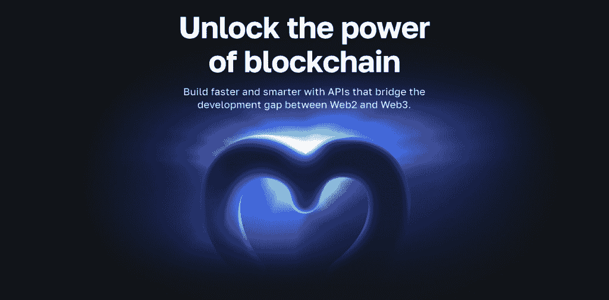
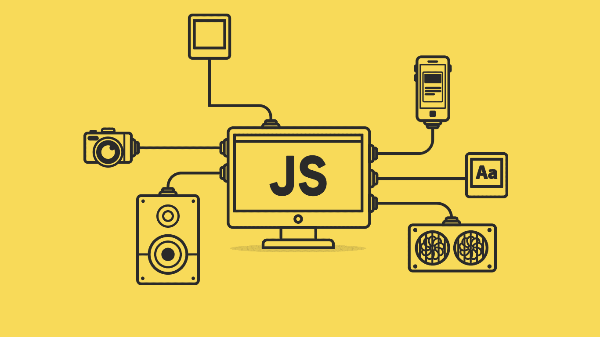
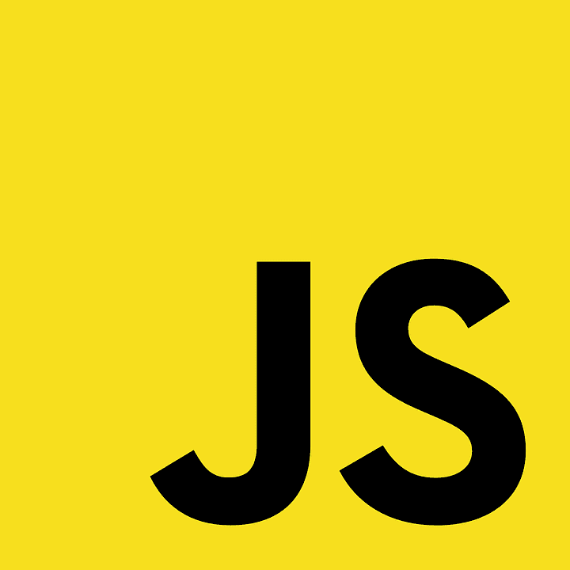
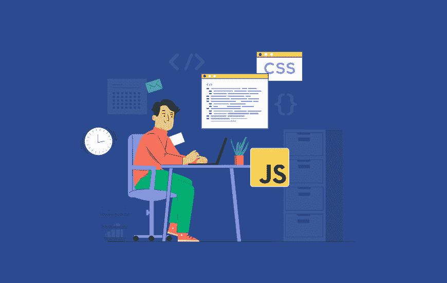
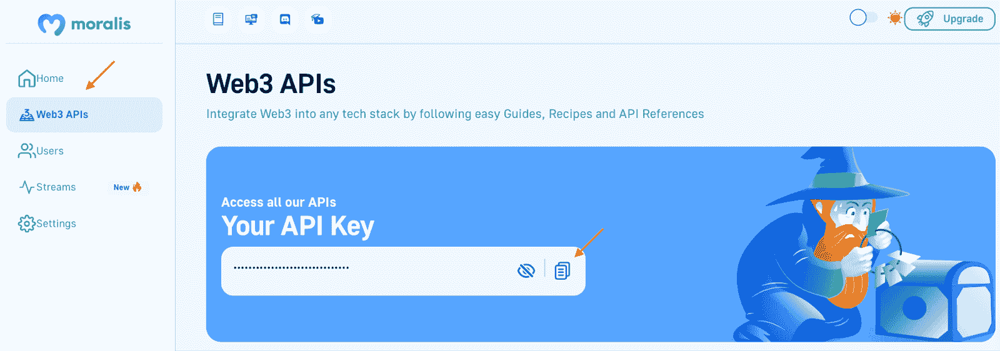

# Web3 JS 教程——区块链开发者指南

> 原文：<https://moralis.io/web3-js-tutorial-for-blockchain-developers/>

如果你想进入 Web3 开发并开始构建 dapp，你来对地方了，因为这个全面的 Web3 JavaScript 教程从头开始分解了使用 JavaScript (JS)创建 dapp 的整个过程。除了分解过程，我们将首先看一些关于 Web3 和 JS 的基础知识。然而，如果你以前有这些经验，可以直接跳到“*区块链开发者 Web3 JS 教程*”部分，立即学习如何创建 dapp！

此外，“*区块链开发者 Web3 JS 教程*”部分说明了如何构建 dapp 来获取和显示指定 [Web3 钱包](https://moralis.io/what-is-a-web3-wallet-web3-wallets-explained/)的本机令牌、ERC-20 令牌和 NFT 余额。此外，为了使过程简单明了，本文将教程分为三个步骤:

1.  创建 NodeJS dapp、安装 Moralis 和设置 Express 服务器
2.  整合 Moralis 服务
3.  读取区块链数据

如果上面的步骤看起来很有趣，请跟随我们处理这个 Web3 JS 教程，并向您展示如何快速构建 dapp！

此外，如果你对 Web3 开发有进一步的兴趣，请点击 Moralis 的 [Web3 博客](https://moralis.io/blog/)查看更多内容。例如，阅读更多关于[【隋】](https://moralis.io/what-is-aptos-full-guide-to-the-aptos-blockchain/)或[学习如何上传文件到 IPFS](https://moralis.io/how-to-upload-files-to-ipfs-full-guide/) ！此外，如果你想成为一名 Web3 开发者，释放区块链技术的力量，那么[注册 Moralis](https://admin.moralis.io/register) 。这样，您将获得更加无缝的开发者体验，并集成行业领先的 [Web3 基础设施](https://moralis.io/web3-infrastructure-exploring-the-best-solution-for-web3-development/)，让您更快、更智能地构建！

[**Sign Up with Moralis for Free**](https://admin.moralis.io/register)

## 使用 JavaScript 开始使用 Web3

如果您刚刚开始熟悉 Web3 开发领域，您应该知道 Web2 和 Web3 开发实践之间有一些相似之处。因此，如果你是一个有经验的开发人员，你可能能够使用你已经精通的编程语言，一个突出的例子是 JavaScript (JS)！



另一方面，如果您对开发领域完全陌生，开始学习 JS 会非常有益。知道如何使用 JS 为任何开发工作提供了良好的基础，并且是开始使用 Web3 的好方法！如果这听起来很有趣，我们强烈推荐报名参加[Moralis 学院](https://academy.moralis.io)。该学院为新的和更有经验的开发人员提供了一系列优秀的区块链课程。例如，看看下面的 JS 课程来启动你的 Web3 之旅:“ [JavaScript 编程 101](https://academy.moralis.io/courses/javascript-programming-for-blockchain-developers) ”。

此外，凭借 JS 的熟练程度，您可以将您的编程语言知识与 Moralis 的优秀开发工具(如各种[web 3 API](https://moralis.io/web3-apis-exploring-the-top-5-blockchain-apis/))结合起来，创建复杂的区块链项目。例如，通过 Moralis 的 [Web3 Streams API](https://moralis.io/streams/) ，您可以使用 webhooks 轻松地将区块链数据传输到项目的后端。

此外，本文将向您展示使用 JS 创建一个 dapp 来从一个特定的 Web3 钱包获取区块链数据的最简单的方法。然而，在这样做之前，我们将回到基础，回答这个问题，“什么是 Web3？”。

## 什么是 Web3？

定义 Web3 不一定是最容易的任务，因为互联网上存在许多稍微矛盾的定义。然而，一个共同点是，大多数人普遍将 Web3 称为“第三代互联网”。然而，要充分回答这个问题，“什么是 Web3？”并且理解这个新阶段的好处，从解释前面的“代”开始是一个好主意。

*   **web 1**–web 1 是互联网的最初一代，这是一个以静态传递信息为特征的阶段。因此，Web1 缺乏交互元素，互联网是获取数据和信息的主要来源。

*   **Web2**–随着社交媒体的引入，网络脱离了 Web1 的静态本质，发展成了 web 2。Web2 仍然是占主导地位的阶段，它不是静态的，而是通过提供更具互动性的网络体验，使互联网变得更加动态。


然而，除了引入更动态的网络体验，Web2 还有一个特点是集中化。不幸的是，这具有一些负面的缺点，例如涉及透明度、隐私和单点故障。

上述问题是目前推动向 Web3 转变的一些因素，而 web 3 的特点是去中心化。因此，Web3 旨在实现一个由区块链技术支持的去中心化网络。除了区块链技术，Web3 还增加了 dapps 和智能合约。这是 Web3 生态系统的两个重要组成部分，这就是为什么本文关注前者，并概述了一个用于构建 dapps 的 Web3 JS 教程！

在进入本教程的中心部分之前，我们将探索更多关于 JavaScript 的内容，因为这是 Web2 和 Web3 开发中最常用的语言之一！

## JavaScript 是什么？

JavaScript (JS)是一种面向对象的编程语言，主要用于基于 web 的开发。此外，JS 是公认的，目前是 Web2 和 Web3 开发中最流行的语言之一！



JS 通常被称为“web 的第三层”,因为这种语言可以更新 CSS 和 HTML 代码。因此，JS 允许开发者向网站/应用添加交互元素。因此，每当你看到一个网页或应用程序不仅仅显示静态内容时，你几乎总是可以肯定其中包含 JS 代码。

此外，JS 是基于文本的，这使得使用和学习这种语言都相对直观。然而，您可以通过在 Web3 开发工作中使用 JS 来创建动态更新的内容。因此，JS 使您能够提供更复杂的用户体验并增加用户参与度！

## JavaScript Web3 示例

随着对 Web3 和 JavaScript 有了更深刻的理解，是时候深入本教程的主要部分并向您展示如何创建 dapp 了。然而，在这样做之前，本节简要介绍了一个简单的 dapp 的特性，因为它展示了 JavaScript Web3 dapp 如何工作的一个很好的例子。这也是您将学习创建的应用程序，如果您在接下来的部分中继续学习的话！



多亏了 Moralis，你可以高效地开发 dapps 和其他 Web3 项目。Moralis 的各种工具，如 [Web3 认证 API](https://moralis.io/authentication/) ，使得快速构建从 dex(分散式交易所)到 NFT 相关平台的多个项目成为可能。

然而，对于这个 Web3 JS 教程，我们将创建一个简单的 NodeJS dapp。更具体地说，为了展示 Moralis 的可访问性，您将学习创建一个 dapp 来获取和显示特定加密钱包的本机令牌、ERC-20 令牌和 NFT 余额。此外，由于 Moralis 的跨链能力，这个 JS 教程几乎适用于任何区块链，包括多边形，以太坊，BNB 链，以及其他几个！

如果您完成了 Web3 JS 教程并创建了应用程序，您将有机会将相同的原则应用到任何未来的项目中。此外，您将学习如何设置一个服务器端 JS dapp，它可以查询任何[链上数据](https://moralis.io/on-chain-data-the-ultimate-guide-to-understanding-and-accessing-on-chain-data/)，比如 NFTs、令牌、余额、交易、转账等等！

然而，让我们直接进入教程，仔细看看创建这个 dapp 的必要步骤！

## Web3 JS 教程——区块链开发者的分步指南

以下部分探讨了本教程的核心部分，向您展示了如何从头开始创建自己的 dapp，为了便于理解，它分为以下三个步骤:

1.  创建 NodeJS dapp、安装 Moralis 和设置 Express 服务器
2.  整合 Moralis 服务
3.  读取区块链数据


然而，在开始学习这个 Web3 JavaScript 教程之前，您必须考虑一些先决条件。首先，你需要一个 Moralis 账户来加入。因此，如果您还没有注册，请立即注册。

除了 Moralis 账户，你还需要一个 IDE(集成开发环境)。在我们的例子中，我们将使用 VSC (Visual Studio 代码)。如果您选择另一个 IDE，请注意该过程可能偶尔会有所不同。最后，还需要安装 NodeJS。你可以在这里找到最新版本的 NodeJS 安装程序。

这是它的先决条件！我们现在可以进入这个 Web3 JS 教程，首先向您展示如何创建一个 NodeJS dapp！

### 步骤 1:创建 NodeJS Dapp，安装 Moralis，并设置一个 Express 服务器

首先，您可以为您的项目建立一个新文件夹。从那里，在 VSC(或任何其他你喜欢的 IDE)中打开文件夹，初始化一个新的项目。您可以通过打开一个新的终端并运行“ *npm init* ”来初始化项目。如果您和我们一样使用 VSC，请点击顶部的“终端”，然后点击“新终端”，打开一个新的终端:


运行该命令后，命名该文件并填入所需的详细信息。当您按 enter 键选择最后一个选项时，它应该在您的本地目录中设置一个新的“package.json”文件，该文件应该包含与下面的代码片段类似的代码:

```js
{
  "name": "simple-nodejs-demo",
  "version": "1.0.0",
  "description": "",
  "main": "index.js",
  "scripts": {
    "test": "echo \"Error: no test specified\" && exit 1"
  },
  "author": "",
  "license": "ISC"
}

```

对于项目设置，通过运行以下命令来安装 Moralis 和 Express 依赖项:

```js
npm install moralis express
```

最后，通过创建一个名为“index.js”的新文件并添加以下内容来设置一个 Express 服务器:

```js
const express = require('express')
const app = express()
const port = 3000

app.get('/', (req, res) => {
  res.send('Hello World!')
})

app.listen(port, () => {
  console.log(`Example app listening on port ${port}`)
})
```

从那里，将下面的脚本添加到“package.json”文件中:

```js
"scripts": {
  "start": "node index.js"
},
```

然后，您应该能够通过在终端中输入以下命令并按 enter 键来运行服务器:

```js
npm run start
```

如果一切正常，现在您应该能够通过点击以下链接来启动 dapp:“[*http://localhost:3000*](http://localhost:3000/)”。目前，dapp 应该只显示“Hello World！”留言！

这涵盖了 Web3 JavaScript 教程的第一步。以下步骤将向您展示如何整合 Moralis 的服务！

### 步骤 2:集成 Moralis 的服务

现在你有了一个标准的“你好，世界！”项目在你的处置，是时候添加 Moralis 到你的 dapp。为此，您首先需要的是您的 Moralis Web3 API 密钥。您可以通过登录 Moralis 并点击管理面板左侧的“Web3 APIs”选项卡找到密钥:



使用 API 键，打开 IDE 并导航到“index.js”文件。从那里，您可以通过输入以下代码来导入和初始化 Moralis:

```js
const express = require('express')
// Import Moralis
const Moralis = require('moralis').default
// Import the EvmChain dataType
const { EvmChain } = require("@moralisweb3/evm-utils")

const app = express()
const port = 3000

// Add a variable for the API key, address, and chain
const MORALIS_API_KEY = "replace_me"
const address = "replace_me"
const chain = EvmChain.ETHEREUM

app.get('/', (req, res) => {
  res.send('Hello World!')
})

// Add this a startServer function that initializes Moralis
const startServer = async () => {
  await Moralis.start({
    apiKey: 'xxx',
  })

  app.listen(port, () => {
    console.log(`Example app listening on port ${port}`)
  })
}

// Call startServer()
startServer()
```

您将很快注意到，如果您检查上面的代码片段，您将需要向代码中添加一些信息。首先，确保将您的 API 密钥添加到“ *MORALIS_API_KEY* ”变量和“ *Moralis.start()* ”函数中。

此外，添加您要监视并从中接收区块链数据的加密钱包的地址。如果你愿意，你也可以选择在代码中添加其他链。如果是这种情况，例如，您可以替换“ *EvmChain。*以太坊与*以太坊。ROPSTEN* 或 *EvmChain。BSC* ”。

这涵盖了集成 Moralis 的代码的所有必要配置。现在，剩下的就是添加获取链上数据的功能！

### 第三步:读取任何区块链数据

集成了 Moralis 服务后，您可以轻松使用 Moralis 的 Web3 APIs 来获取链上数据。因此，现在是时候添加获取和显示本机令牌、ERC-20 令牌和 NFT 余额的功能了。

多亏了 Moralis，这是一个非常简单的任务，您可以通过创建一个" *getDemoData()* "函数并将其添加到"*链*"变量下的" index.js "文件中来获取所有这些数据。这是该函数的完整代码:

```js
async function getDemoData() {
  // Get native balance
  const nativeBalance = await Moralis.EvmApi.balance.getNativeBalance({
    address,
    chain,
  })

  // Format the native balance formatted in ether via the .ether getter
  const native = nativeBalance.result.balance.ether

  // Get token balances
  const tokenBalances = await Moralis.EvmApi.token.getWalletTokenBalances({
    address,
    chain,
  })

  // Format the balances to a readable output with the .display() method
  const tokens = tokenBalances.result.map((token) => token.display())

  // Get the nfts
  const nftsBalances = await Moralis.EvmApi.nft.getWalletNFTs({
    address,
    chain,
    limit: 10,
  })

  // Format the output to return name, amount and metadata
  const nfts = nftsBalances.result.map((nft) => ({
    name: nft.result.name,
    amount: nft.result.amount,
    metadata: nft.result.metadata,
  }))

  return { native, tokens, nfts }
}

app.get("/demo", async (req, res) => {
  try {

    // Get and return the crypto data
    const data = await getDemoData()
    res.status(200)
    res.json(data)
  } catch (error) {
    // Handle errors
    console.error(error)
    res.status(500)
    res.json({ error: error.message })
  }
})
```

如果您遵循了 Web3 JS 教程的步骤，那么您的“index.js”文件现在应该看起来像这样:

```js
const express = require("express")
const Moralis = require("moralis").default
const { EvmChain } = require("@moralisweb3/evm-utils")

const app = express()
const port = 3000

const MORALIS_API_KEY = "replace_me"
const address = "0x9e8f0f8f8f8f8f8f8f8f8f8f8f8f8f8f8f8f8f8f"
const chain = EvmChain.ETHEREUM

async function getDemoData() {
  // Get native balance
  const nativeBalance = await Moralis.EvmApi.balance.getNativeBalance({
    address,
    chain,
  })

  // Format the native balance formatted in ether via the .ether getter
  const native = nativeBalance.result.balance.ether

  // Get token balances
  const tokenBalances = await Moralis.EvmApi.token.getWalletTokenBalances({
    address,
    chain,
  })

  // Format the balances to a readable output with the .display() method
  const tokens = tokenBalances.result.map((token) => token.display())

  // Get the nfts
  const nftsBalances = await Moralis.EvmApi.nft.getWalletNFTs({
    address,
    chain,
    limit: 10,
  })

  // Format the output to return name, amount and metadata
  const nfts = nftsBalances.result.map((nft) => ({
    name: nft.result.name,
    amount: nft.result.amount,
    metadata: nft.result.metadata,
  }))

  return { native, tokens, nfts }
}

app.get("/demo", async (req, res) => {
  try {

    // Get and return the crypto data
    const data = await getDemoData()
    res.status(200)
    res.json(data)
  } catch (error) {
    // Handle errors
    console.error(error)
    res.status(500)
    res.json({ error: error.message })
  }
})

const startServer = async () => {
  await Moralis.start({
    apiKey: MORALIS_API_KEY,
  })

  app.listen(port, () => {
    console.log(`Example app listening on port ${port}`)
  })
}

startServer()
```

这个 Web3 JavaScript 教程到此为止！您现在知道了如何使用 Moralis 创建 JavaScript 应用程序。如果你还有关于 Web3 JS 教程的问题，或者你在任何时候遇到了麻烦，请查看 Moralis 的官方文档！

此外，如果你正在寻找设置全栈 Web3 dapp 的更详细的指南，可以考虑下面的 [Moralis YouTube](https://www.youtube.com/channel/UCgWS9Q3P5AxCWyQLT2kQhBw) 视频。这个片段提供了使用 Moralis、React、NodeJS 和 web3uikit 创建全栈 Web3 应用程序的完整分解！

[https://www.youtube.com/embed/C9yA8LcJsIY?feature=oembed](https://www.youtube.com/embed/C9yA8LcJsIY?feature=oembed)

## 摘要–面向开发人员的 Web3 JS 教程

在这个 Web3 JavaScript 教程中，您学习了如何创建一个简单的 JS dapp，它可以查询链上的数据，比如本地令牌、ERC-20 令牌和特定钱包的 NFT 余额。此外，由于 Moralis 的可访问性，我们能够将这个 Web3 JS 教程分解为以下三个步骤:

1.  创建 NodeJS dapp、安装 Moralis 和设置 Express 服务器
2.  整合 Moralis 服务
3.  读取区块链数据

如果你觉得这个教程很有帮助，可以考虑看看更多令人兴奋的 Moralis 指南。例如，学习如何在索拉纳上铸造硬币，或者 T2 建造索拉纳 NFT 探险者。此外，如果索拉纳开发让你兴奋，请查看 Moralis 的[索拉纳 API](https://docs.moralis.io/reference/solana-api) 。这个工具允许你创建各种有趣的 Solana Web3 项目！

尽管如此，无论你想创建什么项目，[注册 Moralis](https://admin.moralis.io/register) 并立即开始构建 dapps！此外，您可以完全免费创建一个 Moralis 帐户，并立即访问各种 Web3 APIs！