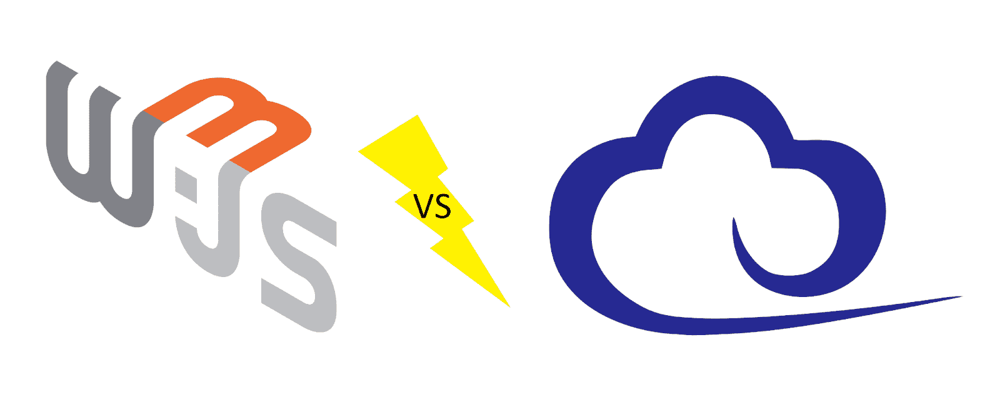
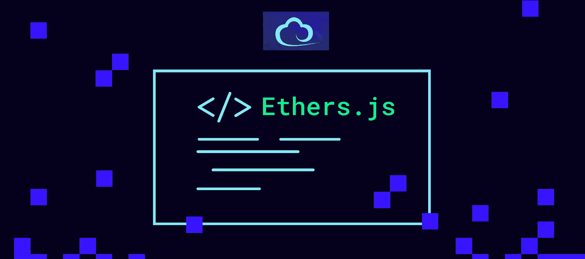

# web 3 . js vs ethers . js–ETH JavaScript 库指南

> 原文：<https://moralis.io/web3-js-vs-ethers-js-guide-to-eth-javascript-libraries/>

如今，加密开发者可以在多种可编程区块链中进行选择。虽然你经常听到“以太坊杀手”这个词，但先行者仍然是王者。正因如此，大部分区块链开发者还是把注意力放在 [**【以太坊】**](https://moralis.io/full-guide-what-is-ethereum/) **上。此外，由于其他可编程链倾向于遵循以太坊的领导，他们中的大多数都是** [**EVM**](https://moralis.io/evm-explained-what-is-ethereum-virtual-machine/) **兼容的。因此，相同的 JavaScript 库可以用于跨多个链部署 dapp(**[**)分散式应用**](https://moralis.io/decentralized-applications-explained-what-are-dapps/) **)。考虑到这一点，您应该仔细看看 Web3.js 与 Ethers.js 的比较。**

在这里，你将有机会了解什么是 Web3.js 和 Ethers.js。您还将了解 JavaScript 模块。此外，我们将快速概述两个 JavaScript ETH 库的模块。然而，本文的核心是 Web3.js 与 Ethers.js 的比较。这将有助于你清楚地了解每个图书馆的优缺点。此外，它还应该使事情变得更清楚，为什么大多数密码行业正在走向两个图书馆中较年轻的一个。也就是说，你也可以期待最终的 Web3 开发平台 [Moralis](https://moralis.io/) (又名 [Firebase for crypto](https://moralis.io/firebase-for-crypto-the-best-blockchain-firebase-alternative/) )很快开始本地运行 Ethers.js

幸运的是，在与 Moralis 合作时，您不必担心库在后台运行。只要您精通 JavaScript 并知道如何使用[元掩码](https://moralis.io/metamask-explained-what-is-metamask/)，您就万事俱备了。只需[创建你的免费 Moralis 账户](https://admin.moralis.io/register)并开始部署杀手级装备。

## Web3.js 是什么？

如上所述，Web3.js 是一个开源库或 JavaScript (JS)库的集合。*如果不能回答“* [*什么是 JavaScript*](https://moralis.io/javascript-explained-what-is-javascript/) *？”，请务必阅读我们关于这种流行编程语言的指南。我们在介绍中也提到了 Web3.js 是为基于以太坊的项目服务的。因此，它使开发人员在创建 dApps 时能够与以太坊区块链进行交互。而且值得指出的是，Web3.js 库是以太坊基金会搭建的。因此，它背后有一个相当大的社区，这通常是一个附加值。*

此外，Web3.js 本质上整合了与[以太坊节点](https://moralis.io/how-to-connect-to-ethereum-nodes/)通信的功能。这种通信是通过 JavaScript 对象符号-远程过程调用(JSON-RPC)协议执行的。*如果这是你第一次听说 Web3，一定要跳到我们的*[*web 3*](https://moralis.io/the-ultimate-guide-to-web3-what-is-web3/)*大指南。此外，在对 Web3.js 和 Ethers.js 进行比较之前，我们需要确保你们都知道什么是 js 模块。现在，注意 Web3.js 和 Ethers.js 都包含模块。*

### JS 模块解释

您可以将 JavaScript 模块视为书籍的章节或部分。此外，这种划分原则是所有有经验的程序员都会应用的。因此，你可以看到许多程序和编程库被分成模块。而且，本文涉及的两个 ETH JS 库都遵循这一实践。

此外，模块基本上是代码的集群。因此，当谈到 JavaScript 编程语言时，模块代表了一组有意义的单词和特殊字符的组合。此外，请记住，每个模块通常涵盖一个更大的程序中的特定功能。然而，回到书本章节的类比，与书本章节不同，好的编程模块可以根据需要被删除、添加或重组。此外，所有这些改变不会影响整个系统。因此，它们本质上是高度独立的，具有特定的功能。此外，将程序和库划分为模块也使得可维护性和可重用性更简单。尽管如此，如果你熟悉任何其他编码语言(例如:Java 或 [Python](https://moralis.io/python-explained-what-is-python/) )，你可能会想到类。它们非常类似于模块。

### Web3.js 模块

现在您已经知道了什么是 JS 模块，让我们快速了解一下 Web.js 模块:

*   **web 3 . Eth**:*Eth 模块是用来和以太坊网络交互的。它提供了几个子模块，包括 Web3.eth.subscribe、Web3.eth.contract、Web3.eth.accounts、Web3.eth.personal 等等。*
*   Web3。*.Net:*Net 模块是用来和网络属性交互的。当然也可能作为子模块与以太坊(Web3.eth.net)进行交互。*
*   **web 3 . Bzz**:*Bzz 模块是用来和蜂群网络交互的。*
*   web 3 . Shh:*Shh 模块用于与耳语协议交互。*
*   **Web3.utils** : *这个模块为以太坊 dApps 和其他 web3.js 包提供了实用函数。*

与大多数编程语言、平台和库一样，最好使用它们的文档来了解更多细节。您可以在下面的“Web3.js 与 Ethers.js 文档”部分找到 Web3.js 文档的链接。

## 什么是 Ethers.js？

Ethers.js 也是一个以太坊 JavaScript 库，使开发人员能够与以太坊网络进行通信和交互。此外，它是一个拥有 MIT 许可的开源库。那么，如果 Ethers.js 和 Web3.js 的用途一样，那它还有什么意义呢？请记住，有选择通常是件好事。因此，Ethers.js 为 Web3.js 提供了一个令人印象深刻的(在许多方面更胜一筹)替代方案。然而，就像其他产品一样，Ethers.js 和 Web3.js 也有各自的优缺点。在下面的“Web3.js 与 Ethers.js 的比较”一节中有更多的介绍。

### Ethers.js 模块

就像 Web3.js 一样，Ethers.js 也有几个模块。确切的说，这个 JS 库中有四个模块:Ethers.contract、Ethers.provider、Ethers.utils、Ethers.wallets，这些模块是 Ethers.js' API(应用编程接口)的核心。此外，让我们快速浏览一下所有四个 Ethers.js 模块:

*   **醚。提供者** : *这个模块可以让你与区块链以太坊建立连接。您使用它来发出查询和发送签名的事务。通过这个模块，Ethers.js 用户可以改变区块链的状态。*

*   **醚。契约** : *您使用该模块来部署智能契约并与之交互。而部署智能合约是 Ethers 的主要目的之一。合同，它可以提供更多。因此，它还包含一些功能，使开发人员能够“监听”智能合约事件(* [*)同步和索引智能合约事件*](https://moralis.io/sync-and-index-smart-contract-events-full-guide/) *)。此外，您还可以使用该模块来获取有关智能合约的信息，并调用智能合约提供的特定函数。*

*   **醚。Utils** : *当你想要格式化数据和处理用户输入时，你会用到这个模块。因此，Ethers.utils 使得构建 dApps 更加容易。*

*   **醚。钱包** : *如你所能假设的基于。钱包，乙醚。钱包提供了一种连接到任何现有以太坊地址的方式(以太坊钱包)。除了这一重要功能之外，该模块还使您能够创建新的钱包和签署交易。*

关于 Ethers.js 主要特性的更多细节，请查看我们的 [*Ethers.js 与 Web3.js*](https://moralis.io/javascript-libraries-ethers-js-vs-web3-js/) *对比。*

## Web3.js 与 ethers . JS–ETH JS 库并列

到目前为止，我们已经介绍了两个 JS ETH 库的基础知识，包括它们的模块。因此，您应该对 Ethers.js 和 Web3.js 有一个正确的理解。此外，你现在知道它们的用途了。因此，你明白它们对于在以太坊区块链或其他 EVM 兼容链上开发 dApps 是非常重要的。

在接下来的小节中，我们将讨论两个 JS 库的主要方面。因此，您将能够使用 Web3.js 与 Ethers.js 的比较来确定使用这两个选项中的哪一个。但是，请注意，您不需要过度考虑这一点。我们向您保证，您可以成功地使用两个 JS ETH 库中的任何一个。使用 Moralis 规范时尤其如此。虽然 Web3.js 目前是本地选择，但我们正计划过渡到 Ethers.js。然而，幸运的是，使用 Moralis 覆盖与加密相关的后端非常简单。在大多数情况下，你只需要复制并粘贴由 [Moralis 的文档](https://docs.moralis.io/)提供的代码片段。也就是说，让我们来比较一下 Web3.js 和 Ethers.js。

## Web3.js 与 Ethers.js 的对比

在接下来的小节中，我们将从以下几个方面对 Web3.js 和 Ethers.js 进行比较:

*   背后的团队
*   流行
*   下载
*   更新
*   测试
*   Web 性能
*   证明文件
*   许可证

### web 3 . js vs ethers . js——背后的团队

*   **Web3.js** :是以太坊基金会(非盈利组织)的一个项目。*有了项目背后的整个组织，就有更多的开发人员提供支持。不幸的是，这也意味着对于谁应该确保一切正常没有明确的责任。*
*   Ethers.js :由 Richard“RicMoo”Moore 开发和维护。*这显然将全部责任推给了里穆。*

如您所见，每种支持类型都有其优点和缺点。你喜欢什么样的后盾？

### web 3 . js vs ethers . js–受欢迎程度

在这里，你需要记住 Web3.js 是先创建的。因此，它赢得总体用例称号是有道理的。依靠 GitHub 的数据，Web3.js 有了更多的明星和更多的知识库。另一方面，当谈到受欢迎程度的增长速度时，Ethers.js 名列前茅。

### web 3 . js vs ethers . js–下载

比较这两个 JS 库的另一种方法是查看下载。然而，总的下载量并没有描绘出一幅清晰的画面。由于 Web3.js 出现的时间明显更长，它拥有不公平的优势。幸运的是，我们可以更专注于日常下载。根据 npm-stat.com 的说法，Ethers.js 是这方面的赢家。

### web 3 . js vs ethers . js–保持更新

定期适当地更新库是很重要的。这样可以确保支持团队及时删除所有已知的错误并添加新功能。根据可用的评论和 devs 反馈，两个 ETH JS 库都相对定期更新。

### web 3 . js vs ethers . js–测试

说到测试，Ethers.js 可能是更好的选择。它有预先编写的测试和清晰的测试文档。但是，您应该记住，这个结论是基于以前版本的 Ethers.js 的，在新版本中，情况可能会有所不同。

### Web3.js 与 ethers . js–Web 性能

Ethers.js 加载速度稍快，因为它的大小明显更小，这可能会提供更好的性能。不过，尺寸因素只有在涉及小型 dApps 时才会发挥显著的作用。此外，需要指出的是，对于使用 Web3.js 和 Ethers.js 的完全相同的 dApps，没有足够的速度测试数据。因此，任何性能优势都有待证实。

### web 3 . js vs ethers . js–文档

根据我们的经验和开发人员的评论，我们可以说这两个 ETH JavaScript 库都没有完美的文档。然而，它们都为您提供了足够多的细节。然后，由你来涵盖你感兴趣的关键方面。这也是你决定哪一个更适合你的项目的方法。此外，下面是每个库的文档的当前最新版本(在撰写本文时)的链接:

*   Web3.js 文档:https://web3js.readthedocs.io/en/v1.7.0/
*   Ethers.js 文档:https://docs.ethers.io/v5/

此外，您还应该记住，JavaScript 本身总是在发展，因此它的库也必须更新。区块链世界的发展速度更快。因此，团队经常发布两个 ETH JavaScript 库的更新和更新版本。

*注* *:在写作的时候 Web3.js 版本是 1.7.0，而 Ethers.js 是 5.4。在学习某些教程时，了解这些版本是很重要的。如果创建者没有更新他们的教程以使用最新版本，你需要匹配两个 ETH JavaScript 库的版本。*

### web 3 . js vs ethers . js–许可证

*   **Web3.js** :有 LGLv3 许可证。
*   Ethers.js :它有麻省理工学院的执照。

如果你的项目对许可证有具体要求，你需要注意这一点。在某些情况下，聘请许可专家是明智的。专业人士会帮你确定两个 ETH JavaScript 库哪个更适合你。

## web 3 . js vs ethers . js–ETH JavaScript 库指南–摘要

我们已经讨论了很多领域，并设法总结了 Web3.js 与 Ethers.js 的比较。到目前为止，您已经知道两个 JS ETH 库都提供了几个模块，使您能够与以太坊链进行交互。此外，您已经了解到每个库都有其优点和缺点。然而，区块链行业作为一个整体正在缓慢地向一个更年轻的替代品迁移——ethers . js。Moralis 也在进行同样的转变。不过，在用这个终极的 Web3 开发平台开发 dApps 时，这不是你需要担心的事情。您只需要创建您的免费 Moralis 帐户，[创建一个 Moralis 服务器](https://docs.moralis.io/moralis-server/getting-started/create-a-moralis-server)，并初始化 Moralis。一种方法是从头开始创建 HTML 和 JS 代码文件。然而，你也可以使用最实用的[以太坊 dApp 样板](https://moralis.io/ethereum-dapp-boilerplate-full-ethereum-react-boilerplate-tutorial/)。这个终极的 [Web3 样板](https://moralis.io/web3-boilerplate-beginners-guide-to-web3/)让你能够在几分钟内部署 dApps。

此外，如果你想继续免费的区块链发展教育，一定要访问 [Moralis 的博客](https://moralis.io/blog/)和 [Moralis 的 YouTube 频道](https://www.youtube.com/c/MoralisWeb3)。您可以在那里找到大量高质量的内容，包括许多有趣的示例项目。一些最新的主题涵盖了[【NFT】API 替代方案](https://moralis.io/nft-api-alternatives-comparing-alchemys-nft-api-with-moralis-nft-api/)、[无汽油交易](https://moralis.io/gasless-transactions-exploring-gasless-transactions-on-ethereum/)、如何[构建 Web3 登录](https://moralis.io/how-to-build-a-web3-login-in-5-steps/)以及 [Web3 认证](https://moralis.io/web3-authentication-the-full-guide/)、 [DAO 智能合约示例](https://moralis.io/dao-smart-contract-example-dao-guide/)、[wallet connects Android SDK](https://moralis.io/walletconnect-android-sdk-alternative-authenticate-android-apps-withmoralis/)、 [Web3 钱包](https://moralis.io/what-is-a-web3-wallet-web3-wallets-explained/)、 [GameFi 和 play-to-earn (P2E)](https://moralis.io/what-is-gamefi-and-play-to-earn-p2e/) 、[如何与 smarts 合约交互然而，如果你决心尽早成为一名区块链开发者，你可能需要考虑一种更专业的方法。如果是这样，你应该报名参加](https://moralis.io/how-to-interact-with-smart-contracts-through-your-website/)[Moralis 学院](https://academy.moralis.io/)。这样你就能接触到许多高质量的课程，一个出色的社区和专业的导师。这三个将使你马上成为全职加密。

