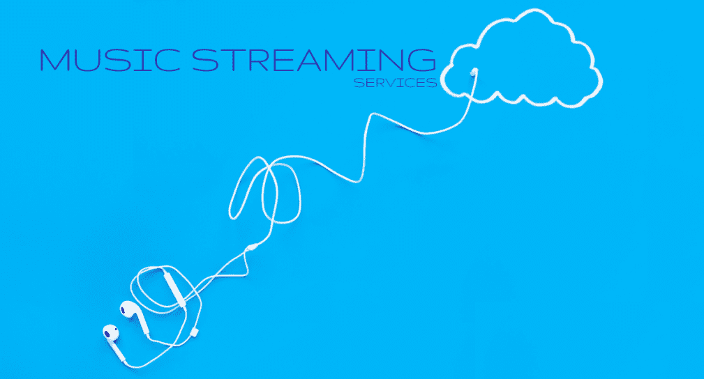
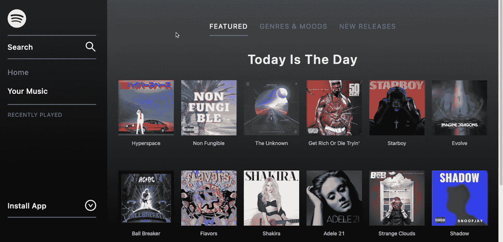
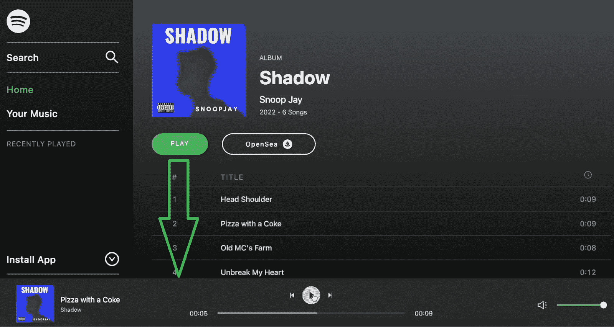
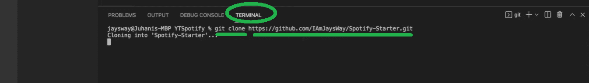
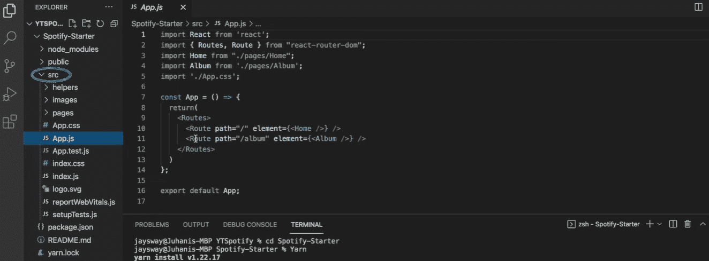
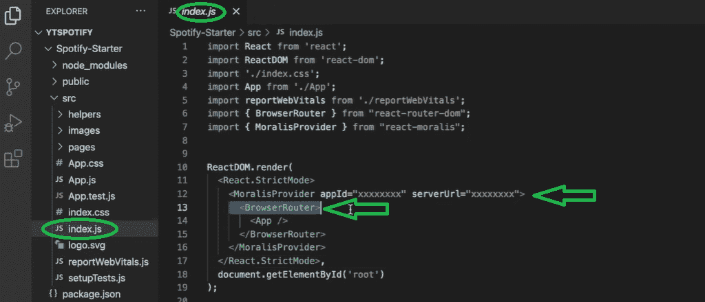
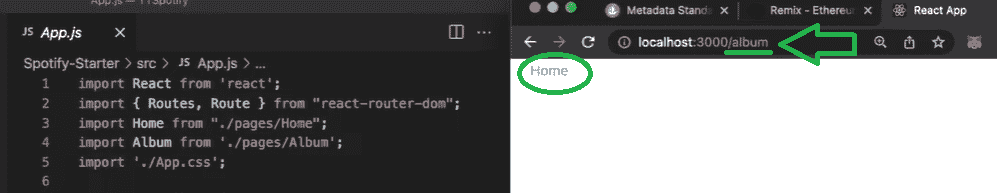
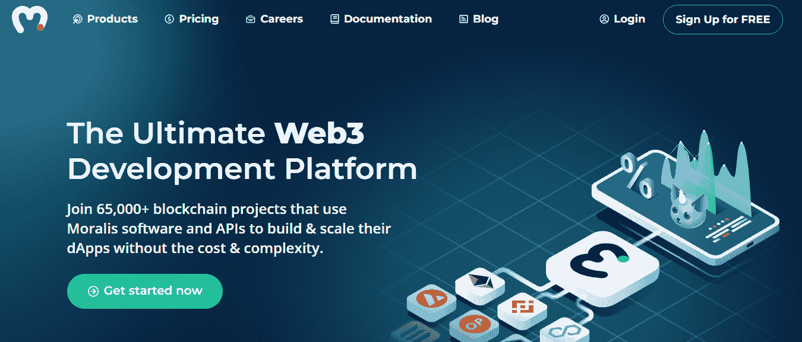
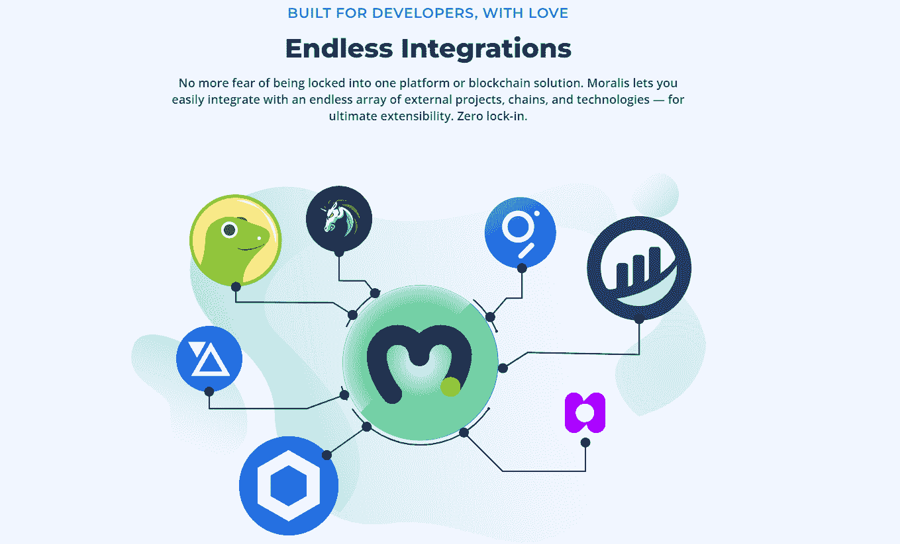
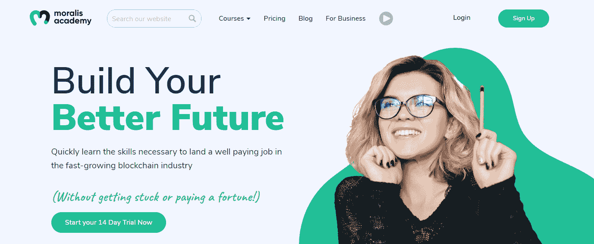

# Web3 音乐平台–创建 Web3 音乐流媒体服务

> 原文：<https://moralis.io/web3-music-platform-create-a-web3-music-streaming-service/>

能够创建 Web3 音乐流媒体服务提供了巨大的潜力。为什么？因为每个人都想进入一个音乐平台来体验好的氛围。这些共鸣是神奇的——它们有能力唤起所有的情感。由于音乐的力量如此强大，音乐伴随人类已经有很长时间了，这一点也不奇怪。此外，你可以确信音乐将继续成为我们日常生活的重要组成部分。现在，加上人们对去中心化的渴望，Web3 音乐平台替代品应该会接管世界。因此，我们想向你展示如何用 Moralis 创建一个 Web3 音乐流媒体服务(想想 [**Spotify Web3 克隆**](https://moralis.io/how-to-build-a-web3-spotify-clone/) **)。**

那么，你想创建自己的 Web3 音乐平台吗？如果是的话，那你来对地方了。接下来，你将会一步一步地遵循文字和视频指导。在这个过程中，您将学习如何使用一些出色的区块链开发工具。因此，你将学会与 [Remix](https://moralis.io/remix-explained-what-is-remix/) 合作，轻松部署你的[智能合约](https://moralis.io/smart-contracts-explained-what-are-smart-contracts/)。然而，这篇文章最有价值的方面在于学习如何使用终极的 [Web3](https://moralis.io/the-ultimate-guide-to-web3-what-is-web3/) 开发平台—[Moralis](https://moralis.io/)。这个“ [Firebase for crypto](https://moralis.io/firebase-for-crypto-the-best-blockchain-firebase-alternative/) ”平台是当前 [Web3 技术栈](https://moralis.io/exploring-the-web3-tech-stack-full-guide/)的巅峰之作。因此，Moralis 使您能够通过复制和粘贴简短的代码片段来满足所有与区块链相关的后端需求。此外，它将平均上市时间缩短了 87%。因此，您可以轻松地创建一个 Web3 音乐流服务，并提升您的 Web3 开发游戏！

## 我们的 Web3 音乐平台示例预览

如上所述，本文的大部分内容将主要向您展示如何创建 Web3 音乐流服务。然而，在我们卷起袖子开始建立一个 Web3 音乐平台之前，我们想让你明白一些事情。通过预览我们的示例 dApp ( [去中心化应用](https://moralis.io/decentralized-applications-explained-what-are-dapps/))，您将带着最终目标继续前进。此外，预览后，你会很容易决定是否要承担我们的示例项目。

让我们从 Web3 音乐平台的主屏幕开始:

在上面的截图中，你可以看到我们 dApp 的所有关键前端部分。在左手边，有一个侧面菜单栏。它的顶部有*标志*，然后是*搜索*栏、*主页*页面链接、*你的音乐*，下面是*最近播放的*标签。此外，还有*安装应用*选项卡，用户可以在这里安装应用。此外，屏幕的大部分显示不同的专辑。此外，可以通过三种不同的方式查看专辑:*特色专辑*、*流派*和*心情*、*新发布*。

### 超越 web 2——非功能性音乐

以上所有介绍都很简洁；然而，它也可以是一个常规的 Web2 音乐平台。因此，真正的价值来自于这样一个事实，即我们 dApp 中的所有音乐专辑实际上都是 [NFTs](https://moralis.io/non-fungible-tokens-explained-what-are-nfts/) 。每张专辑都是 NFT 的歌曲集。因此，每首歌都是 NFT。此外，点击上面的某个专辑，用户就可以看到里面的歌曲:

上面的图像显示了“影子”专辑的细节，我们选择了这个预览。最上面是这张专辑的封面图片。封面图片的旁边是专辑的标题，艺人的名字，专辑发行的年份，专辑中的歌曲数量。页面底部是这张专辑中包含的歌曲列表。列表包括歌曲的标题，在它们的右边，我们可以看到它们的长度。此外，两个按钮位于列表和专辑封面图像之间。play 按钮用于使用我们的示例 Web3 音乐平台的音乐播放器播放专辑中的歌曲。“OpenSea”按钮链接到最受欢迎的 NFT 市场。一旦转移到 OpenSea，用户甚至可以购买所有的歌曲作为 NFT:

当然，没有音乐播放器，我们无法创建 Web3 音乐流媒体服务。因此，点击*播放*按钮启动后者。此外，我们的 dApp 内置音乐播放器允许用户跳过歌曲、暂停或播放音乐以及调节音量:

## 创建 Web3 音乐流媒体服务–示例项目

看了上面的预告，你就知道我们即将打造的是一个多么优秀的 dApp 了。因此，你最有可能渴望在旅途中开始表演。然而，在我们向您展示如何正确设置这个项目之前，您需要了解您的选择。因此，你可以克隆[完成的代码](https://github.com/IAmJaysWay/Decentralized-Spotify)并在几分钟内创建一个 Web3 音乐流媒体服务。另一方面，您从[起始代码](https://github.com/IAmJaysWay/Spotify-Starter)开始，并跟随我们的领导进行构建。这两个模板在 GitHub 上都可以找到。然而，选择权在你。从“起始代码”开始将使你从本教程中获得最大收益。尽管如此，这也是创建你的免费 Moralis 账户的好时机。一旦我们到达这个示例项目的 Web3 后端部分，您将需要它。

### 项目初始设置示例

除非这是你第一次编码，否则你可能会意识到你需要一个代码编辑器。我们首选的代码编辑器是 Visual Studio Code (VSC)。因此，指令将集中在代码编辑器上。现在，使用上面的链接访问“启动代码”。然后克隆它:

成功复制 GitHub URL 后，您想使用 VSC 的终端。为了克隆代码，在命令行中输入“git clone ”,后跟复制的 URL:

然后，输入“cd Spotify-Starter”。接下来，键入“Yarn”安装所有依赖项:

当您等待安装所有依赖项时，我们建议您查看起始代码的文件夹三(src ):

我们主要关注“src”文件夹中的文件。您还可以看到“App.js”文件，它已经使用了 React 路由器。后者使我们能够在主页和相册页面之间切换。接下来是“index.js”文件，它存放着[React](https://moralis.io/react-explained-what-is-react/)“browser router”:

此外，查看上面的截图，您可以看到这也是我们将粘贴我们的 Moralis 服务器的详细信息的文件。这将是我们获得 [Moralis 的 SDK](https://moralis.io/exploring-moralis-sdk-the-ultimate-web3-sdk/) 力量的门票。

接下来，在终端的命令行中输入“yarn start ”,查看我们正在开始的内容:

上面的命令将在“localhost:3000”中运行我们的应用程序(它的初始形式)。这使我们能够在空白画布上看到“相册页面”页面:

通过点击“相册页面”，您可以测试前面提到的路由器。因此，它应该把你从“主页”页面带到“相册页面”。路由器也反过来工作。然而，当我们在“相册页面”页面时，我们看到的链接是“主页”:

## 创建 Web3 音乐流媒体服务-前端

此时，您应该已经完成了初始项目设置。因此，是时候专注于创建一个伟大的 Web3 UI 了。因此，你将有机会在本文底部的视频中跟随 Moralis 的专家之一。他会给你提供非常详细的指导。首先，从 03:11 开始，他将向您展示如何创建侧边栏。从 11:17 开始，你将学习如何建立一个合适的主页。然后，在 20:43，你将开始处理专辑页。最后，从 31:31 开始，您将为 Web3 音乐平台实现一个音频播放器。

完成所有这些 UI 开发阶段后，您将拥有一个看起来像“我们的 Web3 音乐平台示例预览”一节中展示的应用程序。但到目前为止，我们还没有添加任何 Web3 功能。因此，是时候利用 Moralis 的力量，将我们的应用程序转换成 dApp 了。我们将通过连接 Moralis 的 SDK 来实现这一点。因此，我们将访问 Moralis 的所有工具，包括其 [IPFS](https://moralis.io/what-is-ipfs-interplanetary-file-system/) 集成。我们将使用后者以分散的方式存储我们的 Web3 音乐流服务的音频文件。我们的下一站将是使用 Remix 部署我们的智能合约。这样，我们将负责 [NFT 铸造](https://moralis.io/how-to-launch-an-nft-minting-page-full-walkthrough/)过程。最后，我们将使用 [Moralis 的 Web3 API](https://docs.moralis.io/moralis-server/web3-sdk/intro) 来包含所有其他区块链特性。

## 使用 Moralis 创建 Web3 音乐流媒体服务

到目前为止，您已经知道 Moralis 为您提供了一种毫不费力地克服 RPC 节点的所有[限制的方法。首先，这个](https://moralis.io/exploring-the-limitations-of-rpc-nodes-and-the-solution-to-them/)[最好的 Web3 后端平台](https://moralis.io/exploring-the-best-web3-backend-platform/)为 [Web3 认证](https://moralis.io/web3-authentication-the-full-guide/)提供了最实用的解决方案。后者是每个 dApp 的重要组成部分。此外，在创建您的 Moralis 服务器之后，您还可以使用您的 Moralis 仪表板。这充当了链上数据的数据库。此外，通过 Moralis 的“同步”功能，您可以同步和索引智能合约事件。此外，Moralis 还提供了几个有用的集成，包括 [MetaMask](https://moralis.io/metamask-explained-what-is-metamask/) 、 [WalletConnect](https://moralis.io/what-is-walletconnect-the-ultimate-walletconnect-guide/) 和 IPFS。作为该示例项目的一部分，您将使用 IPFS 集成来[向 IPFS](https://moralis.io/full-guide-how-to-upload-to-ipfs/) 上传文件。但是首先，您需要完成初始的 Moralis 设置。

初始 Moralis 设置包括四个步骤。首先，你需要 [**创建你的免费 Moralis 账户**](https://admin.moralis.io/register) 或[登录](https://admin.moralis.io/login)到你现有的账户。接下来，您 [**创建一个新的服务器**](https://docs.moralis.io/moralis-server/getting-started/create-a-moralis-server) 。接下来，您必须**访问该服务器的详细信息**并使用它们**填充您的编码文件**。在我们的示例中，“index.js”文件是您需要替换占位符的地方:

*注意* *:关于初始 Moralis 设置的详细视频说明，请使用下面从 54:56 开始的视频。*

### 上传文件到 IPFS

尽管市场上有许多云存储解决方案，但大多数都是集中式的。幸运的是，我们可以使用 Moralis 的 IPFS 集成，它提供了一个分散的云存储解决方案。您可以通过创建一个名为“ [Album](https://github.com/IAmJaysWay/Decentralized-Spotify/tree/main/Album) ”的新文件夹来覆盖这一部分。它包含两个 JavaScript 文件，将帮助您创建元数据文件并将它们上传到 IPFS。这两个文件分别是“ [metadata.js](https://github.com/IAmJaysWay/Decentralized-Spotify/blob/main/Album/metadata.js) ”和“ [music.js](https://github.com/IAmJaysWay/Decentralized-Spotify/blob/main/Album/music.js) ”。在“Album”文件夹中，我们还有“ [export](https://github.com/IAmJaysWay/Decentralized-Spotify/tree/main/Album/export) ”文件夹，其中包含示例音频文件和专辑的封面图像:

上面的截图显示，您需要在“music.js”文件中输入您的 API 密钥。这也是 Moralis 的 SDK 会保护你的地方。使用下面的视频(57:00)指导您获取 API 密钥，然后将文件上传到 IPFS。

### 铸造代表专辑的 NFT

一旦你上传了文件和它们的元数据到 IPFS，是时候制作专辑了。通过这样做，你将能够在 OpenSea 上列出它们。如果你对制造 NFT 略知一二，你就会知道其中涉及不同标准的智能合约(即 ERC-721 和 ERC-1155)。使用 [OpenZeppelin](https://moralis.io/what-is-openzeppelin-the-ultimate-guide/) 的模板，我们创建了一个非常简单的智能契约，名为“ [Album.sol](https://github.com/IAmJaysWay/Decentralized-Spotify/blob/main/smartContracts/Album.sol) ”。如果想了解更多关于“Album.sol”的内容，如何编译，最后使用 Remix 进行部署，可以参考下面的视频(01:04:20)。

### 在我们的音乐流媒体服务中显示专辑 NFTs

剩下要做的就是显示相册 NFTs。幸运的是，您可以为此使用 Moralis 的 Web3 API。在 React 应用程序中使用适当的 Moralis 端点将获取上面生成的 NFT。一旦获取，你可以很容易地在你的 Web3 音乐平台中显示它们。同样，我们会把你交给 Moralis 专家。在下面的视频中(01:09:22)，他将向您展示如何在“useAlbum.js”中使用“getAllTokenIds”端点。

**最后，这里是视频教程，详细介绍了如何创建 Web3 音乐流媒体服务:**

https://www.youtube.com/watch?v=E7R1gX-pEAs

## Web3 音乐平台–创建 Web3 音乐流媒体服务–摘要

如果这是你第一次使用 Web3 开发，你会学到很多。您现在知道，使用正确的工具，您可以在相对较短的时间内建立并运行强大的 dApps。此外，如果你跟随我们的领导，你也学会了如何创建一个 Web3 音乐流媒体服务，这不是一个小任务。因此，你知道除了创建一个伟大的用户界面，你需要合并分散的文件存储。一旦文件被正确存储，你需要使用一个适当的智能合同来制造 NFT。然后，剩下要做的就是用你的 Web3 音乐平台获取这些 NFT。

如果你对这个例子感兴趣，我们鼓励你访问[Moralis 博客](https://moralis.io/blog/)和[Moralis YouTube](https://www.youtube.com/c/MoralisWeb3) 频道。除了详细的教程，你会发现那里解释了区块链开发的各个方面。我们最近的一些话题包括[无气元宇宙互动](https://moralis.io/gasless-metaverse-interactions-exploring-zero-fee-dapps/)、[如何创建 ERC-721 NFT](https://moralis.io/how-to-create-an-erc-721-nft/) 、 [Unity Web3](https://moralis.io/unity-web3-beginners-guide-to-unity-web3-programming/) 开发、[如何启动白牌 NFT 市场](https://moralis.io/how-to-launch-a-white-label-nft-marketplace/)、[将 Unity 游戏与 Web3 登录连接起来](https://moralis.io/connecting-a-unity-game-with-web3-login/)、[元宇宙智能合约](https://moralis.io/metaverse-smart-contract-how-to-build-a-metaverse-game-smart-contract/)示例、[如何用 ReactJS 构建跨链 Zapper dApp】，如何](https://moralis.io/how-to-build-a-cross-chain-zapper-dapp-with-reactjs-using-moralis-api-and-serverless-real-time-transactions/)[构建因此，这两个出口都是继续你的免费加密教育的最佳方式之一。](https://moralis.io/build-a-web3-mmorpg-with-unity-in-10-minutes/)

然而，如果你想尽早成为 Web3 开发者，那么你应该采取更专业的方法。因此，[Moralis 学院](https://academy.moralis.io/)可能正是你要找的。这个在线加密教育平台将为您提供顶级的[课程](https://academy.moralis.io/all-courses)和个性化的学习路径。尽管如此，更大的价值正以 Moralis 社区和专家指导的形式等待着你。

