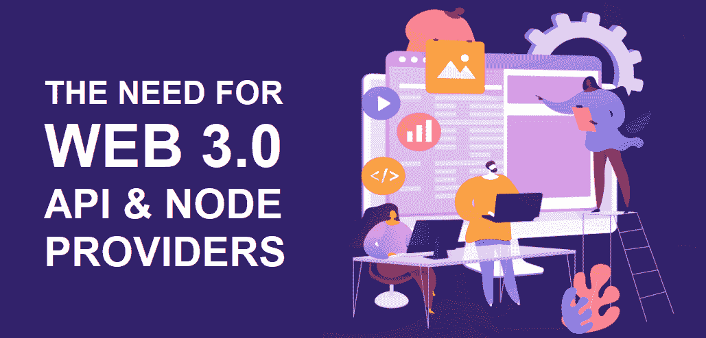
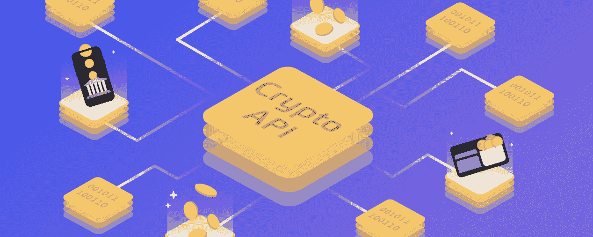
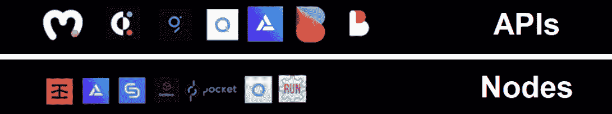
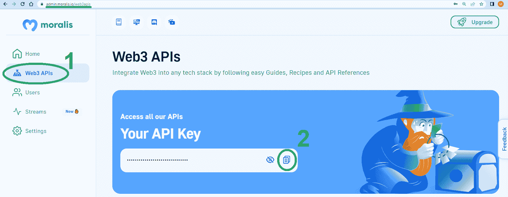
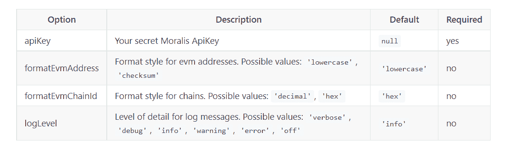
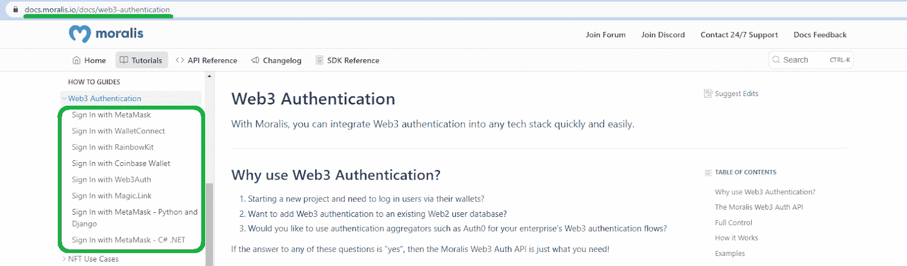
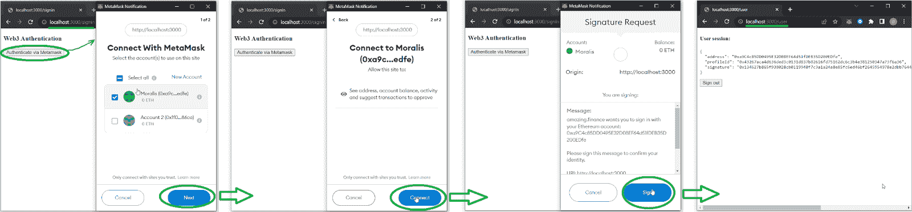

# Web3 提供商——为什么区块链开发者应该使用

> 原文：<https://moralis.io/web3-provider-why-blockchain-developers-should-use-one/>

了解什么是 Web3 提供者，提供者如何运作，以及如何利用提供者，对于任何想要过渡到 Web3 的遗留开发者来说都是必不可少的。虽然区块链理工大学的 T2 分校有许多提供商，但并不是所有的都提供相同的服务。记住这一点，重要的是要知道你想完成什么，以确定你需要什么样的 Web3 提供商。毕竟，在许多情况下，一个提供[基于区块链的认证](https://moralis.io/blockchain-based-authentication-how-to-integrate/)的可靠提供商是你实现你的杀手级 dapp 想法所需要的全部。此外，这完全取决于您想要集成什么类型的链上交互并提供给最终用户。

接下来，本文首先回答了“什么是 Web3 提供商？”问题。这样，我们就能在今天的讨论中增加一些清晰度。接下来，我们将解释为什么 Web3 提供商如此重要，如此受欢迎。我们还将仔细看看一些 Web3 提供商的例子。最后但同样重要的是，我们将向您展示如何连接到最终的 Web3 API 提供者，使您能够轻松开发优秀的 dapps。这意味着你将学习如何导入 Moralis 的 JS SDK。此外，我们将演示如何毫不费力地实现 [Web3 认证](https://moralis.io/authentication/)。当然，为了充分利用这篇文章，我们推荐你[创建你的免费 Moralis 账户](https://admin.moralis.io/register)并跟随我们的脚步。


## 什么是 Web3 提供商？

首先，你必须记住，Web3 是一个相对较新的时代。因此，当谈到与区块链技术相关的各种术语和短语时，会有很多不一致的地方。当关注 Web3 提供商时，这一点也显露出来。因此，你会看到许多平台和文章将 *Web3 提供商*与 *Web3 节点提供商*联系起来。然而，节点提供者只是特定类型的提供者。您还有 Web3 API 提供程序、Web3 钱包和身份验证提供程序，以及其他区块链开发工具提供程序。为了更好地理解我们对 Web3 提供商的定义，看一下当前区块链理工学院的堆栈会有所帮助:


如果你想深入了解这五层中的每一层，请使用本文开头提到的“区块链理工大学堆栈”链接。

看上面的图片，你可以看到区块链理工学院有五层。本质上，上述五层中的每一层都对 Web3 有贡献。因此，将大多数 Web3 开发平台、工具甚至实用程序 dapps 归类为 Web3 提供者在技术上是正确的。尽管如此，甚至每个可编程的区块链(上面的第一层)都是 Web3 提供者。毕竟，如果没有区块链网络，如以太坊、索拉纳和 BNB 链，Web3 就不可能实现。

归根结底，Web3 提供商是一种服务，或者说是一种工具，它支持 Web3 开发和与区块链的互动。此外，最常见和最基本的 Web3 提供程序是以 Web3 节点和 Web3 API 提供程序的形式出现的。因此，我们将在本文中重点讨论这两种类型。



### 为什么需要它们

现在你知道了什么是 Web3 提供商，是时候了解我们为什么需要他们了。说到区块链网络提供商，他们创造了 Web3 的基础。所有其他类型的提供者使得区块链开发变得简单多了。如果没有这些提供商，开发人员将需要运行他们自己的完整节点，并从头开始构建整个后端基础架构。也就是说，让我们仔细看看 Web3 节点提供者和 Web3 API 提供者的用途。


#### 为什么我们需要节点和 Web3 节点提供商

如果您还不熟悉 RPC 节点，请注意它们是与同一区块链上的其他节点连接的软件。此外，完整节点拥有当前特定区块链状态的完整副本。例如，以太坊 RPC 节点连接到其他节点，并包含以太坊链的状态。

用 CPU 来类比区块链也很有帮助:“*就像你在创建应用程序时不与 CPU 交互一样，你也不会想在构建 dapp*时直接与链交互。这就是需要节点的地方。因此，Web3 节点的核心目的是与区块链通信。基本上，节点使我们能够与区块链对话并访问其数据。

此外，值得指出的是，从技术上讲，任何人都可以运行节点。然而，在许多情况下，运行一个节点是一项全职工作，需要一个团队来进行维护、适当的备份等等。因此，如果所有的 Web3 开发者都需要运行他们自己的节点，那将是非常不切实际的。记住这一点，让 Web3 节点提供者去担心节点的运行。



#### 为什么我们需要 Web3 APIs 和 API 提供者

虽然节点很棒，但它们仍然是相当原始的技术。例如，Web3 节点不能为您提供详细信息，如用户余额。此外，节点只能关注一个链，而不能覆盖多个智能合约。此外，节点只为您提供来自区块链的原始数据，您需要开发自己的基础设施来使用这些原始数据。幸运的是，您可以使用 Web3 APIs 来代替。

API 是用于构建和集成应用程序的一组定义和协议。考虑到这一点，Web3 APIs 支持 dapp 开发。本质上，Web3 APIs 是一些核心工具，使 dapp 开发人员能够避免重新发明轮子。毕竟，API 为一个软件与其他软件交互提供了一种直接的方式。此外，可靠的 API 可以在稳定的环境中实现一致的编码。因此，显然非常需要高质量的 Web3 API 提供者。幸运的是，已经有几个可靠的解决方案可供您使用。

因此，通过使用这些提供 API 的 Web3 提供者，您可以利用它们与节点建立的连接。因此，通过使用可靠的 API 提供者，您不必担心连接到节点。此外，当与这些提供者交互时，您可以毫不费力地获得各种珍贵的预编译和预先计算的链上数据。



## 提供商示例

新的团体正在进入并定期展示自己是可靠的 Web3 提供商。然而，只有少数 Web3 节点和 API 提供者脱颖而出，并被证明是可靠、可靠的选择。您可以在下面找到它们。

**领先的 Web3 节点提供商:**

*   Infura
*   魔力
*   链板
*   山羊块
*   袖珍网络
*   快速笔记
*   运行节点

**领先的 Web3 API 提供商:**

*   Moralis
*   共价的
*   快速笔记
*   图表
*   bigquery
*   魔力
*   肖像学

Moralis 被列在 API 列表的顶部是有原因的——它是最终的 Web3 API 提供者。它也是领先的 Web3 身份验证提供商和最重要的 NodeJS Web3 提供商。因此，它使您能够用单行代码实现任何顶级 Web3 身份验证方法。此外，它是一个允许您使用 NodeJS 环境来覆盖 dapps 后端的首选工具。这意味着您可以利用您的 JavaScript 熟练程度开发出杀手级的 dapps。

此外，Moralis 还具有完全的跨平台互操作性。因此，它支持所有领先的遗留编程语言和开发平台。尽管如此，这个身份验证提供程序也是关于跨链互操作性的。因此，您可以轻松地将 dapps 部署到任何领先的区块链。因此，您的工作永远不会受限于任何特定的加密网络。


现在您已经知道了什么是 Moralis，是时候向您展示如何毫不费力地连接到这个 NodeJS Web3 提供者了。

## 如何连接到 Web3 提供商？

当使用 Moralis 作为 NodeJS Web3 提供者时，您可以在基本和高级 Moralis SDK 初始化之间进行选择。基本设置将满足您的大部分需求。但是，如果您希望对添加到 Moralis 的模块有更多的控制，请使用高级设置。看看下面的细节，你就会明白我们的意思了。


### 最终 NodeJS Web3 提供程序的基本初始化

首先通过您最喜欢的软件包管理器安装 Moralis。记住，将 Moralis SDK 集成到您的 JavaScript 项目中最简单的方法是通过 npm 模块。

*   如果使用*纱*，输入:

```js
yarn add moralis
```

*   如果您使用 *npm* ，请输入:

```js
npm install moralis
```

*   如果使用 *pnpm* ，输入:

```js
pnpm add moralis
```

成功安装 Moralis 后，您需要初始化它。为此，使用“ *start* 方法:

```js
import Moralis from 'moralis';

Moralis.start({
  apiKey: '<YOUR_API_KEY>',
});

```

查看上面的代码行，您可以看到您需要您的 Moralis Web3 API 密钥。因此，请确保登录您的 Moralis 账户。通过这样做，您将进入您的管理区域，在这里您可以复制您的 API 密钥:



然后，用实际的 API 键替换“ *< YOUR_API_KEY >* ”占位符。有了您的密钥，您可以使用在 Moralis 的 [NodeJS SDK 参考](https://docs.moralis.io/docs/nodejs-sdk-references)中定义的任何 Moralis 功能。

此外，还可以通过调用“ *Moralis.start(config)* ”来设置具体的配置。这里有一个例子:

```js
Moralis.start({
  apiKey: "YOUR_API_KEY",
  formatEvmAddress: 'checksum',
  formatEvmChainId: 'decimal',
  logLevel: 'verbose'
})
```

此外，使用下图查找配置的可能选项:



### 最终 NodeJS Web3 提供程序的高级初始化

如上所述，最终 NodeJS Web3 提供程序的基本初始化将在大多数情况下工作。但是，在某些特定情况下，您可能希望只安装特定的软件包，而不是" *moralis"* umbrella 软件包。这些是当前可用的软件包:

*   *@moralisweb3/core*
*   *@moralisweb3/auth*
*   *@moralisweb3/evm-api*
*   *Moralis 网页 3/左 api*
*   *@moralisweb3/evm-utils*
*   *@moralisweb3/sol-utils*

除了上面列出的任何软件包之外，您还需要安装" *@moralisweb3/core* "软件包。让我们看一个例子来澄清这个问题。因此，如果您想关注 Moralis EVM API，可以使用以下命令:

*   如果使用*纱*，输入:

```js
yarn add @moralisweb3/core @moralisweb3/evm-api
```

*   如果您使用 *npm* ，请输入:

```js
npm i @moralisweb3/core @moralisweb3/evm-api
```

*   如果使用 *pnpm* ，输入:

```js
pnpm add @moralisweb3/core @moralisweb3/evm-api
```

接下来，您需要将模块注册到代码顶部的核心包中:

```js
import MoralisCore from '@moralisweb3/core';
import MoralisEvmApi from '@moralisweb3/evm-api';

const core = MoralisCore.create();
// Register all imported modules to the @moralisweb3/core module
core.registerModules([MoralisEvmApi]);
```

注册完模块后，您可以按照描述最终 NodeJS Web3 提供程序基本初始化的步骤中描述的类似方式初始化应用程序:

```js
core.start({
  apiKey: '<YOUR_API_KEY>',
  // ...and any other configuration
});
```

按照上面的代码行，您可以使用已安装模块中包含的任何功能。当然，您还需要在代码中调用正确的模块:

```js
import MoralisEvmApi from '@moralisweb3/evm-api';
import { EvmChain } from '@moralisweb3/evm-utils';

const evmApi = core.getModule<MoralisEvmApi>(MoralisEvmApi.moduleName);
evmApi.block.getBlock({
    chain: EvmChain.ETHEREUM,
    blockNumberOrHash: "",
});
```

### 使用终极的 Web3 身份验证提供程序

至此，您已经知道可以通过初始化“ *moralis* ”伞形包或“ *@moralisweb3/auth* ”包来使用 Moralis 的 Web3 Auth API 的强大功能。有了这些，你就可以开始实现这个 [Web3 认证](https://moralis.io/authentication/)提供商提供的各种 Web3 登录解决方案了。因此，您可以为 dapps 配备以下验证解决方案:

*   MetaMask
*   WalletConnect
*   RainbowKit
*   Web3Auth
*   魔法。环

MetaMask 和 WalletConnect 是有经验的加密用户的首选。然而，如果你希望加入 Web2 用户，你可能希望专注于 Web3Auth 和 Magic.Link 提供的[动态 Web3 身份验证](https://moralis.io/add-dynamic-web3-authentication-to-a-website/)替代方案。此外，如果你想确切了解 Moralis 作为 Web3 身份验证提供商是如何工作的，请查看 Moralis 的[身份验证 API 概述](https://docs.moralis.io/reference/auth-api-overview)。此外，您可以在 Moralis 文档中找到所有受支持的 Web3 登录解决方案的演示(“操作指南”部分):



最后，让我们看一个例子，当使用 Moralis 的元掩码集成时，带有元掩码认证的简单前端会是什么样子。以下是完整的 Web3 身份验证序列:



如果你想构建这种 dapp，可以查看“[使用 MetaMask](https://docs.moralis.io/docs/sign-in-with-metamask) 登录”教程。

## Web3 提供商——为什么区块链开发者应该使用 web 3 提供商——摘要

我们在今天的文章中谈了相当多的内容。首先，我们解释了什么是 Web3 提供商，以及为什么您可能想要使用它。因此，您发现当使用 Web3 节点和 API 提供程序时，您可以在创建 dapps 时节省时间和资源。此外，我们列出了一些著名的 Web3 节点和 API 提供者，您会看到 Moralis 是最终的 Web3 API 提供者。此外，您了解了为什么 Moralis 也是最好的 NodeJS Web3 提供者和 Web3 身份验证提供者。最后，我们演示了如何初始化 Moralis 的 JS SDK。因此，您现在知道了如何使用 JavaScript 来充分利用 Moralis 的能力。

如果您准备开始构建，我们鼓励您从本文共享的教程开始。然而，你可以在 [Moralis YouTube 频道](https://www.youtube.com/c/MoralisWeb3)和 [Moralis 博客](https://moralis.io/blog/)上随意探索 Moralis 文档中涉及的其他示例项目。这些资源可以帮助你利用你遗留的编程知识免费成为一名 Web3 开发者。此外，它们也是持续、免费的区块链发展教育的极好来源。例如，一些最新的主题解释了如何[创建一个 NFT 项目](https://moralis.io/how-to-create-an-nft-project-get-started-and-launch-successfully/)，什么是 [Sui 区块链](https://moralis.io/what-is-sui-blockchain-the-ultimate-guide/)，如何着手[构建以太坊 dapps](https://moralis.io/building-ethereum-dapps-create-test-and-deploy/) ，如何使用 MetaMask 创建一个 [Web3 Firebase 登录，等等。](https://moralis.io/create-a-web3-firebase-login-with-metamask/)

另一方面，你可能有兴趣尽快成为全职加密员。在这种情况下，你可以考虑通过完成 Moralis 学院的一些课程来获得区块链认证。如果你是加密领域的新手，我们建议你从“[区块链和比特币 101](https://academy.moralis.io/courses/blockchain-bitcoin-101) 课程开始！