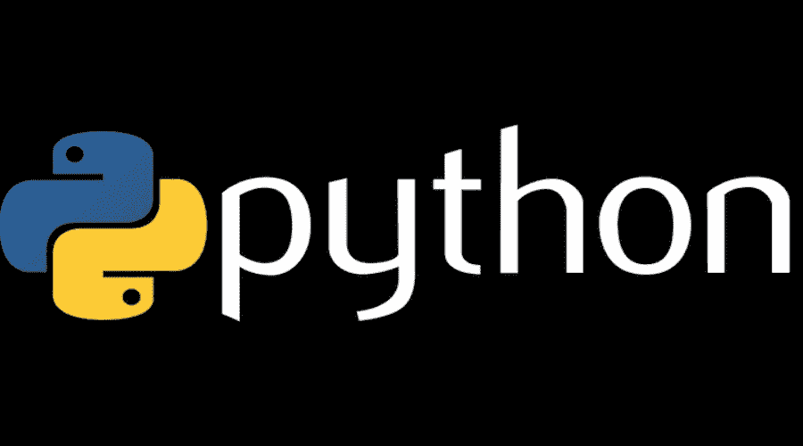
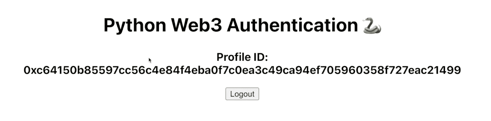
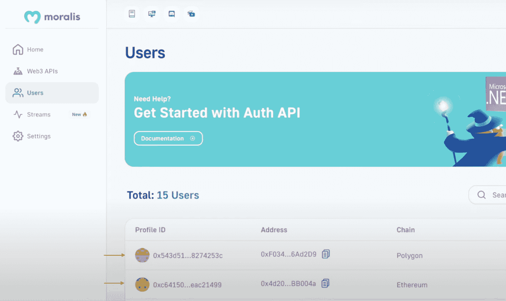
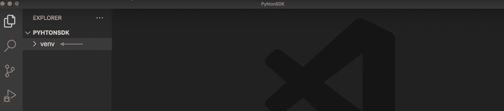

# web 3 Python–Python web 3 开发变得简单

> 原文：<https://moralis.io/web3-python-python-web3-development-made-easy/>

您知道吗，Moralis 提供了将区块链功能集成到任何 Python 应用程序中的最便捷的方法。如果您想了解更多这方面的知识，请阅读本文，探索 Web3 Python 开发的复杂性。可访问性源于 [**Moralis 规范**](https://moralis.io) **Python SDK，允许您分两步将 Web3 功能实现到 Python 应用中:**

*   1.通过运行以下命令安装 Moralis 的 Python SDK:

```js
pip install moralis
```

*   2.进行 Moralis Web3 API 调用。以下是获取 NFT 元数据的示例:

```js
import json
from moralis import evm_api

api_key = "YOUR_API_KEY"

params = {
    "address": "0xb47e3cd837dDF8e4c57F05d70Ab865de6e193BBB", 
    "token_id": "3931", 
    "chain": "eth", 
    "format": "decimal", 
    "normalizeMetadata": True, 
}

result = evm_api.nft.get_nft_metadata(
    api_key=api_key,
    params=params,
)

print(json.dumps(result, indent=4))
```

如果您正在寻找关于该过程的更多示例和更详细的信息，请考虑查看 Moralis 的 [Web3 Python SDK 文档](https://docs.moralis.io/docs/your-first-dapp-python)！然而，如果你想知道更多关于如何使用 Python 实现 Web3 并一步一步地跟进的话，请继续阅读！

### 概观

Python 是一种卓越的、高级的、面向对象的、通用的编程语言，有许多不同的用例。它是当今最流行的编程语言之一，具有简单易学的语法，这也是它被广泛采用的原因之一。此外，如果你是一名 Python 开发者，想要进入区块链领域，现在比以往任何时候都容易，这要感谢 Moralis。如果这听起来令人兴奋，并且您想了解更多，请加入我们，探索 Moralis 的 Python SDK，这是将 Web3 功能集成到 Python 应用程序的最简单方法！

本文以 Python 的快速介绍开始，从中您可以获得编程语言的概述。接下来，下一节将重点介绍 Web3 环境中的 Python。从这里开始，下一部分将介绍 Moralis 和 Python SDK。最后，我们将通过展示如何创建 Web3 Python 应用程序来使用 Moralis 的 Python SDK。此外，为了使本教程尽可能简单明了，它分为以下三个部分:

1.  应用程序演示–您的目标是什么？
2.  构建 Python Flask 应用程序
3.  设置 React 前端应用程序

通过完成本教程，您将了解如何利用 Moralis 的 Python SDK 在任何 Python 应用程序中实现 Web3 身份验证机制。结合开发工具包，您将了解 Moralis 的 [Auth API](https://moralis.io/authentication/) 是如何工作的。而且，在本教程中，我们将集成元掩码认证；然而，您可以通过 API 用单行代码实现几个 auth 方法。如果你想了解这方面的更多信息，请查看我们的指南，了解如何在[添加 RainbowKit 标志](https://moralis.io/how-to-add-a-sign-in-with-rainbowkit-to-your-project-in-5-steps/)或[添加比特币基地钱包登录功能](https://moralis.io/how-to-add-coinbase-wallet-login-functionality/)！

现在，在前进之前，注册与 Moralis，因为你需要一个帐户跟进！

[**Sign Up with Moralis**](https://admin.moralis.io/login)

## Python 是什么？

Python 是一种具有动态语义的面向对象编程语言。它包括高级数据结构、动态绑定、动态类型和其他几个突出的特性。由于 Python 是一种所谓的“通用”编程语言，它有丰富的用例，从构建简单的应用程序到机器学习。



Python 的特点是强调可读性的简单易学的语法，这有助于该语言的广泛采用。由于 Python 相对容易掌握，所以它是入门级编码人员的首选。此外，它甚至被许多非程序员采用，包括科学家和会计师利用 Python 处理日常任务！

Python 提供了许多优势和好处，在下面的列表中，您会发现三个突出的例子:

*   **开源**–编程语言是开源的。因此，它可以自由使用和分发，即使是在商业环境中。
*   **模块和库**–Python 支持包和模块，这使得程序模块化和代码重用成为可能。
*   社区(Community)——Python 有一个庞大的社区，为库和模块池做出贡献，这对其他开发人员来说是一笔极好的资产。

以上是对 Python 的简单介绍。在下一节中，我们将更仔细地看看这种语言在 Web3 环境中意味着什么！

## 你能用 Python 做 Web3 吗？

现在，随着对 Python 有了更深刻的理解，本节将在 Web3 环境中研究这种突出的编程语言。因此，我们将着手回答这个问题，“你能为 Web3 使用 Python 吗？”。


对上述问题的直接回答是:是的，您可以将 Python 用于 Web3！然而，当谈到区块链开发空间时，您可能希望掌握诸如“Web3.py”之类的库。此外，“Web3.py”是一个基于 Python 的库，使得与以太坊区块链的交互更加容易。因此，尽管 Web2 和 Web3 Python 开发之间有许多相似之处，但您需要考虑一些细微的差异！

此外，还有额外的开发工具可以帮助您的 Web3 Python 努力促进更无缝的开发体验。如果您想了解更多这方面的内容，请继续阅读下一节，我们将探索 Python Web3 的终极开发工具！

## 终极 Python Web3 开发工具

如果你正在寻找一个更加无缝的 Web3 开发体验，你需要了解 Moralis！Moralis 是一家著名的 Web3 基础设施提供商，提供企业级开发工具，如 Web3 APIs、SDK 等。因此，使用 Moralis，您可以充分释放区块链技术的力量来创建复杂的 Web3 dapps(分散式应用程序)！

在 Moralis 的突出特性中，您会发现 Moralis Python SDK！这个终极的 Python Web3 开发工具使得区块链相关的 Python 开发变得更加容易。


借助 Python SDK，您可以轻松地将区块链和 Web3 功能集成到任何 Python 应用程序中。此外，由于所有 Moralis 工具之间的协同作用，您可以将 SDK 与 Moralis 的任何[web 3 API](https://moralis.io/web3-apis-exploring-the-top-5-blockchain-apis/)相结合，如 [Solana API](https://moralis.io/solana-api/) 、 [Streams API](https://moralis.io/streams/) 、 [NFT API](https://moralis.io/nft-api/) 等。，创建更复杂的项目！

此外，由于 Moralis 的跨链功能，您可以使用 Python SDK 在多个网络上快速开发 dapps，包括 Solana、Cronos、Ethereum 等等，例如:

*   获取本地余额
*   从集合中获取所有 NFT
*   获取 NFT 元数据
*   从特定钱包中获取所有非功能性钱包

尽管如此，现在您已经更加熟悉了 Moralis 的 Python SKD，让我们通过探索一个 Python Web3 示例来更仔细地看看它实际上是如何工作的！

## Web3 Python 教程–探索 Python Web3 示例

现在，您对 Python 和 Moralis 的 Python SDK 已经比较熟悉了，接下来的小节将通过探索一个 Web3 示例来说明如何在实践中使用开发工具包。具体来说，本教程将教您如何使用 Moralis 的 Python SDK 处理 Web3 认证流，以便通过 Flask server 应用程序进行 API 调用。此外，您将学习如何快速设置一个 React 前端应用程序，展示实际的认证流程！


此外，为了使本教程尽可能简单明了，它分为以下三个部分:

1.  应用程序演示–您的目标是什么？
2.  构建 Python Flask 应用程序
3.  设置 React 前端应用程序

通过介绍上述部分，您将了解如何使用 Moralis 的 Python SDK 进行 Web3 API 调用。因此，您可以轻松地将 Web3 和区块链功能集成到任何服务器端 Python 应用程序中，以查询链上数据！也就是说，如果你更喜欢看视频来学习，你也可以看看下面来自 [Moralis YouTube](https://www.youtube.com/@MoralisWeb3) 频道的视频，它更详细地涵盖了整个 Web3 Python 教程:

[https://www.youtube.com/embed/eIYd_FOT3Fw?feature=oembed](https://www.youtube.com/embed/eIYd_FOT3Fw?feature=oembed)

但是，您也可以在这里加入我们，因为我们从头到尾分解了整个过程。所以，废话不多说，让我们通过一个最终应用程序如何工作的快速演练来更深入地了解一下您正在朝着什么方向努力！

## 应用程序演示–您的目标是什么？

这个 Web3 Python 教程演示了如何创建的应用程序相对简单。登录页面有一个“Python Web3 身份验证”标题和一个“登录”按钮:


当点击这个按钮时，它会自动触发你的元掩码，要求你连接你的 Web3 钱包。一旦你连接你的帐户，它将自动发送一个“挑战”请求到应用程序的 Python 后端，要求 Moralis 的 Auth API 生成一个新的 Web3 登录挑战。

从那里，应用程序发送另一个请求来验证签名。如果正确，它会生成一个新的用户 ID，显示在前端:



一旦您成功验证了新用户，他们将自动添加到您的 Moralis 管理面板上的“用户”选项卡中:



这包括了应用程序演示，如果你想学习如何创建这个项目，请加入我们，我们将在下一节向你展示如何为你的后端创建一个 Python Flask 应用程序！

## 构建 Python Flask 应用程序

首先，本节的第一部分围绕设置 Web3 Python 项目展开。此外，为了说明这个过程，我们将在整个教程中使用 Visual Studio 代码(VSC)。也就是说，请注意，如果您选择另一个环境，该过程可能偶尔会有所不同。现在，您可以从打开首选的集成开发环境(IDE)开始。

启动 IDE 后，继续创建一个新的“PythonSDK”项目文件夹，并打开一个新的终端。如果您像我们一样选择了 VSC，您可以点击顶部的“终端”，然后点击“新终端”选项:


从那里，将“ *cd* ”放到项目的根文件夹中，并通过在终端中运行以下命令来创建一个新的虚拟环境:

```js
python3 -m venv venv
```

运行上面的命令时，会产生一个新的“venv”文件夹，您应该可以在本地目录中找到它:



接下来，您需要初始化这个虚拟环境，您可以通过以下终端命令来完成:

```js
source venv/bin/activate
```

既然您已经初始化了虚拟环境，下一步就是确保您拥有最新的" *pip* "版本。您可以通过输入并运行以下代码来检查当前版本并安装任何最新的更新:

```js
pip install --upgrade pip
```

最后，您必须安装必要的依赖项，总共有三个。在下面，您会找到相应的命令。输入每个命令并连续运行它们:

```js
pip install flask
```

```js
pip install flask_cors
```

```js
pip install moralis
```

这涵盖了最初的项目设置！在接下来的小节中，我们将仔细检查应用程序代码！

### Python Flask 应用程序代码

有了 Web3 Polygon 项目的基本状态，本节将重点放在应用程序代码上。因此，我们现在将向您展示如何添加所需的端点和功能！

首先，在项目的根文件夹中创建一个名为“app.py”的新文件并打开它。您需要做的第一件事是导入依赖项，这可以通过将以下代码片段添加到文件的顶部来完成:

```js
from flask import Flask
from flask import request
from moralis import auth
from flask_cors import CORS
```

接下来，添加下面的代码片段来初始化应用程序，并将其包装在“ *CORS* ”中:

```js
app = Flask(__name__)
CORS(app)
```

从这里，将您的 Moralis API 密钥添加到代码中:

```js
api_key = "xxx"
```

但是，请确保用您的实际密钥替换“ *xxx* ”。要得到钥匙，你必须拥有一个 Moralis 账户。所以，如果你还没有，[马上创建一个 Moralis 账户](https://admin.moralis.io/register)！当您最终登录时，导航到“Web3 APIs”选项卡，在这里您可以找到密钥:


最重要的是，您必须创建两条路线:“*/请求挑战*和“*/验证挑战*”。

*   "***/request challenge***"*——每当用户想要认证自己时，都需要向 Moralis 请求挑战，这就是这个初始路由所负责的。此路由包含一个" *reqChallenge()* "函数，该函数获取请求参数，创建一个" *body* "变量，从" */requestChallenge* "端点获取结果，并最终将其传递给客户端:*

```js
*@app.route('/requestChallenge', methods=["GET"])
def reqChallenge():

    args = request.args
    body = {
        "domain": "my.dapp", 
        "chainId": args.get("chainId"), 
        "address": args.get("address"), 
        "statement": "Please confirm login", 
        "uri": "https://my.dapp/", 
        "expirationTime": "2023-01-01T00:00:00.000Z", 
        "notBefore": "2020-01-01T00:00:00.000Z", 
        "resources": ['https://docs.moralis.io/'], 
        "timeout": 30, 
    }

    result = auth.challenge.request_challenge_evm(
        api_key=api_key,
        body=body,
    )

    return result*
```

**   "***/verify challenge***"*–*当用户签署消息时，结果被返回到后端，并使用第二个" */verifyChallenge* 路线进行验证。该路由具有" *verifyChallenge()* "函数，该函数从请求中获取参数，创建一个" *body* "变量，从 Moralis 的 Auth API 端点获取结果，并最终将其返回给客户端:*

```js
*@app.route('/verifyChallenge', methods=["GET"])
def verifyChallenge():

    args = request.args
    body={
        "message": args.get("message"), 
        "signature": args.get("signature"),
    }

    result = auth.challenge.verify_challenge_evm(
        api_key=api_key,
        body=body
    )

    return result*
```

*最后，添加最后的代码片段，指定您希望在哪里运行应用程序:*

```js
*if __name__ == "__main__":
    app.run(host="127.0.0.1", port=3000, debug=True)*
```

*这包括了“app.py”的代码，总而言之，该文件现在应该是这样的:*

```js
*from flask import Flask
from flask import request
from moralis import auth
from flask_cors import CORS

app = Flask(__name__)
CORS(app)

api_key = "xxx"

@app.route('/requestChallenge', methods=["GET"])
def reqChallenge():

    args = request.args
    body = {
        "domain": "my.dapp", 
        "chainId": args.get("chainId"), 
        "address": args.get("address"), 
        "statement": "Please confirm login", 
        "uri": "https://my.dapp/", 
        "expirationTime": "2023-01-01T00:00:00.000Z", 
        "notBefore": "2020-01-01T00:00:00.000Z", 
        "resources": ['https://docs.moralis.io/'], 
        "timeout": 30, 
    }

    result = auth.challenge.request_challenge_evm(
        api_key=api_key,
        body=body,
    )

    return result

@app.route('/verifyChallenge', methods=["GET"])
def verifyChallenge():

    args = request.args
    body={
        "message": args.get("message"), 
        "signature": args.get("signature"),
    }

    result = auth.challenge.verify_challenge_evm(
        api_key=api_key,
        body=body
    )

    return result

if __name__ == "__main__":
    app.run(host="127.0.0.1", port=3000, debug=True)*
```

### *启动应用程序*

*Web3 Python Flask 应用程序的代码全部完成后，剩下的最后一件事就是运行项目。为此，再次打开一个新的终端并运行以下命令:*

```js
*python3 app.py*
```

*就是这样！它现在应该在您先前指定的本地主机 3000 上启动您的应用程序！但是，如果您计划在某个时候启动应用程序，您可能还想添加一些错误处理。不幸的是，我们不会向您展示这是如何做到的，因为这超出了本文的范围！*

*然而，现在我们已经完成了 Web3 Python Flask 应用程序，让我们深入到前端部分，在这里我们将快速设置一个用于测试端点的 React 应用程序！*

## *设置 React 前端应用程序*

*Web3 Python 示例应用程序全部完成后，您需要做的最后一件事是设置一个前端应用程序，我们将从该应用程序调用端点并处理 Web3 身份验证。因此，在本节中，我们将简要地向您展示如何创建一个 React 前端应用程序！*

*为了尽可能简单明了，我们将使用一个已经准备好的 React 应用程序。因此，您需要做的就是访问下面的 GitHub 库并将项目克隆到您的本地目录:*

***完整的 Web3 Python 示例文档—**[**https://github . com/moralisweb 3/YouTube-tutorials/tree/main/web 3 auth Python**](https://github.com/MoralisWeb3/youtube-tutorials/tree/main/Web3AuthPython)*

***克隆存储库后，您应该会发现自己的文件结构类似于下图所示:***

***

从那里，您现在应该能够启动应用程序了。为此，请打开一个新的终端并运行以下命令:

```js
npm run start
```

这就是 Web3 Python 示例教程！如果您想要 React 应用程序的更详细的分解，请查看“ *Web3 Python 教程-探索 Python Web3 示例*”部分的视频。

此外，如果您已经学习了这么多，现在可以使用 Moralis 的 Web3 Python SDK 来验证用户。如果您想了解更多关于这个开发工具包功能的信息，请查看 [Moralis 的 Web3 Python SDK 文档](https://docs.moralis.io/docs/your-first-dapp-python)！

## Web3 Python 开发–总结

在本文中，我们通过展示一个如何创建 Web3 Python 应用程序的例子，展示了 Moralis 的 Python SDK 的可访问性。此外，为了使本教程尽可能简单明了，它分为以下三个部分:

1.  应用程序演示–您的目标是什么？
2.  构建 Python Flask 应用程序
3.  设置 React 前端应用程序

如果您已经加入了我们，那么您现在应该知道如何在 Python 应用程序中实现 Web3 功能。此外，如果你觉得这个教程很有帮助，请点击 Moralis 的 [Web3 博客](https://moralis.io/blog/)查看其他区块链开发内容。例如，学习如何[创建 AWS Lambda 函数](https://moralis.io/creating-a-lambda-function-learn-how-to-create-an-aws-lambda-function/)或探索[AWS game parks](https://moralis.io/aws-gamesparks-guide-what-is-gamesparks/)！

尽管如此，如果你想创建兼容 Web3 的 Python 应用程序，[立即向 Moralis](https://admin.moralis.io/register) 注册。这样做，您可以充分利用区块链技术来更无缝地构建 Web3 项目！***