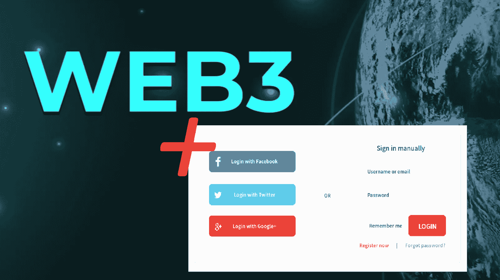
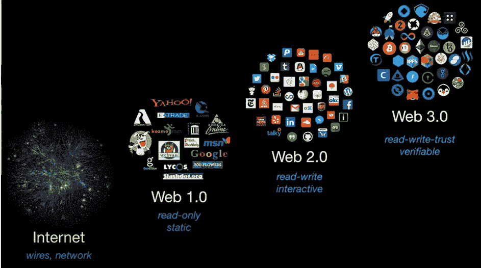
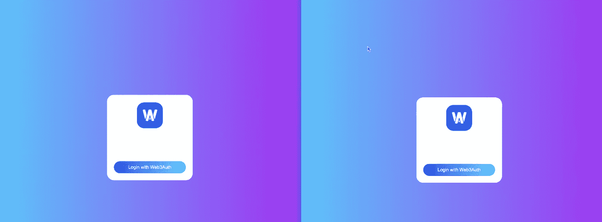
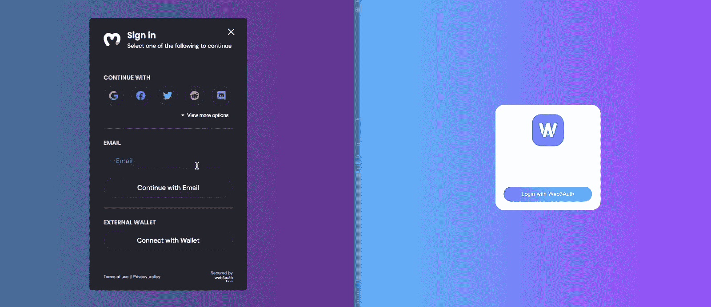
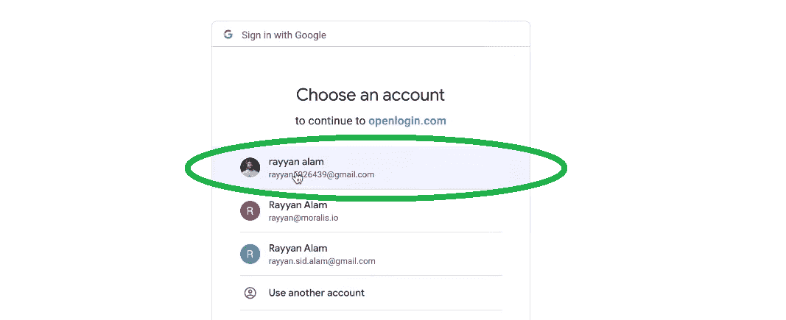
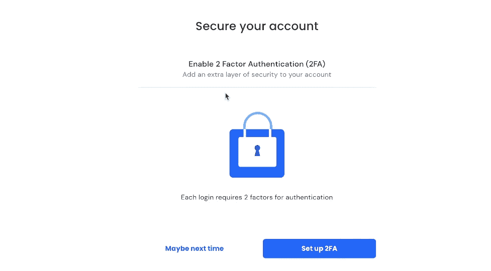
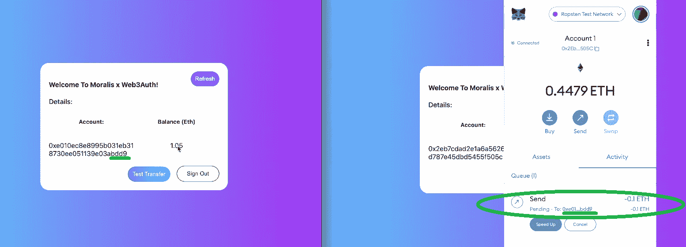
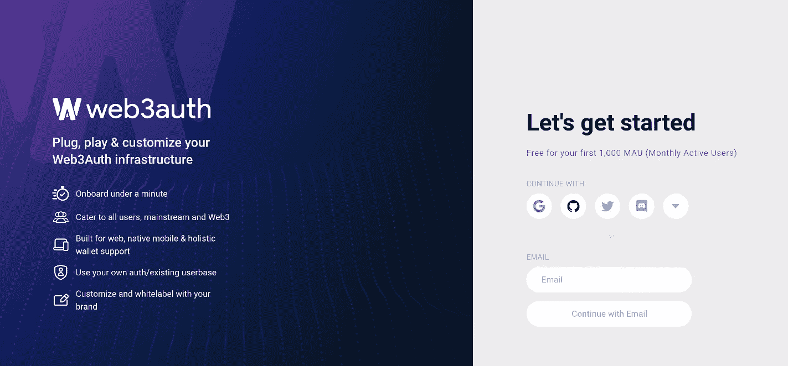
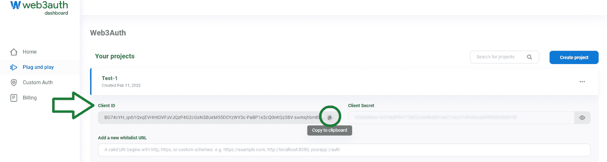
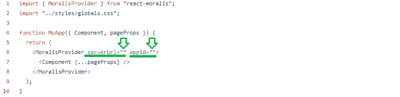

# Web3 社交登录–使用谷歌、电子邮件或 Twitter 登录 dApp 用户

> 原文：<https://moralis.io/web3-social-login-sign-in-dapp-users-with-google-email-or-twitter/>

**如今大多数** [**Web3**](https://moralis.io/the-ultimate-guide-to-web3-what-is-web3/) **应用都需要一个** [**Web3 钱包**](https://moralis.io/what-is-a-web3-wallet-web3-wallets-explained/) **，作为 Web3 认证或 Web3 登录工具。然而，由于许多人仍然不熟悉加密领域，他们可能会犹豫是否要进入这个领域。但是，今天大多数人都非常熟悉的一些领域是各种社交媒体和使用谷歌、电子邮件和 Twitter 时的标准登录程序，等等。因此，将传统登录和 Web3 登录结合起来将会改变游戏规则。幸运的是，这一切都有可能借助终极的 Web3 开发平台，**[**Moralis**](https://moralis.io/)**。有了 Moralis，我们可以在 dApps 中快速实现 Web3 社交登录。反过来，通过电子邮件** **执行 Web3 的社交登录和** [**Web3 认证变成了一个简单的过程。**](https://moralis.io/how-to-do-web3-authentication-via-email/)

接下来，我们将向您展示一个 dApp 示例，其中我们已经实现了一个 Web3 社交登录。此外，我们将指导您完成所有关键步骤，这样您就可以自己开始使用 Google 或 Twitter 登录 dApp 用户。因此，在接下来的几节中，您将要熟悉的工具将帮助您轻松地接纳新用户。此外，让我们指出，您可以轻松地将这种登录添加到您现有的任何用 Moralis 构建的 dApps 中。你所需要做的就是覆盖最初的 Web3 认证设置过程，然后调整一小段代码。尽管如此，随着我们继续我们的“Web3 社交登录”探索，你也将有机会体验一些其他优秀的 Moralis 功能。因此，您将看到 Moralis 仪表板如何使您能够[索引区块链](https://moralis.io/how-to-index-the-blockchain-the-ultimate-guide/)。



## 什么是 Web3 社交登录？

在我们关注我们的示例 dApp 的预览之前，让我们确保我们都在同一页上。如此，让我们一起来回答“什么是 Web3 社交登录？”。首先，让我们将事情分解为“Web3”和“社交登录”。在这里，“Web3”指的是基于区块链技术的新型互联网。理想状态下，它是去中心化的，内置数字货币系统。*如果您想更深入地了解“Web3”和“Web3 身份验证”主题，请确保使用简介中的相应链接。我们还建议您探索一下*[*Web3 tech stack*](https://moralis.io/exploring-the-web3-tech-stack-full-guide/)*并阅读我们的“web 3 解释”文章，了解一下[web 3 如何工作](https://moralis.io/how-does-web3-work-web3-explained/)*[*s*](https://moralis.io/how-does-web3-work-web3-explained/)*。*



另一方面，“社交登录”指的是特定类型的登录选项。用户可以使用现有的社交媒体账户注册并登录其他应用程序。它使用户能够避免输入他们的电子邮件地址和创建新的密码。因此，这显然是一个相当实际的选择。现在，如果我们将所有这些放在一起，我们可以得出结论，Web3 社交登录是 Web3 应用程序的一个强大选项。因此，它是一种用户友好的方法，可以让 dApp 用户通过 Google 或 Twitter(以及其他选项)登录。

## Web3 社交登录正在运行

如前所述，我们将向您展示包含 Web3 社交登录的 dApp 示例。请记住，我们示例的目的是向您展示功能。因此，这款应用非常简单。然而，我们还包括了“测试交易”功能。后者使我们能够向您展示，通过 Web3 社交登录登录的用户可以完全融入 Web3 世界。

## 使用 Google 或 Twitter 登录 dApp 用户——dApp 预览示例

出于演示目的，我们将并行运行两个 dApps。此外，这两款 dApps 都提供了 Web3 社交登录功能。此外，通过并行运行应用程序，我们将能够清楚地向您展示两个帐户之间的测试交易。以下是我们的 dApp 示例:



如前所述，用户通过点击“使用 Web3Auth 登录”按钮登录。一旦用户点击按钮，他们将看到这个登录模块:



看上面的截图，可以看到登录模块有三个部分。还有“继续”部分，这是 Web3 社交登录的精髓。如你所见，该部分有许多社交媒体选项。此外，点击“查看更多选项”按钮可以查看其他选项:


然后是“电子邮件”部分，用户可以使用电子邮件地址登录。通过 Web3 社交登录和 Web3 电子邮件登录，加密钱包会自动创建并分配给选择这些登录选项的用户。因此，作为开发人员，您可以为他们提供与使用他们的热钱包相同的功能。说到热门钱包，我们也有“外部钱包”部分。后者提供了经典的 Web3 登录方法。*通过传统的 Web3 登录，我们指的是使用热门的加密钱包如*[](https://moralis.io/metamask-explained-what-is-metamask/)**。**

### *Web3 社交登录演示*

*为了这个演示，让我们假设一个用户决定使用他的 Google 帐户登录。因此，他需要点击谷歌图标:*

*

用户点击谷歌图标后，会被要求选择一个谷歌账户:



选择 Google 帐户后，用户还可以设置双因素身份验证(2FA):



*注* *:通过使用本文介绍的 Web3 社交登录方式，您和您的用户可以免费使用 2FA 功能。*

为了这个演示，我们将跳过 2FA。因此，我们假设的用户将点击“也许下次”。这也结束了登录过程，这意味着用户现在已经登录。此外，使用 Moralis dashboard(数据库)，我们可以确认上述登录已被检测到并成功完成:


我们的 Moralis 仪表板清楚地记录了最新的登录。此外，我们的示例 dApp 还显示用户已经登录:


上面截图中显示的钱包地址已自动分配给用于登录的 Google 帐户。为了向您展示这是完全可行的，让我们完成一个测试传输。让我们首先使用另一个帐户登录，这次使用 MetaMask。登录后，我们使用 MetaMask 向第一个帐户发送一些使用 Ropsten 的测试 ETH([以太坊测试网](https://moralis.io/ethereum-testnet-guide-connect-to-ethereum-testnets/)之一):



*注* *:如果你更多的是一个视频人，你可以在下面的视频里(0:53 开始)看上面演示的教程。*

## 如何用 Google 或 Twitter 登录 dApp 用户——实现

如前所述，Moralis 新增加的认证功能“Web3Auth”使 Web3 社交登录成为可能。因此，为了设置 Web3 社交登录，您需要设置您的 Web3Auth 帐户。除此之外，您还需要完成初始的 Moralis 设置。

您可以在 [Moralis 文档](https://docs.moralis.io/)中的“用户”>“web 3 认证”>“web 3 认证”下找到详细说明。但是，为了进一步帮助您，让我们来指导您完成这里的设置步骤。

1.  首先，您需要获得一个可发布的客户端 ID。因此，您需要使用您的电子邮件地址创建一个 [Web3Auth](https://dashboard.web3auth.io/) 帐户:



2.  创建您的帐户后，您将可以访问您的仪表板。在那里，导航到“即插即用”部分:


3.  进入“即插即用”部分后，单击“创建项目”。

4.  随着项目的创建，您可以复制该项目的客户 ID:



5.  现在是时候将 SDK 添加到您的应用程序中了。
    1.  如果您通过 CDN 导入 Moralis，请使用以下代码行:

```js
<script src="https://unpkg.com/@web3auth/[email protected]/dist/web3auth.umd.min.js"></script>
```

2.  如果您通过 NPM 或另一个包管理器导入 Moralis，请使用以下命令:

```js
npm install --save @web3auth/web3auth
```

6.  完成以上所有步骤后，您就可以调用 authenticate 函数了。后者接受一些参数，其中客户机 ID(上面获得的)是唯一需要的参数。使用这些代码行，并用您的客户端 ID 替换占位符:

```js
const user = await Moralis.authenticate({
	provider: "web3Auth",
	clientId: "ABC*****************",
})
```

以下是您也可以使用的可选参数:

*   **“chainId”**–*确定您希望连接的支持网络。*
*   **“主题”**–*选择主题的颜色——浅色或深色(默认为深色)。*
*   **“应用程序”**–*使用你的标志。*
*   **" loginMethodsOrder "**–*确定你希望允许的社交登录及其显示顺序。*

### Web3 社交登录–自己动手

现在，是你卷起袖子实施上述步骤的时候了。这也是学习在 Google 或 Twitter 上注册 dApp 用户的最好方法。然而，我们决定尽可能让事情变得简单。这样，您就拥有了在 [GitHub](https://github.com/MoralisWeb3/youtube-tutorials/tree/main/web3Auth) 上构建上述示例 dApp 所需的全部代码。最让我们感兴趣的部分在“ [SignIn.js](https://github.com/MoralisWeb3/youtube-tutorials/blob/main/web3Auth/components/SignIn.js) 文件里面。因此，您需要做的就是复制代码并添加您的 Web3Auth 客户端 ID。有关进一步定制此身份验证功能的视频指导，请使用下面的视频，从 8:33 开始。

尽管如此，要完成上述工作，您还需要访问 [Moralis SDK](https://moralis.io/exploring-moralis-sdk-the-ultimate-web3-sdk/) 。因此，您需要首先完成初始的 Moralis 设置。

#### 初始 Moralis 系统设置-第 1 部分

如果您想最轻松地创建 dApps，您需要完成 Moralis 设置。以下步骤是它的要点:

1.  **创建您的免费 Moralis 账户**–使用[此链接访问 Moralis 的注册页面](https://admin.moralis.io/register)。在那里，输入您的电子邮件地址并创建您的密码。然后，点击确认链接(查看您的电子邮件收件箱)。另一方面，*如果你已经有一个活跃的 Moralis 账号，只需* [*登录*](https://admin.moralis.io/login) *。*

2.  [**创建 Moralis 服务器**](https://docs.moralis.io/moralis-server/getting-started/create-a-moralis-server)–在您的 Moralis 管理区内，您需要点击“+创建新服务器”按钮(位于“服务器”选项卡的右上角)。从将出现的下拉菜单中，提供三种服务器类型(见下面的截图)，选择最适合您的项目的网络类型。*当从事示例项目或测试 dApps 时，“Testnet 服务器”或“本地 Devchain 服务器”是可行的方法。此外，在我们上面的例子 dApp 中，我们使用了 Ropsten testnet。*


选择网络类型后，将出现一个弹出窗口，询问您的服务器详细信息。因此，输入您的服务器名称(这可以是您想要的任何名称)，然后选择您的区域、网络类型和链。最后，要启动服务器，请单击“添加实例”按钮:


#### 初始 Moralis 标准设置-第 2 部分

3.  **访问服务器详情**–成功创建服务器后，您可以访问 Moralis 的所有 SDK 特性。其中，您可以访问上述 Moralis 仪表板(点击三个点)。此外，您还可以访问服务器的详细信息。因此，请确保点击“查看详情”按钮:


你需要的所有细节都会出现在一个新窗口中。然后，通过单击每个详细信息右侧的复制图标(一个接一个),复制您的服务器的 URL 和应用程序 ID:


*注意* *:上述窗口也是您访问 Moralis“同步”功能的地方，通过该功能您可以* [*同步和索引智能合同事件*](https://moralis.io/sync-and-index-smart-contract-events-full-guide/) *。*

4.  **初始化 Moralis 规范***–*在这里，根据你正在处理的项目类型，你有几种不同的选择。然而，你要么从头开始，要么使用终极[以太坊 dApp 样板](https://moralis.io/ethereum-dapp-boilerplate-full-ethereum-react-boilerplate-tutorial/)。从头开始时，您需要将服务器的详细信息填充到。js“，”。jsx“，”。html”或其他一些文件。另一方面，当使用 [Web3 样板文件](https://moralis.io/web3-boilerplate-beginners-guide-to-web3/)时，你将把注意力集中在。env”文件(见下图)。


就*我们的例子来说，你要使用的是“* [*_app.js*](https://github.com/MoralisWeb3/youtube-tutorials/blob/main/web3Auth/pages/_app.js) *”文件。在那里，将您的服务器的详细信息粘贴到指定的位置:*



*最后，这也是我们在文章* *:* 中一直引用的视频

https://www.youtube.com/watch?v=44ItBuw86AA

## Web3 社交登录–使用 Google 或 Twitter 登录 dApp 用户–摘要

在这一点上，你应该渴望开始建立一些非凡的 dApps。知道您可以轻松无缝地加入非加密人员是一个真正的游戏改变者。此外，当你将这种 Web3Auth 能力与 Moralis 的 SDK 及其终极 [Web3 API](https://docs.moralis.io/moralis-server/web3-sdk/intro) 相结合时，你应该会击败你的竞争对手。为了进一步掌握 Web3 社交登录的实现，我们建议您承担一些额外的示例项目。然后，只需调整代码，让 dApp 用户通过 Google 或 Twitter 登录。因此，浏览[Moralis 博客](https://moralis.io/blog/)和[Moralis YouTube 频道](https://www.youtube.com/c/MoralisWeb3)以获得指导和灵感。这些网点也是继续你的免费加密教育的好地方。例如，我们的一些最新文章涵盖了一个[可重入智能合约示例](https://moralis.io/what-is-reentrancy-reentrancy-smart-contract-example/)、[什么是元宇宙](https://moralis.io/what-is-the-metaverse-full-guide/)、 [Web3 后端平台](https://moralis.io/exploring-the-best-web3-backend-platform/)、 [React Native Web3](https://moralis.io/react-native-web3-full-react-native-web3-dev-guide/) 、 [Web3 游戏化](https://moralis.io/web3-gamification-creating-a-coinmarketcap-diamonds-dapp/)、 [NFT 游戏角色](https://moralis.io/nft-game-characters-how-to-mint-in-game-nft-characters/)、[如何铸造 10，000 个 NFT](https://moralis.io/how-to-mint-10000-nfts-full-walkthrough/)以及 [Web3 数据科学](https://moralis.io/web3-data-science-importing-on-chain-events/)。

然而，如果你准备好更进一步，一定要报名参加[Moralis 学院](https://academy.moralis.io/)。然后，报名参加最符合你目前阶段的[课程](https://academy.moralis.io/all-courses)。说到初学者课程， [JavaScript 编程 101](https://academy.moralis.io/courses/javascript-programming-for-blockchain-developers) 和[初学者密码](https://academy.moralis.io/courses/crypto-for-beginners/)可能正是你需要的。但是，如果你想找中级课程，[技术分析 101](https://academy.moralis.io/courses/technical-analysis-101) 和[以太坊智能合约 101](https://academy.moralis.io/courses/ethereum-smart-contract-programming-101/) 等着你。尽管如此，如果你准备好了更高级的话题，[区块链商业大师班](https://academy.moralis.io/courses/blockchain-business-masterclass)、 [DeFi 101](https://academy.moralis.io/courses/defi-101/) 和 [DeFi 201](https://academy.moralis.io/courses/defi-201) 可能是你最好的选择。除了专业课程，Moralis 学院还为您提供最支持的社区和专家指导。有了这些优势，你应该[成为一名区块链开发者](https://moralis.io/how-to-become-a-blockchain-developer/)并立刻成为全职加密员。

*