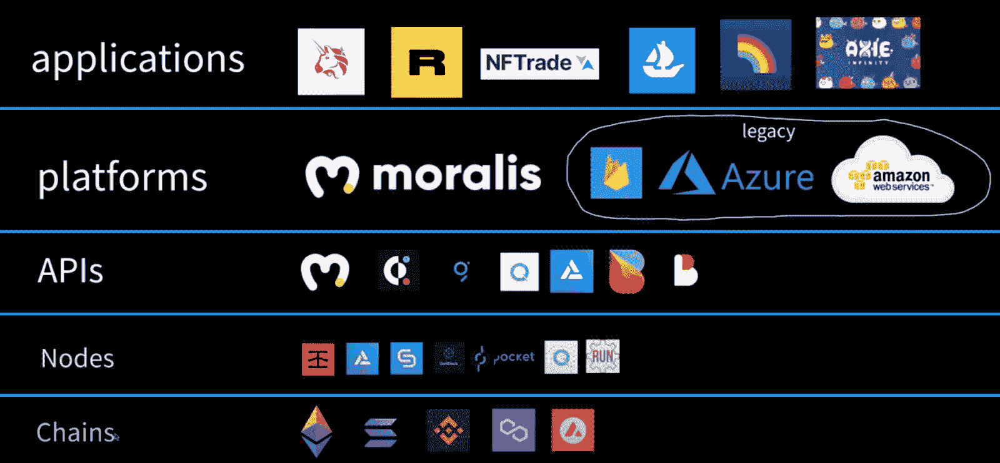
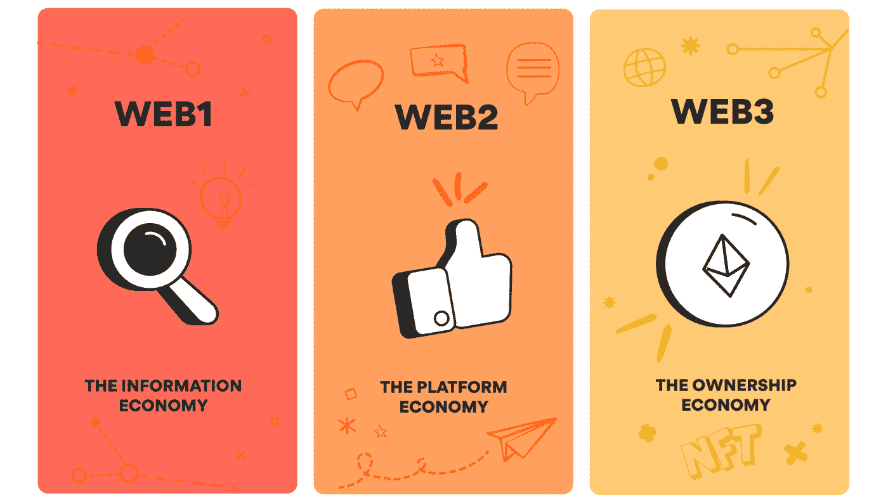
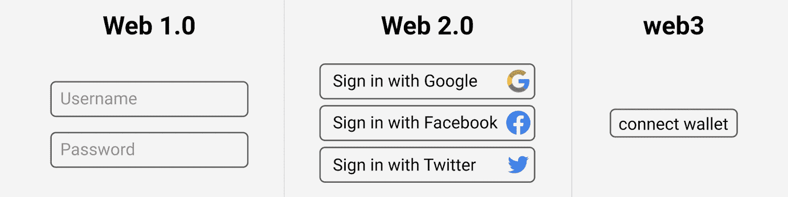
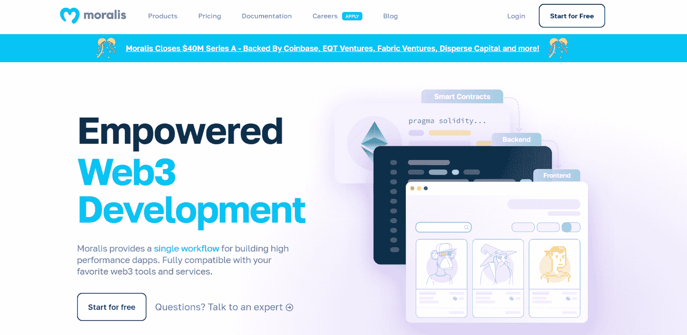
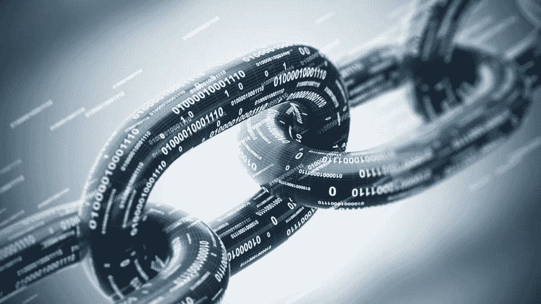
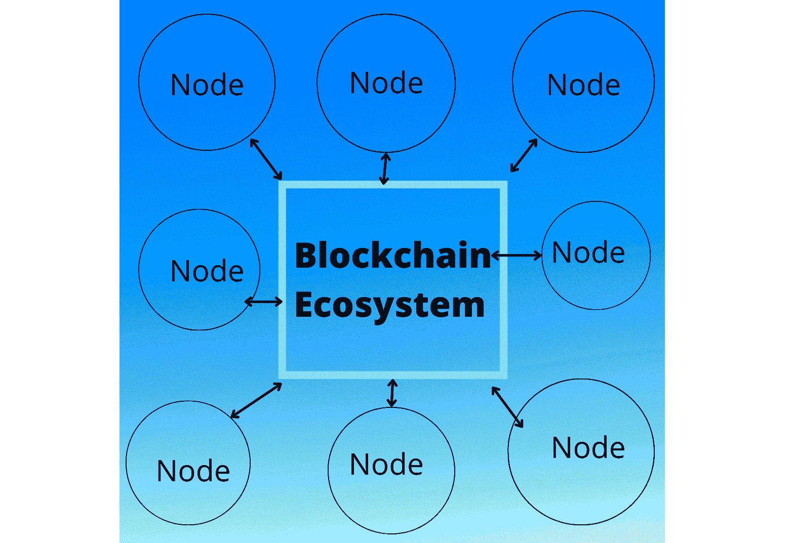
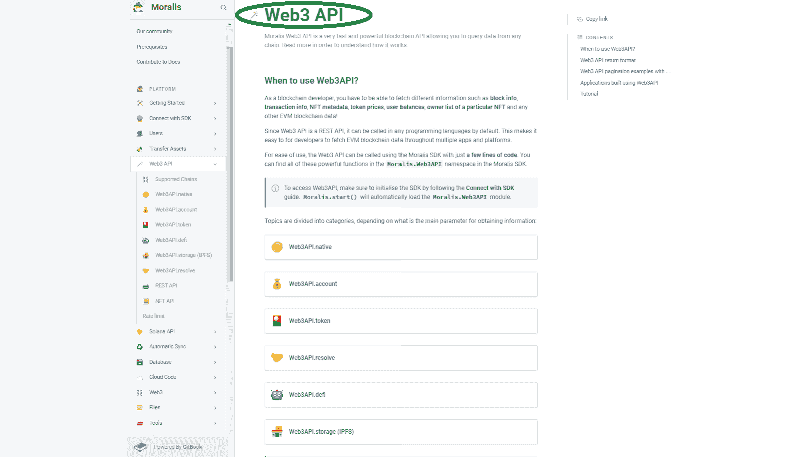
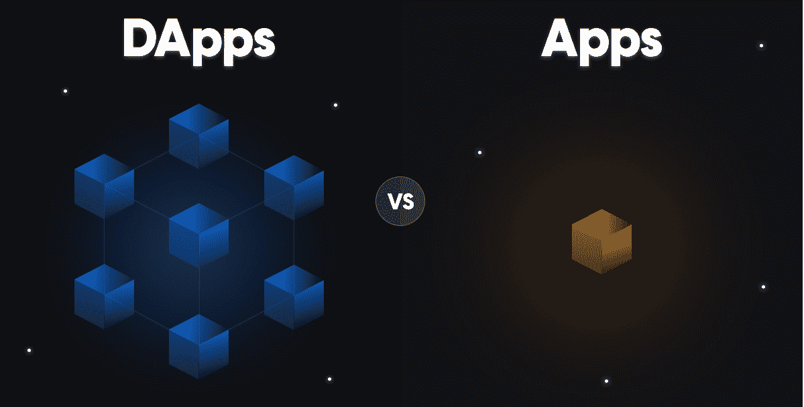

# Web3 堆栈——web 3 开发的完整指南

> 原文：<https://moralis.io/web3-stack-the-full-guide-to-web3-development/>

**你可能知道，加密行业可以追溯到 2009 年，当时比特币出现了。然而，标志着 Web3 开始的是以太坊的推出。有了这个第一个可编程区块链，我们有效地看到了用于** [**Web3 开发**](https://moralis.io/how-to-become-a-web3-developer-full-guide/) **的 Web3 堆栈的开始。起初，它非常原始，在分散的网络上构建就像使用石器时代的工具。然而，在过去的几年里，事情真的有了很大的进展。现在，有一些强大的工具可以让开发者避免 RPC 节点** **的所有** [**限制。此外，当前的 Web3 堆栈由以下五层组成:**](https://moralis.io/exploring-the-limitations-of-rpc-nodes-and-the-solution-to-them/)

1.  **可编程区块链**
2.  **节点和节点提供者**
3.  **API 和 API 提供者**
4.  **开发平台**
5.  ****【dapps】****

**在今天的文章中，我们将仔细看看 Web3 的每个堆栈层。因此，我们将为您提供一个清晰的全局视图。有这样的理解是非常重要的——一方面，它帮助你成为一个有见识的用户。另一方面，通过利用 Web3 堆栈提供的工具，它使您能够更快地成为区块链开发人员。此外，你们大多数人对构建基础设施的底层不感兴趣。因此，你最有可能想集中在最上面的三层。此外，Web3 堆栈的第 3 层和第 4 层只能作为提供最佳 dapps 的工具。毕竟这是用户所在的地方。**

**此外，在这里您将了解到最终的 Web3 开发平台 [Moralis](https://moralis.io/) 。后者使你能够使用你的前端技能快速创建杀手 dapps。从 DeFi 仪表盘到 Web3 游戏，这款 Firebase for crypto 可帮助您将可扩展且强大的 dapps 速度提高 80%以上。**

**

## Web3 解释——什么是 Web3？

在我们深入讨论 Web3 堆栈之前，我们想确保我们都在同一页上。因此，让我们从解释 Web3 是什么开始。首先，让我们提醒你，我们大多数人所知道的网络，是 Web2 或 Web 2.0。这是一个集中的互联网，由强大的公司和社交媒体驱动。这个互联网完全是关于用户在线上与平台和彼此(通过中间媒介)的互动。它让用户消费，也让用户创造内容。这是 Web2 和 Web1 的主要区别，web 1 是一个只读网站。

然而，随着可编程区块链和支持它们的分散式网络的诞生，Web3 出现了。万维网的这一新的迭代仍处于起步阶段；然而，那些了解这项技术的人一致同意，没有回头路，Web3 将继续存在。我们也这样认为。

简而言之，Web3 是一个以分布式账本(如区块链技术公司)的形式结合了去中心化概念的 Web。这意味着它背后没有中央服务器。当然，去中心化的程度取决于作为网络的可编程区块链去中心化的程度。除了去中心化，Web3 还融合了基于加密货币的经济学。这意味着用户可以在没有中间商的情况下转移价值和支付货款。Web2 和 Web3 的另一个核心区别是身份验证。后者使用 Web3 钱包，使用户能够连接到 dapps:

*注* *:如果你想进一步探索“Web3 是什么”，一定要访问*[*web 3*](https://moralis.io/the-ultimate-guide-to-web3-what-is-web3/)终极指南。

## 什么是 Web3 堆栈？

花点时间仔细看看简介下面的图片。这张图片清楚地展示了当前 Web3 堆栈的要点。在其中，您可以看到列出的所有五个层，从可编程区块链作为基础开始。此外，你还可以看到 Web3 应用程序，也称为 dapps，位于顶部。然而，要从底层走到顶层，中间的三层都起着非常重要的作用。因此，我们将在下面的章节中解释每一层的一些细节。

但是，你不应该忘记绝大多数用户只关心顶层。因此，要成为一名优秀的 dapp 开发者，你应该时刻记住这一点。光是这个想法就能让你把注意力放在最重要的事情上。毕竟，当您可以使用健壮且经过测试的工具，而不是将所有资源投入到创建最佳前端时，为什么要浪费时间来创建自己的后端呢？这就是 Moralis 让世界变得不同的地方。这个单工作流平台旨在尽可能简单地构建高性能 dapps。

Moralis 使您能够使用单行代码来满足所有与区块链相关的后端需求。因此，您可以毫不费力地验证您的用户并监控历史和实时链上数据。而且，由于 Moralis 的跨平台互操作性，您可以在自己喜欢的平台上完成所有这些工作。此外，因为 Moralis 也是关于跨链互操作性的，所以你的工作是面向未来的。你永远不会拘泥于任何一个特定的区块链。哦，我们提到过你可以从免费的 Moralis 开始吗？

### Web3 堆栈层#1:可编程区块链

可编程区块链，或者简称为链，是 Web3 栈的基础。没有它们，我们就谈不上 Web3，它们上面的所有层马上就变得无关紧要了。幸运的是，已经有多个知名的公共连锁店开始运营了。以太坊仍然是大多数 dapps 的家园，尽管由于这个网络的天然气费用高得离谱，许多开发商也在关注其他有前途的连锁店。然而，由于以太坊是高度分散的，并且已经非常成熟，如果以太坊即将到来的升级能够实现更低的费用，这对整个行业来说将是一件好事。尽管如此，我们最有可能期待一个跨链互操作的未来。

因为你们中的许多人可能对传统技术有一些基本的了解，所以把区块链(协议)看作 CPU 是有意义的。而且，就像 Web2 开发者不直接与 CPU 交互一样，期望 Web3 开发者直接与区块链交互是荒谬的。这是节点进入场景的地方。

### Web3 堆栈层#2:节点

为了与链通信，您需要运行一个节点。后者是与同一链上的其他节点连接的软件。因此，节点使你能够与区块链网络通话并访问其数据。然而，运行一个节点是一项全职工作，这对大多数开发人员来说是一个相当大的问题。要运行一个节点，通常需要一个团队来进行维护、适当的备份等等。因此，对于希望专注于创建 dapps 的开发人员来说，这不是一个实用的解决方案。这让我们想到了区块链节点提供商。他们把所有的时间都投入到运行节点上，这样你就不用。

诸如 Infura、Quicknode、Chainstack、Alchemy、Getblock、RunNode 和 Pocket Network(去中心化)等公司使您能够使用它们的节点。通过使用这些服务，您不必处理运行和维护您自己的节点的开销。然而，虽然这听起来是一个很好的解决方案，但是您需要意识到节点的局限性。首先，你不能从节点获得大量数据。

例如，一个节点不能告诉你用户余额。此外，一个节点只能关注一个特定的链，而且，它不能覆盖加密令牌背后的多个智能契约。基本上，节点只能给你来自区块链的原始数据，这本身是非常无用的。因此，您有两个选择，您可以开始创建自己的基础设施，使原始数据变得有用。这可能需要几个月的时间，并且不能保证肯定的结果。另一方面，您可以使用 Web3 APIs。

## Web3 堆栈层# 3:API

应用程序编程接口或 API 是我们可以用来构建和集成应用程序的一组定义和协议。当然，在密码行业，应用程序成为 dapps。因此，API 是软件之间交互的一种简洁方式。此外，好的 API 还能确保在稳定的环境中进行一致的编码。

今天，您可以在几个 Web3 API 提供者中进行选择。最流行的选项包括 Moralis、Graph、共价、Alchemy、Quicknode、Biconomy 和 Bitquery。因此，您可以使用 API 提供者的 API 连接到幕后的节点。这使得 API 和 API 提供者成为开发人员应该与之交互的第一个 Web3 堆栈层。了解 API 下面的层是有帮助的，但是它们绝对不是你应该直接处理的东西。

通过使用 API，您可以获得大量有用的预编译和预先计算的链上数据。此外，您可以在 API 提供者的文档中访问 API 和关于它们的详细信息。如果您查看 Moralis 文档，您甚至会找到实用的示例、截图和视频来帮助您确定如何使用特定的端点。

### Moralis 的 Web3 API

Moralis 提供了全套的 API。它还提供了最终的 NFT API，消除了 NFT 开发中的所有猜测。并且，要访问 [Moralis 的 Web3 API](https://docs.moralis.io/moralis-dapp/web3-api) ，需要初始化 Moralis 的 SDK，然后“Moralis.star()”会自动加载“Moralis。Web3API”模块:

有了 API，我们已经进入了你应该关注的顶层。这些层是可以帮助您节省大量开发时间的工具。

## Web3 堆栈第 4 层:平台

让我们再来看看遗留系统。在开发平台的情况下，有几个大多数开发人员使用的选项(例如:Amazon Web Service (AWS)、Azure 和 Firebase)。不幸的是，这些平台不能帮助你开发 Web3。但幸运的是，你已经知道你可以依靠 Moralis。

即使使用节点和 API 提供者，没有平台，也需要运行自己的后端。否则不能使用 API。这意味着您需要构建自己的数据库、登录功能等等。因此，你要花几周甚至几个月的时间才能开始创建 dapps。然而，当你使用像 Moralis 这样可靠的平台时，你可以立即专注于前端。一个合适的 Web3 平台将为你提供所有你需要的工具，让你从一个想法快速变成一个可用的 Web3 应用。所以，无论你已经有了一个想法还是想从范例项目中学习，创建你的免费 Moralis 账户并开始“建造”。

### Web3 堆栈第 5 层:Dapps

我们已经到达了 Web3 堆栈的顶层 dapps。此时，您已经知道这是将引入群众的层。Dapps 是主流采用 Web3 的关键。此外，在这一层，开发人员可以表达他们的创造力，以及他们对流行应用程序的独到见解。本质上，这一切都是为了创建用户友好的界面，并确保良好的用户体验。幸运的是，要做到这一点，你不需要对 Web3 和区块链有什么深刻的理解。感谢 Moralis，你的 JavaScript 或 Unity 熟练程度足以创建一个壮观的 dapp。那么，你准备好卷起袖子成为 Web3 革命的一部分了吗？

## Web3 堆栈–web 3 开发的完整指南–摘要

在今天的文章中，您了解了关于当前 Web3 堆栈的所有知识。因此，您有机会仔细了解了五个层次中的每一层——可编程区块链、节点和节点提供者、API 和 API 提供者、开发平台和分散式应用程序。此外，您还了解到，如果您想专注于创建 dapps，最上面的三层应该是您最关心的。此外，你已经发现 Moralis 可以帮助你引导这种关注，从而快速创造杀手 dapps。尽管如此，这里也有一个很好的视频来解释我们上面提到的要点:

https://www.youtube.com/watch?v=1i5wOpAg-lc

有了这里获得的知识，你就可以开始构建并为[搭建 Web2 和 Web3](https://moralis.io/web2-to-web3-bridging-web2-and-web3/) 的桥梁做出贡献了。唯一剩下的问题是，你是否有你自己的想法，你想把重点放在或者你更喜欢实践你的技能，并通过完成一些例子项目来学习更多关于 dapp 开发的知识。如果你对范例项目感兴趣，[Moralis 家的博客](https://moralis.io/blog/)和[Moralis 家的 YouTube 频道](https://www.youtube.com/c/MoralisWeb3)会支持你。在那里，你会找到大量有价值且可行的内容，帮助你掌握 Web3 基础知识。这些也是帮助您了解基本区块链开发工具的途径，如 MetaMask、WalletConnect、Remix、Hardhat、React、OpenZeppelin、Auth0、Web3Auth、Metapley、Phantom 等。

然而，如果你正在寻找获得区块链认证的途径，那么[Moralis 学院](https://academy.moralis.io/)是你应该去的地方。在这里，您可以报名参加专业的区块链发展课程，并遵循您的个性化学习路径。此外，在这里，您可以获得专家导师的指导，让您朝着正确的方向前进，并成为行业中最先进的社区之一的成员。**