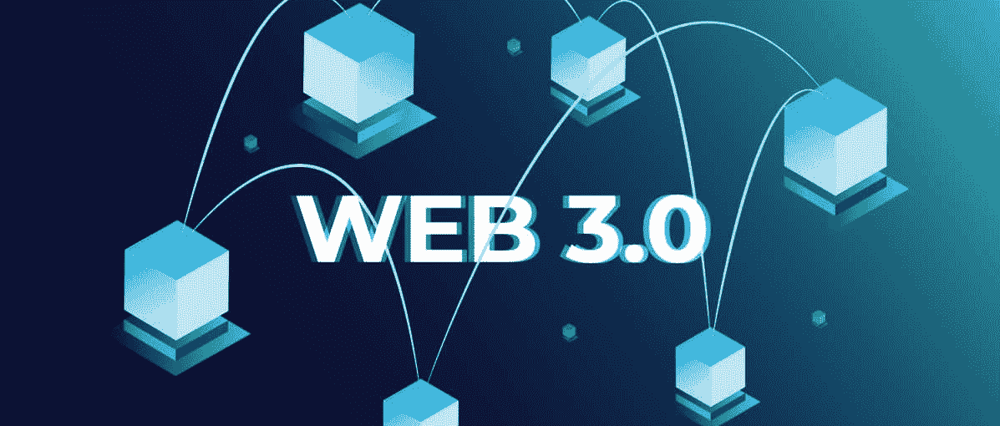
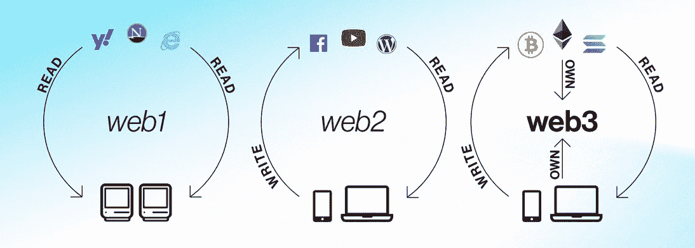
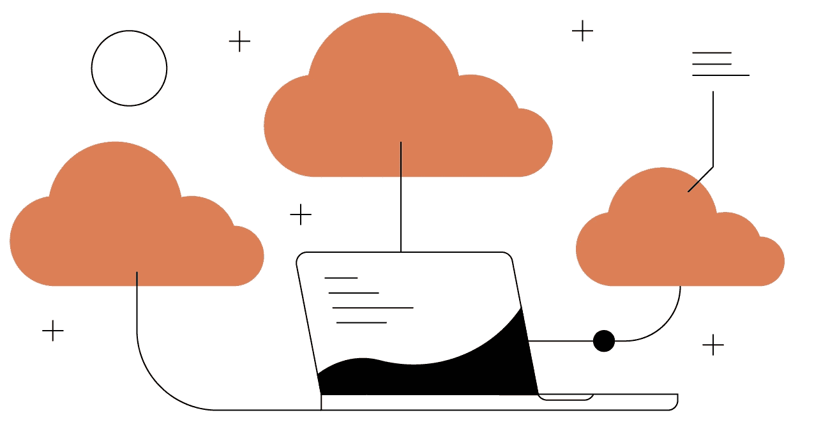
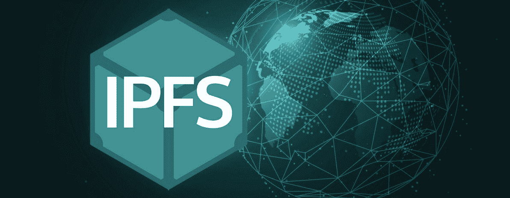
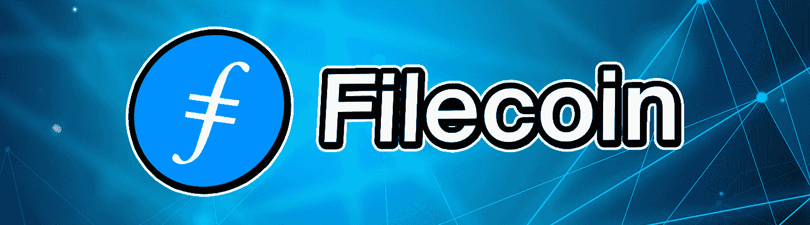
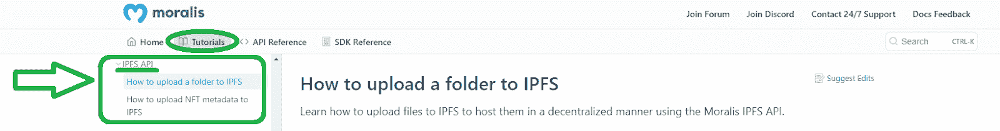
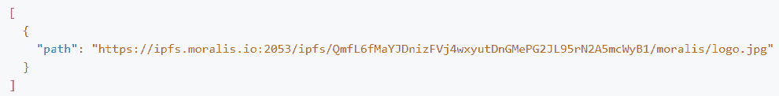
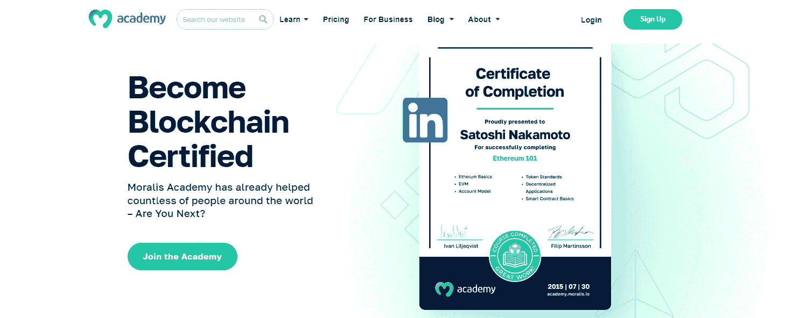

# Web3 存储–web 3 数据存储的工作原理

> 原文：<https://moralis.io/web3-storage-how-web3-data-storage-works/>

**分散存储解决方案是新互联网时代(Web3)的重要方面之一。尽管区块链是 Web3 领域的技术领导者，但我们不一定需要区块链来存储 Web3 数据，这听起来可能有点奇怪，因为 Web3 只会与区块链技术共存。然而，在本文的后面部分，您将会了解到更多。也就是说，Web3 存储解决方案应该以尽可能高的分散化水平为目标。毕竟，去中心化是 Web3 文件存储的核心概念之一。最终，目标是拥有可靠的选项，而没有中央权威和单点故障。**

当构建 dapps 或创建加密资产时，您总是需要存储一些数据。因此，作为 dapp 开发人员，您必须知道如何使用 Web3 数据存储，这正是本文将帮助您掌握的内容。接下来，我们将首先通过解释什么是 Web3 存储来介绍基础知识。我们还会告诉你 Web3 数据存储在哪里。然后，我们将对分散式数据存储解决方案进行适当的介绍。此外，我们将仔细研究两个著名的 Web3 文件存储替代方案，它们在某种程度上是互补的。在这里，您将了解更多关于 IPFS 和 Filecoin 的信息。最后但同样重要的是，我们还将解释使用最流行的 Web3 存储解决方案和 [Moralis](https://moralis.io/) 有多简单。

尽管如此，如果你想跳过这个理论，跳到今天文章的最后一部分，请确保首先[创建你的免费 Moralis 账户](https://admin.moralis.io/register)。这样，你就可以在本文末尾跟随我们的脚步，毫不费力地上传你自己的文件。



## 什么是 Web3 存储？

要理解 Web3 存储，你需要知道 Web3 是什么。因此，让我们快速看看互联网的演变。最初的“万维网”，或 Web1，主要是终端用户的只读体验。第二代(Web2)引入了许多伟大的应用程序，迎来了读写体验。值得指出的是，Web2 是当今世界上大多数人使用的。然而，Web3 发展很快，那些参与加密领域的人已经每天都在与 Web3 的各种功能进行交互。此外，如引言中所述，区块链技术和加密原理是最新一代互联网的核心。此外，Web3 完全是关于“读-写-拥有”的体验。



“自有”部分清楚地表明，集中式(Web2)存储解决方案，如 Google Cloud、OneDrive、Dropbox 和许多其他解决方案，不会削减它。毕竟，几乎不可能确切知道第三方是在保护你的隐私还是在滥用它。因此，集中式存储解决方案需要用户的高度信任。然而，Web3 完全是关于不信任的功能。因此，如果我们想真正拥有数据，我们需要使用分散存储解决方案。

此外，还存在单点故障的问题。所有集中式云存储解决方案都面临这个问题。因此，当网络中断时，用户可能无法访问他们的数据。此外，当这些公司的服务器出现故障时，用户可能会丢失宝贵的数据。甚至个人存储设备，如 PC 硬盘、外部磁盘和电话存储器，都有单点故障。

那么，什么是 Web3 存储呢？这是一种分散式存储解决方案，使用户能够真正拥有自己的数据，并且没有单点故障。


## Web3 数据存储在哪里？

如果你想知道最简单明了的答案，我们可以告诉你，使用 Web3 存储解决方案，文件存储在计算机网络上，而不是在一台服务器上。然而，这些网络的确切性质和机制却千差万别。事实上，有许多项目试图提出最终的解决方案。也就是说，我们只需要再等一会儿就能得到其中的一个。幸运的是，我们已经有了一些可靠和值得信赖的 Web3 文件存储解决方案，我们将继续讨论。

此外，关于在 Web3 中存储数据的最常见的误解是，我们可以在区块链上存储一切。但是，如果您以前制作过 NFT，您会知道您不会将代表 NFTs(例如，JPEGs)的文件存储在一个链上。事实上，您甚至没有在区块链上存储 NFT 元数据。相反，您只存储到链上元数据文件的链接。因此，虽然区块链是分布式数字分类帐，并且根据定义，是一种特定类型的 Web3 存储解决方案，但它们最适合特定类型的数据。外部链接是这些数据类型的一个例子。当然，并不是所有的区块链都是一样的，有些主要关注 Web3 文件存储。然而，一般来说，在以太坊这样的可编程区块链上存储更大的文件在技术上和经济上都是不可能的。



## 引入分散式数据存储解决方案

首先，值得指出的是，“分散数据存储”只是 Web3 存储解决方案的另一个术语，此时，您已经知道什么是 Web3 存储解决方案。您还知道，分散式方法消除了单点故障以及集中式实体操纵或滥用私有数据的问题。尽管如此，所有相信光明未来的人都同意，分散式数据存储解决方案发挥着至关重要的作用。幸运的是，已经有几个项目专注于这个方面。此外，请记住，在如何确保冗余、效率和适当的分权水平方面，它们都采取了独特的方法。在这一点上，可以说开发仍在进行中，最终的 Web3 数据存储解决方案还没有出现。

除了没有使用区块链技术的 IPFS，我们还有以下项目进一步推动“Web3 存储”的发展:

*   赫萝(热)
*   地壳网络
*   希雅·凯特·伊索贝尔·富勒
*   阿尔韦布
*   斯托尔杰
*   Filecoin

由于 Filecoin 与 IPFS 的紧密联系，我们将在这里对其进行更深入的研究。毕竟，IPFS 和 Filecoin 是我们更喜欢使用的分散存储解决方案。但是，我们强烈建议您也探索上面列出的其他替代方案。如果没有别的，通过这样做，您将了解更多关于使分散存储成为可能的不同机制。



### 什么是 IPFS？

星际文件系统(IPFS)是一个分布式系统，或者说是一个协议。它用于上传、存储和访问网站、应用程序、数据和文件。此外，如 IPFS 官方网站所述，IPFS 旨在保护和发展人类的知识。后者将通过使网络具有弹性、可升级性和开放性来实现。值得一提的是，Protocol Labs 是这个对等(P2P)超媒体协议背后的组织。

作为 P2P 文件共享协议，IPFS 使用户能够以分散的方式托管和访问内容。这意味着在协议中，用户运营商拥有全部数据的一部分。这是 IPFS 独特的创新解决方案，用于存储和共享文件及其他内容。此外，这个 Web3 文件存储解决方案与传统的基于位置的 HTTP 系统有很大不同；IPFS 采用了内容寻址解决方案。因此，这种 Web3 存储协议的用户可以找到任何文件、网站、数据等。，基于它的实际内容而不是它的位置。

为了使这种内容寻址解决方案成为可能，IPFS 生态系统中的所有内容都有一个唯一的内容标识符(CID)。后者本质上是一个杂凑。因此，当你想找到特定的数据，IPFS 利用这些加密哈希。当然，这只是因为每个内容都有一个唯一的 CID。尽管如此，除了内容寻址，IPFS 还将内容链接在一起。

*注意:如果你想了解更多关于 IPFS 如何工作的细节，一定要看看我们的文章，这篇文章也解释了如何将 IPFS 用于 NFT 元数据*[](https://moralis.io/ipfs-nft-how-to-use-ipfs-for-nft-metadata/)**。**

*

### Filecoin 是什么？

Filecoin 是一个开源存储解决方案。其核心是云存储市场、协议和激励层。此外，Filecoin 网络建立在 IPFS 之上。因此，它提供了分散和安全的数据存储和检索。正如“ *filecoin.io* ”中所述，这个 Web3 文件存储网络旨在确保一个不受公司控制的更安全、更高效的网络。

Filecoin 网络实现了惊人的规模经济，这是非常了不起的。它允许任何人作为存储提供商加入和参与进来。这种供应自由确保了极具竞争力的存储价格。此外，这也意味着 Filecoin 网络包括大量不同的存储提供商和开发商。由于这种多样性，网络用户受益于强大而可靠的服务。考虑到这些概念，可以肯定地说，Filecoin Web3 存储可以由每个人构建和拥有。

通过内容寻址和加密存储证明，这个开源协议提供了可证明的安全性和真实性。毕竟，随着时间的推移，网络会验证数据存储是否正确和安全。此外，用户可以定制此存储解决方案，以满足他们的需求。这可以通过调整冗余、检索速度和成本策略来实现。此外，值得一提的是，Filecoin 是一个由提供商、工具、库和集成组成的快速增长的生态系统。

*注:要练习使用这款基于区块链的 Web3 文件存储解决方案，请务必跟随我们一起应对 Unity 中的“*[*Filecoin*](https://moralis.io/how-to-use-filecoin-in-unity-for-storage/)*”挑战。*


## 最佳的 Web3 存储提供商–将 Web3 数据存储与 Moralis 结合使用

正如整篇文章所指出的，在我们看来，IPFS 是目前最好的 Web3 存储提供商。您还知道 Moralis 是最终的 Web3 API 提供者，这使得构建 dapps 变得非常简单。此外，Moralis 使您能够毫不费力地[将文件上传到 IPFS](https://moralis.io/how-to-upload-files-to-ipfs-full-guide/) ，多亏了 Moralis 的 IPFS API，以下代码片段实现了这一目的:

```js
const response = await Moralis.EvmApi.ipfs.uploadFolder({ abi });
```

如果你以前使用过 Moralis，你应该知道如何充分利用上面的代码。然而，如果这是您第一次使用这种 Web2-Web3 桥接解决方案，您应该进一步探索[最佳 IPFS API](https://docs.moralis.io/docs/ipfs-api) 。



通过访问 [Moralis IPFS API 文档页面](https://docs.moralis.io/docs/ipfs-api)，你可以了解到关于这个有用的快捷方式你需要知道的一切。通过完成以下三个步骤，您还可以在这里找到如何使用“ *uploadFolder* ”端点的详细说明:

1.  **设置 Moralis**–您需要[创建您的免费 Moralis 帐户](https://admin.moralis.io/register)以获取您的 Moralis Web3 API 密钥并安装 Moralis SDK。
2.  **创建一个脚本，将一个文件夹上传到 IPFS**——这是您实现上述代码片段的地方。本质上，你需要一个 JavaScript、TypeScript 或 Python 脚本(你可以在 [Moralis 的文档](https://docs.moralis.io/docs)中找到示例脚本)来初始化 Moralis 并将一个文件或文件数组上传到 IPFS。为此，您还需要提供“*路径*和“*内容*参数。
3.  **执行程序**——一旦你准备好脚本，你只需要使用正确的命令运行它。例如，如果您在第二步中创建了一个“index.js”，那么“*节点 index.js* ”就可以解决这个问题。最后，您可以在您的终端中看到响应。后者应该为您提供一个经过 HTTPS 调整的上传文件的 IPFS 路径:



## Web3 存储–web 3 数据存储的工作原理–总结

如果您已经学习了上述部分，那么您现在应该知道什么是 Web3 存储以及 Web3 数据存储在哪里。此外，您了解了什么是领先的分散式数据存储解决方案。在列出的解决方案中，我们仔细研究了 IPFS 和 Filecoin，它们在某种程度上是互补的。最后，您还了解了 Moralis 的" *uploadFolder* " IPFS API 端点，使您能够轻松地将文件上传到 IPFS。

我们希望今天的文章能给你带来适当的启发，这样你就能确保在你的 Web3 开发工作中使用 IPFS、Filecoin 或任何其他可靠的 Web3 数据存储解决方案。毕竟作为 dapp 开发者，你自动成为了互联网新时代的大使。因此，不要忘记权力下放和真正所有权的重要性。此外，一定要探索其他 Moralis web 3 API([令牌 API](https://moralis.io/token-api/) 、 [NFT API](https://moralis.io/nft-api/) 、 [Web3 认证 API](https://moralis.io/authentication/) 、[流 API](https://moralis.io/streams/) 等。).有了这些工具，dapp 开发将变得轻而易举！

另一方面，在你有足够的信心开始创建杀手级 dapps 之前，你可能需要学习更多关于区块链开发的知识。在这种情况下，你有两个选择。你可以利用 [Moralis YouTube 频道](https://www.youtube.com/c/MoralisWeb3)和 [Moralis 博客](https://moralis.io/blog/)——这两个渠道旨在支持你的免费加密教育。或者，你可以采取更专业的方法，进入[Moralis 学院](https://academy.moralis.io/)。如果你选择前者，请务必阅读我们的一些最新文章，包括“ [Python 和 Web3](https://moralis.io/python-and-web3-a-web3-and-python-tutorial-for-blockchain-development/) ”、关于 [Web3 通知邮件的教程](https://moralis.io/how-to-set-up-automated-web3-notification-emails-with-python/)、[最佳 ERC20 令牌平衡 API](https://moralis.io/the-best-erc20-token-balance-api-for-dapp-development/) 等等。然而，如果你决定在区块链发展教育中采取更专业的方法，我们建议从[区块链和比特币基础](https://academy.moralis.io/courses/blockchain-bitcoin-101)开始。

*