# Web3 同步–如何同步智能合约 Web3 事件

> 原文：<https://moralis.io/web3-syncing-how-to-sync-smart-contract-web3-events/>

每当我们处理实时数据时，确保我们使用正确的同步是很重要的。而且，正如你最可能知道的，当谈到区块链，有新的[链上事件](https://moralis.io/web3-data-science-importing-on-chain-events/)一直在发生。因此，你需要实现可靠的 Web3 同步。如果你过去运行过你自己的节点，你就会知道[索引区块链](https://moralis.io/how-to-index-the-blockchain-the-ultimate-guide/)是多么的势不可挡和具有挑战性。然而，让我们向你保证，[的 Web3 技术栈](https://moralis.io/exploring-the-web3-tech-stack-full-guide/)在过去的几年里取得了长足的进步。因此，现在有一些工具供您使用，使您能够避免 RPC 节点的所有限制。借助这些工具，您可以[同步和索引智能合约事件](https://moralis.io/sync-and-index-smart-contract-events-full-guide/)，这是您实现 Web3 同步的入场券。

如你所知，[智能合约](https://moralis.io/smart-contracts-explained-what-are-smart-contracts/)是一种为可编程链提供动力的链上软件(例如:[以太坊](https://moralis.io/full-guide-what-is-ethereum/))。此外， [Web3 契约](https://moralis.io/what-are-web3-contracts-exploring-smart-contracts/)确保当满足预定义的条件时，预定义的动作被正确执行。那么，如何轻松地进行 Web3 同步呢？使用终极的 Web3 开发平台—[Moralis](https://moralis.io/)。这个 [Firebase for crypto](https://moralis.io/firebase-for-crypto-the-best-blockchain-firebase-alternative/) 有一个特殊的“同步”功能，使这个过程毫不费力。此外，由于 Moralis 的数据库，你可以在一个地方处理链上和链外数据。除了这个改变游戏规则的特性，这个全面的 [Web3 后端平台](https://moralis.io/exploring-the-best-web3-backend-platform/)为你提供了[终极 Web3 SDK](https://moralis.io/exploring-moralis-sdk-the-ultimate-web3-sdk/) 。因此，你可以在几分钟内创建杀手级应用程序。而且，由于 Moralis 是跨平台互操作的，你可以使用你喜欢的平台和编程语言成为一名区块链开发者。

例如，你可以使用 [JavaScript](https://moralis.io/javascript-explained-what-is-javascript/) 或 Unity 技能来开发各种网络或移动应用程序。尽管如此，Moralis 也是关于跨链互操作性的，这意味着它能让你的工作经得起未来的考验。因此，[今天就创建你的免费 Moralis 账户](https://admin.moralis.io/register)，并开始建设。

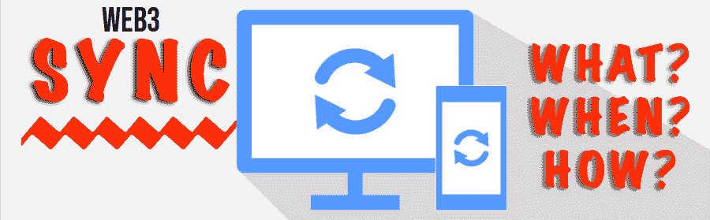

### 智能合同事件解释

为了向您展示如何实现 Web3 同步，我们必须首先确保您都知道基本知识。因此，让我们确保我们在什么是[智能合同事件](https://docs.moralis.io/moralis-server/automatic-transaction-sync/smart-contract-events)的问题上意见一致。正如简介中提到的，智能合约是一组特定的编码规则。一旦满足预定条件，这些规则就会执行预定义的操作。此外，每当智能合约中发生有意义的事情时，智能合约就会发出事件(基于它们的代码)。基本上，智能合约事件是智能合约发出的某种信号。使用这些信号，dapps 或其他智能合约可以进行通信。然而，您应该记住，由智能合约的开发者来定义事件应该何时发生。

为了进一步阐明智能合约事件，让我们来看一个 [ERC-20 令牌标准](https://moralis.io/erc20-exploring-the-erc-20-token-standard/)智能合约。每当有人发送 ERC-20 令牌时，后者就发出一个“转移”事件。此外，事件通常包含其他详细信息。在 ERC-20 合同事件的情况下，这意味着关于 ERC-20 令牌转移的细节。也就是说，很明显，在开发 dapps 时，实时 Web3 同步极其重要。

接下来，我们将展示一个示例任务。我们鼓励你跟随并采取行动来学习如何使用 Web3 与 Moralis 同步。

## Web3 与 Moralis 同步

由于 NFTs ( [不可替代令牌](https://moralis.io/non-fungible-tokens-explained-what-are-nfts/))继续风靡一时，我们决定承担一项 Web3 同步任务，我们将为 CryptoPunks 同步和索引智能合约事件。因此，让我们假设我们有一个 dapp，我们想在其中跟踪这些 NFT。因此，我们需要所有关于 CryptoPunks 的实时和历史数据。此外，这个 NFT 收集利用了 [ERC-721 令牌标准](https://moralis.io/erc-721-token-standard-how-to-transfer-erc721-tokens/)。因此，必须有一个 ERC721 合同来运作。此外，这意味着我们需要应用 Web3 同步来传输 CryptoPunks 合同的事件。然而，如果你想使用 Moralis，你需要先做一些简单的初始设置。

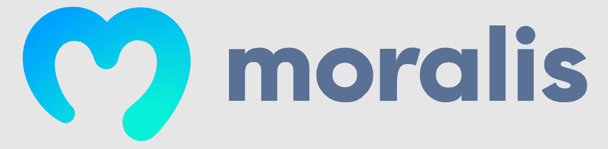

### 初始 Moralis 设置

要获得 Moralis 的完整后端功能，您需要创建一个 Moralis 服务器。后者对于同步和索引智能合约事件也是必不可少的。因此，下面是要遵循的步骤:

1.  **创建您的免费 Moralis 账户**–点击简介中的“创建您的免费 Moralis 账户”链接。然而，如果你已经创建了你的 Moralis 账户，使用你的凭证和[登录](https://admin.moralis.io/login)。

2.  [**创建 Moralis dapp**](https://docs.moralis.io/moralis-server/getting-started/create-a-moralis-server)–进入 Moralis 管理区域后，使用“创建新 Dapp”按钮:

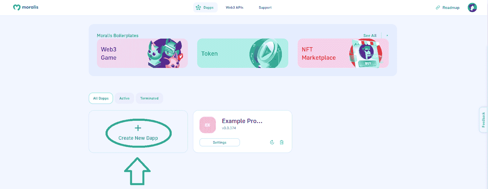

3.  **选择环境**–在大多数示例项目中，您将使用 testnet(例如:[以太坊测试网](https://moralis.io/ethereum-testnet-guide-connect-to-ethereum-testnets/))。但是，由于 CryptoPunks 是一个 live 项目，您需要选择“Mainnet”:

4.  选择以太坊主网并继续:

5.  选择离您最近的城市:

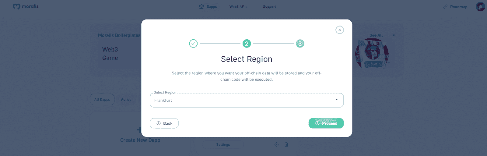

6.  命名您的 dapp 并点击“创建您的 Dapp”按钮:

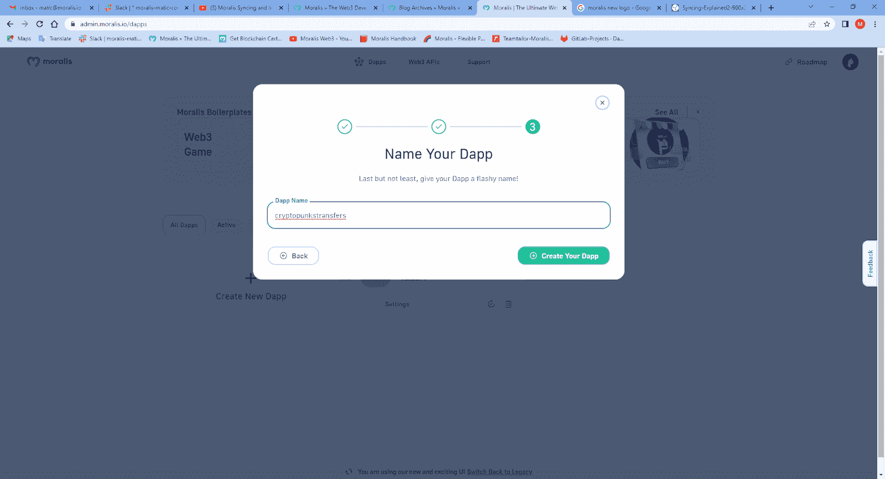

以上步骤是你获得 Moralis 力量的门票。一旦你成功地创建了你的 Moralis dapp，你就可以开始使用它的工具了。正如之前承诺的那样，为了解决 Web3 同步问题，我们将专注于 Moralis 的“同步”功能。

# Web3 同步示例项目

要与 Moralis 进行 Web3 同步，请单击上面创建的 dapp 下的“设置”按钮:

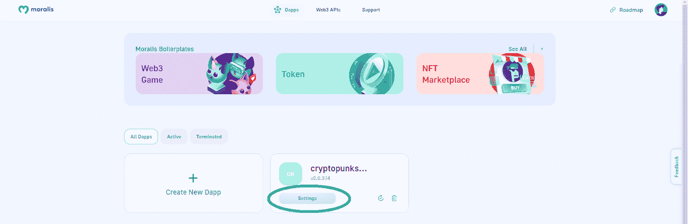

接下来，您需要从侧边栏中选择“Syncs”选项卡:

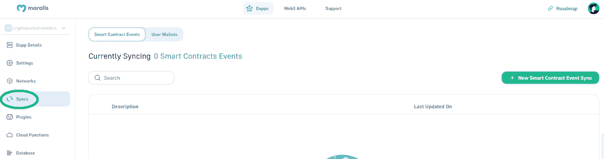

在“同步”选项卡上，单击“新智能合同事件同步”按钮:

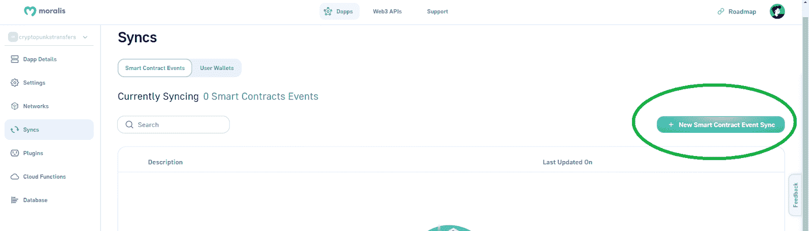

接下来，您有两个选项——您可以选择“自定义事件”,或者为我们的示例项目选择“NFT·ERC-721”选项。但是，由于我们将关注“PunksTransfer”主题，我们需要选择“Custome Events”选项:

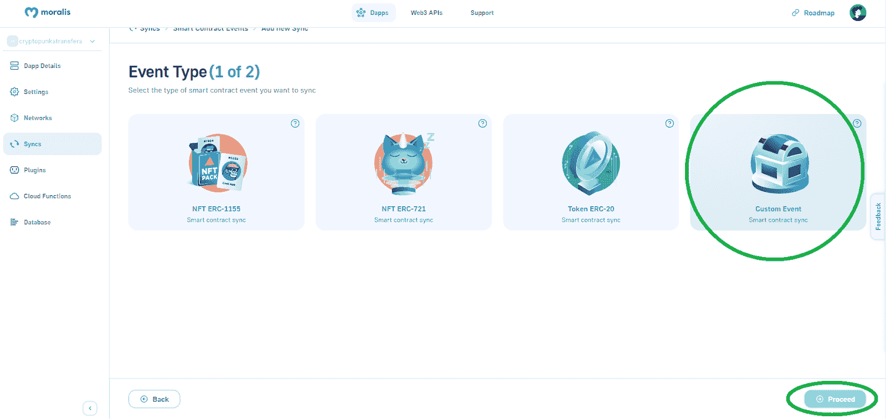

完成上述步骤后，您将进入“同步设置(第 2 步，共 2 步)”屏幕:

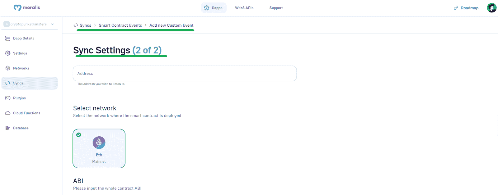

在这里，您需要输入与这个示例项目的目标相匹配的特定信息，该目标是为 crypto 朋克传输设置 Web3 同步。幸运的是，配置过程非常简单；基本上，你只是复制和粘贴公开可用的链上数据。

### 利用公共链上数据进行 Web3 同步

以下是您需要完成的步骤，以同步我们的 CryptoPunks 示例项目的链上事件。然后，就看你自己了，用这些概念，应用到自己的项目中。

如果你已经按照我们之前的步骤，那么你现在是在同步设置的第二部分。顶部是“地址”输入字段:

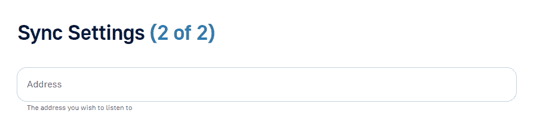

因此，让我们向您展示如何使用 Etherscan 来获取这些信息。

#### 使用以太网扫描获取合同地址

打开 Etherscan 并使用它的搜索选项，在这里您要键入“CryptoPunks”并单击已验证的选项:

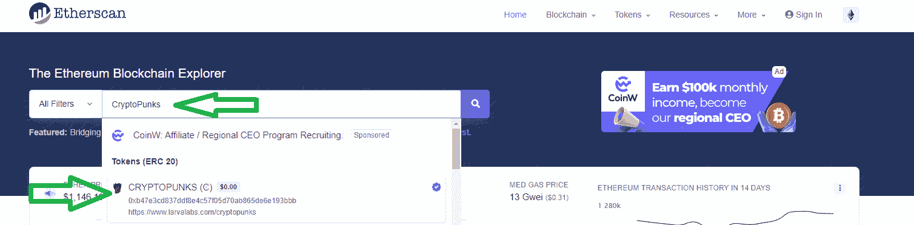

在“令牌加密朋克”页面上，使用“复制”图标复制该项目的合同地址:

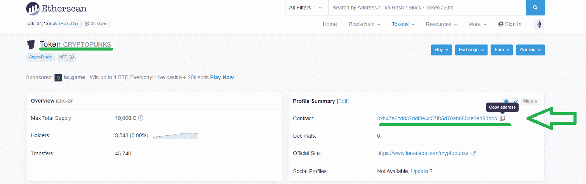

接下来，返回“同步设置(第 2 页，共 2 页)”屏幕，将上面复制的地址粘贴到指定字段:

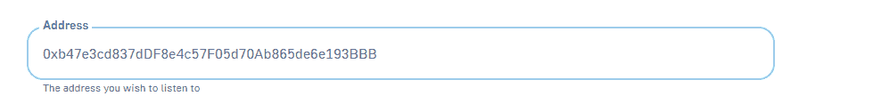

在地址选项卡下面，您会看到“Eth Mainnet”。“同步”功能会自动选择该链，因为我们在创建 Moralis dapp 时会选择该网络:

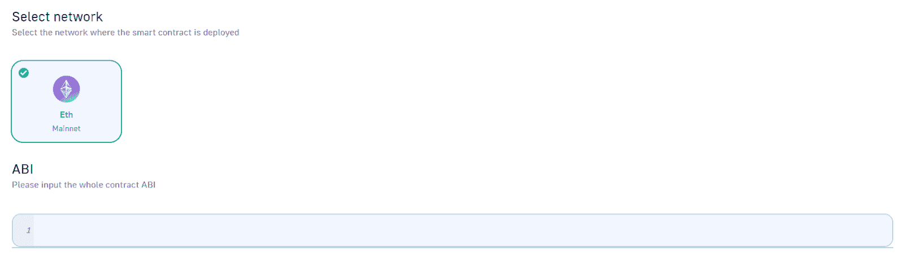

此外，如上面的截图所示，接下来是“ABI”输入字段。

#### 使用以太网扫描获取 ABI

幸运的是，加密朋克的合同 ABI 也是我们可以从以太扫描得到的一条信息。为了定位 ABI，点击 CryptoPunks 的合同地址:

然后，在下一页，向下滚动一点。您将看到一个以“事务”开头的水平选项栏。在这些选项中，您需要单击“合同”选项卡:

现在你已经进入了“合同”选项卡，首先，确保你进入了“代码”部分:

然后，向下滚动，直到您看到“合同 ABI”:

如上图所示，这是一个相当长的数组。然而，你只需要它的特定部分。此外，为了让事情对你自己更容易，使用你的浏览器的搜索选项，并输入“PunkTransfer”。这样，您的浏览器将突出显示搜索结果，即您感兴趣的 ABI 部分:

接下来，复制包含突出显示的“PunkTransfer”的整个对象:

然后，回到你的同步设置，将上面高亮显示的物体粘贴到“ABI”部分。确保在对象周围加上方括号。ABI 就绪后，您需要选择正确的主题(只有一个选项):

#### 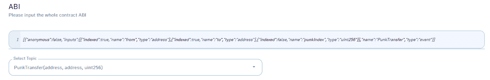

#### 表名、描述和同步历史事件

就表名而言，您可以随意使用；但是，我们鼓励您跟随我们的脚步，输入“PunkTransfer”:

而且，还可以用“PunkTransfer”来描述:

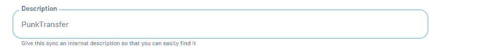

如果你还记得，我们说过我们也想包括历史事件。因此，请确保启用该选项，并输入您希望包括的历史事件的最大数量:

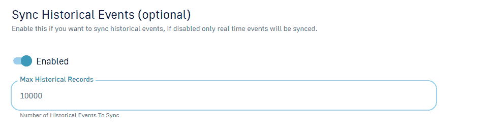

此外，还有“过滤器”选项，在本教程中我们不会用到它。因此，单击同步设置屏幕右下角的“继续”按钮。

完成上述步骤后，您应该会在 Moralis dapp 的“同步”选项卡中看到新的 Web3 同步:

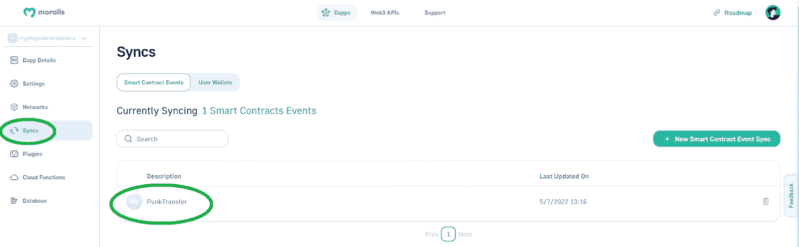

*注* *:以上说明是针对新的 Moralis admin UI。然而，在本文的按钮上，您可以找到使用我们的遗留 UI 完成相同步骤的视频教程。因此，如果你喜欢跟随下面的视频，切换到我们的传统用户界面可能是有意义的:*

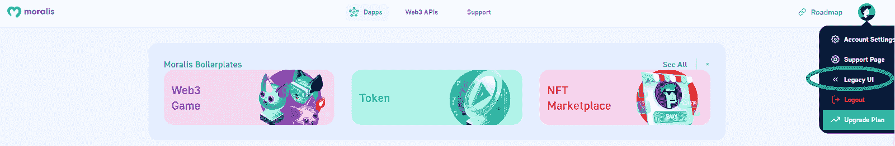

此外，在使用遗留 UI 时，了解如何使用 Etherscan 来获得正确的主题是很有用的。

#### 使用以太网扫描获取智能合同的主题

要获得智能合约事件的主题，您需要再次使用 Etherscan。在我们的例子中，返回到 CryptoPunks 页面并向下滚动，直到看到“Transfers”选项卡。在该选项卡中，单击“转移朋克”方法的任何交易散列，了解更多详细信息:

在“交易详细信息”页面中，选择“日志”选项卡:

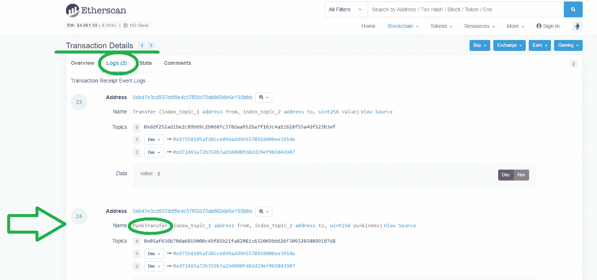

看上面的截图，可以看到有“转账”和“PunkTransfer”的名字。而且，既然《PunkTransfer》是我们感兴趣的一部，那就关注它的细节吧。为了最终获得主题，您需要使用括号内的详细信息(仅限类型):

所以，这就是我们例子的主题:

*PunkTransfer(地址，地址，单位 256)*

### Web3 同步的结果——连锁事件由您决定

一旦您的 Web3 同步设置就绪(如前几节所述)，您就可以在 Moralis 数据库中查看相关事件的详细信息。要访问您的数据库，请使用您的 dapp 设置。

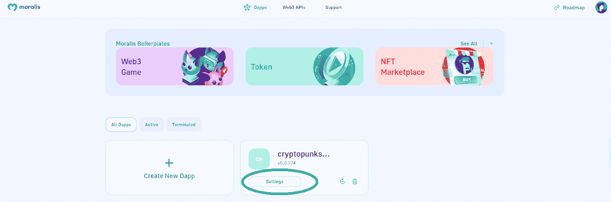

接下来，转到“数据库”选项卡，在这里您需要单击“访问数据库”按钮:

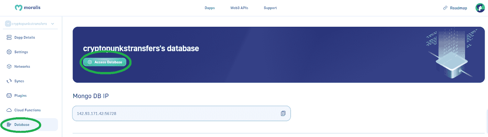

另一方面，如果您决定使用我们的遗留用户界面，这是您访问 Moralis 数据库的方式:

在数据库的仪表板中，您现在会看到“PunkTransfers”类。后者是在您创建此同步时自动添加的:

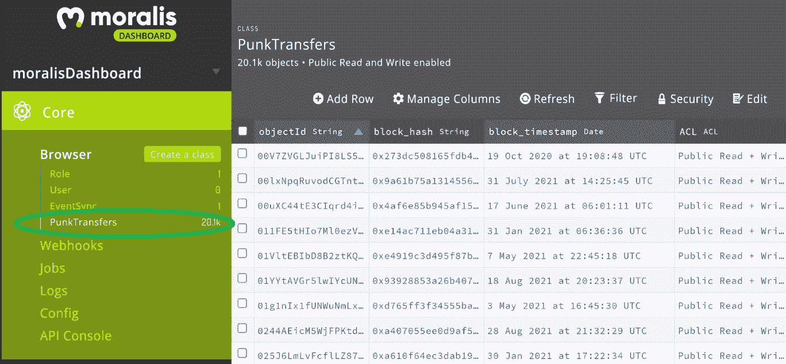

*注* *:上面的截图代表的是比较老的数据库 UI(配合下面的视频教程)。更新后的数据库 UI 更加引人注目，尽管它包含相同的细节。然而，在顶部，它还创建了“_EventSyncStatus”，其中包含了关于您的同步的所有细节:*

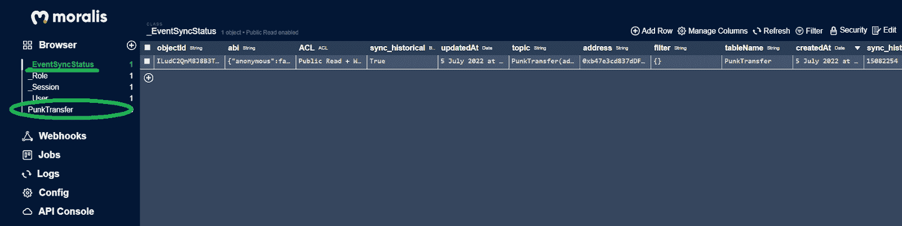

最后，正如承诺的那样，这是今天的 Web3 同步示例项目的视频教程:

https://www.youtube.com/watch?v=LMqqxkuo7b0

## Web3 同步–如何同步智能合约 Web3 事件–摘要

在本文中，您有机会了解了关于 Web3 同步的所有知识。我们首先解释了什么是智能合约事件，然后向您展示了如何毫不费力地将 dapps 同步到任何智能合约事件。此外，您还了解了一些关于 Moralis 的细节以及如何完成它的初始设置。因此，你现在知道如何创建你的 Moralis dapps。然后，我们接手了一个示例项目，我们为 CryptoPunks 设置了一个新的 Web3 同步。因此，您有机会使用新的管理 UI 或旧的 UI 来设置自定义同步。最后但同样重要的是，您还学习了如何访问 Moralis 数据库中的事件。Moralis 还为您提供了最强大的 [Web3 认证](https://moralis.io/authentication/)解决方案。

如果你喜欢今天的例子项目，我们鼓励你访问[Moralis 的博客](https://moralis.io/blog/)和[Moralis 的 YouTube 频道](https://www.youtube.com/c/MoralisWeb3)。在那里你会找到大量高质量的内容，可以作为你的免费区块链发展教育。例如，一些最新的话题集中在 [Web3 webhooks](https://moralis.io/web3-webhooks-the-ultimate-guide-to-blockchain-webhooks/) ，如何[构建 Web3](https://moralis.io/how-to-build-on-web3-in-minutes/) ，[全栈 Web3 开发](https://moralis.io/full-stack-web3-development-the-ultimate-guide-to-building-web3-projects/)，如何[创建一个 NFT 造币网站](https://nftcoders.com/create-an-nft-minting-website-in-5-steps/)，我们的[以太坊 dapp API](https://moralis.io/what-is-an-ethereum-dapp-api-build-ethereum-dapps-easily/) ，[多边形 dapp API](https://moralis.io/polygon-dapp-api-how-to-efficiently-create-polygon-dapps/) 等等。

然而，如果你想尽早成为 Web3 开发者，我们建议你采取更专业的方法。在这种情况下，报名参加[Moralis 学院](https://academy.moralis.io/)是你需要考虑的途径。除了顶尖的[密码开发课程](https://academy.moralis.io/all-courses/)，这里也是获得专家指导的地方。最重要的是，你可以获得个性化的学习路径，并成为最棒的加密社区之一的成员。