# Web3 模板–使用 Web3 网站模板构建 Dapp

> 原文：<https://moralis.io/web3-template-build-a-dapp-using-a-web3-website-template/>

下一代互联网 Web3 将会打破现状。然而，我们仍处于 Web3 革命的早期阶段。因此，现在是开始构建 [**分散应用**](https://moralis.io/decentralized-applications-explained-what-are-dapps/) **(dapps)的绝佳时机。此外，多亏了 Moralis，任何人都可以开始使用它的 Web3 模板——以太坊样板来构建 dapp。有了这个快捷方式，您可以在几分钟内启动并运行一个全功能的 dapp。简而言之，只需在 GitHub 上克隆 Web3 网站模板，并添加您的 Web3 API 密钥。后者在 Moralis 管理区等着你，你可以用一个免费账户进入。当然，向前看，你将有机会跟随我们的领导，毫不费力地创建你的第一个 dapp。如果这听起来很有趣，** [**创建你的免费 Moralis 账户**](https://admin.moralis.io/register) **，卷起你的袖子。**

你是新来的吗？如果是这样，让我们带您熟悉一下这个强大的平台。领先的[企业级 Web3 API](http://moralis.io/) 提供商 Moralis 支持 Web2 开发人员轻松过渡到 Web3 开发。你可以把它想象成一个 Web2-Web3 的桥梁。此外，这个 Web3 开发费用完全是关于跨平台的互操作性。因此，您可以使用各种领先的遗留平台、框架和编程语言来参与其中。

*加入* [*Moralis 杂志*](https://moralis.io/joindiscord/) *了解 Web3 最新发展*

此外，Moralis 具有跨链互操作性，支持所有领先的可编程链。因此，您将在这里了解的 Web3 模板是一个很好的起点。后者整合了 [Web3 认证](https://moralis.io/authentication/)——所有 dapps 的起点。毕竟，让用户将他们的 Web3 钱包连接到你的 dapp 是进入 Web3 领域的一个入口。尽管如此，我们在 GitHub 上的 Web3 网站模板包括一些简洁的功能，我们将在下面介绍。

## Moralis 的以太坊样板——最终的 Web3 网站模板

来自 Moralis 的以太坊样板充当“Web3 网站模板”。这是开发人员快速、轻松地创建 dapp(或“Web3 网站”)的第一步。它可以帮助你克服所有最初的障碍，让你马上准备好你的 MVP。以下是该样板文件包含的功能:

*   **Web3 认证**–Moralis 的 Web3 认证解决方案是访客连接其 Web3 钱包的一种简单方式。
*   **交易**–它展示了一个显示已连接钱包交易的页面。
*   **转账**–它提供了一个页面，显示已连接钱包的 ERC-20 或 NFT 转账。
*   **余额**–显示联网钱包的 ERC-20 或 NFT 余额。

除了上面列出的特性，这个 Web3 模板还提供了多链支持。它还具有改进的响应设计。此外，您可以轻松地将浏览器链接添加到余额、交易等。此外，在本文中，我们将带您完成这个 Web3 网站模板的所有设置步骤。然而，在我们这样做之前，我们希望确保您知道从这个最终的 Web3 样板文件中可以期待什么。因此，让我们快速演示一个使用 Moralis 的 Web3 网站模板得到的 dapp 示例。

### 在 GitHub 上使用 Web3 网站模板的结果–演示

因此，下面是显示我们的示例 dapp 的仪表板的屏幕截图:

查看上图中顶部的菜单栏，您可以看到我们当前位于“主页”页面。此外，在顶部菜单的最右侧，用户可以在深色和浅色主题之间切换:

暗/亮主题开关旁边是“连接钱包”按钮。由于 Moralis Web3 Auth API，该按钮触发用户的元掩码扩展:

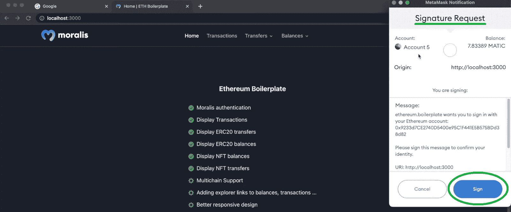

正如你在上面的截图中看到的，用户需要通过“签名”按钮签署签名请求。签署消息后，我们的示例 dapp 显示用户的钱包地址，而不是“连接钱包”按钮:

此外，一旦用户通过身份验证，他们就可以在“交易”页面上查看自己的交易:

交易细节包括交易散列，例如“发件人”地址、“收件人”地址、用气量、交易日期和交易状态。此外，用户可以通过从“转移”下拉菜单中选择两个选项之一来关注 ERC-20 或 NFT 转移:

例如，这是一个示例用户的 NFT 传输方式:

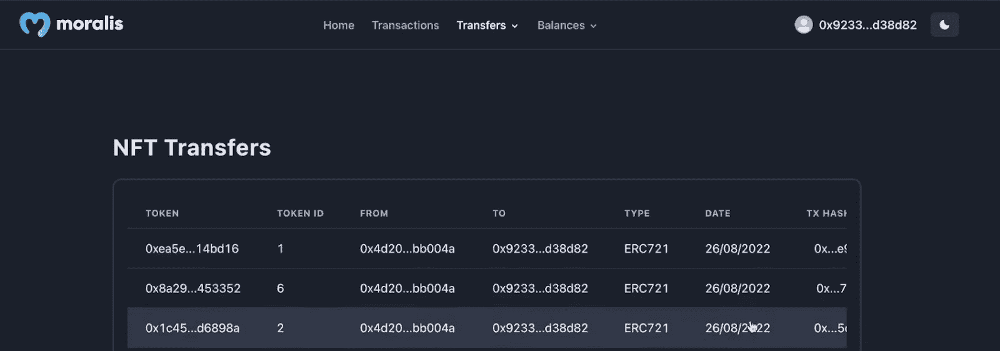

如你所见，我们的 Web3 网站模板包括几个细节。包括令牌地址、令牌 id、“发件人”地址、“收件人”地址、NFTs 类型(ERC-721 或 ERC-1155)、日期和事务散列。最后但同样重要的是，用户还可以查看他们的余额。在这里，他们再次可以在 ERC 20 代币和 NFT 之间进行选择:

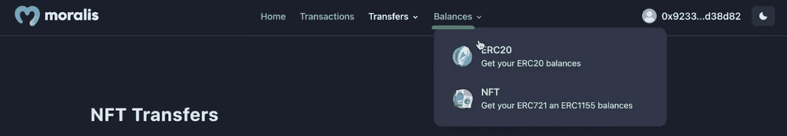

当显示 ERC-20 余额时，我们的示例 dapp 显示代币的名称和代号、连接的钱包中的代币数量(“值”)以及代币的地址:

谈到非功能性桌面，我们的 Web3 模板甚至可以确保显示与非功能性桌面相关的图像:

此外，与 ERC-20 余额一样，“NFT 余额”页面也显示 NFT 类型、名称、符号和金额。

## 使用 GitHub 上的 Web3 网站模板建立一个网站

在看到您可以用终极以太坊样板创建一个多么优秀的 dapp 之后，您很可能渴望尝试一下。如果是这样，首先使用 Google 并输入“以太坊样板”关键字:

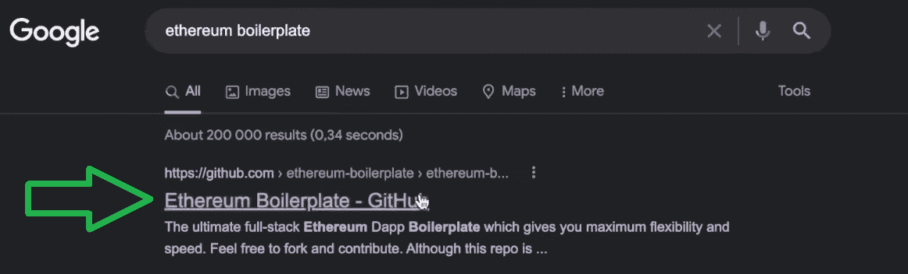

*注* *:大多数情况下，排名靠前的结果是你想要关注的。不过，以防万一，这里是正确的* [*GitHub 库*](https://github.com/ethereum-boilerplate/ethereum-boilerplate) *的链接。*

一旦您在 GitHub 上访问了我们的 Web3 网站模板，请浏览“自述”部分了解更多详情。“关于”部分告诉您这个模板主要关注 NextJS 框架。此外，值得指出的是，您可以将这个 Web3 模板与以太坊和其他支持的 EVM 兼容链一起使用。若要继续，请复制回购的 URL 地址:

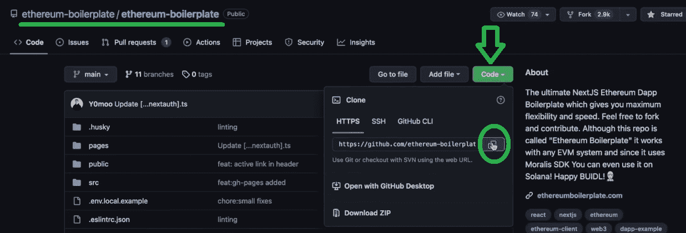

然后，打开你最喜欢的 IDE。对你来说，跟随我们的脚步使用 Visual Studio 代码(VSC)可能是最简单的。接下来，确保您有一个想要克隆代码的文件夹(在我们的例子中是“样板”)。然后，使用 VSC 的终端运行" *git clone* "命令，后跟上面复制的 URL:

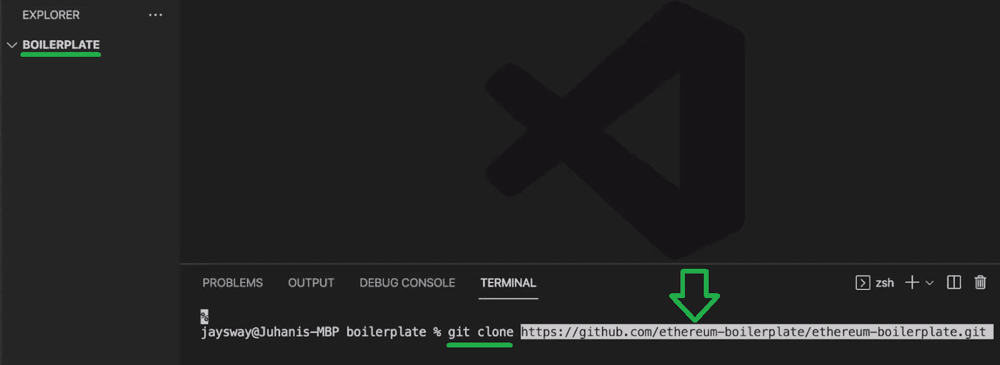

一旦克隆过程完成，将 *cd* 放入“以太坊-样板”文件夹:

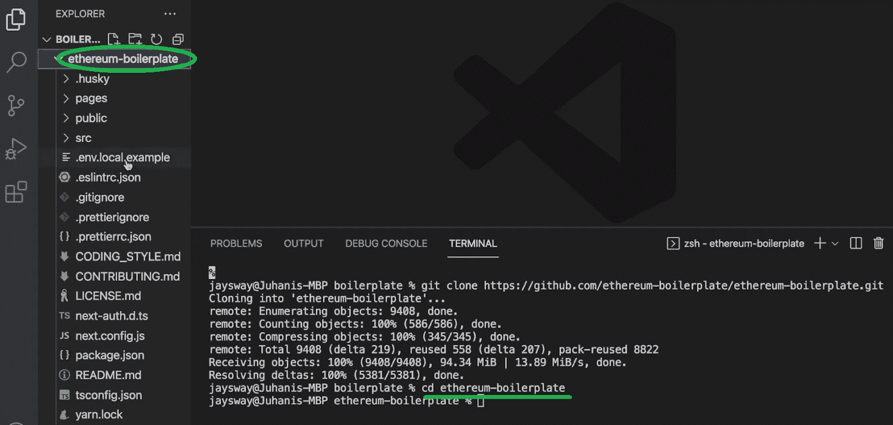

同样，请随意浏览现在由您处理的文件夹和文件。然而，要创建上面介绍的 dapp，您必须首先关注“. env.local.example”文件。这是您需要设置一些环境变量的地方:

### 选择你的 Dapp 的区块链

看上面的截图，可以看到最上面的变量是“ *APP_CHAIN_ID* ”。所以，这个变量的值将决定你想要关注哪个链。此外，“ *0x1* 表示，默认情况下，代码关注以太坊链。然而，正如您在上面的演示中可能已经注意到的，我们的示例 dapp 运行在 Polygon 的 testnet (Mumbai)上。因此，让我们把注意力集中在这个链条上。不过，记住你可以在任何一个[支持的链](https://docs.moralis.io/reference/supported-chains-evm)上构建你的 dapp。

*注* *:* *您可以通过访问“支持的链”链接找到支持的链的 id。*

就孟买测试网而言，ID 是“ *0x13881* ”。接下来，您需要粘贴您的 Moralis Web3 API 密钥。

### 获取您的 Moralis Web3 API 密钥

要获得 API 密钥，您需要您的 Moralis 帐户。因此，如果你还没有这样做，请使用简介中的“创建你的免费 Moralis 账户”链接。或者，您也可以访问 Moralis 的主页，点击“免费开始”按钮:

随着您的帐户启动和运行，您将能够访问您的 Moralis 管理区。在那里，您可以通过两个简单的步骤获得您的 Moralis Web3 API 密钥。首先，点击侧边菜单中的“Web3 APIs”选项，然后复制您的 API 密钥:

然后，返回到“. env.local.example”文件，用上面复制的键替换占位符的内容:

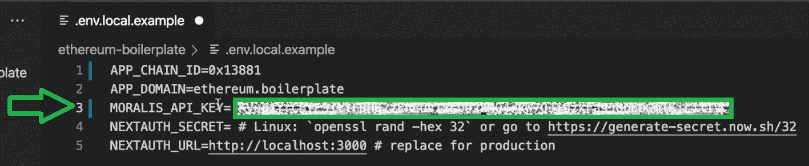

#### 获取您的下一个认证密码

另一个需要注意的环境变量是“ *NEXTAUTH_SECRET* ”。幸运的是，您可以很容易地获得这个变量的值。只需使用有问题的变量旁边的“. env.local.example”文件中的链接。然后，使用浏览器访问该 URL 地址。相应地，你应该得到你的“秘密”:

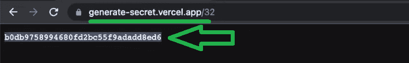

最后，用您的“ *NEXTAUTH_SECRET* ”值替换默认内容。

至于“ *NEXTAUTH_URL* ”值，测试时可以坚持“ *localhost: 3000* ”(或 *3001* )。然而，一旦你准备好生产，你将需要使用你的 dapp 的网址。因此，如果您正确地遵循了我们的说明，您现在应该已经准备好了您的环境变量:

最后但同样重要的是，确保将“. env.local.example”文件重命名为“. env.local”。

#### 安装依赖项

准备好“. env.local”文件后，必须安装所有必需的依赖项。无论是使用*纱*还是 *npm* ，都需要输入“*纱*或“ *npm i* 命令:

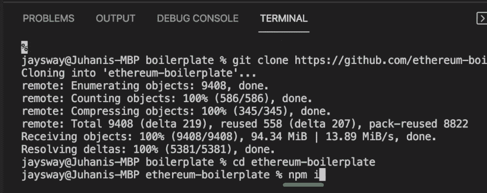

安装完所有依赖项后，您可以使用" *yarn run dev"* 或" *npm run dev* "命令运行 dapp:

从上面的截图可以看到，我们使用的是端口*3000*；因此，我们的 dapp 是在“ *localhost: 3001* 上启动的。如果您有同样的情况，请确保相应地更改“. evn.local”文件中的“ *NEXTAUTH_URL* ”值:

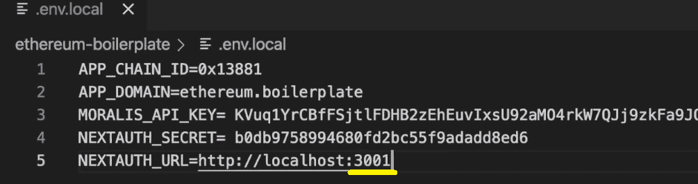

现在，你可以带着你的 dapp 去试运行了。只需打开自己喜欢的浏览器，在“ *NEXTAUTH_URL* ”地址中粘贴即可。当然，请确保您已经安装了元掩码扩展，并且至少准备好了一个钱包帐户。因此，您可以使用“连接钱包”按钮来连接您的 dapp。不过，默认情况下，你甚至可以在 MetaMask 或比特币基地钱包之间进行选择:

如果选择元掩码，您还需要选择想要使用的帐户(如果您有多个帐户):

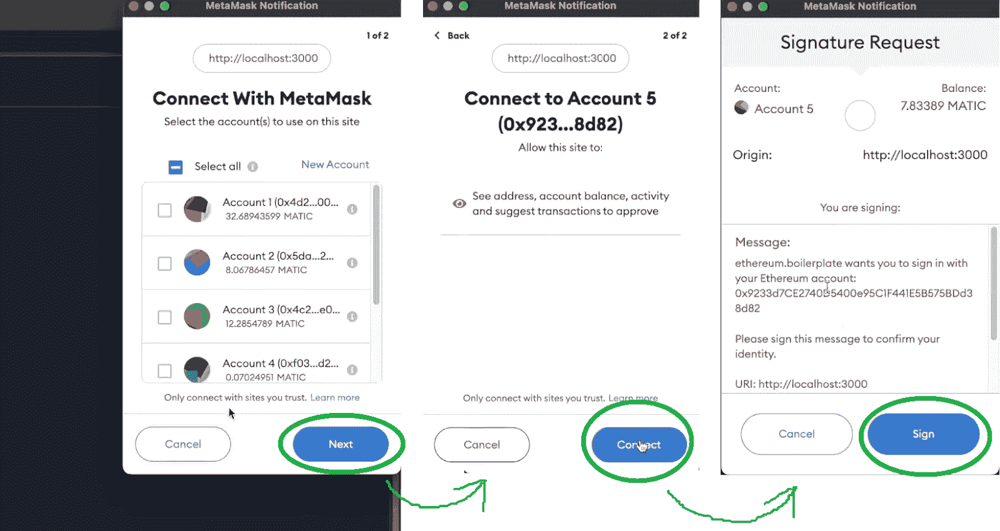

选择并连接您的帐户后，您需要签署签名请求，如上面的演示部分所示。一旦通过认证，请确保在 GitHub 上浏览使用我们的 Web3 网站模板创建的 dapp 的所有页面。

### 进一步发展我们的 Web3 模板

正如前面所指出的，这个样板文件(或 Web3 网站模板)是创建一个外观整洁的 dapp 的最简单快捷的方法。因此，它可以作为你的项目或黑客马拉松的一个很好的起点。当然，你可能会想给你的 dapp 添加其他功能。在这种情况下，您需要关注“以太坊-样板”文件夹中的“页面”文件夹:

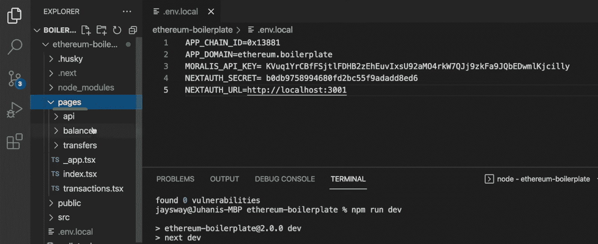

此外，您还可以浏览“src”文件夹，在那里您可以访问所有的组件(元素、布局、模块和模板)和“utils”。例如，如果你想改变默认主页，你可以在“模板”文件夹中找到它。因此，请确保更深入地探索这个存储库，并充分利用它。

*尽管如此，这里还有一个视频教程，带你完成上面的演示和步骤:*

https://www.youtube.com/watch?v=Bb5Pc–kyAY

## Web3 模板–使用 Web3 网站模板构建 Dapp–摘要

在今天的文章中，您了解了借助 Moralis 和我们在 GitHub 上的 Web3 网站模板的力量，创建 dapp 可以轻松快捷地完成。初始过程包括克隆 Web3 模板(或以太坊样板代码)。此外，随着我们向前推进，您发现您可以将 dapp 部署到以太坊或任何其他受支持的 EVM 兼容链。您只需在“. env.local”文件中的指定位置输入相应的链 ID 即可。除了链 ID，我们还向您展示了如何通过两个简单的步骤获得您的 Moralis Web3 API 密钥。您还学习了如何获取您的“ *NEXTAUTH_SECRET* ”并在本地运行您的 dapp。

我们希望您已经动手测试了我们示例 dapp 的实例。现在，您可以通过添加额外的页面和功能来使这个分散式应用程序变得独一无二。如果你需要更多的实践或一些新的想法，一定要去探索[Moralis 博客](https://moralis.io/blog/)和[Moralis YouTube 频道](https://www.youtube.com/c/MoralisWeb3)。这两个渠道涵盖了从 DeFi dapps 到 Web3 游戏的各种示例项目。因此，你可以使用这些教程成为一个没有 Web3 开发经验的自信的 Web3 开发者。

此外，值得指出的是，区块链行业提供了许多就业机会。然而，要得到你梦想中的加密工作，如果你是区块链认证的，那会很有帮助。因此，一定要考虑报名参加[Moralis 学院](https://academy.moralis.io/)。除了顶尖的区块链发展课程，这是获得专家指导、个性化学习路径和密码领域最先进社区之一的会员资格的地方。