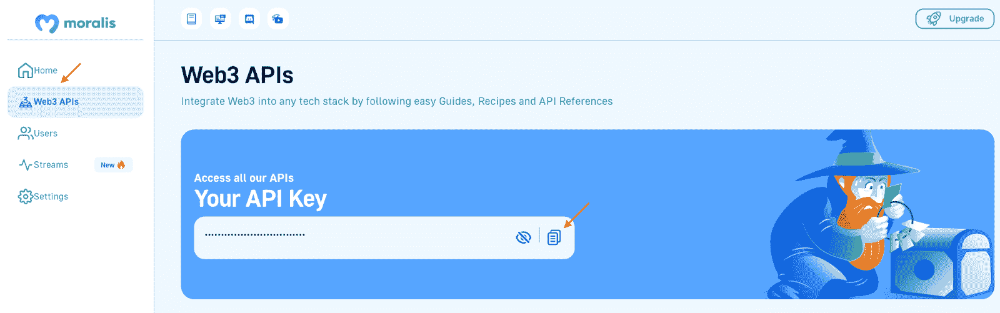
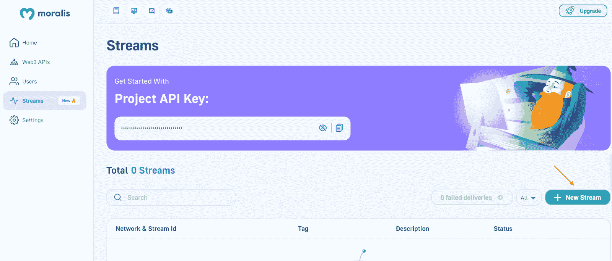
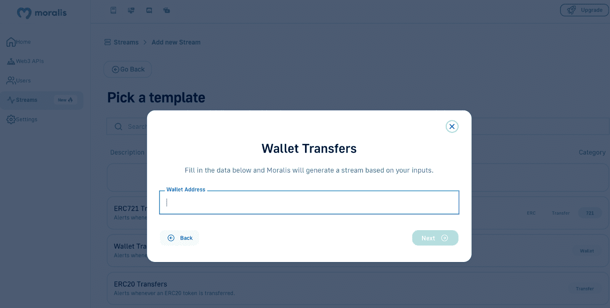
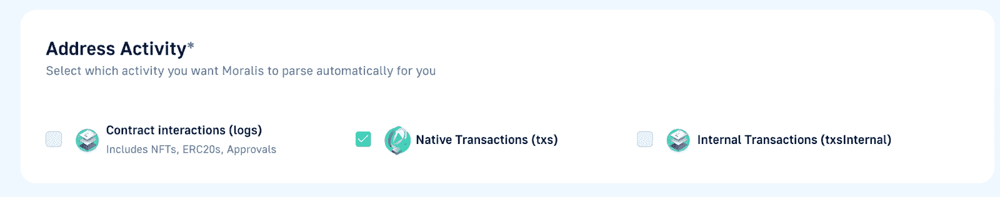

# web 3 Webhooks——区块链 web hooks 的终极指南

> 原文：<https://moralis.io/web3-webhooks-the-ultimate-guide-to-blockchain-webhooks/>

要设置 Web3 webhooks，利用现有的最佳工具至关重要。Moralis 的企业级 Web3 Streams API 为开发人员提供了最简单、最容易的方式来设置 Web3 webhooks，以便将链上数据传输到他们项目的后端。


如果您完成了本指南中的所有先决条件，您可以使用 Moralis 的 JS SDK 以编程方式设置区块链 webhooks，下面是一个代码示例:

```js
import Moralis from 'moralis';
import { EvmChain } from "@moralisweb3/evm-utils";

Moralis.start({
  apiKey: 'YOUR_API_KEY',
});

const stream = {
  chains: [EvmChain.ETHEREUM, EvmChain.POLYGON], // List of blockchains to monitor
  description: "monitor Bobs wallet", // Your description
  tag: "bob", // Give it a tag
  webhookUrl: "https://YOUR_WEBHOOK_URL", // Webhook URL to receive events
}

const newStream = await Moralis.Streams.add(stream);
const { id } = newStream.toJSON(); // { id: 'YOUR_STREAM_ID', ...newStream }

// Now we attach Bobs address to the stream
const address = "0x68b3f12d6e8d85a8d3dbbc15bba9dc5103b888a4";

await Moralis.Streams.addAddress({ address, id });

```

[**Set Up Web3 Webhooks Now**](https://admin.moralis.io/register)

### 概观

应用程序和其他平台可以通过几种方式进行通信。然而，最有效的方法往往是使用网络钩子。正如传统的网络钩子对于网络 2 中的数字交流是必不可少的一样，网络 3 网络钩子(区块链网络钩子)对于分散的网络也是同样重要的。但是，开发人员如何在分散的应用程序和其他传统服务之间轻松建立 webhook 通信呢？当我们进一步探索这个话题时，请继续阅读，并深入探究 Web3 网络钩子的复杂性！此外，随着我们的深入，我们将解释如何通过设置网络钩子来侦听区块链事件并基于预定义的过滤器发出 HTTP 请求。在 Web3 的上下文中，源系统是区块链，目标系统是你的项目。

此外，结合探索区块链网络钩子的来龙去脉，本指南展示了如何使用 Moralis 的企业级[web 3 API](https://moralis.io/web3-apis-exploring-the-top-5-blockchain-apis/)——web 3 Streams API 来创建它们。然而，Moralis 提供了其他 API，包括 [Web3 Auth API](https://moralis.io/authentication/) ，可以帮助您的开发工作。所以，如果你想成为一名区块链开发者，[马上和 Moralis 家](https://admin.moralis.io/register)签约。Moralis 的 API 开启了更加无缝的开发者体验，弥合了 Web2 和 Web3 的开发差距。因此，使用 Moralis，您可以更智能、更快速地构建！

现在，在我们更深入地了解设置 Web3 webhooks 的主题之前，我们必须让大家都熟悉一下。因此，让我们从基础开始！

## 什么是 Webhooks？

为了充分掌握 Web3 webhooks，你需要从探索传统的 webhooks 开始，以及是什么让它们变得重要。简而言之，webhooks 是由源系统(发送方)中的某些事件触发的 HTTP 请求，并发送到目的系统(接收方)。

此外，在一个高度互联的在线世界中，系统不能孤立地发挥最佳功能，在线系统能够相互通信以共享数据是至关重要的。这就是 webhooks 进入等式的原因，它提供了一种有效的方式让系统互相“说话”。当给定事件发生时，源系统通过发送到 webhook URL 的 HTTP 请求与目标系统通信。源系统通过“请求有效载荷”共享关于事件的附加信息。设置这一点对于区块链开发者来说是必不可少的，因为你需要知道如何监控和收听实时的区块链活动。这是一个非常重要的任务，这篇文章将教你如何基于区块链事件创建网页挂钩！


然而，由于 webhooks 扮演着如此重要的角色，很明显，知道如何使用 webhooks 在系统之间自动推送数据是非常有益的！

## 什么是 Web3 Webhooks？

随着对传统的 webhooks 有了更好的理解，是时候更深入地研究它们在去中心化 web 环境中是什么了。因此，本节将深入探讨区块链的网络钩子，并着手回答这个问题，“*什么是 Web3 网络钩子？*”。


Web3 webhooks 与传统的 webhooks 具有相同的用途，可以实现跨系统的通信。然而，事情略有不同，因为 Web3 是分散的，运行在由智能合约支持的可编程区块链上。因此，Web3 webhooks 监听区块链上发生的不同事件，并依次将实时请求负载接收到您的后端。例如，各种活动可以是资产转移、执行特定动作的特定钱包或发出事件的合同。

就像传统的 webhooks 一样，Web3 webhooks 使您能够避免不断轮询数据库和检查状态是否被更改的繁琐任务。相反，可以利用区块链 webhooks 来自动定位您感兴趣的事件，以触发请求有效负载的交付。


当您感兴趣的智能合约事件发生时，发送方系统会将相关数据推送到您(接收方)指定的 webhook URL。此外，目标系统还可以返回回调消息。这些消息包含 HTTP 状态代码，通知发送方数据已成功传递。

### Web3 Webhook 示例

想象一下，你正在使用一个加密交易所来交易区块链相关的资产。当交易发生时，你既发送又接收资产。然而，即使当你不活跃地交易时，有人也可能向你的 Web3 钱包发送资产。在这种情况下，交换可能希望发送推送通知，通知您新收到的资产。因此，为了自动化这一过程，交易所向您的 Web3 钱包订阅，以便在您接收资产时接收 webhooks。在这种情况下，交换机是目标系统，区块链是源系统。

另一个例子可能是，您希望监控链上发生的特定转移金额的转移。例如，在这种情况下，您可以设置一个 webhook 来监听金额超过 10 万美元的 USDT 转账。

此外，由于 webhooks 扮演着如此重要的角色，很明显，知道如何使用 webhooks 在系统之间自动推送数据是非常有益的。所以，如果你觉得前面提到的例子很有趣，请继续阅读，因为我们将向你展示如何设置具有类似目的的 webhooks！

## Moralis 的 Web3 流 API 解释

在 Web3 开发中，为 dapps 和其他项目获取区块链数据是必不可少的，因为这对用户体验至关重要。从传统的角度来看，这是一项非常乏味的任务，因为它要求开发人员运行错误的 RPC 节点、构建抽象、浪费时间设置复杂的数据管道等。然而，幸运的是，现在情况不再是这样了，因为您可以选择使用 Moralis 的 [Streams API](https://moralis.io/streams/) ！


Streams API 允许您通过轻松设置 Web3 webhooks 将区块链数据流式传输到区块链项目的后端。此外，Moralis 还支持以太坊、多边形、BNB 链等多种网络。因此，您可以选择在几乎任何网络或第二层解决方案上接收 webhooks！

此外，Moralis Web3 Streams API 是 Moralis 基础设施的支柱。但是它是如何工作的呢？

1.  请提供地址。如果地址是 Web3 合同，请指定您感兴趣的特定事件。
2.  应用过滤器并根据条件选择何时接收网页挂钩。
3.  指定要监控的网络。
4.  添加 webhook URL。
5.  当事件触发时，接收 webhooks 并请求有效负载，匹配您的过滤器。

尽管如此，接下来的部分将深入这个过程，解释如何用 Moralis 创建 Web3 webhooks！

## 使用 Moralis 的 Web3 Streams API 设置 Web3 Webhooks

现在，对区块链 webhooks 有了更深刻的理解，下面几节将说明如何使用 Moralis 的 Streams API 设置 Web3 webhooks。该 API 是 Moralis 基础设施的支柱，它提供了你设置 Web3 webhooks 所需要的一切。此外，当与 Moralis 合作时，您可以轻松地将链上数据传输到您未来的任何区块链项目中！


在任何网络或第二层解决方案上，您有两种选择来构建您的第一个流和接收 Web3 webhooks:

*   **程序化**–第一种选择是通过使用 Moralis 的 SDK 或 API 程序化地设置流。
*   **通过 Moralis 的管理面板**–第二种选择是使用 Moralis 的网络用户界面创建流。

这两种选择都相对简单；但是，本指南为每个选项提供了一个演练，以使该过程尽可能易于理解。这样，我们将说明如何设置一个区块链 webhook 来监控一个 [Web3 钱包](https://moralis.io/what-is-a-web3-wallet-web3-wallets-explained/)。更具体地说，您将使用 Web3 webhook 将有关所有进出交易的区块链数据传输到特定的 wallet。

### 程序化

本节解释了如何使用 Moralis 的 JS (JavaScript) SDK 以编程方式设置 Web3 webhook。首先，您需要启动您最喜欢的 IDE(集成开发环境),并建立一个包含 JS 文件的新项目。从这里开始，确保安装所有的 Moralis 依赖项。例如，如果您使用 NodeJS，您可以通过在新终端中运行" *npm install moralis"* 来实现。

手头有一个 JS 项目，您可以通过在文件顶部输入以下内容来初始化 Moralis SDK:

```js
import Moralis from 'moralis';
import { EvmChain } from "@moralisweb3/evm-utils";
Moralis.start({
  apiKey: 'YOUR_API_KEY',
});
```

然而，当进一步检查上面的代码片段时，您会注意到需要输入 Moralis API 键。因此，如果您还没有，[立即免费注册您的 Moralis 帐户](https://admin.moralis.io/register)!

一旦你登录，你会发现自己在 Moralis 管理面板。在那里，您可以通过单击“Web3 APIs”选项卡找到您的密钥。然后，您可以复制密钥并替换代码中的“ *YOUR_API_KEY* ”:



初始化 Moralis 后，创建一个新的" *stream* "对象，您可以在其中指定链、提供描述、添加标签和 webhook URL。下面是一个可能的例子:

```js
const stream = {
  chains: [EvmChain.ETHEREUM, EvmChain.POLYGON], // list of blockchains to monitor
  description: "monitor Bobs wallet", // your description
  tag: "bob", // give it a tag
  webhookUrl: "https://YOUR_WEBHOOK_URL", // webhook url to receive events,
}
```

最后，在调用 Moralis 的“ *Moralis”时，将“ *stream* ”对象作为参数传递。Streams.add(stream)* 函数，添加一个新的“ *{ id }* ”对象，以及你想要监控的地址:

```js
const newStream = await Moralis.Streams.add(stream);
const { id } = newStream.toJSON(); // { id: 'YOUR_STREAM_ID', ...newStream }
// Now we attach Bobs address to the stream
const address = "0x68b3f12d6e8d85a8d3dbbc15bba9dc5103b888a4";
await Moralis.Streams.addAddress({ address, id });
```

总而言之，整个文件应该是这样的:

```js
import Moralis from 'moralis';
import { EvmChain } from "@moralisweb3/evm-utils";

Moralis.start({
  apiKey: 'YOUR_API_KEY',
});

const stream = {
  chains: [EvmChain.ETHEREUM, EvmChain.POLYGON], // list of blockchains to monitor
  description: "monitor Bobs wallet", // your description
  tag: "bob", // give it a tag
  webhookUrl: "https://YOUR_WEBHOOK_URL", // webhook url to receive events,
}

const newStream = await Moralis.Streams.add(stream);
const { id } = newStream.toJSON(); // { id: 'YOUR_STREAM_ID', ...newStream }

// Now we attach bobs address to the stream
const address = "0x68b3f12d6e8d85a8d3dbbc15bba9dc5103b888a4";

await Moralis.Streams.addAddress({ address, id });
```

这就是代码；剩下的就是运行程序了。打开一个新的终端，然后“cd”到包含该代码的文件的位置，并以该文件的名称运行以下命令:

```js
node “FILE_NAME”
```

### 通过 Moralis 的网络用户界面

本节说明了如何使用 Moralis 的 web UI 设置一个 Web3 webhook 来传输链上数据。首先，确保你有一个 Moralis 账户，并访问以下网站:“[https://admin.moralis.io/streams](https://admin.moralis.io/streams)”。在那里，您可以单击“+新流”按钮开始:



接下来，从头开始创建一个新的流，或者选择一个已经准备好的模板。在这种情况下，由于您希望设置一个 Web3 webhook 来监控特定的钱包，因此您可以选择“钱包转账”选项:


如果选择此选项，请添加要监视的电子钱包的地址:



输入地址并点击“下一步”后，您需要添加描述、webhook URL 和标签:


在那里，选择区块链:


选择网络后，您必须选择地址活动。在这个阶段，您选择希望 Moralis 自动为您解析的活动:



最后，向下滚动到页面底部，点击“创建流”！这涵盖了使用 Moralis 的 web UI 通过 Web3 webhooks 创建流的整个过程！

### 强制测试 Webhook

您现在知道了如何通过两种不同的方式设置 Web3 webhooks 来创建流。然而，无论您选择哪一个，一旦您启动了这个流，您将会收到一个测试 webhook。

为此，您需要返回状态代码 200，以便启动流。此外，这是测试主体的外观:

```js
{
  "abi": {},
  "block": {
    "hash": "",
    "number": "",
    "timestamp": ""
  },
  "txs": [],
  "txsInternal": [],
  "logs": [],
  "chainId": "",
  "tag": "",
  "streamId": : "",
  "confirmed": true,
  "retries": 0,
  "erc20Approvals": [],
  "erc20Transfers": [],
  "nftApprovals": [],
  "nftTransfers": []
}
```

一旦您返回状态代码，您应该通过 Web3 webhook 设置您的流。因此，当您指定的地址涉及到一个传入或传出的交易时，您将收到一个包含交易详细信息的 webhook！

如果您已经了解了这么多，那么您应该知道如何通过 Moralis 的 web UI 以编程方式构建您的第一个流。因此，您现在知道如何利用 Moralis 的 Streams API 通过 Web3 webhooks 将链上数据传输到 Web3 项目的后端了！

但是，如果您在此过程中遇到问题，请查看[快速入门指南](https://docs.moralis.io/docs/your-first-stream-using-js-sdk)了解更多信息。

## Web3 Webhook Firebase 集成

在这一点上，你知道它是一个区块链监听器，使你能够监听任何链上的事件。此外，您可以监控的一些活动示例有智能合约事件、ERC-20 令牌转移、正在铸造的 NFT 等等！然而，即使您可以立即建立一个 Moralis 流，您也需要一种方法来无缝地将数据存储在您的后端，这就是 Moralis 流 API Firebase 集成的用途！

Firebase 集成使得 Web2 开发人员可以非常快速地使用 Web3 webhooks，而无需建立自己的后端基础设施。相反，Firebase 通过提供完整的托管解决方案来处理所有繁重的工作。此外，通过 Firebase 集成，您可以通过 Web3 webhooks 轻松地将区块链数据实时传输到您的后端！因此，您不需要担心连接和维护 RPC 节点、构建不必要的抽象、设置复杂的数据管道等。

此外，Firebase 集成了 Moralis Streams 扩展。通过添加扩展，您可以基于特定事件轻松触发任何云功能，流入 Firebase 的信息将整齐地显示在文档中。例如，这可以包括钱包地址、连锁店 id、汽油价格以及更多与特定事件相关的信息！

要了解更多关于 Moralis 的 Streams API Firebase 集成的信息，请查看下面 Moralis 的 YouTube 频道中的视频。在这个片段中，Moralis 的一位天才开发人员提供了 Web3 Streams API 的简要概述，并演示了如何收听任何区块链活动！

[https://www.youtube.com/embed/EieJVLhpvsI?feature=oembed](https://www.youtube.com/embed/EieJVLhpvsI?feature=oembed)

## 总结–解释了 Web3 Webhooks

在本文中，我们探索了 Web3 webhooks 的复杂性，并学习了如何使用 Moralis 和 Web3 Streams API 来设置它们。此外，您还了解了 Web3 webhooks 是由源系统(发送者)中的特定事件触发的请求。一旦被触发，响应将与请求有效负载一起发送到目标系统(接收器)。相应地，Web3 webhooks 消除了持续轮询数据库的需要，使得系统间的通信更加高效！

除了探究 Web3 webhooks 的来龙去脉，本文还展示了如何通过 Moralis 的 SDK 和通过 Moralis 的 web UI 以编程方式设置 webhooks。因此，希望你知道两种建立 Web3 webhooks 的方法，并在未来的 Web3 项目中使用它们！

尽管如此，如果你觉得这个教程很有帮助，请点击 Moralis 的 [Web3 博客](https://moralis.io/blog/)查看更多精彩内容。例如，学习所有你需要知道的关于[穗区块链](https://moralis.io/what-is-sui-blockchain-the-ultimate-guide/)、[索拉纳智能合约建筑](https://moralis.io/solana-smart-contract-building/)，或者如何使用 [Firebase 作为 Web3 的代理 API](https://moralis.io/how-to-use-firebase-as-a-proxy-api-for-web3/)！

因此，如果你正在寻找创建 Web3 webhooks 或者想要构建 dapps，那么[注册 Moralis](https://admin.moralis.io/register) ！创建帐户是免费的，您可以立即获得更无缝的开发者体验。因此，您将能够更高效地构建强大的 Web3 项目，并在市场竞争中胜出！