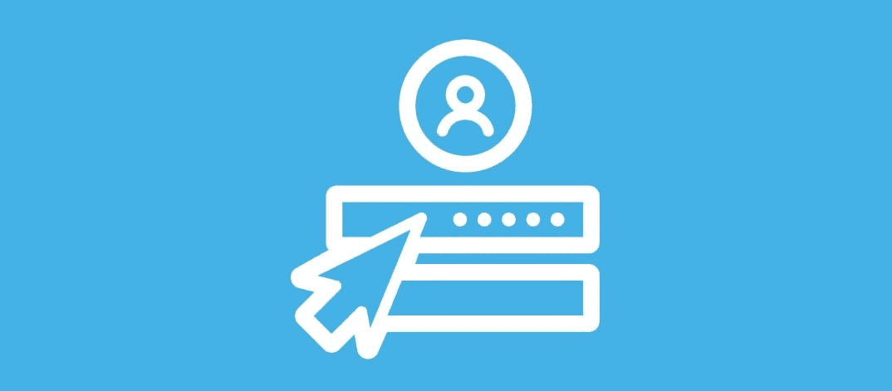
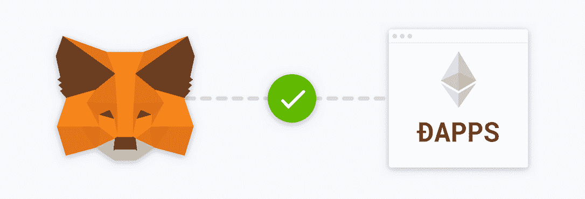
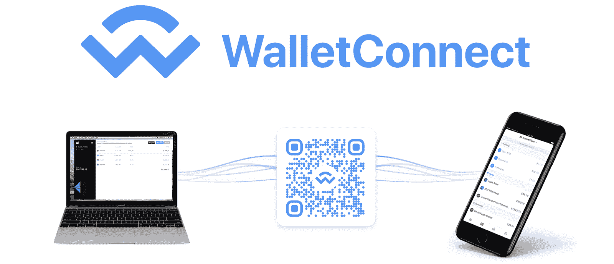
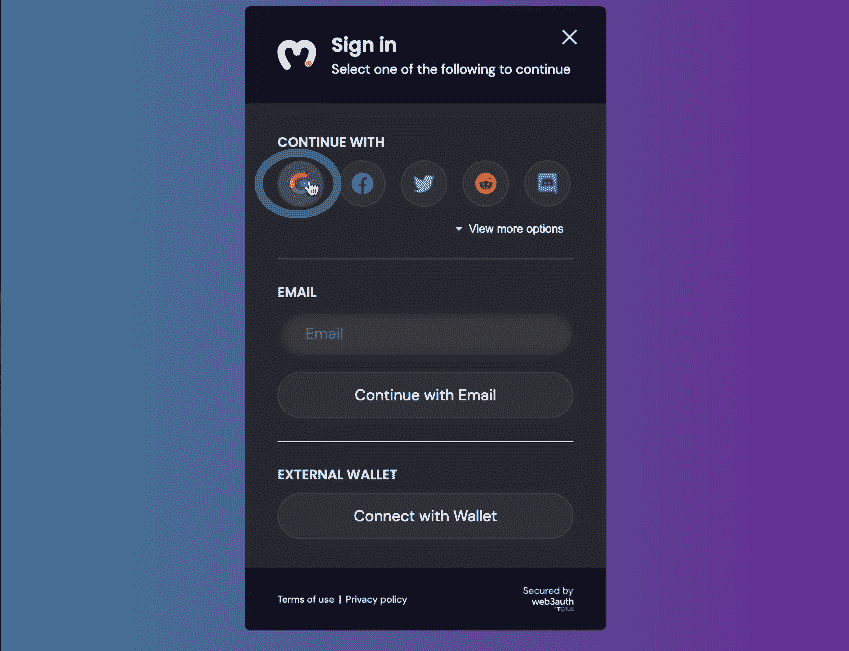
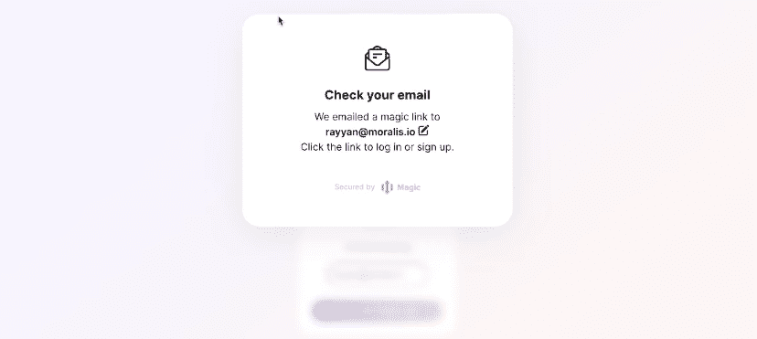
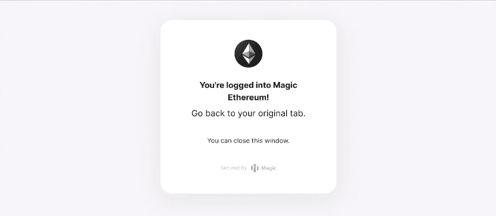

# 不带元掩码的 web 3–web 3 身份验证替代方案

> 原文：<https://moralis.io/web3-without-metamask-web3-authentication-alternatives/>

[**web 3**](https://moralis.io/web3-authentication-the-full-guide/)**认证是** [**Web3**](https://moralis.io/the-ultimate-guide-to-web3-what-is-web3/) **体验的组成部分。通过验证您的加密地址，您可以进入区块链领域。由于大多数 Web3 应用程序要求用户使用元掩码** [**进行身份验证，所以你很可能也使用了那个流行的 Web3 钱包。虽然**](https://moralis.io/how-to-authenticate-with-metamask/) [**元掩码**](https://moralis.io/metamask-explained-what-is-metamask/) **是访问**[**dapps**](https://moralis.io/decentralized-applications-explained-what-are-dapps/)**最常用的钱包之一，但在某些情况下，对于不熟悉 Web3 的新用户来说，这可能不是最佳选择。因此，我们决定探索不带元掩码的 Web3。在这里，我们将向您展示不依赖元掩码的 Web3 身份验证选项。作为用户，您可能无法控制身份验证方法。然而，如果您想成为一名区块链开发者，您需要探索所有能够在您的应用程序中实现的 Web3 认证替代方案。你会发现没有元掩码的 Web3 可能是一个更加用户友好的选择。**

本文将研究三种可靠且声誉良好的 Web3 身份验证替代方案。因此，你将了解当前的 [Web3 技术栈](https://moralis.io/exploring-the-web3-tech-stack-full-guide/)能提供什么。此外，我们将额外关注两个特殊的 [Web3 登录](https://moralis.io/how-to-build-a-web3-login-in-5-steps/)方法。这些方法有能力帮助你[提高 Web3 用户入职的成功率](https://moralis.io/how-to-boost-web3-user-onboarding-success-rates/)。怎么会？它们让您可以轻松实现 Web2 用户熟悉的登录方法。用[什么是 Web2 和 Web3？](https://moralis.io/what-is-web2-and-web3-explaining-web3/)“谨记，可以两全其美。你可以利用普通人熟悉社交和电子邮件登录的事实。此外，您将会看到，使用合适的工具，实现这些特定的 Web3 身份验证替代方案非常简单。使实现无缝的工具是 [Moralis](https://moralis.io/) ，也就是加密的[Firebase](https://moralis.io/firebase-for-crypto-the-best-blockchain-firebase-alternative/)。因此，[现在就创建你的免费 Moralis 账户](https://admin.moralis.io/register)!

## 什么是 MetaMask？

至此，您知道 Web3 身份验证不仅仅是元掩码。然而，MetaMask 在很大程度上已经成为 Web3 身份验证的同义词，这也不是什么秘密。因此，如果不确保我们都知道元掩码是什么，我们就无法解决“没有元掩码的 Web3”这个主题。如前所述，MetaMask 是最受欢迎的热门加密钱包。此外，它可以说是 dapps 最著名的身份验证方法。因此，[元掩码为开发者](https://moralis.io/metamask-for-developers-how-to-launch-web3-apps-with-metamask/)提供了几种可能性。例如，[用 MetaMask](https://moralis.io/building-dapps-with-metamask/) 和 Moralis 构建 dapps 就像做馅饼一样简单。

ConsenSys 在 2016 年开发了 MetaMask，以与[以太坊](https://moralis.io/full-guide-what-is-ethereum/)链进行交互。然而，从那以后，许多著名的与 EVM 兼容的区块链开始活跃起来。因此，MetaMask 使得添加其他链变得简单。例如，您可以使用 MetaMask 毫不费力地创建一个 [BNB 钱包](https://moralis.io/binance-coin-wallet-guide-how-to-set-up-a-bnb-wallet/)或[多链钱包](https://moralis.io/how-to-build-a-multi-chain-wallet-in-5-steps/)。尽管默认情况下，MetaMask 仍然充当 [ETH 钱包](https://moralis.io/how-to-create-an-eth-wallet-full-guide/)。

要使用 MetaMask，您需要以移动应用程序或浏览器扩展的形式下载它。对于精通技术的人来说，这一步一点也不复杂。然而，对于密码领域的新手来说，这可能是一个挑战。因此，您应该了解 Web3 身份验证的替代方案。虽然有许多有效的选择，特别是在加密钱包中，但我们想把重点放在三个特定的工具上。不带元掩码的 Web3 工具有:

*   **魔法**
*   wallet connect
*   **Web3Auth**

## 不带元掩码的 Web3–考虑这些 web 3 身份验证备选方案

上面列出的每一种元掩码替代方案都使不带元掩码的 Web3 成为现实。当然，每种都有其特定的用例以及优缺点。我们将使用以下部分来快速概述这三个 Web3 身份验证工具。然而，我们的示例项目将围绕 Web3Auth 和 Magic。

## 

## 什么是魔法？

Magic 或 Magic Link 是由 Magic Labs 开发的，是提供无密码 Web3 onboarding 的最著名的方法之一。它提供了一个实用的 SDK，您可以使用它进行身份验证、钱包创建和密钥管理。借助 Magic，您只需一个电子邮件地址、一个社交账户或一个电话号码，就能接触到区块链世界的新用户。这种“没有元掩码的 Web3”替代方案在幕后创建了 Web3 钱包。这样，对加密钱包一无所知的用户可以与各种 dapps 互动。

Magic 与几款发展最快的区块链产品天生兼容。此外，它还包括非托管密钥管理。此外，您可以使用一个 CLI 工具来引导您的项目，该工具可以生成一个带有 Magic auth 的定制的、完全可用的应用程序。这个 Web3 身份验证解决方案还以强大的安全性和基础设施而自豪。它使您能够通过获得专利的非托管密钥管理来保护用户。

此外，Magic 声称它保证 99.99%的正常运行时间，所以你可以确保世界各地的用户可以毫无障碍地访问你的应用程序。根据他们的官方网站，恶意登录攻击会被自动阻止和阻止。他们通过监控使用模式来实现后者。尽管如此，通过定期的第三方安全测试，Magic 符合 CCPA、SOC 2 和 GDPR 标准。此外，HIPAA 和 ISO27001 合规性也在酝酿中。

随着这一优秀工具的发展，我们鼓励您学习如何毫不费力地将其与 Moralis 集成。因此，你可以在几分钟内通过电子邮件完成 [Web3 认证。](https://moralis.io/how-to-do-web3-authentication-via-email/)

## 什么是 WalletConnect？

许多人认为 [WalletConnect](https://moralis.io/what-is-walletconnect-the-ultimate-walletconnect-guide/) 是一个应用程序或加密钱包。然而，实际上，WalletConnect 是一个开源协议。后者可用于在各种加密钱包和 dapps 之间建立连接。由于该协议的特性，使用 WalletConnect 的应用程序、钱包或设备之间的连接是安全的。本质上，以这种方式建立的连接是通过两个对等体之间的共享密钥对称加密的。

WalletConnect 与 100 多家领先的钱包合作。要查看所有支持的钱包，请访问 WalletConnect 的官方网站，并向下滚动到“任何钱包”部分。

使用这种“不带元掩码的 Web3”认证方法，有两种方法可以在钱包和 dapps 之间建立连接。可以通过扫描二维码或使用深度链接来完成。一个对等体(或 dapp)发出代码或链接，另一个对等体需要扫描或批准它。因此，当 WalletConnect 集成到 dapps 中时，可以轻松建立安全可靠的连接。

以下是 WalletConnect 的一些附加功能:

*   **不可知链**–wallet connect 也意识到未来很可能是面向多链的。因此，这个协议已经支持几个链。WalletConnect 可以和以太坊上的 dapps、 [Solana](https://moralis.io/what-is-solana-the-full-2022-guide/) 以及其他很多链一起使用。他们的官方网站声明 WalletConnect 将继续增加对更多链的支持。
*   **多链**–wallet connte 支持多链集成。它使您能够将任何支持的钱包同时连接到多个链。
*   **平台无关**–您可以在 web、桌面、移动和游戏应用程序上使用 WalletConnect 的协议。

我们建议学习如何使用 Moralis 及其 WalletConnect 集成来[认证 Android 应用。这样，您将看到这个强大的协议在起作用。](https://moralis.io/walletconnect-android-sdk-alternative-authenticate-android-apps-withmoralis/)

### 不带元掩码的 web 3–广泛的选项

既然您已经理解 WalletConnect 是一个协议而不是加密钱包，那么您可以看到它是一个强大的 Web3 身份验证工具。有了 WalletConnect，除了 MetaMask，你还可以使用很多其他钱包。因此，这给了“没有元掩码的 Web3”相当广泛的可能性。MetaMask 的一些最受欢迎的替代产品包括 Rainbow、Trust Wallet 和 Argent(如上图所示)。

## 什么是 Web3Auth？

在很多方面，Web3Auth 和 Magic 颇为相似。它还为用户使用熟悉的 Web2 登录方法进入 Web3 领域提供了一种简洁的方式。此外，Web3Auth 提供了几个超越 onboarding 的特性。其中包括:

*   **Fiat-to-crypto API**允许您的客户直接在您的 dapp 上购买相关链并与之互动。
*   **消除种子短语**减少支持票。后者是用户密钥丢失的主要原因之一，因此，往往会让您的支持人员蜂拥而至。有了 Web3Auth，就可以轻松避免这种情况。
*   **非保管式多因素认证**向用户介绍了一种安全、分散的方式来保护他们的密钥。
*   **OAuth 2.0 兼容用户登录验证**允许您通过单一 API 在后端验证用户。后者与现有的 Web2 解决方案兼容。

据 Web3Auth 官网介绍，这个强大的工具可以与任何钱包、平台、链条，甚至社交登录进行整合。它允许您插入现有的身份验证设置。有关 Web3Auth 及其工作原理的更多详细信息，我们鼓励您浏览它的文档。然而，你将有机会在下面看到这个非凡的“没有元掩码的 Web3”工具。

## Web3 的无密码登录–两个示例项目

我们认为 Web3Auth 和 Magic 都值得额外关注。为什么？因为它们是非常强大的工具，使“没有元掩码的 Web3”变得实用。如上所述，这两种方法为用户提供了熟悉的 Web2 登录和注册方法。它们是让对加密一无所知的用户有效入门的关键。因此，Web3Auth 和 Magic 也可以为区块链理工大学和 dapps 的主流采用做出贡献。

### Web3Auth 正在运行

看到这个“没有元掩码的 Web3”替代方案的最好方法是看一个演示。以下是我们的 dapp 示例，其中我们使用 Web3Auth 轻松搭载用户:

正如你在上面的截图中看到的，我们的 dapp 使用户能够通过点击“用 Web3Auth 登录”来登录。单击上面的按钮，将出现登录模块:

在上图的左侧，您可以看到登录模块及其三个部分。其中包括“继续”、“电子邮件”和“外部钱包”部分。因此，用户可以选择使用社交登录、电子邮件地址或加密钱包。在第一部分，还有“查看更多选项”按钮，显示所有支持的社交登录选项:

#### 使用 Web3Auth 的 Web3 社交登录

让我们仔细看看使用“Google”选项的实际身份验证过程。当然，同样的原则也适用于其他社交登录选项。在这种情况下，示例用户需要点击 Google 图标:

接下来，我们假设的用户需要选择一个 Google 帐户:

然后，用户还有机会选择双因素身份认证(2FA):

*注* *:使用 Web3Auth 时，开发者和用户都可以免费使用 2FA 功能。*

我们的示例用户通过点击“也许下次”决定跳过 2FA。因此，用户现在已经登录。用户还会获得一个可用于交易的加密地址:

上面显示的钱包地址是自动创建并分配给 Google 帐户的。让我们做一个交易示例，向您展示这是一个功能齐全的加密地址。首先，我们使用另一个帐户。我们进入 Web3Auth 模块的“外部钱包”部分，并使用元掩码登录。此外，该帐户会将 Ropsten 上一些测试 ETH([以太坊测试网](https://moralis.io/ethereum-testnet-guide-connect-to-ethereum-testnets/)之一)发送到上述地址:

对于上述示例 dapp 的详细视频演示，请使用以下从 0:53 开始的视频。在这段视频中，Moralis 专家将向您展示如何创建上述 dapp。此外，该视频将指导您创建 Web3Auth 帐户，并将其与 [Moralis SDK](https://moralis.io/exploring-moralis-sdk-the-ultimate-web3-sdk/) 一起使用。

这是我们的 Web3Auth 教程:

https://www.youtube.com/watch?v=44ItBuw86AA

### 魔法在行动

与我们使用 Web3Auth 的示例项目类似，我们使用 Magic 创建了另一个示例 dapp。这一次，我们专注于通过电子邮件为用户提供 Web3 身份验证。这是我们的示例 Web3 应用程序预览:

看上面的图片，你可以看到一个输入框和一个登录按钮。因此，普通用户会直观地知道如何进行。他们输入自己的电子邮件地址，然后点击“用魔法链接登录”按钮。接下来，他们会看到以下弹出窗口:

阅读完上面的消息后，用户会检查他们的电子邮件收件箱。这是一封默认电子邮件，带有我们 dapp 的登录魔法链接:

要继续，用户必须单击其身份验证电子邮件中的链接(登录按钮)。一旦用户点击链接，他们就登录了:

如果您想使用 Moralis SDK 和 Magic 创建上述 dapp 示例，请观看下面的视频。当然，这也是学习如何完成初始魔术设置的一个非常干净的方法。

这是我们的魔术教程:

https://youtu.be/gLJ4YejmG2E

## 不带元掩码的 web 3–web 3 身份验证备选方案–摘要

我们在这篇文章中涉及了相当多的内容。您已经有机会了解什么是元蒙版，并探索了“不带元蒙版的 Web3”选项。因此，您已经了解了什么是 WalletConnect、Magic 和 Web3Auth，以及它们可以作为 Web3 身份验证的替代方案。您还了解了 WalletConnect 是一种协议。它使您能够使用各种加密钱包来认证网络和移动用户。使用 Magic 和 Web3Auth，您可以实现遗留的登录方法。因此，你可以提高用户的参与度。此外，您还有机会看到 Magic 和 Web3Auth 的实际应用，并参与了两个示例项目。通过完成这些项目，您有机会学习如何使用“不带 MetaMask 的 Web3”工具。这也是学习如何使用 Moralis SDK 在几分钟内创建 dapps 的好方法。

除了以上两个示例项目，你可以在 [Moralis 博客](https://moralis.io/blog/)和 [Moralis YouTube 频道](https://www.youtube.com/c/MoralisWeb3)上找到许多其他的区块链开发教程。这些也是学习各种加密主题的途径。一些最新的文章集中在[以太坊名称服务(ENS)](https://moralis.io/what-is-ethereum-name-service-full-ens-guide/) ，如何[要求一个游戏内的 NFT](https://moralis.io/how-to-claim-an-in-game-nft-full-guide/) ， [Web3 契约](https://moralis.io/what-are-web3-contracts-exploring-smart-contracts/)， [Web3 游戏设计](https://moralis.io/web3-game-design-explaining-the-web3-game-design-process/)，[将 Web3 钱包连接到 Twitter 账户](https://moralis.io/connecting-web3-wallet-to-twitter-account/)，如何[将 Web3 钱包连接到网站](https://moralis.io/how-to-connect-a-web3-wallet-to-a-website/)， [NFT 实用程序](https://moralis.io/nft-utility-exploring-nft-use-cases-in-2022/)等等。此外，你可能想尽快成为全职加密员。如果是这样的话，更专业地对待你的区块链教育就是你要走的路。因此，你应该考虑报名参加 Moralis 学院。