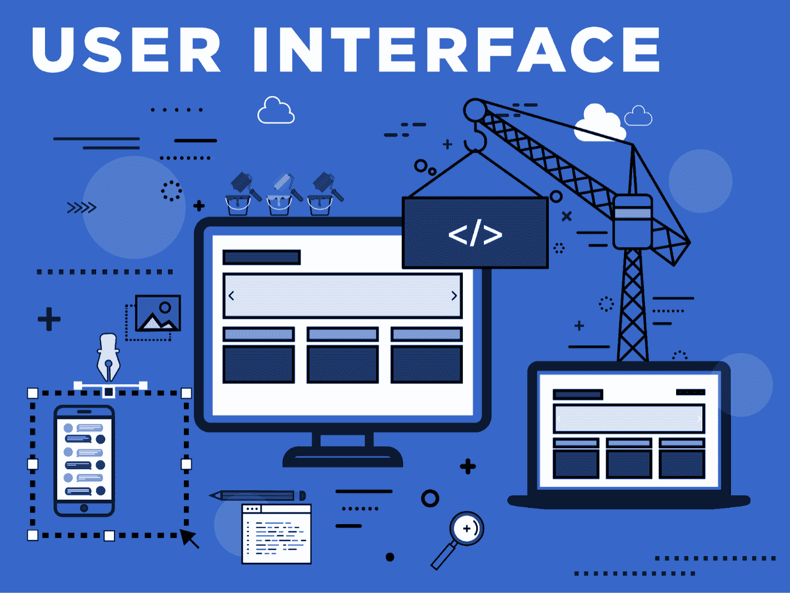
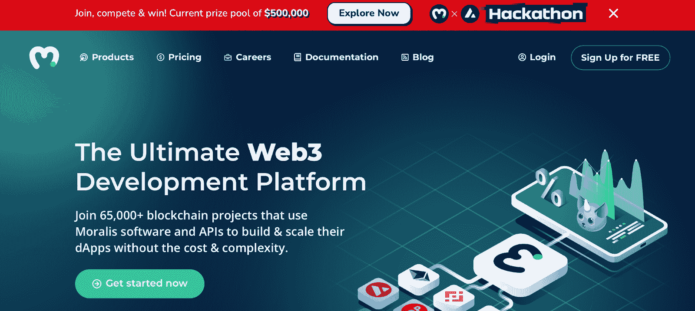
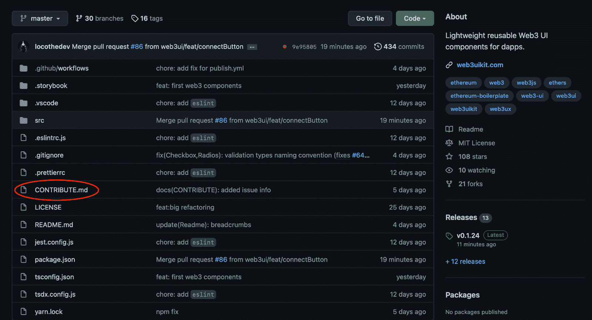
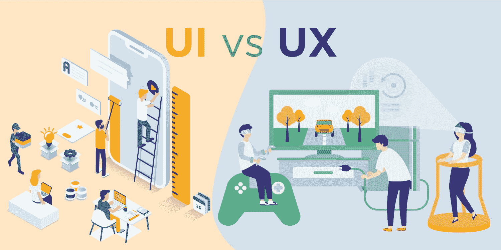

# Web3 uikit–最终的 web 3 用户界面套件

> 原文：<https://moralis.io/web3ui-kit-the-ultimate-web3-user-interface-kit/>

本文将向您介绍为什么 Web3 开发需要更好的前端 UI 开发工具，以及 Moralis 的 web3uikit 如何提供这些工具。如果您想直接进入 web3uikit，请查看以下链接:

**全 Web3 UI 文档——**

****发展比以往任何时候都更加火热，并以惊人的速度增长。自 Web3 早期以来，大部分注意力都集中在后端开发上。因此，在前端用户体验方面缺乏创新。这并不奇怪，因为 Web3 一直是一个“开发者密集”的利基市场，这表明大多数开发都是为其他开发者进行的。然而，随着去中心化 web 的不断发展并成为主流，我们需要强调用户体验并设计更有效的 ui(用户界面)。为了加速 Web3 前端革命，我们必须满足对更先进、更有用的开发工具的需求。正是因为这个原因，我们决定将 Moralis web3uikit 开源，为每个人提供设计优秀 ui 的机会！****

****Moralis 是 Web3 开发的最佳操作系统，有了这个平台，所有区块链项目的平均开发时间有可能减少高达 87%。节省开发时间的能力部分源于 Moralis 提供了无限可扩展的后端基础设施。****

****此外，除了 web3uikit，Moralis 还提供了广泛的开发工具选择。例如，作为用户，你将获得对[Moralis 快速节点](https://moralis.io/speedy-nodes/?utm_source=blog&utm_medium=post&utm_campaign=How%2520to%2520Build%2520Decentralized%2520Apps%2520%28dApps%29%2520Quickly%2520and%2520Easily)、 [NFT API](https://moralis.io/ultimate-nft-api-exploring-moralis-nft-api/) 、[价格 API](https://moralis.io/introducing-the-moralis-price-api/) 等的完全访问权。****

****所以，如果你对区块链的发展感兴趣，请马上和 Moralis 签约。这样做是完全免费的，只需要几秒钟，所以你不会有任何损失！****

## ****什么是 UI？****

****UI 是“用户界面”的缩写，指的是人类与网站或应用程序交互的空间。高效 UI 的主要目的是促进无缝的用户体验。这是通过创建一个直观且易于导航的界面来实现的。因此，它要求用户付出最少的努力，同时为他们提供一个愉快和期望的结果。****

****

创建一个引人注目的用户界面是相当棘手的，在设计用户界面时，有几个基本问题需要记住。然而，三个最重要的 UI 设计元素是信息架构、交互设计和视觉设计。作为基本组件，我们将仔细研究每个元素，以便更好地了解它们包含的内容:

*   信息架构(Information Architecture)——UI 的一个重要方面是对网站或应用程序的内容进行逻辑组织，使用户能够以最少的努力轻松浏览。组织内容有三种主要方式:层次式、顺序式和“矩阵”式。信息架构组件的例子有按钮、标签、术语和组织系统。
*   互动设计–互动设计元素背后的主要思想是将被动的读者转化为主动的参与者。要做到这一点，UI 应该提供用户有机会自己输入信息的实例。这里的例子可以是切换、按钮和社交分享功能。
*   视觉设计–应用程序或网站的美观至关重要。所以需要考虑几个方面，比如颜色、对比度、视频、字体等。有效利用这些组件可以吸引访问者，让他们更容易浏览网站/应用程序。例子可以是移动优化、排版、对比度和颜色。

### Web3 中的用户界面

Web3 风靡全球，目前是开发行业中最热门的领域之一。互联网的分散化提供了几个好处，并有可能彻底改变当前的系统。然而，自其诞生以来，Web3 爱好者大多强调后端开发，并优化了 [dApps](https://moralis.io/decentralized-applications-explained-what-are-dapps/) 的编码元素。

一段时间以来，Web3 一直被认为是一个“以开发人员为主”的利基市场，大多数早期采用者都是有编程经验的开发人员。在一个满是开发人员的空间里，大多数创新想法都是为其他开发人员设计的。这意味着开发人员的大部分精力都放在了后端编码元素上，几乎没有时间来设计高效的 ui。然而，从传统的角度来看，他们没有太多的选择，因为 Web3 后端开发是最费力的工作，不能让开发者专注于获得正确的 UI。

然而，Web3 现在正迅速走向主流应用，这表明不再可能忽视 UI 设计。我们需要高效的用户界面，因为这降低了大众的准入门槛，让技术知识较少的人也能进入这个领域。如果没有 UI 设计，Web3 要成为互联网的新标准将更具挑战性，如果不是不可能的话。

缺乏高效 UI 设计的一个原因是 Web3 后端开发很费力。然而，可以从 Moralis 开始，因为该操作系统允许开发人员平均节省 87%的开发 Web3 项目的时间。因此，在使用 Moralis 时，可以将更多的时间分配给 UI 设计。

此外，Moralis 工具包中最近增加的一个组件是 web3uikit，我们将在下一节中更深入地研究它！

## Moralis’ Web3UIKit

除了让 [Web3 开发](https://moralis.io/how-to-build-decentralized-apps-dapps-quickly-and-easily/)更容易使用，Moralis 现在还提供了一个 Web3UI 工具包。Moralis UI 就是建立在这个工具包上的，它现在是开源的，任何人都可以使用。因此，现在可以利用与开发 Moralis 平台相同的 UI 资源。

Moralis 的 Web3 UI 工具 web3uikit 配备了许多 Web2 元素，如按钮、渐变、表格、颜色。随着 Moralis 平台的扩展和发展，Web3UI 工具包也将扩展和发展，添加任何人都可以轻松访问的附加功能。

此外，在不久的将来，Moralis 的团队将继续向 web3uikit 添加更多以加密为中心的功能。这将使得为各种不同的 Web3 项目构建优秀的 ui 变得更加容易。这里的例子可以是交换接口、DeFi 接口等。，这些特性在开发 dApps 时将被证明非常有用。

开源 Web3UI 工具包的主要原因是创建一个统一的平台——Moralis——提供“一个真实的单一来源”。因此，你现在可以在 Web3 开发的所有方面使用 Moralis。此外，该工具包有几个基本核心目标:

*   **开发者体验(DX)**–通过 Web3UI 套件，Moralis 旨在提供出色的开发者体验，使创建高效的 UI 变得更加容易。
*   **用户体验(UX)**–通过使用该套件，所有开发人员都应该能够促成一个伟大的 UX。
*   **前端社区**–这个开源 UI 套件的一个目标是建立一个前端社区。因此，人们可以互相分享和学习。
*   **扩大 Moralis 团队**–由于该工具包是开源的，任何人都可以贡献，这将使 Moralis 的团队能够找到更多的前端开发人员。

## 贡献给 Moralis 的 Web3UI 套件

Web3UI 工具包的基本目标之一是创建一个前端社区。在这里，人们可以分享他们的工作，互相学习。由于这个原因，以及该工具包是开源的事实，任何人都有能力提交自己的贡献。我们强烈鼓励你加入，因为现在是一场 Web3 前端革命的时候了！

如果您想了解更多关于贡献 web3uikit 的信息，您可以在" [CONTRIBUTE.md](https://github.com/web3ui/web3uikit/blob/master/CONTRIBUTE.md) "文件中找到所有必要的信息。您可能很快就会注意到，这是一个相当广泛的过程，需要考虑大量信息。然而，这个详细的过程是出于好意，因为 Moralis 的目标是提供最高质量的 Web3 UI 工具包。因此，该套件的所有可用组件都经过测试，确保一切按预期运行。

然而，如果你对 Moralis 的 Web3 UI 工具有进一步的兴趣，你应该看看下面来自 Moralis YouTube 频道的视频。该视频涵盖了投稿的必要步骤，为您提供了如何加入的简明指南:

https://www.youtube.com/watch?v=bhOf56omPmA

此外，正如我们在前面提到的，这个工具包的另一个重要目标是扩展 Moralis 团队。为这个工具包做贡献是获得 Moralis 关注的一个很好的方式，你在这里的工作是一份很好的简历。

所以，如果你想加入 Moralis 团队，一个很好的起点就是为 Web3UI 工具包做贡献！

### 什么是 UX？UI vs UX

用户界面和 UX 之间的区别有点令人困惑，人们经常把它们当作同义词使用或者混淆。因此，我们认为澄清什么是 UX 以及这两种实践之间的区别是一个好主意。所以，事不宜迟，让我们试着回答这个问题，“什么是 UX？”。

UX 是“用户体验”的缩写，就像用户界面一样，这是在线成功的一个重要方面。UX 和 UI 是两个密切相关的概念；然而，有明显的区别。

同时，UI 主要关注人类与应用或网页交互的点或空间；UX 涵盖了完整的客户旅程。因此，UX 设计师的任务包括客户研究、创建客户角色和测试设计。因此，UX 的设计师需要时刻牢记客户的需求，并以他们的需求为基础做出战略决策。然而，这听起来和 UI 设计没有什么不同。

UI 和 UX 是相互关联的，这意味着这两个领域之间的边界可能是模糊的。尽管如此，一个普遍的区别是，UX 设计关注的是一种体验的整体感觉；同时，UI 是关于产品的外观和功能。

因此，一名 UX 设计师会做大量的研究，并规划出整个顾客旅程。在这里，他们可能会强调客户难以解决的“痛点”以及如何解决这些问题。然后由 UI 设计师来赋予一切以生命。这表明用户界面和 UX 设计者紧密合作，以提供更高的客户满意度。

## Moralis 的 web 3 uikit–摘要

UI 或用户界面是人们与网站或应用程序交互的点。因此，有效的用户界面的主要目的是促进无缝的用户体验。这通过许多不同的元素来实现，例如，信息架构、交互设计和视觉设计。

此外，UI 和 UX(用户体验)是两个相对相似的概念。然而，即使有些人偶尔将它们用作同义词，它们也有不同之处。主要的区别是 UX 设计采取了一种更广泛的方法，包含了一种体验的整体感觉。同时，UI 是关于一个网站或应用程序的外观和功能。

到目前为止，Web3 革命在很大程度上是一场后端革命。然而，随着 Web3 的普及，对改进的 Web3 UI 的需求也越来越大。因此，Web3 经历一场以制作吸引大众的用户界面和用户体验为中心的前端革命只是时间问题。随着 web3uikit 的开源发布，我们希望加速 Web3 前端革命的到来。请务必查看它，在 GitHub 上启动它，并使用我们的 web3uikit。谁知道呢——也许是你在 Moralis 的 web3uikit 的帮助下启动了 Web3 前端革命！

此外，如果你想了解更多关于设计伟大 UI 的知识，请查看以下来自 [Moralis 博客](https://moralis.io/blog/)的关于[如何创建伟大 dApp UI](https://moralis.io/web3-ui-how-to-create-a-great-dapp-ui/) 的指南。

所以，如果你还没有，为了继续改进你的 Web3 开发和 Web3 UI 之旅，[注册 Moralis](https://admin.moralis.io/register) 。创建一个账户是完全免费的，你很快就能[成为一名区块链开发者](https://moralis.io/how-to-become-a-blockchain-developer/)！****