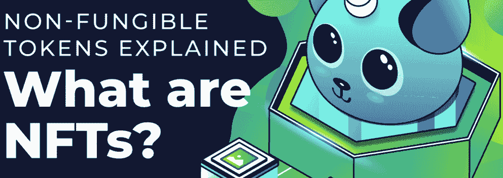
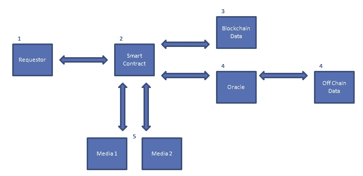
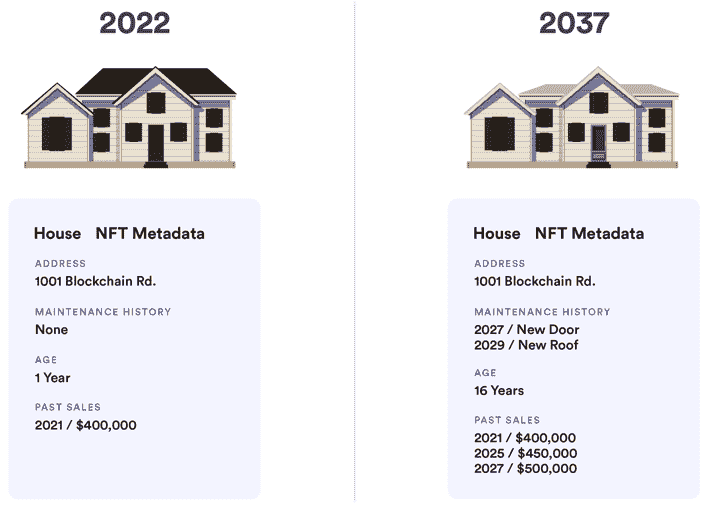

# 什么是动态 NFT？–2022 年终极指南

> 原文：<https://moralis.io/what-are-dynamic-nfts-the-ultimate-2022-guide/>

**NFTs(不可替代代币)已经迅速成为** [**Web3**](https://moralis.io/the-ultimate-guide-to-web3-what-is-web3/) **社区最显著的特征之一。随着知名公众人物推出自己的 NFT 项目和收藏，这些纪念品正在成为主流。这一点，加上这些令牌的大量用例，使它们极具吸引力。** **此外，这些令牌和底层技术也在不断改进，开启了 NFTs 发展的下一步:动态 NFTs。** **那么，什么是动态 NFT，它们是如何工作的，为什么有用？**

如果您对动态 NFT 感兴趣，请跟随我们在整篇文章中更详细地探索这些令牌。我们将从一个动态的 NFT 实际需要什么开始。接下来，我们将深入研究动态 NFT 是如何工作的。另外，我们将把它们与更熟悉的静态 NFT 概念进行比较。此外，我们将探索动态 NFT 的一些潜在用例，因为这进一步说明了它们为什么有用。最后，我们将仔细看看如何使用最终的 Web3 后端平台 [Moralis](https://moralis.io/) 创建你的 NFT。

这个操作系统提供了一些最好的 Web3 开发工具。其中包括 [Moralis Speedy Nodes](https://moralis.io/speedy-nodes/) 、 [Moralis 的元宇宙 SDK](https://moralis.io/metaverse/) 、 [Price API](https://moralis.io/introducing-the-moralis-price-api/) 等等。这些工具与系统的底层后端基础设施相结合，确保用户获得市场上最好的开发人员体验！因此，如果你还没有注册，现在就注册吧！免费创建你的 Moralis 账户，然后[在创纪录的时间内成为区块链开发者](https://moralis.io/how-to-become-a-blockchain-developer/)！现在，事不宜迟，让我们从回答问题“什么是动态 NFT”开始我们的旅程。

## 什么是动态 NFT？

来回答“什么是动态非功能表？”问题，一个好的起点是分析术语并清楚地定义短语的各个部分。因此，让我们剖析一下这个概念，从简单解释一下 NFTs 开始。

“NFTs”是“不可替换令牌”的缩写，它们本质上是存在于区块链上的完全唯一的数字资产。每个 NFT 都是独一无二的，因为它们有唯一的合同地址和令牌 ID。此外，它可以附加图像，文件，数据，链接等。，到令牌的元数据。因此，NFT 可以表示独特的对象，包括数字对象和物理对象。此外，一旦生成了 NFT，令牌 ID 和元数据就是永久的，因此这些令牌是静态的。但是，在继续之前，如果您想了解关于不可替换令牌的更多详细信息，请务必查看我们在 Moralis 博客上的文章，该文章提供了对 [NFTs](https://moralis.io/non-fungible-tokens-explained-what-are-nfts/) 的更深入的解释。

对传统的非功能性测试有了更好的理解后，我们可以更仔细地看看术语“动态”在这个上下文中是什么意思。在许多情况下，为 NFTs 提供对外部条件做出反应的能力是有益的。为什么？因为这可能会触发对令牌元数据的修改，而这正是“动态”在这种情况下所指的。

以一款基于进程的游戏为例，其中 NFT 代表游戏内的头像。化身可能有不同的技能，比如力量、速度、敏捷等。，在令牌的元数据中指定。随着玩家在游戏中的进步，我们需要更新元素，以便令牌反映玩家的努力。这实质上意味着动态 NFT 保留了唯一的标识符，但是提供了根据外部条件改变和更新其元数据方面的可能性。既然我们已经回答了“什么是动态 NFT？”问题，让我们来探索动态不可替换令牌是如何工作的。

## 动态 NFT 是如何工作的？

动态 NFTs 可以使用链外和链内计算来发展，使这成为可能的技术是智能契约。每当请求 NFT(不可替代的令牌)时，智能合约都会评估链外和链内数据，以确定呈现给用户的响应。为了使这一点更容易理解，下面是该过程的一个示例:

1.  首先向 NFT 的智能合同发起请求。
2.  智能合约接收请求进行处理。
3.  智能合约调用链上数据并处理结果。
4.  该契约使用 oracle 调用链外数据并处理结果。
5.  离线和在线数据都被评估。然后，智能合约将媒体一或媒体二返回给请求者。

本质上，这意味着智能合约允许 NFT 在一段时间内进行更改、更新和扩展。因此，智能合约确定不可替换令牌是否应该改变，如果应该改变，则基于链外和链内数据改变动态 NFT 的元数据。

既然您已经对以上内容有了坚实的理解，并且能够回答“什么是动态 NFT？”自信地提问，您可能想要创建动态 NFT。如果是这样，我们建议阅读我们关于 [Web3 合同](https://moralis.io/what-are-web3-contracts-exploring-smart-contracts/)的文章。那篇文章涵盖了智能合约的基本部分，并且深入解释了这些 Web3 合约需要什么。

你还可以在 Moralis 学习如何创建智能合同，了解智能合同开发的复杂性。此外，你可以发现所需的必要技能。例如，智能合同通常是使用 [Solidity](https://moralis.io/solidity-explained-what-is-solidity/) 编程语言编写的。因此，如果你想成为一名熟练的智能合同开发人员，这是一项你应该学习的技能。

### 动态与静态非功能性测试

来回答“什么是动态非功能表？”问题，我们还必须考虑“静态”的 NFT。因此，我们来比较一下这两者。今天，大多数用户很可能熟悉静态 NFT。静态 NFT 是区块链上记录的具有永久不变特征的令牌。静态 NFT 的例子可以是图像、视频、音乐、游戏中的项目等。在许多情况下，比如数字艺术或数字收藏品，静态 NFT 非常有意义。事实上，甚至可能是静态 NFT 的不变性使它们变得有价值。

然而，NFT(不可替换令牌)发展的下一步是动态 NFT，它们在区块链空间的未来可能会非常有用。这些类型的令牌将可验证的、独一无二的静态 NFT 与动态数据输入相结合。此外，动态 NFT 可以从链外和链内数据源获取输入，以改变令牌的元数据。因此，静态和动态 NFT 的主要区别在于令牌的元数据的更改能力。

因此，有可能找到静态和动态 NFT 的用例，并且一个可能不会取代另一个，这意味着在加密领域中静态和动态 NFT 都有空间。然而，将动态 NFT 引入区块链生态系统提供了进一步的灵活性，并为这些令牌添加了更多潜在的用例。

在下一节中，我们将了解更多关于动态 NFT 的一些用例，这将有望使动态和静态 NFT 之间的区别更加透明！

### 动态 NFT 用例

在本文的前面，我们提到了游戏中的角色是动态非功能性游戏的一个潜在用例。然而，这只是一个例子。因此，我们发现在本节中提供两个额外的用例来说明动态 NFTs 的好处是合适的。因此，您将能够解释“什么是动态 NFT？”更有逻辑地提问。这两个用例是:

1.  NFT 运动卡
2.  房地产

#### NFT 运动卡

第一个例子是运动卡，在这种情况下，我们将以足球运动员为例。假设我们有一个动态的 NFT 代表一个真实世界的足球运动员。NFT 可以具有诸如速度、敏捷性、力量、得分、助攻等信息。，存储在令牌的元数据中。

然而，随着赛季的继续，这些统计数据会发生变化，例如，球员可能会进几个球。这意味着动态 NFT 可以选择获取关于玩家进度的链外数据，并相应地更新元数据。这对于静态 NFT 是不可能的，因为一旦有人首先创建了令牌，元数据将是永久的。

#### 房地产

第二个例子是房地产，在这个例子中，我们将使用一所房子。现在，假设我们有一个动态 NFT 代表一所房子。在标记真实世界资产的情况下，拥有改变度量的能力是有益的，这是经常需要的。

在这个例子中，我们希望 NFT 的元数据(不可替换的令牌)反映可能对资产发生的特定变化，这是未来买家潜在感兴趣的。因此，举例来说，元数据应该呈现维护历史、年龄、市场价值、过去的销售等。因此，在对真实世界的资产(如财产)进行令牌化时，能够更新和更改令牌的元数据显然是有益的。

### 创造你自己的 NFT

现在，您对动态 NFT 已经比较熟悉了，可以回答“什么是动态 NFT？”问题，并了解如何使用它们，您可能会对创建自己的令牌感兴趣。如果是那样的话，你肯定是到对地方了。你想要创造什么样的 NFT 并不重要；Moralis 是最好的平台，非常容易用于任何类型的 NFT 开发。

借助 Moralis 的后端基础设施和市场上一些最好的开发工具，您可以在几分钟内创建各种有趣的 NFT。一个对 NFT 发展有重大帮助的工具是 [Moralis 的 NFT API](https://moralis.io/ultimate-nft-api-exploring-moralis-nft-api/) 。事实上，当利用 Moralis，你将能够[创造自己的 NFT](https://moralis.io/how-to-create-your-own-nft-in-5-steps/) 在五个简单的步骤！

你不仅能够创建单个 NFT，而且 Moralis 为你提供了所有必要的工具来创建你自己的 NFT 集合，类似于 [Bored Ape 游艇俱乐部](https://opensea.io/collection/boredapeyachtclub)和[crypto 朋克](https://opensea.io/collection/cryptopunks)。您可能已经知道，这些是由数千个完全唯一的 NFT 组成的令牌集合。如果这听起来很有趣，看看我们关于[如何创造 10，000 个 NFT](https://moralis.io/how-to-mint-10000-nfts-full-walkthrough/)的文章。因此，您将能够在短时间内创建自己的 NFT 集合。

更重要的是，Moralis 使开发你自己的 NFT 市场成为可能，也使 T2 建立 NFT 交易界面成为可能。因此，该平台为您提供了所有必要的工具，以便您可以开始 NFT 开发！

如果你对其他类型的代币感兴趣，你可以在 Moralis 博客上了解更多关于 [ERC-20](https://moralis.io/erc20-exploring-the-erc-20-token-standard/) 和 [ERC-1155](https://moralis.io/erc1155-exploring-the-erc-1155-token-standard/) 代币的信息。此外，看看我们的指南[如何在十分钟内创建自己的 ERC-20 代币](https://moralis.io/how-to-create-your-own-erc-20-token-in-10-minutes/)！

## 什么是动态非功能性测试–摘要

非功能性交易很快成为区块链产业最显著的特征之一。对非功能性测试越来越多的关注部分源于大量的 [NFT 用例](https://moralis.io/nft-utility-exploring-nft-use-cases-in-2022/)。然而，大多数人熟悉的 NFT 是静态 NFT；同时，Web3 领域的最新创新之一是动态 NFTs。那么，什么是动态 NFT 呢？

简而言之，我们可以得出结论，动态 NFT 与静态 NFT 在某些方面是相同的。然而，本例中的“动态”一词指的是令牌基于链外和链内数据更新其元数据参数的能力。这不同于静态 NFT，静态 NFT 一旦被铸造出来就完全不可改变。

动态 NFT 更新元数据的能力在某些情况下非常有吸引力。文章中提到的一个明显的例子是房地产。如果一个动态 NFT 代表一栋房子，那么就可以用维护历史和过去的销售额来更新元数据。

然而，房地产示例只是动态 NFTs 的众多用例之一。因此，这表明动态 NFT 的潜力几乎是无限的，他们有能力扩展 NFT 设计空间，并将这些令牌带到下一个级别。

我们希望你能找到这份 2022 年终极指南，它回答了“什么是动态 NFT？”问题有用。现在，如果你想从总体上了解更多关于 NFTs 和密码行业的知识，请随意浏览 [Moralis 博客](https://moralis.io/blog/)。在这里，你可以找到区块链发展的几个方面的相关信息。例如，您可以了解更多关于[元宇宙](https://moralis.io/what-is-the-metaverse-full-guide/)、[为什么 Web3 很重要](https://moralis.io/what-is-the-metaverse-full-guide/)、区块链开发的[最佳语言](https://moralis.io/what-is-the-metaverse-full-guide/)等等！

因此，如果你[注册了 Moralis](https://admin.moralis.io/register) ，你马上就能成为一名区块链开发者！