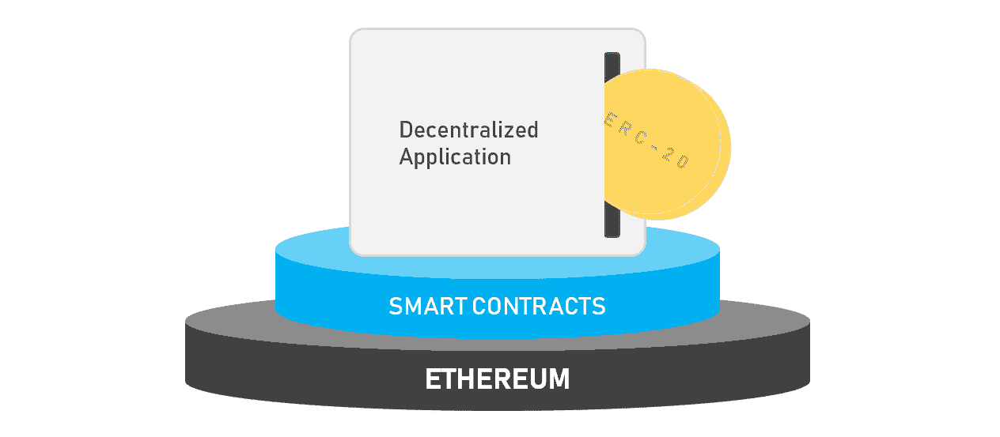
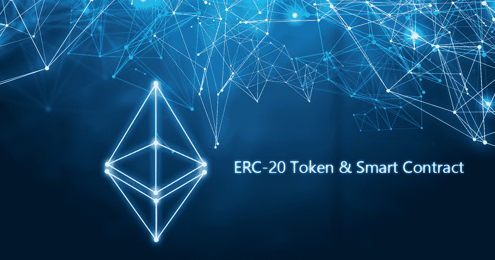
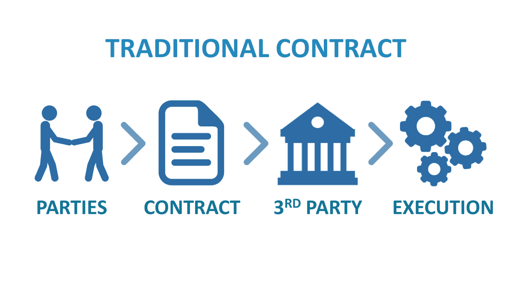
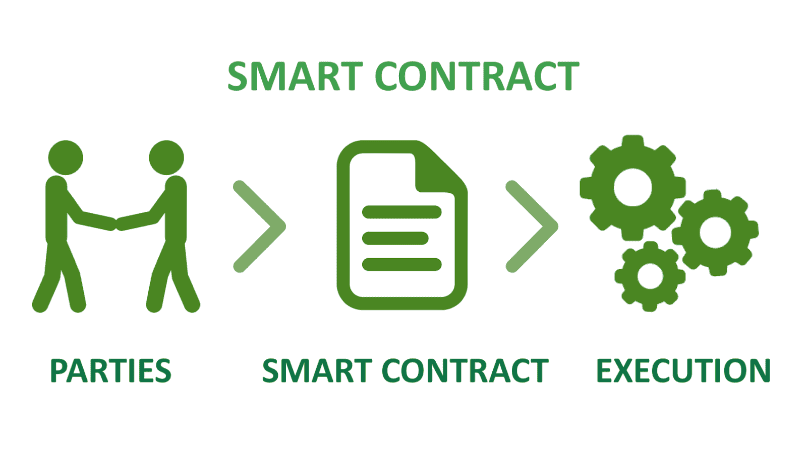
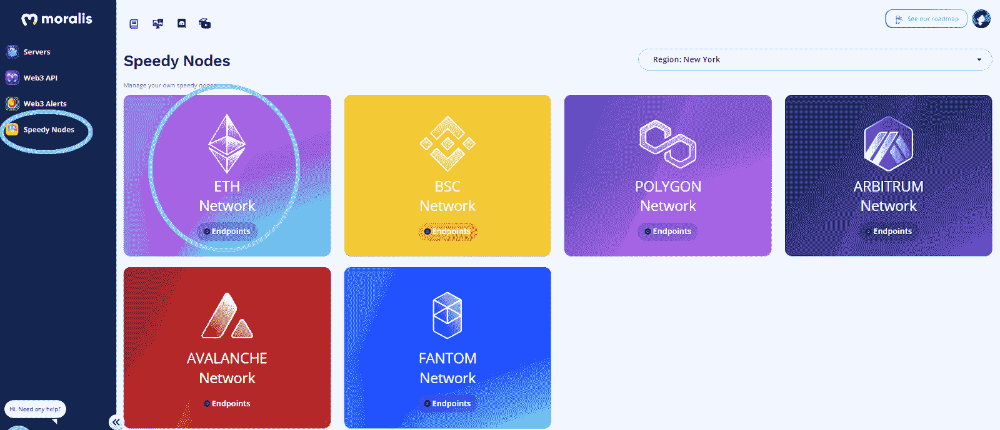
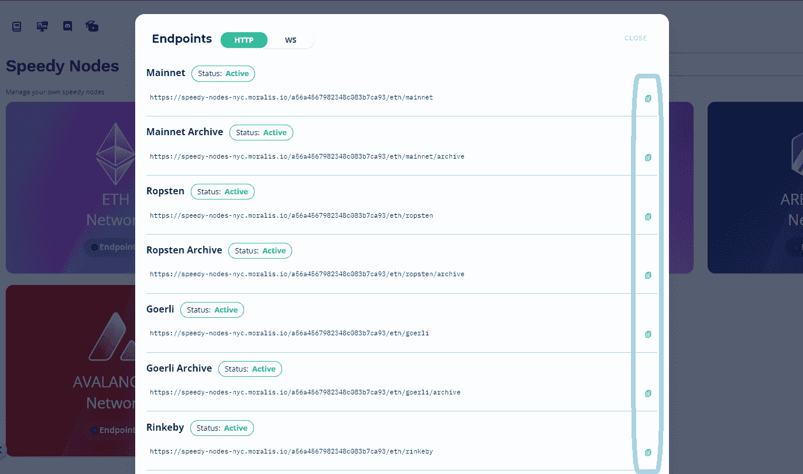
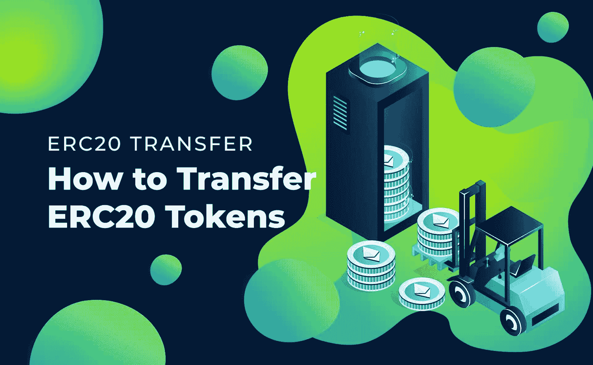

# 什么是 ERC20 合约？–完整的 ERC20 合同指南

> 原文：<https://moralis.io/what-are-erc20-contracts-full-erc20-contract-guide/>

到现在为止，大多数人都听说过区块链，比如以太坊。比特币是第一个区块链，以太坊链是第一个可编程的区块链。此外，凭借其先发优势和强大的社区，以太坊仍然是部署 dapp([](https://moralis.io/decentralized-applications-explained-what-are-dapps/)****)的最受欢迎的途径。另外，以太坊的区块链还支持最大数量的加密令牌。包括一些声誉极佳的加密货币，如 LINK、ZRX、MKR 和 BAT，它们都基于 ERC20 合约。不确定什么是 ERC20 合约？不要担心；到本文结束时，您将对什么是 ERC20 合同有一个坚实的理解。****

**接下来，我们首先要确保你们都知道什么是 ERC20 智能合约。我们还将从总体上解释智能合约，包括它们允许的内容。然后，我们将向您展示如何创建 [*ERC20*](https://moralis.io/erc20-exploring-the-erc-20-token-standard/) 令牌，以加深您的理解。通过概述 ERC20 契约的使用，您还将看到 [Moralis](https://moralis.io/) (又名 [Firebase for crypto](https://moralis.io/firebase-for-crypto-the-best-blockchain-firebase-alternative/) )的实际应用。您将学习如何使用这个终极的 [Web3](https://moralis.io/the-ultimate-guide-to-web3-what-is-web3/) 开发工具来帮助加速各种区块链开发任务。本质上，Moralis 为前端开发者提供了使用 [JavaScript](https://moralis.io/javascript-explained-what-is-javascript/) 和[元掩码](https://moralis.io/metamask-explained-what-is-metamask/)创建非凡的 dApps 的能力。当然，除了前端开发人员，许多后端程序员也在跳上这辆“面向未来的列车”。所以，如果你真的想成为一名区块链开发者，请确保今天就创建你的免费 Moralis 账户。**

**

## 什么是 ERC20 合同？

尽管区块链技术自 2009 年就已经出现，但它仍然没有被主流采用。但是，我们正在慢慢地到达那里；记住，“慢则顺，顺则快”。此外，通过确保尽可能多的人清楚地理解重要的基本概念，我们将更快地达到目标。因此，让我们首先通知您，加密领域中的“合同”指的是“智能合同”。这些基本上是运行在可编程区块链上的计算机程序或交易协议。我们将在下面的“智能合同解释”一节中详细介绍智能合同。记住这一点，让我们看看什么是 ERC20 合约，好吗？



## 什么是 ERC20 智能合约？

“以太坊 20 号意见征询”或 ERC20 于 2015 年实施，同年以太坊连锁店问世。就这样，ERC20 标准诞生了。此外，请注意，所有 ERC20 智能合约或 ERC20 合约都是遵循 ERC20 标准的智能合约。因此，真正的问题是:什么是 ERC20 标准？

ERC20 标准是确保以太坊区块链正常运行的众多脚本标准之一。*另外两个流行的标准，都与* [*NFTs*](https://moralis.io/non-fungible-tokens-explained-what-are-nfts/) *有关，分别是*[*ERC-721*](https://moralis.io/erc-721-token-standard-how-to-transfer-erc721-tokens/)*和*[*ERC-1155*](https://moralis.io/erc1155-exploring-the-erc-1155-token-standard/)*。此外，ERC20 规定了一组特定的规则、动作和步骤来实现以太坊上的可替换令牌。因此，将以太坊上创建的可替换令牌称为“ERC20 令牌”是有意义的。此外，由于令牌是使用智能合约创建(铸造)的，因此 ERC20 智能合约实现了 ERC20 标准。简单地说，ERC20 是一组必需的(和一些可选的)指南和功能。以太坊链条上的每一份 ERC20 合约都必须遵循这些准则和功能。*

以下是 ERC20 合同需要遵守的规则:

*   **合同地址**(必选)。
*   **代币总供应量**(必不可少)。
*   **令牌名称**(可选)。
*   **令牌符号**(ticker【可选】)。
*   **令牌的小数位数**(可选)。

以下是 ERC20 合同提供的最常见功能:

*   **在不同账户之间转移代币。**
*   **获取特定账户的当前代币余额。**
*   **获取网络上可用令牌的总供应量。**
*   **批准第三方账户是否可以从特定账户消费若干代币。**

### 智能合同解释

不确定什么是智能合约？不用担心；我们掩护你。你很可能知道大多数正规合同是如何运作的，对吗？通常，双方同意某些条件和行为，双方都必须遵守这些条件和行为，合同才有效。然而，没有几个中间商的参与，常规合同就没有立竿见影的安全性。然而，当我们谈论智能合同时，一切都是自动化的。所以不需要中间商。因此，这就是智能合约赢得“智能”称号的地方。



此外，看待智能合约的最简单方式是将它们视为运行在区块链上的计算机程序。这些程序确保一旦满足了预定的条件，就执行预定的动作。此外，这些行动也遵循明确规定的规则或准则。正如你所想象的，Solidity smart contracts 有无数的用例，在这些用例中，这种不可思议的创造可以用来确保默认情况下的公平。您可以使用 ERC20 合约来创建 ERC20 令牌，这只是以太坊上智能合约的一个特殊用例。*您可以从我们过去的文章中了解更多关于* [*智能合约*](https://moralis.io/smart-contracts-explained-what-are-smart-contracts/) *和* [*如何创建智能合约*](https://moralis.io/how-to-create-smart-contracts/) *。*



此外，让我们告诉你，与区块链开发人员的普遍看法相反，创建和使用智能合同并不困难。当然，前提是使用正确的工具。对于初学者来说，如果你从在 [OpenZeppelin](https://moralis.io/what-is-openzeppelin-the-ultimate-guide/) 可获得的经过验证的开源智能合同模板开始，那就完全不同了。此外，您可以使用 [Remix](https://moralis.io/remix-explained-what-is-remix/) 轻松部署智能合约。然而，真正的魔力(对于 dApp 开发)在于使用 Moralis 来[同步和索引智能合约事件](https://moralis.io/sync-and-index-smart-contract-events-full-guide/)。这一特性使得 Moralis 成为智能合同索引的图形替代方案。

## 创建 ERC20 令牌

如果您已经学习了上述章节，那么您现在应该对什么是 ERC20 智能合约有一个非常清晰的理解。这样，你就可以学习如何制作 ERC-20 代币了。幸运的是，这比大多数人想象的要简单得多。事实上，在 Moralis 家的帮助下，你可以在十分钟左右完成这项工作。我们将在下面介绍创建 ERC-20 令牌的主要步骤。但是，要获得更详细的指导，请使用下面的视频。不过，让我们先指导您完成初始设置。

### 初始设置

在创建 ERC20 令牌之前，您需要完成某些设置步骤。这些包括初始 Moralis 设置、获取 Moralis 快速节点、设置元掩码和获取 ETH(游戏或真实 ETH)。

#### 初始 Moralis 设置

为了将 Moralis 用于您的区块链开发工作，包括创建 ERC20 令牌，请遵循以下子步骤:

1.  [**创建你的自由 Moralis 账户**](https://admin.moralis.io/register)——如果你还没有创建你的自由 Moralis 账户，现在就创建吧。在下一页，输入您的电子邮件地址，创建您的密码，然后单击确认链接(发送到您的电子邮件收件箱)。然而，如果你已经有了一个 Moralis 账户，只需[登录](https://admin.moralis.io/login)。

*注意* *:为了创建 ERC20 令牌，您不需要完成下面的子步骤 2–4。然而，当您决定使用 Moralis 进行 dApp 开发时，它们会派上用场。*

2.  [***创建 Moralis 服务器***](https://docs.moralis.io/moralis-server/getting-started/create-a-moralis-server)*–登录 Moralis 管理区后，导航至“服务器”选项卡。在那里，单击右上角的“+创建新服务器”按钮。然后，选择最适合您需求的网络类型(见下图)。当开发或处理示例项目时，选择“Testnet Server”选项是有意义的。然而，要部署功能性 dApps，您需要选择“Mainnet 服务器”。*


*接下来，输入您的服务器名称(这可以是您想要的任何名称)，选择您的区域、网络类型、链，并通过点击“添加实例”按钮启动您的服务器:*


3.  ***访问服务器详细信息****–为了访问 Moralis 的完整后端功能，您需要获取您的服务器详细信息。这些详细信息可通过“查看详细信息”按钮获得:*


*所有相关细节将显示在一个新窗口中，您可以通过点击复制图标(一个接一个)简单地复制它们:*


4.  ***初始化 Moralis****——通过使用上述细节，填充你的编码文件(".html“，“. js”，”。jsx”，或者”。env "如果使用终极* [*以太坊 dApp 样板*](https://moralis.io/ethereum-dapp-boilerplate-full-ethereum-react-boilerplate-tutorial/) *):*


#### 获取 Moralis 的快速节点

创建 ERC20 令牌时，您需要一个功能完整的[节点](https://moralis.io/node-js-explained-what-is-node-js/)。除非你想通过自己运行一个来面对 RPC 节点的[限制，否则 Moralis 提供了一个很好的捷径。](https://moralis.io/exploring-the-limitations-of-rpc-nodes-and-the-solution-to-them/)[创建账户后，Moralis Speedy Nodes](https://moralis.io/speedy-nodes/) 任你使用。因此，您可以在 [Infura 备选方案](https://moralis.io/infura-for-avalanche-exploring-infura-avalanche-alternatives/)中利用这一首选。

在您的 Moralis 管理区内，选择左侧菜单栏中的“Speedy Nodes”选项卡:



由于您正在创建 ERC20 令牌，您需要通过单击“ETH Network”下的“Endpoints”按钮来选择以太网。这将允许你访问主网上的节点和所有的[以太坊测试网](https://moralis.io/ethereum-testnet-guide-connect-to-ethereum-testnets/):



您在上图中看到的每个网络的 URL 是节点。通过点击您决定使用的网络旁边的“复制”图标，您可以复制相关的地址。尽管如此，当你设置 Moralis 快速节点时，你将使用这个与 [*布朗尼*](https://moralis.io/eth-brownie-explained-what-is-brownie/) *。*

#### MetaMask Setup

如果您还没有元掩码帐户，请确保在继续之前设置好它。如果您需要帮助，请使用我们的[开发人员元掩码](https://moralis.io/metamask-for-developers-how-to-launch-web3-apps-with-metamask/)指南中提供的详细信息。此外，如果您不熟悉这个优秀的工具，我们建议您了解更多关于[使用元掩码](https://moralis.io/building-dapps-with-metamask/)构建 dApps 以及如何使用元掩码对[进行认证的信息。](https://moralis.io/how-to-authenticate-with-metamask/)


#### 收购 ETH

当在以太坊上工作时，特别是当你想铸造令牌时，你需要网络的本地令牌(ETH)。后者需要支付汽油费来完成铸币交易。最好有足够的 ETH 来执行几个测试事务。如果你使用任何以太坊测试网，你可以从 ETH“水龙头”免费获得。然而，如果你想在以太坊主网上部署 ERC20 令牌，你需要真正的以太网。要获得后者，你必须在任何知名的集中交易所(CEXs)或通过任何其他[菲亚特网关](https://moralis.io/what-is-a-fiat-gateway/)购买一些。

### 创建 ERC20 令牌的步骤

完成初始设置后，是时候把你交给 Moralis 的专家了。他将指导您通过使用 ERC20 合同来创建 ERC20 令牌所需的步骤。以下是他将指导您完成的步骤:

1.  建立一个 Moralis 快速节点。
2.  添加一个 pragma 行，同时导入适当的 OpenZeppelin 包。
3.  创建以太坊令牌合同。
4.  测试合同。

此外，在视频的最后，您还将学习如何向元掩码添加 ERC20 令牌。

https://www.youtube.com/watch?v=KNBneUpFaGo

### ERC20 传输

背后有真实用例的优质加密货币非常棒，尤其是考虑到转移它们是多么容易。此外，如果您已经按照上面的视频创建了自己的 ERC20 令牌，您可能希望将它们转移到其他帐户。如果是这样的话，我们会保护你的。在我们的 [ERC20 转账](https://moralis.io/erc20-transfer-how-to-transfer-erc20-tokens/)指南中，您将了解到有多种方式来转账这些类型的代币。首先，你可以一直使用 CEXs 但是，如果你想用去中心化的方式，MetaMask 是你最好的选择。



此外，通过点击上面的链接，您还将了解到在使用 Moralis 时，将各种令牌转移功能集成到您的 dApps 中是多么容易。例如，如果您要发送 18 位小数的 0.5 个令牌，您只需复制这几行代码并添加相关令牌的详细信息:

```js
const options = {type: "erc20", 
                 amount: Moralis.Units.Token("0.5", "18"), 
                 receiver: "0x..",
                 contractAddress: "0x.."}
let result = await Moralis.transfer(options)
```

## 什么是 ERC20 合同？–完整指南–摘要

此时，回答“什么是 ERC20 合同？”应该没有问题一瞬间。您知道，ERC20 合约是一个遵循 ERC20 协议细节的智能合约。此外，您知道它们用于在以太坊上铸造代币，并确保这些代币被正确转移。因此，以太坊上的代币被称为 ERC20 代币对你来说是完全有意义的。此外，您还学习了如何创建自己的 ERC20 令牌。尽管如此，您已经发现 Moralis 可用于快速轻松地将 ERC20 传输功能集成到您的 dApps 中。

如果你想利用免费资源拓展你在区块链的发展视野，我们建议你访问[Moralis 的 YouTube 频道](https://www.youtube.com/c/MoralisWeb3)和[Moralis 的博客](https://moralis.io/blog/)。这两个渠道都定期生产高价值的内容。我们的一些最新文章向您展示了如何[将 mint 功能集成到 JS 接口](https://moralis.io/integrate-mint-function-to-js-interface-nft-development/)，如何[索引区块链](https://moralis.io/how-to-index-the-blockchain-the-ultimate-guide/)，如何[开发 NFT 稀有度排名 dApp](https://moralis.io/how-to-develop-an-nft-rarity-ranking-dapp/) ，如何[连接雪崩节点](https://moralis.io/how-to-connect-to-avalanche-nodes/)，如何[连接仲裁节点](https://moralis.io/full-guide-how-to-connect-to-arbitrum-nodes/)，如何[构建 NFT 交易接口](https://moralis.io/build-an-nft-trading-interface-full-guide/)，如何构建[以太坊 dApp in Angular](https://moralis.io/how-to-build-ethereum-dapps-in-angular/)，如何 [flash](https://moralis.io/how-do-flash-loans-work-full-walkthrough/)

然而，如果你有兴趣采取一种更专业的方法，一种能让你尽快成为全职加密员的方法，那么一定要报名参加[Moralis 学院](https://academy.moralis.io/)。你不仅能接触到高质量的课程，还能为你提供详细的成功之路。最重要的是，它将让你接触到导师和一个先进的加密社区。

**