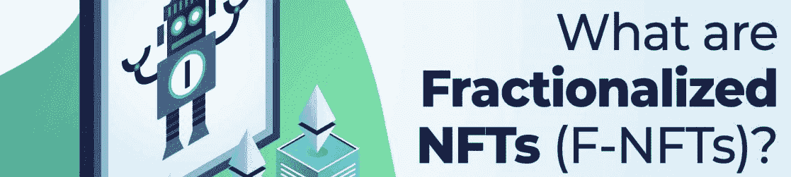
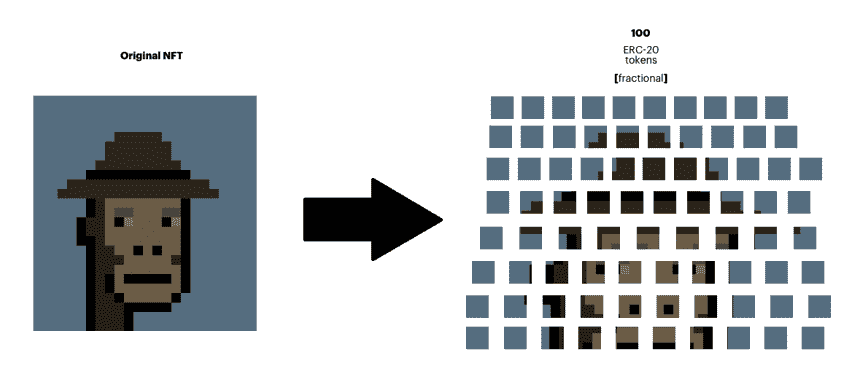
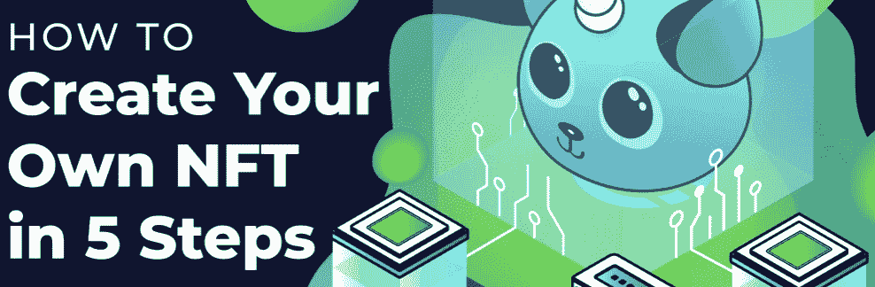

# 什么是分数 NFT？–2022 F-NFT 终极指南

> 原文：<https://moralis.io/what-are-fractional-nfts-the-ultimate-2022-f-nft-guide/>

NFT(不可替代代币)开创了以透明和去中心化为特征的资产所有权的下一个阶段。此外，NFT 在过去几年里变得非常受欢迎，代币的售价也是天文数字。此外，传统[**NFT**](https://moralis.io/non-fungible-tokens-explained-what-are-nfts/)**的两个定义属性是它们的唯一性和无法复制/伪造这些数字资产。然而，这些代币的独一无二性多少限制了 NFT 持有者的可能性。这导致了 NFT 领域的创新，并产生了两个令人兴奋的概念:** [**动态 NFTs**](https://moralis.io/what-are-dynamic-nfts-the-ultimate-2022-guide/) **和 F-NFTs。在本文中，我们将关注后者，并回答这个问题，“什么是分数 NFT？”。**

对分数 NFT 最简单的解释是，它们是不可替换的令牌，已经被分成片段。但是，如果您想了解更多关于 F-NFT 的知识，请继续学习，因为我们将更深入地探究分数 NFT 的复杂性。在这里，我们将解释令牌，它们是如何工作的，以及它们的好处。此外，如果您想了解更多关于创建您自己的令牌的信息，我们将简要探索使用 [Moralis](https://moralis.io/) 操作系统创建 NFT 的过程。

如果你正在寻找开发 [dapps](https://moralis.io/decentralized-applications-explained-what-are-dapps/) ，tokens，或者任何其他 [Web3](https://moralis.io/the-ultimate-guide-to-web3-what-is-web3/) 项目，你绝对应该去看看 Moralis。Moralis 是首要的 Web3 开发平台，使用像 [Moralis Speedy Nodes](https://moralis.io/speedy-nodes/) 和 [NFT API](https://moralis.io/ultimate-nft-api-exploring-moralis-nft-api/) 这样的工具，你将能够轻松地创建——不仅是 NFTs 而且是可替换的令牌！

因此，你有成为区块链开发者的雄心吗？如果是这样的话，今天就和 Moralis 签约吧。您可以免费创建您的帐户，并在几分钟内开始您的开发之旅！现在，事不宜迟，让我们从解决本文的主要问题开始，“什么是分数 NFT？”。

## 什么是分数 NFT？

随着对非功能性食物越来越多的关注，我们进一步看到代币价格呈指数增长。有时，代表艺术品的 NFT 可以卖到数百万美元。此外，来自著名系列的头像，如 [Bored Ape Yacht Club](https://opensea.io/collection/boredapeyachtclub) 正变得相对昂贵。需求的增加和价格的上涨使得购买非功能性食物变得极其昂贵。高昂的价格标签导致进入市场的巨大障碍，因为不是每个人都有能力购买非功能性食物。解决这个问题的一个方法是通过细分过程，这是分数 NFT 进入画面的地方。

那么，什么是分数 NFT 呢？分数 NFT 是不可替换的令牌，已经被细分为几个更小的部分，正如其名称所反映的那样。然而，这到底意味着什么呢？这实质上意味着采用一个 NFT，将不可替代的令牌分割成几个可替代的令牌，代表原始资产的一部分。

细分过程是使用智能合约完成的。契约创建了与不可分割的原始令牌互连的指定数量的可替换令牌。每一部分——或分数——都为持有者提供了一定比例的原始 NFT 的所有权。以后可以在交易所或市场上以很低的价格交易代表部分 NFT 股份的可互换代币。

总之，这基本上表明，一个分数 NFT 是一个令牌，已被分成几个部分，允许多个不同的人声称同一 NFT 的部分所有权。

既然我们已经回答了问题“什么是分数 NFT？”，让我们看看细分过程是如何工作的。

## 分数 NFT 是如何工作的？

在其最基本的状态下，NFT 是实现特定标准的令牌。两个例子是以太坊的 [ERC-721](https://moralis.io/erc-721-token-standard-how-to-transfer-erc721-tokens/) 和 BNB 链的 BEP-721 标准，这两个标准都被用来管理各种网络上的 NFT。在细分 NFT 之前，必须首先在智能合约中锁定令牌。[智能合约](https://moralis.io/smart-contracts-explained-what-are-smart-contracts/)是区块链上的程序，当有人满足预定条件时，它可以自动执行功能。

一旦智能合约中锁定了原始 NFT，并且满足了预定的规则，合约就会根据智能合约中指定的指令将令牌分割成更小的部分(由可替换的令牌表示)。NFT 的所有者指定碎片的数量，以及价格、元数据和新创建碎片的其他属性。

每一部分，或者说代币，都代表了整个 NFT 原作的部分所有权，可以在一段时间内出售，或者直到卖光为止。分数的数量可以根据原始 NFT 的所有者而变化。因此，可以将一个 NFT 分成 1000、10000 甚至 1000 万股。所有的股份或碎片都可以在二级市场上出售，这不会直接影响原 NFT 的价值。

这表明，在实践中，将一幅有价值的画令牌化是可能的，例如文森特·梵高的“*《星夜》、*”，其价值超过 1 亿美元。一旦标记化，就有可能进一步细分 NFT，将其分割成几千甚至几十万个部分。因此，普通人将能够购买艺术品的一部分，因为这将使每一部分更加实惠。

### NFTs 与 F-NFTs

此时，您应该能够回答“什么是分数 NFT？”充满自信的提问。因此，让我们比较一下 NFT 和 F-NFT。根据前面一节的解释，传统的非功能性测试和功能性测试之间的区别是显而易见的。一个 NFT 是一个整体；同时，分数 NFT 是同一整体的分数。两者之间的主要区别是它们所代表的原始 NFT 的百分比。然而，这进一步意味着 NFTs 和 F-NFTs 密切相关，因为后者是传统令牌的细分过程的结果。

一旦 NFT 被细分，就有可能逆转这个过程。因此，可以将分数 NFT 转换回原始状态。首先负责分割 NFT 的智能合约通常有一个买断选项。这允许 F-NFT 持有者购买所有分数，并最终解锁原始令牌。

买断过程通常可以通过将特定数量的代币从集合转移到智能合约来启动，这将触发回购选项。如果发生这种情况，F-NFT 持有者将被提供出售其股份的决定。如果收购通过，所有部分将自动返回智能合同，买方将获得原始 NFT 的所有权。

#### 什么是分数 NFT？–使用案例

基于以上所述，可以合理地假设分数 NFT 的几种有趣的使用方式将很快出现。因此，这将增加与传统非功能性测试相关的大量用例。如果你愿意，你可以看看 Moralis 博客，了解更多关于 T2 NFT 电力公司的信息。本指南深入探讨了如何将 NFTs 用作会员专属、音乐 NFTs 和数字艺术等。到目前为止，在我们的“什么是分数 NFT？”旅程中，我们讨论了传统 NFT 与 F-NFT，分数 NFT 如何工作，以及什么是分数 NFT。因此，现在让我们来探讨分数 NFT 带来了什么好处！

### F-NFT 的优势

本节将介绍分数 NFT 的三个最重要的优势。首先，我们将解释 F-NFT 如何向更广泛的投资者开放市场。接下来，我们还将讨论分数 NFT 如何使所有者受益并解决流动性问题。最后，我们将进一步研究 F-NFT 如何有助于价格发现。尽管如此，让我们开始并仔细看看 F-NFT 如何使 NFT 空间民主化。

#### 民主化

在上一节中，我们简要地提到了 F-NFT 为 NFT 空间提供了更多的可访问性。为了进一步阐述这一点，分数 NFT 有助于 NFT 空间的民主化，因为它为小投资者参与市场提供了一个通道。

受欢迎程度的提高推高了 NFT 的价格，使人们很难进入这个空间。然而，可以通过细分来打破这些高门槛。这表明，分数 NFT 为更广泛的人群打开了市场，并提供了进一步进入区块链行业的机会。

#### 流动性增加

可访问性的问题不仅影响到 NFT 的潜在购买者，也影响到昂贵代币的所有者。由于可及性问题限制了市场，它减少了潜在买家的数量和流动性。这进一步表明，不可替代的代币越贵，出售该资产就越困难。然而，通过分割 NFT，几个较小的投资者可以立即购买 NFT 的一部分。因此，细分扩大了市场，是解决流动性问题的一种方式。

#### 价格发现

由于相当昂贵的代币市场相对较小，人们通常较少交易较昂贵的非功能性货币。由于数据不足，缺乏交易使得很难确定 NFT 的确切市场价值。因此，通过细分令牌，它变得更便宜。因此，它允许更多的人交易和竞拍细分资产，从而更容易找到 NFT 的实际价值。

### 用 Moralis 创建 NFT

对 F-NFT 有了更好的理解，你就能回答“什么是分数 NFT？”问题，我们将在本节介绍使用 Moralis 创建 NFT 的基本步骤。我们将提供一个过程的概要，让您了解使用 Moralis 进行区块链开发是多么容易。因此，可以将流程分为以下五个步骤:

1.  初始化 Moralis 并找到一个聪明的契约
2.  创建一个 HTML 索引文件
3.  制作一个简单的登录功能
4.  创建上传功能
5.  建立一个新的功能

遵循这五个步骤将会产生一个 NFT 造币 dapp，用户只需点击几下就可以连续地铸造 NFT。然而，如果你想要一个更详细的指南来解释整个过程，请查看我们关于如何在五个步骤中创建你自己的 NFT 的指南！

此外，如果你对 NFT 开发有额外的兴趣，你也可以学习创建自己的 NFT 集合，类似于[crypto punk](https://opensea.io/collection/cryptopunks)的集合。所以，如果你想进入 NFT 收藏品市场，请随意仔细看看下面的指南:“[如何铸造 10，000 NFT](https://moralis.io/how-to-mint-10000-nfts-full-walkthrough/)”。此外，你可以进一步学习如何[建立一个 NFT 交易界面](https://moralis.io/build-an-nft-trading-interface-full-guide/)和[利用该平台开发自己的 NFT 市场](https://moralis.io/develop-your-own-nft-marketplace-step-by-step-guide/)。因此，这说明了 Moralis 使进入 NFT 发展的几个方面成为可能。

最后，Moralis 并没有限制你开发 NFT，而是允许你轻松地创建可替换的令牌。例如，你可以学习[如何创建自己的 ERC-20 令牌](https://moralis.io/how-to-create-your-own-erc-20-token-in-10-minutes/)或[如何创建 BSC 令牌](https://moralis.io/how-to-create-a-bsc-token-in-5-steps/)。

Moralis 的可能性是无限的，它为您提供了开发 token 和 dapp 所需的一切！

## 什么是分数 NFT？–总结

NFT 已经迅速成为密码行业最显著的特征之一。因此，开发人员正把他们的注意力转向非功能性测试，我们已经在这个领域看到了新的、创造性的创新。两个例子是动态 NFT 和分数 NFT。在这篇“什么是分数 NFT？”文章中，我们集中讨论了分数 NFT，并试图回答这个问题，“什么是 F-NFT？”。

分数 NFT 是使用智能合约划分为更小分数的 NFT。我们可以把这个过程称为“细分化”。此外，它为 NFT 领域提供了更多的可及性，因为它使不止一个人拥有 NFT 的股份成为可能。

分数 NFT 提供了大量的好处，如民主化、增加流动性和价格发现。因此，它们有可能对整个市场的几个方面产生积极影响。例如，F-NFT 使小投资者有可能购买更受欢迎的 NFT；同时，它也为潜在的卖家提供了更大的市场。

此外，我们还简要介绍了使用 Moralis——最终的 Web3 后端平台——创建您自己的 NFT 的过程。然而，我们所看到的远不是 Moralis 的局限性。事实上，该平台使所有区块链发展项目更容易获得。此外，系统的工具和底层基础设施允许您在几分钟内[构建 dapps](https://moralis.io/how-to-build-decentralized-apps-dapps-quickly-and-easily/) ！

您还可以浏览 Moralis，找到可以让您更加精通区块链开发的相关内容。例如，你可以了解更多关于区块链发展的最佳语言和 T2 元宇宙的信息。此外，您还可以探索 [Web3 钱包](https://moralis.io/what-is-a-web3-wallet-web3-wallets-explained/)，了解 [Moralis 的 web3uikit](https://moralis.io/web3ui-kit-the-ultimate-web3-user-interface-kit/) 如何让区块链的发展变得轻而易举！

所以，如果你想成为一名区块链开发者，那么今天就和 Moralis 家签约，开始你的 Web3 之旅吧！