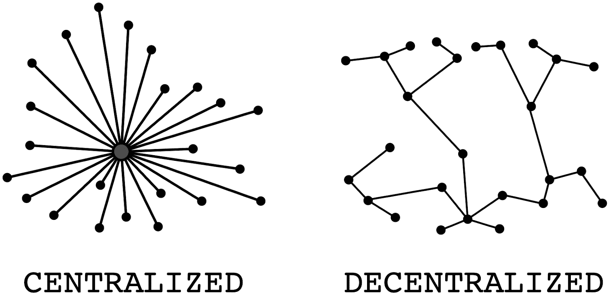
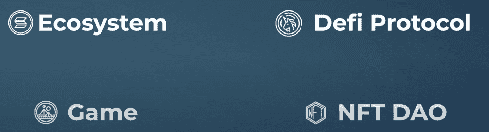
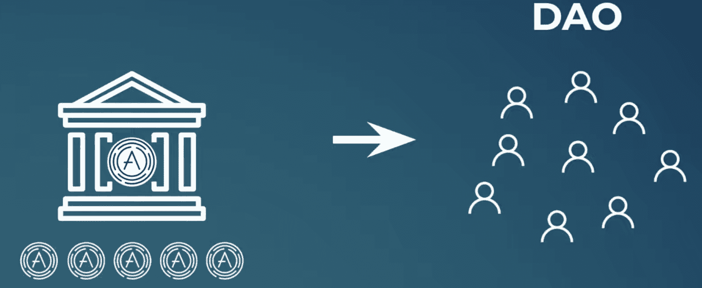
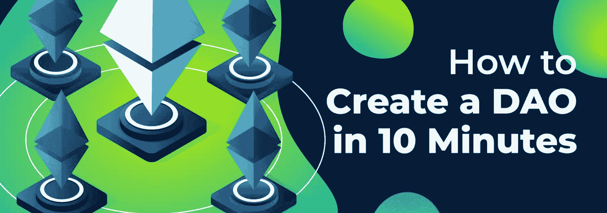
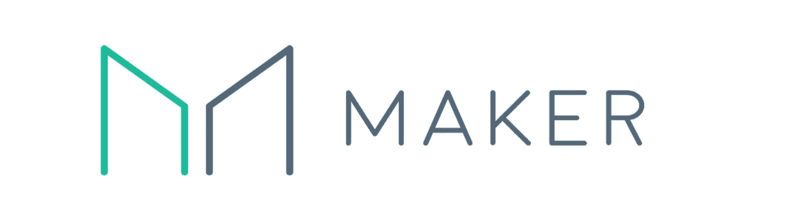
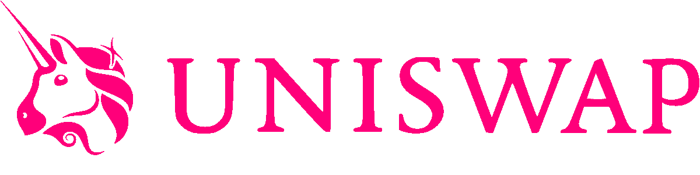

# 什么是治理令牌？–完整指南

> 原文：<https://moralis.io/what-are-governance-tokens-full-guide/>

代币是 Web3 和加密货币行业的核心。代币一般有两种:可替代代币和不可替代代币，后者又称为****。这些令牌又可以服务于不同的目的。其他替代令牌类型包括平台、安全、实用工具和治理令牌等。治理令牌在互联网的去中心化过程中起着至关重要的作用，这是** [**Web3**](https://moralis.io/the-ultimate-guide-to-web3-what-is-web3/) **的一个至关重要的方面。因此，我们将在本文中更仔细地研究这些令牌，并回答这个问题:“什么是治理令牌？”。****

**与治理令牌紧密相关的一个概念是 DAOs。DAO 是“去中心化自治组织”的缩写，一般指项目的治理主体或 dApp(去中心化应用程序)。作为密切相关的概念，我们还将在本文中专门用一部分来解释 Dao。此外，我们将简要地看看如何使用 [Moralis](https://moralis.io/) 创建你自己的 DAO 的过程。**

**Moralis 是用于 Web3 开发的最棒的操作系统，它可以让你将未来所有区块链项目的平均开发时间减少 87%。Moralis 提供了一个无限可扩展的后端基础设施，使得区块链开发变得更加容易。这与诸如 [Moralis Speedy Nodes](https://moralis.io/speedy-nodes/) 、 [Web3UI kit](https://moralis.io/web3ui-kit-the-ultimate-web3-user-interface-kit/) 、 [Moralis Price API](https://moralis.io/introducing-the-moralis-price-api/) 等工具相结合。，为您提供市场上最好的开发人员体验！**

**如果你想成为一名区块链开发者，马上和 Moralis 签约吧！你可以创建一个完全免费的账户，并且可以立即使用该平台的所有工具。那么，你还在等什么？你没什么可失去的！**

## **什么是治理令牌？**

**“治理令牌”是一个不言自明的术语。本质上，它指的是在特定协议、游戏、dApp 或 DeFi(分散金融)解决方案中为持有者提供治理权限的令牌。然而，这在实践中究竟意味着什么呢？**

**传统的组织通常有一个中央集权的结构，在这个结构中，个人领导或董事会决定着公司的未来。这意味着权力被授予在所有决策中拥有最终发言权的一个或一组个人。这通常是一种有效的结构；然而，个人投资者、用户和其他利益相关者无法影响未来的决策。**

**

在 Web3 中，由于有了[智能合约](https://moralis.io/smart-contracts-explained-what-are-smart-contracts/)和代币，在代币持有者之间分配权力成为可能。因此，它为任何持有治理令牌的人提供了权力，他们有权提出建议并参与决策。

尽管代币持有者拥有投票权，但这种权力可以通过不同的方式进行分配。最简单的结构是一个令牌等于一票。然而，这使系统变得脆弱，因为大型投资者可以利用他们的雄厚资金来确保项目朝着他们自己希望的方向发展。

为了避免这样的问题，项目可以实现其他机制并考虑其他变量。例如，在某些情况下，持有代币的时间提供了更大的投票权。这给那些在更长时间内相信项目的早期采用者带来了更多的动力和激励。

因此，随着对什么是治理令牌有了更好的理解，另一个问题仍然存在:“令牌持有者投票表决什么？”。在下一节中，我们将探索一些通用示例来回答这个问题。

### 治理令牌——持有人投票支持什么？

通过治理令牌将控制分配给涉众通常被称为“链上治理”。参与该系统的个人可以对许多不同的提案进行投票，从微小的细节到治理系统本身的更复杂的变化。

提案的数量是巨大的，而且往往有多少代币持有者就有多少。这表明代币持有者需要考虑各种各样的提议。然而，一些一般的例子可以是对加密货币的生态系统的改变，以实现更先进的技术来提高安全性、DeFi 协议中的利率或视频游戏的游戏机制。

总而言之，代币持有者对许多不同的提案进行投票。但是这些提议是如何提出的，代币持有者实际上是如何投票的呢？治理令牌持有者群体会提出建议。在许多情况下，这个群体被称为 DAO 或分散自治组织。那么，到底什么是刀，它们最初是如何被创造出来的呢？

## 什么是治理令牌？–道斯解释道

尽管围绕管理协议、dApps、游戏或 DeFi 平台的实践的逻辑可能有所不同，但它们形成的一般方式是相同的。一旦项目最初启动，它就铸造了许多治理令牌，个人或团体可以在公开市场上购买这些令牌。购买这些代币的人创建了一个分散的自治组织或 DAO。

一个 DAO，通俗的说就是指某个特定项目或协议的管理机构。反过来，这些组织通常通过[以太坊](https://moralis.io/full-guide-what-is-ethereum/)智能合约发挥作用，这种合约允许代币持有者参与网络，并就有关项目未来的事宜自由投票。此外，由于这是链上治理，任何拥有设备的人只要持有令牌就可以参与。因此，它与它们在世界上的位置无关。这表明，一个 DAO 消除了传统的治理形式，并为 Web3 提供了一种去中心化决策的方式。

因此，DAOs 使区块链项目民主化，并确保所有用户对未来的前景都有发言权。此外，由于任何人都有可能提出更改，因此以前被视为“无关紧要”的建议可以在社区中进行讨论和投票。

Dao 提供了几个好处，两个突出的例子是建立社区信任和透明度。通过让用户和令牌持有者参与项目的决策，它可以建立信任，因为用户自己可以决定是否应该实施更改。此外，由于决策是在供应链上进行的，这意味着一切尽可能透明。

作为区块链世界的一大特色，拥有创建 Dao 的能力是非常有用的。出于这个原因，我们将在下一节中概述创建 DAO 的过程。

### 创造一个道

创建一个 DAO 通常是一项繁琐的任务；然而，有了 Moralis，这个过程变得更容易实现。如果你已经精通 [JavaScript](https://moralis.io/javascript-explained-what-is-javascript/) 和 [Solidity](https://moralis.io/solidity-explained-what-is-solidity/) 编程，那么让你自己的 DAO 运行起来应该不难。鉴于这种情况，我们将概述创建 DAO 的必要步骤。

这个小工具或应用程序将允许用户在 DAO 中执行一个基本操作，即使用 [Web3 钱包](https://moralis.io/what-is-a-web3-wallet-web3-wallets-explained/)在投票中签名。因此，这些是必要的步骤:

### 如何用 5 个步骤创造一把刀

1.  **注册 Moralis**-注册过程的第一步是创建一个 Moralis 账户。这将使开发过程更容易理解，并且对下面的步骤有一个解释是很重要的。
2.  **获取 Moralis 民意测验代码库**——你可以在这里找到代码库[，你可以将它复制到你的本地 IDE 中。这将提供 DAO 正常工作所需的所有必要功能。](https://github.com/ashbeech/moralis-poll)
3.  **初始化 Moralis**–对于代码的克隆，您还需要将您自己的 Moralis 服务器连接到它。因此，您首先需要的是一个 Moralis 服务器。要得到一个，你可以简单地点击在 Moralis 管理面板中的“+创建一个新的服务器”按钮，并按照指示操作。

有了服务器，您就需要获取服务器 URL 和应用程序 ID。您可以在相关服务器的“查看详细信息”按钮下找到此信息。然后，您可以使用这些信息来初始化。env "文件。

4.  **测试 dApp**–初始化 Moralis 后，您可以测试应用程序，看看它是否工作正常。一旦您运行代码，应用程序应该出现，并允许用户投票，如果他们有足够数量的令牌。在这个例子中，标记是 testnet MATIC。但是，如果需要的话，可以很容易地将其更改为另一个治理令牌。
5.  **验证一切正常**–当您测试应用程序时，您可以通过访问服务器的仪表板并检查“Polls”选项卡下的详细信息来验证一切正常。

如果你想要一个关于这个主题的更全面的指南，看看下面这篇关于如何创建 DAO 的文章。此外，如果你喜欢看视频来学习，仔细看看这个来自[Moralis YouTube](https://www.youtube.com/channel/UCgWS9Q3P5AxCWyQLT2kQhBw) 频道的教程:

https://www.youtube.com/watch?v=S-yBqLWEtGw

## 治理令牌示例

市场上有大量不同的治理令牌，不可能在本文中涵盖所有这些令牌。因此，我们将更深入地研究密码行业一些最重要的协议中的三个治理令牌。我们将仔细看看创客的创客(MKR)，Uniswap 的 UNI，和 Aave 的 AAVE。所以，事不宜迟，让我们先来仔细看看 Maker。

*   **MKR**——治理令牌的第一个例子是 Maker (MKR)，这是在 [MakerDAO](https://makerdao.com/en/) 中使用的令牌。MakerDAO 是最大的 Web3 借贷平台，也是市场上最重要的 DeFi 平台之一。MKR 持有者可以就改变管理该平台的经济规则等问题进行投票。

*   **UNI**—[UNI WAP](https://uniswap.org/)协议利用 UNI 治理令牌。此外，Uniswap 是以太网上最大的 dex(分散式交易所)之一。因此，UNI 持有者可以提出建议并投票决定平台的未来。然而，开发人员仍然对 Uniswap 的发展有很大的影响，这使得它比其他协议更加集中。

*   **AAVE**–AAVE 令牌持有者是承担协议风险的人，他们以更切实的方式为协议做出贡献。因此，他们对协议的行为、安全性和功能有既得利益。这意味着 AAVE 的持有者有权就与 [Aave](https://aave.com/) 平台相关的事宜进行投票，这在涉及借贷的 Web3 领域意义重大。

## 什么是治理令牌？–总结

加密世界的一些最突出的特性是令牌，有几种不同的类型。其中最重要的是治理令牌，因为它们支持更高程度的权力下放。此外，它们提供了一种使 Web3 协议、平台、[dapp](https://moralis.io/decentralized-applications-explained-what-are-dapps/)和游戏民主化的方式。

通常，治理令牌在 Web3 项目启动时销售。此外，作为令牌的交换，购买者提供流动性，这构成了协议的金库。每当协议需要实施更改时，他们都会使用这些资金。

此外，治理令牌为个人提供了投票权，允许他们对项目的未来有发言权。令牌持有者通常组成一个 DAO，其中以提议的形式提出建议，然后令牌持有者对这些建议做出决定。此外，以最简单的形式来说，一个代币相当于一个议题的投票权。然而，情况并非总是如此，例如，某人持有代币的时间可能会影响投票权。

此外，我们还简要介绍了什么是道，以及如何使用 Moralis 创建它们。此外，如果你对 Web3 开发有进一步的兴趣，可以看看 [Moralis 博客](https://moralis.io/blog/)和 [Moralis YouTube 频道](https://www.youtube.com/channel/UCgWS9Q3P5AxCWyQLT2kQhBw)。在这里你可以找到各种与区块链相关的优秀文章。例如，您可以了解更多关于[如何创建您自己的 NFT、](https://moralis.io/how-to-create-your-own-nft-in-5-steps/)用于区块链开发的[最佳语言](https://moralis.io/best-languages-for-blockchain-development-full-tutorial/)，或者[如何创建 DEX](https://moralis.io/how-to-create-a-dex-in-5-steps/) 。您还可以了解更多关于 Moralis 操作系统的信息，并发现该平台对[元掩码](https://moralis.io/metamask-explained-what-is-metamask/)和 [IPFS](https://moralis.io/what-is-ipfs-interplanetary-file-system/) 的原生支持。

如果你想成为一名区块链开发者，那么旅程从 Moralis 开始。你可以[免费注册 Moralis](https://admin.moralis.io/register) 并获得该平台的全部好处。这将让你在所有未来的区块链项目中节省宝贵的时间和金钱！**