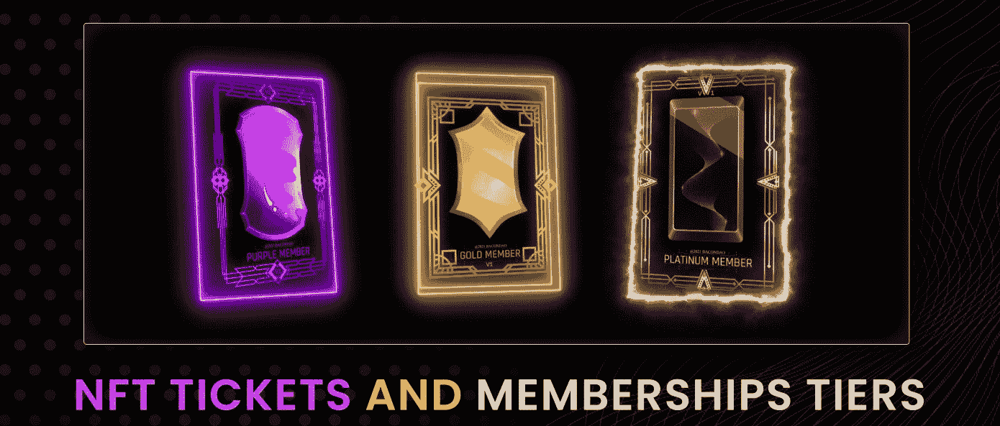
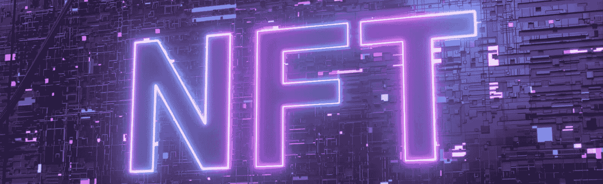
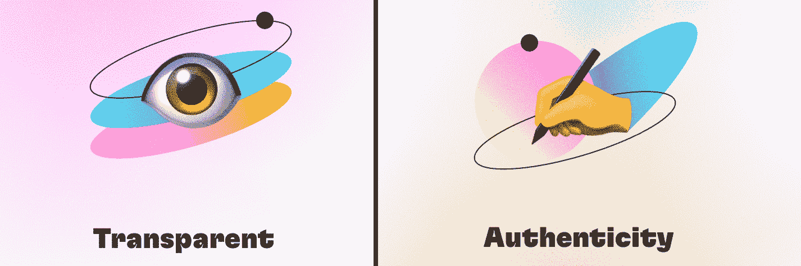
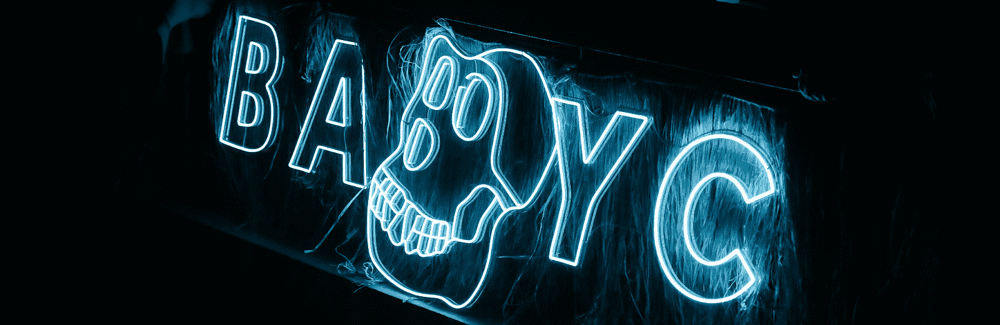
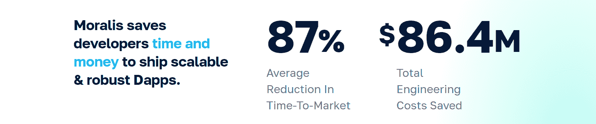
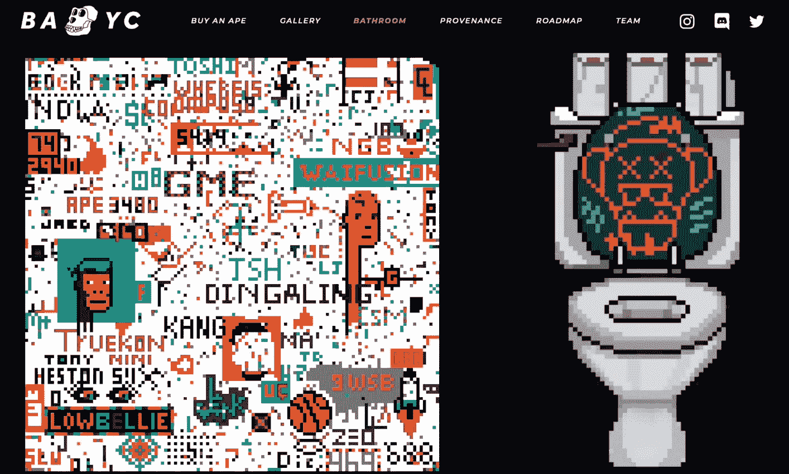
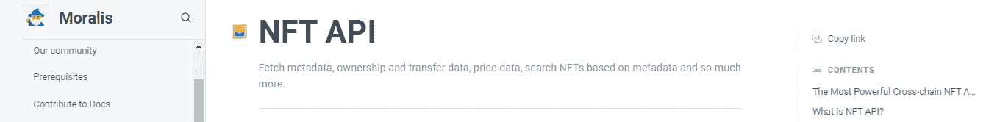

# 什么是 NFT 会员？完整指南

> 原文：<https://moralis.io/what-are-nft-based-memberships-full-guide/>

NFT 的会员资格在各行各业越来越受欢迎。例如，企业可以只允许持有特定 NFTs 的人访问他们的内容，这将防止发行公司遇到用户与其他人共享其付费订阅会员的情况。因此，许多人想在他们的网站和平台上推行 NFT 会员制度也就不足为奇了。但是，什么是 NFT 会员制呢？在我们的完整指南中，请跟随我们深入探讨这个主题！

像其他区块链发展主题一样，纳入 NFT 的会员资格可能会很棘手。如果你掉进了直接在[以太坊 RPC 节点](https://moralis.io/ethereum-rpc-nodes-what-they-are-and-why-you-shouldnt-use-them/)上建造的陷阱，那就更是如此。然而，如果您利用正确的工具，您可以避免处理 RPC 节点的[限制。此外，使用适当的工具，您可以在几分钟内准备好 NFT 门户网站。这就是](https://moralis.io/exploring-the-limitations-of-rpc-nodes-and-the-solution-to-them/)[Moralis 观的由来。当使用这个"](https://moralis.io/) [Firebase for crypto](https://moralis.io/firebase-for-crypto-the-best-blockchain-firebase-alternative/) "平台时，你可以使用[终极 NFT API](https://moralis.io/ultimate-nft-api-exploring-moralis-nft-api/) 。因此，当前 Web3 技术的顶峰使得创建 NFT 门户网站变得简单明了。因此，[创建你的免费 Moralis 账户](https://admin.moralis.io/register)，并从今天开始使用这个优秀的 [Web3 后端平台](https://moralis.io/exploring-the-best-web3-backend-platform/)。然而，在您开始实施 NFT 会员资格之前，您需要了解一些基础知识。在这里，我们将从探索 NFT 基本面开始。然后我们将回答“什么是 NFT 会员？”问题！

### 什么是 NFT？

我们中的许多人高度参与了加密领域，但往往忘记了加密才刚刚开始。事实上，大多数人仍然不知道什么是区块链和加密货币。因此，我们想确保你们都知道什么是 NFT。正如这些加密资产的定义所示，它们是不可替代的。这意味着每个 NFT 都是独一无二的。因此，即使我们有两个 NFT 表示同一个数字文件(例如 JPEG)，它们的链上数据也不会相同。因此，与 BTC 或 ETH 等可互换令牌不同，非功能性令牌是不可互换的。

它们的独特性使 NFT 适用于在线收藏品和数字艺术。此外，NFT 还可以链接到各种所有权证明，包括房地产等现实世界的资产。此外，NFT 可以表示证书和票证。此外，当我们谈到 NFT 的会员资格时，这些类型的非正规金融机构通常是有问题的。

*注:如果你想更深入地了解 NFT 话题，请阅读我们的“* [*什么是 NFT？*](https://moralis.io/non-fungible-tokens-explained-what-are-nfts/)*文章！*

## *什么是 NFT 会员？*

*基于 NFT 的会员资格是要求用户或参与者持有特定 NFT 的会员资格。通过验证他们对所需 NFT 的所有权，用户可以访问特定的服务、利益、奖励等。因此，这意味着这种成员资格有许多不同的选择。例如，它可以让用户访问特定的在线俱乐部、DAO、Discord 组或特殊活动。在后一种情况下，我们倾向于谈论 NFT 票务，尤其是如果它是一次性的事情。此外，在大多数情况下，NFT 所有者可以访问某些 NFT 门户网站。在那里，他们可以经常看到不可锁定的内容。*

### *什么是 NFT 门控网站？*

*NFT 限制网站是 Web3 网站或 Web2 网站，具有某些 Web3 功能(混合网站)，其中某些内容受到限制。要访问这些受限制的内容，用户需要拥有特定的 NFTs。从本质上讲，NFT 门户网站是 NFT 会员制得以实现的地方。*

*

### NFT 会员的优势

需要指出的是，NFT 的会员资格对用户和项目背后的团队都有好处。就大多数用户而言，核心利益发生在 NFT 门户网站的前端。这可以是特定的内容、投票权、社区访问等。这些都是对用户的核心好处。因此，接触是他们追求的东西。那么，为什么使用基于 NFT 的会员资格，而不是现有的验证访问的形式呢？

如果你对区块链有所了解，你就会知道它基本上是一个数字账本，由包含不可变的链上交易的块组成。此外，最受欢迎的连锁店是分散的。因此，这两个因素使得 NFT 的会员非常安全。此外，链上数据是公开的，这确保了透明度。像 [MetaMask](https://moralis.io/metamask-explained-what-is-metamask/) 这样的工具使你能够轻松地存储你的 NFT，而且由于这些相同的工具(热加密钱包)被用于 [Web3 认证](https://moralis.io/web3-authentication-the-full-guide/)，NFT 控制的网站相对来说是用户友好的。一旦用户完成他们的 [Web3 登录](https://moralis.io/connecting-a-unity-game-with-web3-login/)并将他们的钱包连接到 Web3 网站或 dapp，就很容易检查他们是否拥有正确的 NFT。当然，实现这个特性的容易程度取决于你使用的 [Web3 SDK](https://moralis.io/exploring-moralis-sdk-the-ultimate-web3-sdk/) 和 [NFT API 替代品](https://moralis.io/nft-api-alternatives-comparing-alchemys-nft-api-with-moralis-nft-api/)。但稍后会详细介绍。

考虑到这一点，很明显，使用 NFT 会员可以为用户提供完全无缝的体验。他们只需要把合适的 NFT 放在钱包里。与此同时，NFT 门户网站使得项目很容易确保只有合格的用户(NFT 所有者)可以访问。因此，这是一个双赢的组合。另外，NFT 是这种新流行的东西，光是它就增加了一些价值。尽管如此，NFT 可以代表酷而有吸引力的数字艺术(音乐和图像)。

### NFT 会员的例子

*   NFT 门户网站最受欢迎的例子之一是来自无聊猿游艇俱乐部(BAYC)的网站。这是一个众所周知的社区，成员需要持有 BAYC NFTs 才能访问。会员可以访问特殊商品、特殊现实和虚拟活动以及特殊内容。

*   after party——只有持有特定 NFT 的人才能参加的艺术和音乐节。

*   这是一个来自加里·维纳查克的项目，他为那些持有他的 NFT 的人提供特殊的互动(例如，晚餐)。因此，用户可以通过持有特定的 NFT 来访问他和他的特殊知识。
*   史蒂夫·青木的元宇宙，NFT 持有者可以在这里观看他的虚拟表演，购买商品等。

这些只是一些最受欢迎的例子。然而，每天都有许多新的 NFT 会员加入进来。例如，有一些“旅游 NFT 会员”即将推出，NFT 持有者将能够访问独特的地方。此外，已经有一些餐馆(如 FFC 飞鱼俱乐部)只允许你在持有特定 NFT 的情况下用餐。

如你所见，NFT 的会员正在超越 NFT 门户网站的边界。现实生活和虚拟生活的融合([元宇宙](https://moralis.io/what-is-the-metaverse-full-guide/))似乎是我们的未来。这正是 NFT 可以大放异彩的地方。

## 为 NFT 会员创建 NFT 门户网站

既然你已经知道了所有的基础知识，你可能会迫不及待地开始构建这类网站或应用程序。幸运的是，你可以用你的前端技能做到这一点。此外，当使用 Moralis 时，您可以使用 [JavaScript](https://moralis.io/javascript-explained-what-is-javascript/) (JS)或 Unity experience 创建 dapps、Web3 网站和 [GameFi](https://moralis.io/gamefi-tutorial-how-to-create-a-gamefi-game/) 应用程序。多亏了 Moralis 的 SDK 及其全面的 Web3 APIs，它基本上可以满足你所有与区块链相关的后端需求。在大多数情况下，你只需从[的 Moralis 文档](https://docs.moralis.io/)中复制一些简短的代码片段，然后粘贴到你的代码中。

Moralis 还提供了几个额外的快捷方式。它们以样板文件的形式出现，比如终极 [Web3 样板文件](https://moralis.io/web3-boilerplate-beginners-guide-to-web3/)和 [web3uikit](https://moralis.io/web3ui-kit-the-ultimate-web3-user-interface-kit/) 。有了这些优秀的工具，开发人员可以在几分钟内完成惊人的部署和运行。Moralis 的另一个优点是它的跨链和跨平台的互操作性。因此，使用 Moralis 不会以任何方式限制你。它允许你使用相同的代码在多个链上部署你的 Web3 应用。因此，你可以接触到更广泛的观众。尽管如此，这也是一个让你的工作经得起未来考验的好方法。此外，由于 Moralis 让每个人都可以免费入门，因此可以节省您的时间和金钱。

如果你还没有这样做，一定要创建你的免费 Moralis 账户，给这个坏男孩一个机会。首先，我们鼓励你创建一个 Moralis dapp。这样，您将学习如何完成初始设置，包括创建一个 Moralis 服务器。一旦您的服务器启动并运行，您就可以访问您的 Moralis 仪表板(数据库)。后者结合 Moralis 的“同步”功能，使您能够[同步和索引智能合同事件](https://moralis.io/sync-and-index-smart-contract-events-full-guide/)。本质上，你可以用 T4 指数来衡量区块链 T5 指数。因此，Moralis 是创建 NFT 门户网站的工具。

## NFTs 和 NFT 门控网站

当你着手实施 NFT 会员制时，它有两个方面。一方面，您需要 NFT，另一方面，您需要有一种方法来处理这些 NFT。此外，创建 NFTs 包括艺术部分和技术部分。它们都很重要，尽管后者把数字文件变成了 NFT。因此，你可以与艺术家合作，或者外包 NFTs 的艺术部分(jpg、MP3、MP4 等)。).然后，你需要[根据](https://moralis.io/how-to-mint-nfts-full-tutorial-to-minting-an-nft/) [ERC-721](https://moralis.io/erc-721-token-standard-how-to-transfer-erc721-tokens/) 或 [ERC-1155](https://moralis.io/erc1155-exploring-the-erc-1155-token-standard/) 标准铸造这些 NFT。*也就是说，如果你决定专注于* [*以太坊*](https://moralis.io/full-guide-what-is-ethereum/) *或者其他*[*EVM*](https://moralis.io/evm-explained-what-is-ethereum-virtual-machine/)*【兼容链。在那种情况下，你还需要学习[可靠性](https://moralis.io/solidity-explained-what-is-solidity/)的基础知识，这是用于 [Web3 合同](https://moralis.io/what-are-web3-contracts-exploring-smart-contracts/)的语言。不过，幸运的是，您可以使用 [OpenZeppelin](https://moralis.io/what-is-openzeppelin-the-ultimate-guide/) 来获得经过验证的[智能合约](https://moralis.io/smart-contracts-explained-what-are-smart-contracts/)模板，并使用 [Remix](https://moralis.io/remix-explained-what-is-remix/) 在分钟内部署它们。*

*注* *:如果这是你第一次听说 NFT 造币，我们推荐学习* [*如何懒人造币 NFTs*](https://moralis.io/how-to-lazy-mint-nfts/) *，* [*如何批量造币 NFTs*](https://moralis.io/how-to-bulk-mint-nfts-batch-minting-guide/) *，* [*如何免费造币 NFTs*](https://moralis.io/how-to-mint-nfts-for-free-without-paying-gas-fees/)*。*

### Moralis 的 NFT API

无论你想创建一个 NFT 门户网站还是 NFT 门户移动 dapp，Moralis 都是首选。这个构建高性能 dapps 的单一 Web3 工作流提供了不容错过的捷径。首先，Moralis 使您能够通过 MetaMask 、 [WalletConnect](https://moralis.io/what-is-walletconnect-the-ultimate-walletconnect-guide/) 或其他简单的方法用一行代码进行认证。设置好身份验证后，你已经能够[将 Web3 钱包连接到网站](https://moralis.io/how-to-connect-a-web3-wallet-to-a-website/)。然后，你可以使用 [Moralis 的 NFT API](https://docs.moralis.io/moralis-dapp/web3-api/nft-api) 来实现各种基于 NFT 的会员资格。

例如，“ [getNFTs](https://github.com/nft-api/nft-api#getnfts) ”端点从当前用户获取所有的 NFT，包括 ERC-721 和 ERC-1155 NFT。它返回一个具有 NFTs 对象数量和 NFT 对象数组的对象。因此，这个终点将是谜题的第一部分。接下来，您可以使用“ [searchNFTs](https://github.com/nft-api/nft-api#searchnfts) ”端点来查看他们的 NFT 是否匹配所需的 NFT。然后，您可以轻松地使用您的 JavaScript 知识来构建必要的逻辑。后者将只允许那些拥有正确的 NFTs 的人访问某些内容。

如果你是一个视频爱好者，请确保观看我们下面 YouTube 频道的视频。在这篇文章中，一位 Moralis 专家在不到五分钟的时间里解释了我们文章的主旨。

https://www.youtube.com/watch?v=WMsWGchdPpo

## 探索 NFT 会员和 NFT 门户网站–摘要

没有人能肯定地告诉你未来会怎样；然而，我们敢说非功能性测试会一直存在。因此，NFT 会员和 NFT 门户网站将在未来几年发挥重要作用。因此，利用此处获得的信息为自己定位。有了本文的基础知识，您就有了进行下一步所需的所有信息:

1.  ***完全初学者***——使用本文中的链接来了解更多关于 NFTs 和 [NFT 实用程序](https://moralis.io/nft-utility-exploring-nft-use-cases-in-2022/)的信息。
2.  ***对于那些准备建造*** 的人来说——使用 [Moralis 博客](https://moralis.io/blog/)和 [Moralis YouTube 频道](https://www.youtube.com/c/MoralisWeb3)来承担各种 NFT 范例项目。

当然，您也可以使用这两个平台来探索其他 Web3 开发主题。例如，一些最新的文章集中在[区块链短信通知](https://moralis.io/how-to-get-blockchain-sms-notifications/)，如何实现一个 [Web3 连接钱包按钮](https://moralis.io/how-to-add-a-web3-connect-wallet-button-to-your-website/)，如何[建立一个玩赚游戏](https://moralis.io/how-to-build-a-play-to-earn-p2e-game/)，如何使用[孟买测试网龙头](https://moralis.io/mumbai-testnet-faucet-how-to-get-free-testnet-matic-tokens/)，以及如何[宣称一个游戏内 NFT](https://moralis.io/how-to-claim-an-in-game-nft-full-guide/) 。此外，您还可以探索[以太坊名称服务](https://moralis.io/what-is-ethereum-name-service-full-ens-guide/) (ENS)，如何在没有元掩码的情况下[web 3](https://moralis.io/web3-without-metamask-web3-authentication-alternatives/)，如何创建一个[币安 NFT](https://moralis.io/how-to-create-a-binance-nft-in-5-steps/) ，并获得“[什么是 Web2 和 Web3](https://moralis.io/what-is-web2-and-web3-explaining-web3/) ”等问题的答案等等。

另外，一定要考虑报读[Moralis 学院](https://academy.moralis.io/)。如果你想参加顶级的[密码开发课程](https://academy.moralis.io/all-courses)，获得专家指导，并成为行业中最先进的社区之一的一员，这里就是你要去的地方。在成为 Moralis 学院成员的推动下，你将[在创纪录的时间内成为 Web3 开发者](https://moralis.io/how-to-become-a-web3-developer-full-guide/)。*