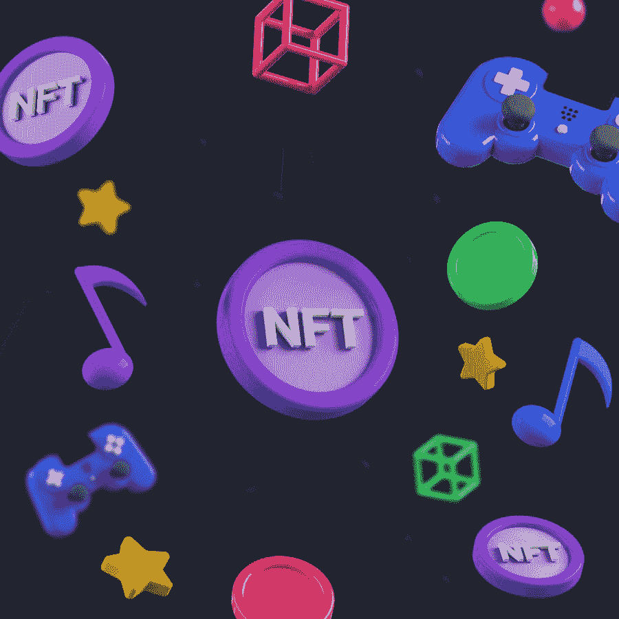
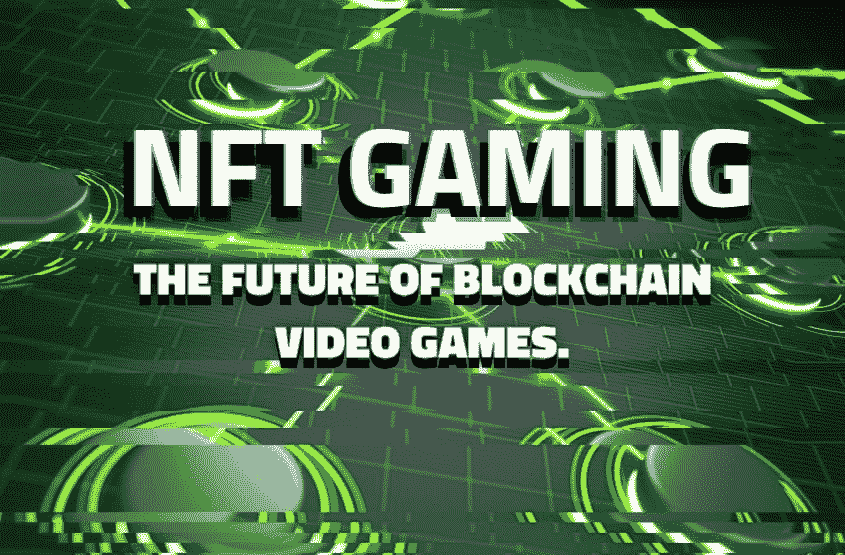
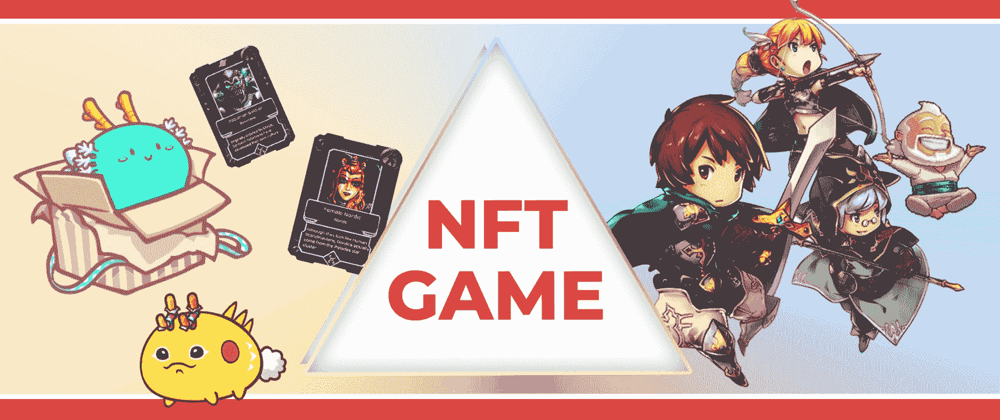
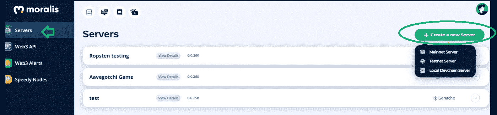
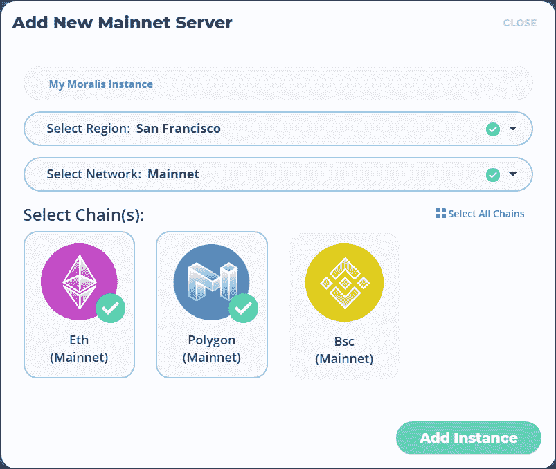
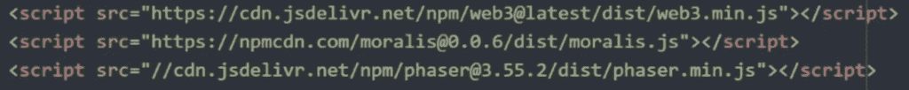
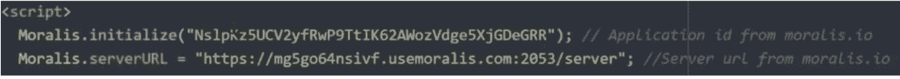
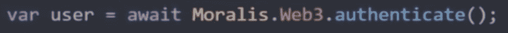
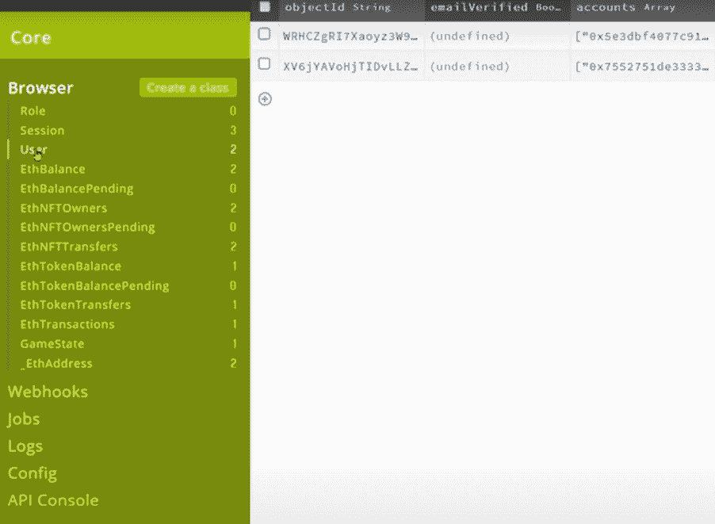

# 什么是 NFT 游戏，如何制作 NFT 游戏？

> 原文：<https://moralis.io/what-are-nft-games-and-how-to-make-nft-games/>

**无论是从朋友、YouTuber 还是主流媒体，你很可能听说过******。NFTs 的迅速普及让普通人和一些密码专家大吃一惊。随着游戏开发者寻找在游戏中利用 NFT 的方法，NFT 的增加也引起了他们的注意。有些人可能会说，NFT 奥运会不会长久；然而，我们知道 NFT 游戏才刚刚开始。因此，巨大的机会正等待着那些准备深入研究 NFT 游戏和 GameFi 空间的开发者。所以，继续读下去，找出以下问题的答案:“什么是 NFT 游戏？”以及“如何制作 NFT 游戏？”。****

**如果你想学习如何制作 NFT 游戏，或者想得到“什么是 NFT 游戏”的正确答案问题，你来对地方了。我们不仅会为您提供开始工作所需的答案，而且您还将了解名为[Moralis(T3)的终极](https://moralis.io/) [Web3](https://moralis.io/the-ultimate-guide-to-web3-what-is-web3/) 开发平台。这个免费使用的工具为有经验的开发人员和初学者提供了他们应得的捷径。**

**此外，由于 Moralis 丰富的文档，使用该平台及其全部潜力非常简单。此外，由于这篇文章的一部分着重于如何用 Moralis 制作 NFT 游戏，我们建议[马上创建你的免费账户](https://admin.moralis.io/register)。因此，一旦我们到了如何创建一个 NFT 游戏的部分，你就准备好跟随了。事实上，对于初学者来说，Moralis 是开始 [NFT 编程的最好地方。除了制作 NFT 游戏，请通过](https://moralis.io/nft-programming-for-beginners/) [Moralis 博客](https://moralis.io/blog/)查看我们关于如何使用 Moralis 与 NFT 合作的其他提示和技巧！**

**

## 什么是 NFT？

在我们回答“什么是 NFT 游戏”这个问题之前我们需要确保你知道什么是非功能性测试。NFT(不可替换令牌)是一种特殊的加密令牌。像其他加密令牌一样，它存在于区块链上，在那里它代表一个特定的(唯一的)项目。

正如“不可替换”部分所暗示的，NFT 是独一无二的，不能像其他可替换的代币或硬币(如特定区块链上的本地代币)一样进行交换。例如，你可以用一个 BTC(比特币)换取等量的 BTC(在我们的例子中是一个)，因为它们在各方面都是平等的。这同样适用于所有其他可替换的令牌。然而，没有两个或两个以上不可替换的令牌是相同的。即使在创建具有特定 NFT 的多个版本的 NFT 系列的情况下也是如此。对于后者，每个 NFT 仍然有不同的元数据。一个很好的类比就是编号系列的印刷品。

根据上面对 NFTs 的定义，您可以理解这使得 NFTs 非常适合作为数字和现实世界中各种独特项目的表示。常见的例子包括数字艺术、数字收藏品、游戏中的物品或角色、房地产所有权、各种证书等。

虽然围绕某些 NFT 项目的炒作已经达到了难以想象的高度，但真实世界的用例才刚刚开始出现。此外，NFT 游戏也处于起步阶段。此外，虽然你可以很容易地[创建自己的 NFT](https://moralis.io/how-to-create-your-own-nft-in-5-steps/) ，但创建自己的 NFT 游戏就有点棘手了。然而，这个过程并不像你想象的那么困难和复杂(稍后会有更多的介绍)。因此，NFT 游戏为所有对这个特殊领域感兴趣的区块链开发者提供了巨大的机会。

# 什么是 NFT 游戏？

我们已经多次提到 NFT 奥运会，但现在让我们更深入地探讨 NFT 奥运会到底是什么。从本质上讲，NFT 游戏是以某种方式结合了非功能性游戏的游戏。因此，他们为非功能性测试提供了使用的方法，或者仅仅是作为奖励来获得。然而，在大多数情况下，NFT 游戏创作者会将两者结合起来。因此，NFT 游戏在其机制、规则和玩家互动中使用 NFTs。

例如，任何角色、游戏皮肤、剑、宝盒、毒药或任何其他游戏中的物品都可以用 NFT 来表示。此外，任何奖励给玩家达到一定的水平或完成特定的任务或挑战也可以以 NFTs 的形式出现。

## 什么是“玩即赚”NFT 游戏？

目前，大多数加密用例都直接或间接地围绕着金融部门。因此，通过玩游戏获得奖励的概念越来越流行，这主要归功于 Axie Infinity 的流行。后者是一个玩赚 NFT 游戏的很好的例子，玩家可以在完成游戏内的挑战和任务时获得他们的“光滑爱情药水”(SLP)令牌。由于代币可以在多个交易所交易，玩家有机会将它变成法币。

随着玩到赚到的 Web3 游戏，一个新的术语诞生了，GameFi。它指的是游戏金融，因此也指区块链游戏的整个领域，包括以前仅限于金融领域的各种选择。此外，这意味着许多 NFT 游戏都有自己的市场，玩家可以在那里下注，出借，借用和交易本地链令牌和游戏内资产，这些令牌和资产以可替换令牌或 NFT 的形式出现。

### 什么是游戏内 NFT？

除了赚取可替换的代币(如 Axie Infinity 的例子)，玩家可以在玩游戏时赚取或以其他方式获得 NFT。这些 NFT 可以代表可收集的物品、工具或任何上述在游戏中引入的 NFT 的例子。那些都叫做“游戏内 NFTs”。

此外，特定的功能可以分配给特定的游戏内 NFT。此外，每个 NFT 都可以有一个预定义的赋值，这取决于它的重要性、稀有性、装饰性等。另一方面，通过允许玩家在市场中交易这些 NFT，可以由玩家或市场来设定 NFT 的价值。

### 什么是 NFT 游戏？–游戏示例

在我们进入本文教你如何制作 NFT 游戏的部分之前，我们想给你展示几个你可以自己探索的 NFT 游戏。你可以阅读他们的白皮书，查看他们的网站。然而，如果你有时间和意愿，我们鼓励你尝试玩这些游戏，只是为了获得一个整体概念的感觉。这样，你会更好地回答“什么是 NFT 奥运会？”问题。

一些值得一提的 NFT 游戏包括 Axie Infinity、Sorare、Gods Unchained、Splinterlands、Sandbox 3D、Alien Worlds、Battle Racers 等等。当然，每天都有许多新的 NFT 游戏出现，这给了你探索这个新行业的大量选择。然而，在将你的钱包连接到任何平台之前，确保检查它们的信誉，并应用所有标准的安全措施以避免被骗。

## 如何制作 NFT 游戏

虽然玩 NFT 游戏可能很有趣，某些游戏甚至可能会给你一个选择来赚一大笔钱，但我们向你保证，加密领域最大的机会在于专注于创造或开发一些东西。因此，我们发表这篇文章来告诉你如何制作 NFT 游戏，这样你就可以用你的创造力来开发一个非凡的 NFT 游戏。

此外，如前所述，这并没有你想象的那么难。当然，这意味着您希望使用正确的工具，这样您就可以避免耗时的开发过程。这就是为什么 [Moralis 的 SDK](https://moralis.io/exploring-moralis-sdk-the-ultimate-web3-sdk/) 毫无疑问是你可以用于你的 [dApp](https://moralis.io/decentralized-applications-explained-what-are-dapps/) 开发的最强大的工具之一。此外，它是 NFT 相关项目的游戏规则改变者，并使 NFT 游戏开发变得容易。本质上，Moralis 为您提供了与 NFT 开发相关的所有正确工具，并通过复制和粘贴简短的代码行来帮助您处理后端。因此，您可以将您的注意力和资源投入到创建最好的前端，并确保良好的用户体验。如果你想了解更多关于[什么是 Moralis 观](https://youtu.be/txHnWDRB728)，请务必观看以下视频:

https://www.youtube.com/watch?v=txHnWDRB728

### 如何用 Moralis 制作 NFT 游戏——初始设置

在我们开始编写代码(在许多情况下，复制和粘贴)之前，我们必须创建一个 Moralis 服务器，导入 Moralis SDK，并初始化 Moralis。此外，无论你是想[创建自己的 ERC-20 令牌](https://moralis.io/how-to-create-your-own-erc-20-token-in-10-minutes/)、[建立一个加密钱包](https://moralis.io/how-to-build-a-crypto-wallet-in-4-steps/)，还是承担任何其他 Web3 开发任务，你都必须在使用 Moralis 时完成这些相同的步骤。幸运的是，它们是易于执行的简单任务。

1.  **创建一个 Moralis 服务器**–首先，您需要登录 Moralis 并点击左上角的“服务器”选项卡。与下图不同，这里不会显示服务器，因为您很可能正在使用一个新帐户。单击右上角的“+创建新服务器”按钮，从出现的下拉菜单中选择三个选项之一(在本例中，您可以选择“Testnet 服务器”)。

接下来，命名您的服务器，选择您的区域，选择您感兴趣的链(网络)，并在出现的弹出窗口中单击“添加实例”按钮(见下图)。请耐心等待，因为 Moralis 可能需要几分钟来创建一个新的服务器。

2.  **导入 Moralis SDK**–这将使您能够访问开发套件，包括库和其他有用的工具。很容易导入 Moralis SDK 基本上，您只需要复制并粘贴几行代码:

3.  **初始化 Moralis**–您可以在我们的 [JavaScript](https://moralis.io/javascript-explained-what-is-javascript/) ("中使用下面的代码初始化 Moralis。js”)文件。请记住，您需要为您的服务器使用服务器 URL 和应用程序 ID。您可以通过点击 Moralis 管理页面中您的服务器名称旁边的“查看详细信息”按钮来获取这些信息。

### 用户认证

基本上每个 NFT 游戏都需要认证用户的能力。因此，每当你的 NFT 游戏的玩家访问相关网站时，应该有一种方法使他们能够登录。幸运的是，有一个公开的免费工具可供我们使用—[meta mask](https://moralis.io/metamask-explained-what-is-metamask/)。使用这一行代码，您可以轻松快速地用元掩码实现[认证:](https://moralis.io/how-to-authenticate-with-metamask/)

除了这个简单的实现之外，Moralis 集成会自动将每个新用户添加到您的 Moralis 数据库中。通过这种方式，您可以访问区块链上所有可用的用户数据。要访问服务器的数据库，请单击服务器名称旁边的三个点，然后按“仪表板”选项。这是我们服务器仪表板中导航栏的特写:

查看上图，您可以看到在“浏览器”选项卡下的导航选项卡中有一些与 NFTs 相关的项目。这将使我们能够看到所有用户的 NFT。你可能会同意，一行代码能让我们做的事情令人难以置信。

### 如何制作 NFT 游戏——后续范例项目

如果你想构建一个真正简单的 NFT 游戏，我们强烈建议你查看我们的示例项目，在这里我们向你展示如何在几分钟内构建一个 NFT 游戏。如果你更喜欢视频而不是文章，那么我们也为你准备了“[如何快速构建 NFT 游戏](https://youtu.be/CsdhJrD9m1M)”视频。

上述两种情况都让你看到我们的肩膀，并设置所有的代码，以创建一个真正的 NFT 游戏。这是学习如何制作 NFT 游戏的最好方法吗？

你将开始编程前端和后端方面，以结束一个简单的工作 NFT 游戏。此外，您将从设置图形开始，为此您将使用一个名为“Phaser”的开源 HTML5 库。使用 Phaser，您将创建简单的图形，如下图所示:

### 如何制作 NFT 奥运会-第二阶段

接下来，您将使用“preload”函数和“ping()”函数来管理游戏的生命周期。这样，您将确保后台被加载并且服务器被 pinged。

接下来，您将添加控件和订阅。在这里，Moralis 的力量将再次提供一个伟大的捷径，通过“游戏状态”标签，可在您的 Moralis 服务器的仪表板。您将通过应用“update”和“drawState”函数来完成前端编程。

继续，你将关注 NFT 游戏创作的后端部分。在那里你将学习如何添加额外的功能，比如游戏的边界和特殊物品的收集。此外，您将了解如何使用“persistState”函数和后端的 ping 函数。后者将调用“getSVGString”函数，使您能够从区块链中获取用户的 SVG。

至此，您将结束示例项目，并最终学习如何制作 NFT 游戏。然后，由您将这些知识进一步应用到其他更广泛、更高级的项目中。

## 什么是 NFT 游戏，如何制作 NFT 游戏？–总结

在这一点上，你应该没有问题回答“什么是 NFT 游戏？”问题。你知道，这些 Web3 游戏应用程序在某种程度上包含了非功能性游戏——或者通过奖励玩家，或者在游戏中设置某种非功能性游戏，或者两者兼而有之。

此外，你现在知道你不需要走从零开始创造 NFT 游戏的困难和耗时的道路。相反，您可以通过让 Moralis 处理复杂的后端部分来加快这个过程。此外，让我们重复一遍，我们鼓励你采取上述后续的例子项目。这样，你会很快学会如何制作 NFT 游戏。

最后，让我们再次指出，除了提供许多关于 NFT 编程的快捷方式，包括用一行代码发送 NFT 的方法[，Moralis 还为多个领先链上的整个 Web3 开发范围提供了一个令人难以置信的后端解决方案。例如，它还提供给你](https://moralis.io/how-to-transfer-nfts-with-one-line-of-code/)[在仲裁器](https://moralis.io/how-to-create-an-arbitrum-token-in-6-steps/)、[多边形](https://moralis.io/how-to-create-a-polygon-token/)和[币安智能链(BSC)](https://moralis.io/how-to-create-a-bsc-token-in-5-steps/) 上创建令牌。因此，创建一个 Moralis 帐户并访问它的所有功能是你不想错过的。

**