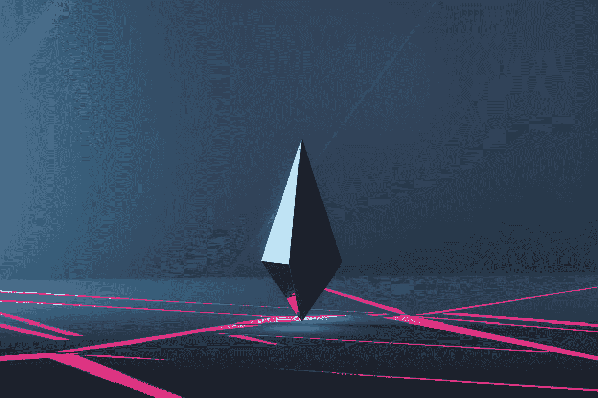
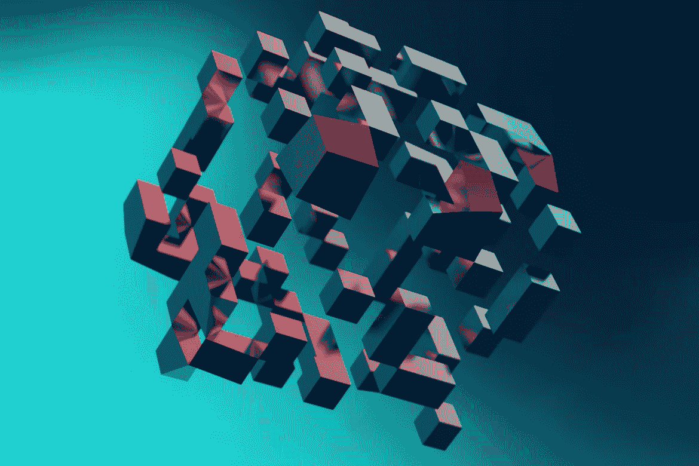

# 什么是 Solidity 智能合约？完全可靠教程

> 原文：<https://moralis.io/what-are-solidity-smart-contracts-full-solidity-tutorial/>

大约十年前，区块链技术在很大程度上只是比特币加密货币的代名词。直到以太坊的诞生，当开发人员开始使用****来编写智能合同时，区块链技术才真正发挥了作用。随着程序员开始使用 Solidity smart contracts，大量的区块链用例出现了，释放了 Web3 的真正力量。大幅改善的物流、分散的金融和数字收藏品——如**[**NFTs**](https://moralis.io/non-fungible-tokens-explained-what-are-nfts/)**——都依赖于类似以太坊智能合约的** [**Web3 合约**](https://moralis.io/what-are-web3-contracts-exploring-smart-contracts/) **。但是，什么是可靠智能合约呢？这篇文章回顾了基础知识，并进一步研究了 Solidity 语言和区块链技术！****

**显然，我们的全球影响力正越来越多地转移到网上。更重要的是，Web3 的出现带来了去中心化金融、数字艺术、无许可社交媒体、虚拟房地产等等的愿景。也许是因为我们对我们的有形世界不满意，我们正在寻找在无法被集中行动者控制的网络上连接的方法。因此，我们正在离开我们的中央集权时代，走向一个新的去中心化的世界。在这里，用户可以在一个数字化的、点对点的环境中创造、分享、购买和交换任何东西。**

**互联网正以同样快的速度改变着 [Web3](https://moralis.io/how-does-web3-work-web3-explained/) 的承诺，一种新型的互联网将权力交还给用户。然而，这仅仅是由于区块链技术才成为可能。让我们来看看区块链技术和支撑以太坊的可靠智能合约！**

### ****为什么要区块链技术？****

**那么，是什么让区块链科技如此特别呢？首先，它允许任何人在没有中间人的情况下完成双方之间的交易。因此，我们可以快速轻松地完成事情。例如，如果你想在用户之间转移加密货币，你不需要银行，公证人或经纪人来证明或认证交易。其次，由于区块链将交易存储在块中，因此很难破坏、删除、更改、伪造或窃取相关资产。最后，区块链是一种开源的、去中心化的技术，通过点对点的交互来验证，增加了另一层信任。**

**区块链交易基于智能合约——本质上是代码串——提供参与者之间安全、可靠和可信交易所需的所有信息。但是到底什么是智能合约，是什么让它们在 Web3 世界如此重要？**

**

## **什么是扎实？**

在很长一段时间里，区块链技术主要局限于加密货币。直到程序员创造了一种新的计算机语言——即 [Solidity](https://moralis.io/solidity-explained-what-is-solidity/) 。Solidity 语言是专为编写智能契约而设计的，可以针对许多不同的用例进行修改。然而，如果没有以太坊网络(由[以太坊虚拟机](https://moralis.io/evm-explained-what-is-ethereum-virtual-machine/)驱动)，运行 Solidity 智能合约并将其添加到区块链的能力将是不可能的。

Solidity 语言必须尽可能简单，这样智能合约才能在尽可能多的应用中使用。因此，新程序员可以很快学会并使用它。此外，它需要更像人类(高级)和面向对象(面向契约)，以便更好地模拟真实的人类契约事务。为了开发这种优雅的语言，创始程序员采用了著名编程语言中最合适的组件。这包括 Python、C++和 JavaScript。然后，他们创造了坚固。Solidity 语言使用花括号和“if/then”语句来处理复杂的用户输入，而不是 1 和 0。

因为 Solidity 语言灵活且面向契约，所以非常适合为各种[去中心化应用](https://moralis.io/decentralized-applications-explained-what-are-dapps/)(dapp)创建智能契约。根据它们的复杂性，开发 dapps 可能会很困难和耗时，尤其是对于那些编程新手。

Moralis 是快速方便地为 dapps 创建后端基础设施的最佳平台。具体来说，Moralis 允许您只使用几行代码就可以做到这一点。此外，你可以很容易地学会如何用 Moralis 创建智能合同。注册一个[免费 Moralis 账户](https://admin.moralis.io/register)，这样你就可以专注于你的 dapp 的前端。剩下的我们来处理！y

## 什么是 Solidity 智能合约？

Solidity [智能合约](https://moralis.io/smart-contracts-explained-what-are-smart-contracts/)是用 Solidity 语言编写的代码串。这些条款规定了交易各方在合同生效前需要履行的条款和条件。

就像工作合同一样，智能合同规定了雇佣条款。但是，它不需要证人、银行或任何其他中介来验证合同是否有效。只有双方满足所有规定，智能合同才会执行和验证。交易完成后，智能合约将存储在新的块中。此外，它还与其他智能合约的堆栈一起存储。然后将该块添加到称为区块链的线性块链的末端。这个新块包含存储在以前的块中的所有以前的智能合约的信息。此外，它还包含了刚刚完成的一系列新智能合约。

每个完成的智能契约都有一个公钥，或者一串随机生成的数字，作为它的地址。这样任何人都可以验证它的存在。虽然智能合约永久存储在区块链上，每个人都可以访问它，但这并不意味着每个人都可以查看其内容。只有参与协定的各方会收到一个私钥，使他们能够访问智能协定的未加密版本。

### **区块链和 Solidity 智能合约**

当区块链在其链上存储智能合同时，交易被永久确认-这意味着没有人可以改变它。加密和块确认对区块链技术至关重要，因为它使得改变或破坏信息几乎不可能。黑客需要在每个代码块中修改代码来修改智能合同。这是一项艰巨的任务，如果不是完全不可能的话。由于交易过程不涉及中间商，智能合约可以随时自动执行。因此，智能合同交易为任何一方签订协议提供了一种革命性的方式。

要在区块链上创建和执行智能合同，您必须注册一个 [Web3 钱包](https://moralis.io/how-to-build-a-multi-chain-wallet-in-5-steps/)。这个钱包可以存储您的加密货币和资产、公钥和私钥以及与每笔交易相关的信息。

每笔智能合约交易都需要一定量的“汽油”才能运行。因此，当用户与以太坊上的 dapp 进行交互时，用户必须为运行 Solidity 智能合同支付燃气费。虽然每个用户可以设置他们愿意在每个智能合同上花费的天然气数量，但用户为交易保留的货币越多，交易执行和被矿工验证的速度就越快。从本质上讲，这是因为矿商优先考虑验证更有利可图的智能合同。因此，矿工和节点所有者可以通过帮助种植区块链赚钱，但是，这并不总是有利可图的——因为这样做需要专业知识、特殊设备和正确的诀窍。

## **可靠性智能合同的用例**

因为可靠性很容易应用于各种交易，所以可靠性智能合同不仅仅适用于加密交易。我们可以使用 Solidity 智能合约为金融、艺术、房地产、游戏、社交媒体和众筹创建 dapps。每个部门都通过使用令牌独特地采用智能合约。在加密货币的情况下，这些代币可以具有固有值，或者由例如 NFT 的稀有度和受欢迎度设置的任意值。

### **分散融资(DeFi)**

想象一下能够在全球范围内随时交易、投资、借贷、发送和购买任何东西。[去中心化金融](https://moralis.io/what-is-defi-the-full-decentralized-finance-guide/) (DeFi)是金融的未来，加密货币和区块链技术是其必不可少的组成部分。

### **艺术**

今天，我们可以通过区块链技术出售或交易几乎任何符号化的创作。可能最广为人知的令牌是 NFT。这些标志可以是任何形式的艺术、音乐、视频、文字，甚至是网址。要确定代币的价值，必须考虑它的受欢迎程度、稀缺性、需求、稀有性、可收藏性、市场价值等。关于 NFTs 有趣的事情是购买方不一定拥有艺术品本身。买家实质上是购买了作为原创艺术品唯一所有者的吹嘘权。

在 OpenSea 等平台上以 NFT 的身份出售艺术品，让许多艺术家能够接触到他们以前从未接触过的观众。此外，它使他们能够获得他们的 NFT 艺术品的转售版税。此外，他们的 NFT 可以作为一种促销工具，也可以导致他们的实物艺术品的销售。一些艺术家甚至认为 NFT 是销售实物艺术品、防止伪造和记录转售版税的未来。使用 Moralis，只需几个简单的步骤就可以创建自己的 [OpenSea 克隆](https://moralis.io/create-an-opensea-clone-build-an-nft-marketplace-like-opensea/)！

### **众筹**

众筹是区块链领域最容易被忽视的领域之一，尽管它是区块链技术最有前途的好处之一。分散式众筹平台允许捐赠者拥有部分受资助项目。部分所有权给人们一种真实的感觉，即他们参与并投资于他们资助的项目。传统的众筹可能很麻烦，有许多中间人费用，以及关于谁可以捐赠的严格规则。有了智能合约，分散的众筹平台也可以作为投资工具，因为用户可以从他们支持的项目中赚取利润。

### **房地产**

智能合约在房地产领域找到了一个强大的利基市场。某些公司帮助人们投资有形房地产。他们通过将人们可以作为投资购买的房地产资产证券化来实现这一点。通常情况下，房地产投资涉及大量的文书工作，第三方费用，以及寻找合适的房地产的巨大时间承诺。然而，通过投资区块链支持的房地产，投资者可以快速、轻松、安全地开始投资，并创造一个稳定的被动收入来源。

### **游戏**

游戏已经成为使用智能合同的最有趣、最流行和最有利可图的方式之一。人们在区块链创造了整个宇宙(metaverses ),用户之间的互动通常是游戏本身。其他 NFT 游戏，如 [Axie Infinity](https://axieinfinity.com/) ，是“[即玩即赚](https://moralis.io/how-to-build-a-play-to-earn-p2e-game/)”游戏，用户通过参与游戏的不同方面获得奖励。此外，还有各种各样的区块链游戏主题。这些主题从收集交易卡和探索遥远的宇宙到体育游戏，如梦幻足球。

### **社交媒体**

内容审查和“去平台化”已经成为脸书、推特和 YouTube 等社交媒体平台上的热门话题。这些平台的缺点是，它们有一个集中的命令，用户发布的任何内容都可以被受雇监控内容的人查看、审查和删除。虽然有些规定在非法活动的情况下是合理的，但许多人认为这种监督侵犯了言论自由。如果不允许人们有相互冲突的观点，自由开放的社会与对立的观点斗争并找到最佳解决方案的可能性就会受到威胁。这就是稳健智能合约的用武之地。

Blockchain 技术被用来创建开放的、通过点对点互动进行自我监管的社交媒体平台。您知道您可以使用 Moralis 在一个小时内构建自己的 [Web3 推特克隆体](https://moralis.io/how-to-build-a-web3-twitter-clone/)吗？

## 如何设置 Moralis 服务器以便开始构建？

如果你是一个 dapp 开发者，希望加快你的后端开发过程，Moralis 是你的工具！通常，Web3 后端设置过程可能需要几个月的时间。然而，当使用 Moralis 时，你可以在几小时甚至几分钟内设置好你的 dapp。因此，Moralis 极大地提高了你作为程序员的生活质量。此外，它允许您以前所未有的速度创建和部署 dapps！

### 【Moralis 到底是如何帮助开发者的？

创建 dapp 时，开发过程有两个主要部分:前端和后端。Moralis 帮助你快速创建的部分是后端。因此，Moralis 负责任何开发人员在创建高质量的 dapp 时必须处理的工作。通过实现来自 [Moralis 文档](https://docs.moralis.io/introduction/readme)的几行代码，您将能够从每个用户那里收集区块链数据，实时跟踪用户行为，向其他应用程序提供 API，索引区块链，等等！

### 如何开始用 Moralis 构建我的 Dapp？

开始用 Moralis 创建 dapp 很容易。只需去 [Moralis](https://moralis.io/) 注册一个免费账户！登录后，单击“创建新服务器”按钮。然后，选择您想使用的服务器类型——Mainnet、Testnet 或 Local Devnet。接下来，选择离你最近的地区(例如，纽约、多伦多、伦敦等。).此外，选择您想要使用的链(以太坊，多边形，BNB 链，雪崩或 Fantom)。就是这样；您已经准备好开始创建您的 dapp 了！此外，有关如何使用 Moralis 构建项目的分步书面和视频教程，请访问 Moralis 的文档页面。

## **什么是 Solidity 智能合同–摘要**

互联网正在向 Web3 过渡，新的去中心化前沿需要开发高质量的 dapps。Dapps 基于区块链的智能合约。此外，它们在各方之间快速、安全、永久、廉洁且不受审查地执行不同类型的交易。他们也是点对点认证，消除了第三方，如银行，公证人和经纪人。

目前，从头开始创建 dapps 既困难又耗时，尤其是在后端。幸运的是，您不必重新发明轮子，因为 Moralis 为您提供了快速构建 dapp 的工具。因此，你可以把你的梦想变成现实！你会加入 Moralis 网革命吗？**