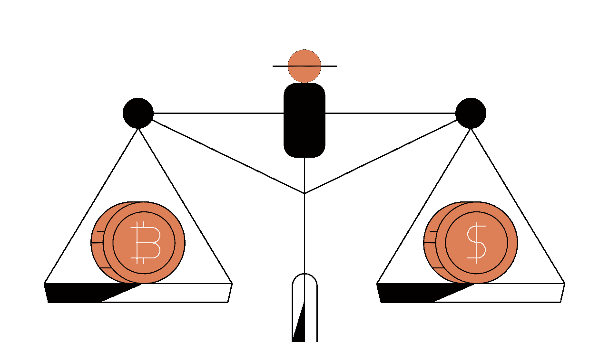
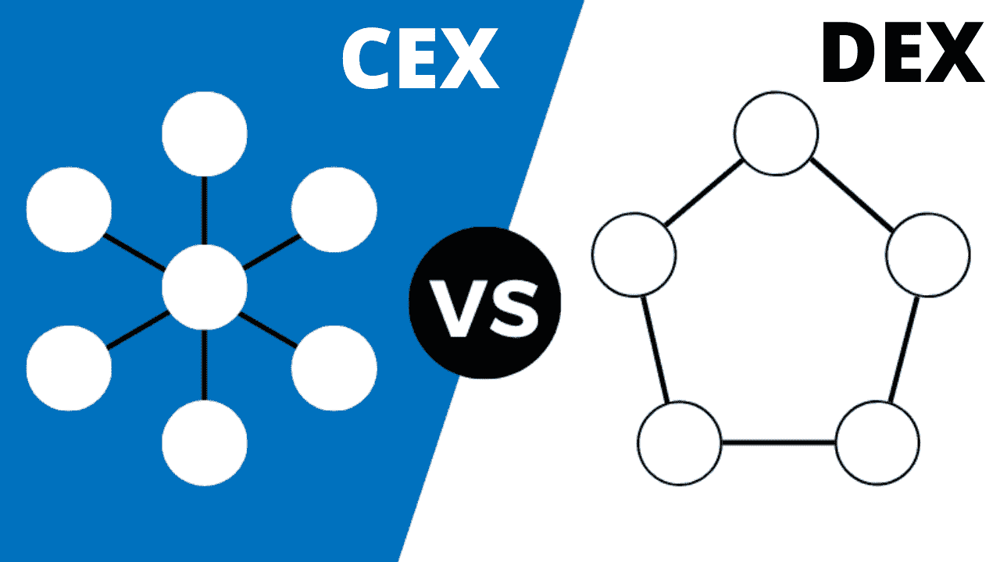
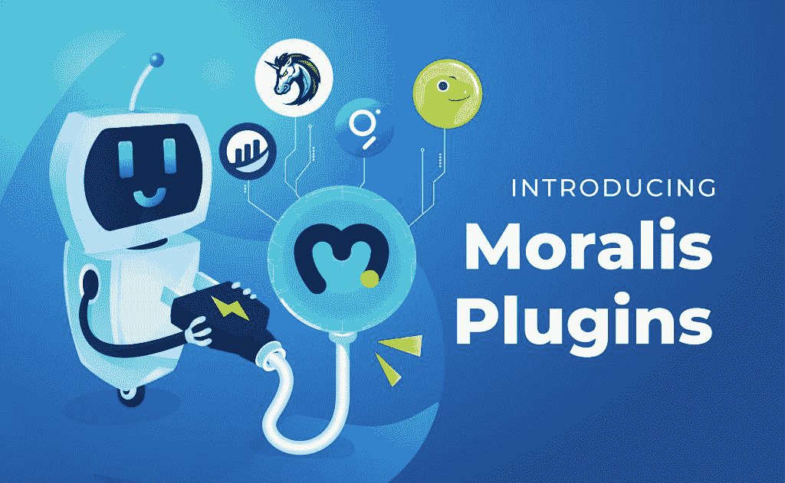

# 什么是菲亚特网关？

> 原文：<https://moralis.io/what-is-a-fiat-gateway/>

如果你曾经购买过加密货币，你很可能使用过菲亚特网关。事实上，要购买比特币、以太坊或替代币，需要一个菲亚特网关。然而，如果你不熟悉加密货币如何在各种区块链上传播的概念，你可能会想知道什么是菲亚特网关。因此，我们将以简单易行的方式解释这一点，这样你就可以回答这个问题，“什么是菲亚特网关？”并在下一个 dApp 中实现网关的功能。

尽管有诸多不利因素，如政府控制、中央集权和印钞，法定货币仍然是主要的货币类型。对于深入参与加密领域的人来说，顶级加密货币的大规模采用似乎已经到来；然而，数据显示了一幅不同的画面。根据 [TripleA](https://triple-a.io/about/) 的数据，全球密码拥有率不到 4%。因此，在开发 [dApps](https://moralis.io/decentralized-applications-explained-what-are-dapps/) (分散式应用程序)时包含一个菲亚特网关仍然很有意义。在 Moralis 的帮助下，你可以轻松地将你自己的菲亚特网关集成到你的 [Web3](https://moralis.io/the-ultimate-guide-to-web3-what-is-web3/) 应用中。Moralis 通过使用[菲亚特 Onramp 插件](https://moralis.io/plugins/fiat/)使这一过程变得简单明了。在我们深入探讨如何使用这个插件之前，让我们先来看看什么是菲亚特网关或菲亚特 onramp。

# 什么是菲亚特网关或菲亚特 Onramp？

那么，什么是菲亚特网关？在回答这个问题之前，我们需要确定你知道菲亚特是什么。法定货币是政府发行的货币(美元、欧元、英镑、加拿大元等)。).此外，法定货币没有黄金等商品的支持；它没有内在价值，也没有使用价值。基本上，法定货币之所以有价值，只是因为某个特定的政府保持了它的价值，或者是因为参与特定法定货币交换的各方对其价值达成了一致。

“gateway”这个词的意思是一个地方或一条路，通过它可以做某事或实现某事。把“菲亚特”和“网关”的定义放在一起，我们已经可以猜出“什么是菲亚特网关？”问题。本质上，法定网关是一种让我们能够使用法定货币购买加密货币的方法。此外，菲亚特网关越好，购买特定硬币或代币就越容易、越安全。

为了加深你对什么是菲亚特网关的理解，一个很好的类比就是街机中的投币机。当你想使用一台接受特定代币并可能通过给你更多代币来奖励你的最高分的街机时，你需要把你的法定货币换成代币。为此，你使用投币机。因此，要“玩”加密货币，你需要把你的法币换成加密硬币或代币。

就“菲亚特 onramp”这个术语而言，它只是菲亚特网关的另一种表达方式。它还意味着一种方法，允许你将法定货币转换成加密货币。

## 什么是加密到菲亚特网关？

尽管“加密到法定”这一术语明确强调了从加密货币到法定货币的转换，但它本质上也指的是法定网关或法定货币。为什么？嗯，事情是这样的，一个典型的加密到菲亚特网关也充当菲亚特网关——它使你能够将你的菲亚特转换成一种特定的加密货币，反之亦然。

请记住，许多媒体和面向加密的博客倾向于将“加密到法定”部分缩短为“加密到法定”。因此，加密-菲亚特网关和加密-菲亚特网关的意思是一样的。加密货币相对较新，并且没有明确的“剧本”，如“加密 onramp”、“加密到菲亚特网关”、“加密菲亚特网关”、“加密网关”等术语。，指的是同一个东西——菲亚特网关。

## 菲亚特 Onramp 示例

既然你能够回答“什么是菲亚特网关？”问题，是时候看看一些菲亚特 onramp 的例子了。虽然区块链技术的忠实信徒主张去中心化，但事实仍然是大多数零售用户都拥有集中式交易所。为什么？嗯，他们的平板网关易于使用；在大多数情况下，他们遵循与大多数在线购物平台相同的方法，这是人们习惯的事情。此外，这意味着人们可以使用信用卡购买稳定币、比特币，或者在某些情况下甚至是几个顶级替代币，以太坊是其中的佼佼者。

一些最受欢迎的菲亚特网关平台包括币安比特币基地。美国、币安、北海巨妖和许多其他国家。此外，大多数声誉良好的交易所可能是新手购买加密货币的最实用方式。然而，你需要记住，他们往往收取相当高的服务费。例如，当你用信用卡购买比特币时，比特币基地会收取大约 4%的费用。

此外，让我们在这里提到罗宾汉，因为它是另一个受欢迎的平台上的菲亚特。它的主要优势是零费用交易。然而，你需要记住，虽然 Robinhood 确实让你接触到了某些加密货币，但它并没有让你实际接触到硬币和代币。这意味着你不能真的在那里购买加密货币，并转移到其他钱包。因此，这不是一个真正的加密到菲亚特网关。这对只想参与价格波动的交易者来说可能无关紧要；然而，对于对利用特定硬币或代币感兴趣的开发者来说，这是一条极其重要的信息。

## 菲亚特 Onramp 类型

“什么是菲亚特网关？”文章旨在让您熟悉不同的菲亚特网关类型。其中包括银行转账、卡支付、比特币自动取款机、授权商店和从其他人那里购买。

*   **银行转账**–如果可以的话，这种方式通常费用最低。因为交易所是实体，他们有银行账户，你可以把你的钱转到那里。这反映在你的仪表盘上，你可以在那里购买最流行的加密货币。
*   **卡支付**–该选项是最常提供的一种。虽然这可能是最实用的方法，但它通常涉及很高的费用，有时来自交易所和您的卡提供商。
*   **比特币自动取款机**——比特币自动取款机是菲亚特 onramp 方法的另一个例子。目前，许多国家都有许多比特币自动取款机。一些只是让你购买比特币，而另一些也作为一个加密的法定网关。然而，费用变化很大，往往高得离谱，所以在使用这种方法之前，一定要检查这方面。
*   **授权商店**–根据您所在的位置，您可能会有此选项。在这里，你通常可以使用借记卡/信用卡，甚至现金来购买加密货币。基本上，这些类型的商店只不过是场外交易，授权在一个平台上启用钱包，甚至为你提供硬件钱包(又名冷钱包/存储)。尽管如此，在这种情况下，确保一家商店信誉良好、值得信赖是一个关键要素。
*   从其他人那里购买——除非你真的信任其他人，否则这是最危险的方式，但仍然是许多人利用的方式。此外，还有几个潜在卖家和买家的数据库，最大的是 T2 本地比特币 T3。

## 什么是菲亚特网关？–对所有 Web3 开发者的大声疾呼

如果你已经参与了 Web3 的开发，我们要祝贺你做出了这个聪明而大胆的决定，提前做全职加密。然而，如果你还没有把你的编程技能集中在这个成长中的行业，我们强烈建议你尽早这样做。如果您认为 dApp 开发似乎很困难且耗时，让我们向您保证事实并非如此。当然，前提是你有合适的工具。

你能马上获得优势的最好工具是 Moralis。这个终极的 Web3 开发平台使您能够将最大的注意力放在前端开发和用户体验上。怎么会？ [Moralis SDK](https://moralis.io/exploring-moralis-sdk-the-ultimate-web3-sdk/) 为你提供了简短的、通常只有一行的代码，这些代码负责后端所有艰巨的编程工作。这样，你可以在几小时甚至几分钟内开发出通常需要几个月的东西。这听起来好得难以置信吗？如果是这样，看看我们如何利用 Moralis 的力量[在三分钟内建立一个简单的 dApp](https://docs.moralis.io/guides/build-a-simple-dapp-in-3-minutes)。还有一件事，你可以开始免费使用 Moralis。因此，请确保[今天就创建您的免费账户](https://admin.moralis.io/register)，并在短时间内开始提供出色的 dApps！

那么，Moralis 与菲亚特网关有什么关系呢？多亏了 [Moralis 的插件](https://moralis.io/introducing-moralis-plugins/)，您现在可以轻松地将 fiat onramp 功能添加到您的 Web3 应用程序中！

### 为什么您应该在 dApp 中包含一个加密到菲亚特的网关？

让用户使用你的 dApp 是一个相当大的挑战，吸引更多的用户并不容易。因此，你要确保为你当前的 dApp 用户和新用户提供他们可能需要的一切；菲亚特 onramp 肯定属于这一类。

如果你的 dApp 没有内置的菲亚特网关，用户将自动被迫离开其他地方，以部署他们的加密货币菲亚特。考虑到这一点，任何类型的 Web3 应用程序都只能从拥有一个可用的 crypto-fiat 网关选项中受益。

幸运的是，你不必从头开始为你的 dApps 构建一个菲亚特网关。当使用 Moralis 时，这被它的 [Fiat Onramp 插件](https://moralis.io/plugins/fiat/)所覆盖。

### Moralis 的菲亚特 Onramp 插件

Moralis 现在为您提供了 [Fiat Onramp 插件](https://moralis.io/plugins/fiat/)，这是让您的用户能够直接从您的 dApps 购买加密货币的最简单方式。该插件支持多种法定货币和加密货币。一旦安装了 Fiat Onramp 插件，您就可以开始使用它，代码如下:

一旦你真正开始将这个功能添加到你的分散式应用程序中，我们强烈建议你阅读我们的“[如何将 Fiat Gateway 添加到 dApps](https://moralis.io/how-to-add-fiat-gateway-to-dapps/) ”文章。在那篇文章中，您可以找到具体的分步说明，包括创建 Moralis 服务器、安装插件和创建 dApp。

如果您想观看视频，请点击下面的播放按钮:

https://www.youtube.com/embed/5MlTnoBm7YQ

## 什么是菲亚特网关？–总结

你现在应该能够回答“什么是菲亚特网关？”问题。如果你已经阅读了上面的章节，你就知道这是一种使用户能够将他们的法定货币转换成加密货币的方式或方法。你也知道，无论你是想交易密码还是想在这项新技术的基础上发展，你都需要本国的硬币或代币。因此，对于那些对加密感兴趣的人来说，熟悉菲亚特网关选项不是可选的，而是必须的。

幸运的是，有各种地方和方法可供人们购买比特币或其他加密货币；然而，集中交易所仍然是最受欢迎的选择。此外，您还了解到，如果您设法将您的银行账户与您的交易所连接起来，通常可以节省费用，尽管菲亚特网关策略可能并不总是可用。

除了回答“什么是菲亚特网关”的问题之外，我们还向您介绍了名为 Moralis 的终极 Web3 开发平台。如果你真的想做全职加密和部署非凡的 dApps，你应该利用后者。你还会发现 Moralis 有一个实用的插件叫做 Fiat Onramp，它可以很容易地添加到任何 Web3 应用程序中。这对你来说足够了吗，或者你渴望更多的指导和有用的内容吗？

在 Moralis 的博客上，你可以更深入地了解大量与 Web3 开发相关的话题，从[以太坊开发](https://moralis.io/ethereum-development-for-beginners/)到[币安智能链开发](https://moralis.io/bsc-programming-guide-intro-to-binance-smart-chain-development-in-10-minutes/)等等。例如，你可以很容易地[学会在 20 分钟内](https://moralis.io/how-to-create-a-bsc-nft-in-less-than-20-minutes/)创建一个 NFT。

此外，我们鼓励你使用 [Moralis 的 YouTube 频道](https://www.youtube.com/channel/UCgWS9Q3P5AxCWyQLT2kQhBw)，在那里我们会定期发布新视频。那里有大量高价值的内容，包括许多一步一步的示例项目供您遵循。