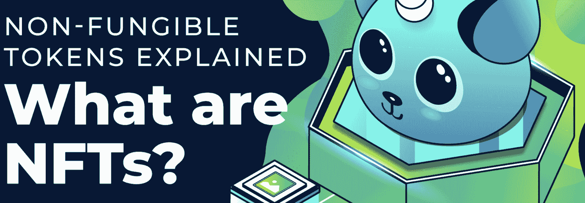

# 什么是多边形 NFT API？–多边形 NFT API 解释

> 原文：<https://moralis.io/what-is-a-polygon-nft-api-polygon-nft-apis-explained/>

随着对 NFTs(不可替代代币)关注度的提高，NFT 市场如 [**OpenSea**](https://opensea.io/) **等类似平台正在蓬勃发展。这并不奇怪，因为 NFT 市场正变得越来越有利可图。尽管** [**以太坊**](https://moralis.io/full-guide-what-is-ethereum/) **为**[**dapps**](https://moralis.io/decentralized-applications-explained-what-are-dapps/)**和 Web3 项目支持最广泛的生态系统，但网络正在变得拥挤，迫使开发者寻找替代的、更经济的解决方案。因此，blockend 开发人员使用多边形网络构建 NFT 项目变得越来越流行。然而，即使作为一个流行的分散缩放平台，在网络上构建**[**web 3**](https://moralis.io/the-ultimate-guide-to-web3-what-is-web3/)**NFT 项目可能会相当麻烦。出于这个原因，程序员正在过渡到多边形 NFT API 等工具，因为它们使** [**blockend 开发**](https://moralis.io/blockend-development-what-is-it-and-how-to-become-a-blockend-developer/) **更加直观。然而，到底什么是多边形 NFT API 呢？**

在本文中，我们将深入多边形 NFT API 的复杂性，以便更好地理解这些开发工具。此外，我们将进一步了解 Moralis 的 NFT API，因为它具有跨链兼容性，是市场上最好的多边形 NFT API 之一。所以，如果你跟着做，我们将为你提供你需要的关于多边形 NFT API 的一切，并希望让你成为一个更熟练的 Web3 开发者！

除了 NFT API， [Moralis](https://moralis.io/) 还提供了额外的工具和完全托管的后端基础设施。此外，操作系统为您提供了构建高级 dapps 的基本要素。例如，你可以学习如何[创建一个 OpenSea 克隆](https://moralis.io/create-an-opensea-clone-build-an-nft-marketplace-like-opensea/)来建立你自己的 NFT 市场。

所以，如果你想为分散式网络开发 NFT 平台，马上创建一个 Moralis 账户！作为首要的 Web3 开发平台，Moralis 为您提供所需的一切。此外，首先，它是免费提供给你的！现在，让我们通过查看 NFT API 基础知识开始我们的“多边形 NFT API”之旅！

## 多边形 NFT API-什么是 NFT 应用程序编程接口？

为了理解什么是多边形 NFT API，我们认为从解释什么是 NFT API 开始是有益的。我们先来考察一下“API”。API 代表“应用程序编程接口”。此外，API 是允许两个应用程序或软件相互通信的媒介。每当你在手机上使用脸书等应用程序、发送信息或查看天气时，你都在接触一个 API。


在电脑或手机上使用 dapp 时，该软件会连接到互联网并将数据传输到服务器。一旦服务器检索到数据，它需要解释信息，执行必要的操作，并最终向您的设备发回响应。然后轮到你的设备解释数据，并以可读的方式呈现出来。此外，这个完整的过程通常由 API 来促进。

API 翻译或传递一组相互理解的指令，并通过根据请求一致地交付功能，确保在安全的开发环境中进行可协调的编码。我们可以用一个餐馆的比喻作为例子。在这种情况下，厨房是照顾你的订单的“系统”。但是，您通常不直接与厨房通信，而是使用一个中介，比如服务器。在这个类比中，服务器是促进你和厨房之间通信的 API。因此，服务器传递您的请求/订单，然后向您提供响应，在本例中是食物。

既然我们已经知道了 API 是什么，那么它在 NFTs 的上下文中意味着什么呢？NFT API 向 NFTs 提供了上述功能。因此，这些 API 允许开发人员以更容易访问的方式获取关于 NFTs 的后端信息，从而使 NFT 开发变得更容易管理！

### 什么是多边形网络？

在深入研究多边形 NFTs 和多边形 NFT API 之前，让我们仔细看看多边形和这个网络的细节。要理解多边形为什么会出现，为什么它的存在是必要的，一个很好的起点就是看以太坊网络。以太坊是 Web3 开发最突出的区块链；然而，在相当长的一段时间里，网络遇到了拥塞问题。这是以太坊受欢迎的结果，也是该网络尚未被大规模采用的事实。


为了解决以太坊的拥塞问题，出现了所谓的“缩放平台”或“缩放解决方案”来缓解链，其中之一是多边形。Polygon 相信“Web3 for all ”,是一个去中心化的以太坊扩展平台。该网络允许开发人员以较低的交易费用构建 dapps，同时保持与以太坊 mainnet 相同的安全级别。

Polygon 的本地货币被称为 MATIC，它是一种 [ERC-20](https://moralis.io/erc20-exploring-the-erc-20-token-standard/) 令牌，表明与其他基于以太坊的加密货币兼容。令牌用于管理多边形，并作为一种保持网络安全的方式。此外，它还用于支付网络促成的低交易费用。

由于 Polygon 的 PoS(proof-of-stage)共识机制，它可以实现更高的可扩展性和更低的交易费用。这种机制要求网络参与者用他们的 MATIC 来交换验证网络交易的权利。完成这项任务的验证者将获得额外的 MATIC 奖励。与 Polygon 不同，Ethereum 使用 PoW(工作验证)共识机制，这导致了可伸缩性问题。

### 什么是多边形 NFT？

对多边形网络有了更好的理解后，在进入多边形 NFT API 之前，我们可以继续前进，近距离观察多边形 [NFTs](https://moralis.io/non-fungible-tokens-explained-what-are-nfts/) 。然而，我们首先需要理解 NFT 和这些令牌需要什么。

NFT 是“不可替换令牌”的缩写，顾名思义，它们是独一无二的。“不可替代”一词源于传统经济学，用于标记独特的资产，如财产、歌曲或艺术品。因此，NFT 本质上是生活在区块链上的独一无二的令牌。由于惟一性是这些令牌的普遍特征，这使得它们非常适合于表示我们前面提到的资产。



与 NFT 的相对的另一种常见令牌类型*是可替换令牌。相反，这些是可互换的资产，一个明显的例子就是货币。例如，所有的美元都是相等的，这意味着两美元可以免费交换。密码行业的以太网也是如此。一个 ETH 与另一个 ETH 的价值完全相同，这表明它们是可以互换的。此外，还有额外的令牌类型，比如半可替换令牌。如果这听起来很有趣，你可以阅读一下 [ERC-1155 令牌标准](https://moralis.io/erc1155-exploring-the-erc-1155-token-standard/)，它更详细地涵盖了这些资产。*

在面的上下文中，NFT 基本上是一个位于面网络上的令牌。其他网络也是如此。以太坊 NFT 是生活在以太坊网络上的 NFT，以此类推。

大多数人听说过的一些最受欢迎的 NFT 是无聊猿游艇俱乐部收藏的一部分。这是一个包含数以千计的 NFT 的收藏，有时被以天文数字的价格买卖。如果你对此感兴趣，可以看看我们关于[如何生成数千个 NFT](https://moralis.io/how-to-generate-thousands-of-nfts/)的文章。

## Moralis 的 NFT API–终极多边形 NFT API

Blockend 开发人员可以通过利用开发工具显著提高效率。一个这样的工具是 Moralis 的 [NFT API](https://moralis.io/nft-api/) ，允许你轻松创建各种与 NFT 相关的项目。此外，NFT API 具有跨链兼容性，这意味着它对以太坊、币安和 Polygon 等几种不同的网络都很有价值。


Moralis NFT API 可以被描述为一个规范化的跨链 API，可以说它使你避免了“重新发明轮子”。因此，这种“多边形 NFT API”提供了一种基础设施，有助于您的项目和各种区块链之间的通信，以获取与 NFT 相关的数据。这意味着您可以专注于开发过程的其他部分，例如为您的客户创造价值。

因此，Moralis 的 NFT API 使得多边形网络上的 NFT 开发更易于管理。然而，这是如何工作的，这对开发人员有什么好处呢？在以下三个部分中，我们将了解如何快速轻松地获取面 NFT 所有权数据、元数据和传输数据。所以，事不宜迟，让我们开始探索通过终极多边形 NFT API 可以获得什么类型的 NFT 所有权数据！

### 获取多边形 NFT 所有权数据

根据你想创建的与 NFT 相关的项目的类型，获取准确的 NFT 所有权数据是非常有益的。您可以使用 Moralis 的 NFT API 快速获取多边形 NFT 所有权数据，并避免设置自己的基础设施来跟踪 NFT。此外，当代币在市场上交易时，您不需要担心客户代码。

关于 Polygon NFT 所有权的数据是实时更新的，并且在交易完成后立即可用。还记得上一节的 NFT 系列吗？有了 Moralis NFT API，你只需要几行代码就可以获得一个集合的所有所有者。

此外，该 API 还有一个特性叫做“令牌门”。这使得开发者只需简单的点击几下就可以“令牌门”他们的内容。因此，创作者可以收回对其内容的完全控制权。

此外，您可以通过以下命令轻松地查询所有权数据:

```js
const options = { address: "", chain: "" };
const nftOwners = await Moralis.Web3API.token.getNFTOwners(options);
```

### 获取面 NFT 元数据

NFT 通常附有元数据，例如引用数字艺术或其他虚拟资产。还可以将其他特征和规范附加到 NFT 的元数据中。因此，NFT 元数据是这些令牌的重要组成部分，对于开发 NFT 相关平台非常有价值，这就是为什么 Moralis 的 NFT API 允许您查询这类信息。

您将不得不在没有 API 的情况下手动解析智能合约，这通常是一项非常乏味的任务。然而，NFT API 负责标准化数据的所有繁重工作。这意味着你需要做的就是查询你想要的信息。因此，您可以轻松检索关于面 NFT 元数据的信息。

此外，Moralis 的 NFT API 允许您通过所谓的“搜索端点”在 NFTs 的元数据内部进行搜索。这意味着您可以搜索在开发 NFT 项目时会有帮助的特定属性或描述。下面是一个通过 Moralis [Web3 SDK](https://moralis.io/exploring-moralis-sdk-the-ultimate-web3-sdk/) 看到的例子:

```js
const options = { address: "", chain: "" };
const metaData = await Moralis.Web3API.token.getNFTMetadata(options);
```

### 获取多边形 NFT 传递数据

最后，我们要仔细了解的关于多边形 NFT API 的最后一条信息是多边形 NFT 传输数据。通过 Moralis NFT API，可以跟踪区块链上发生的 NFT 转移。例如，您可以通过搜索特定块的所有令牌传输来获取传输信息。此外，您可以基于特定令牌、NFT 合同地址或钱包地址来搜索信息。此外，这并不局限于多边形 NFT，因为该工具是跨链兼容的。因此，相同的功能在其他类似的链上也是可用的。以下是如何使用 API 获取 NFT 传输数据的示例:

```js
const options = { chain: "", address: "",  limit: "" };
const transferNFT = await Moralis.Web3API.token.getNFTTransfer(options);
```

因此，有了 Moralis NFT API，你可以避免设置基础设施、托管和跨链开发的麻烦。这将使你作为开发人员的生活变得更加容易，你将能够在很短的时间内创建 dapps。

有关 Moralis NFT API 的更多信息，请查看官方的 NFT API [GitHub 库](https://github.com/nft-api/nft-api/#moralis-sdk-8)。在那里，您可以发现关于 API 如何改进您的开发人员体验的更多信息。然而，如果你更愿意为币安网络开发 NFT 项目，请查看我们的其他指南，探索[币安 NFT API](https://moralis.io/binance-nft-api-what-is-it-and-how-does-it-work/) ！

## 什么是多边形 NFT API？–总结

随着以太网使用的增加，利用第 2 层扩展解决方案(如多边形网络)来避免过多的天然气成本变得越来越有吸引力。更重要的是，随着对 NFTs 兴趣的增加，现在开发与 NFT 相关的项目比以往任何时候都要热。出于这两个原因，我们带着这篇文章去探索 Moralis 的多边形 NFT API。

多边形 NFT API 对多边形网络上所有 NFT 项目的开发过程有很大的帮助。获得这样一个工具最简单的方法是通过支持几个网络的 Moralis NFT API，包括 Polygon。使用 Moralis API，可以轻松获取 NFT 所有权数据、元数据和传输数据！


然而，这只是利用 Moralis 操作系统的众多好处之一。Moralis 的底层后端基础设施，以及其他工具，如 [Moralis Speedy Nodes](https://moralis.io/speedy-nodes/) 、Moralis 的 [Price API](https://moralis.io/introducing-the-moralis-price-api/) 和 [Moralis 元宇宙 SDK](https://moralis.io/metaverse/) ，使所有 blockend 开发变得更加容易。事实上，通过使用 Moralis，您将能够将所有未来项目的平均开发时间减少高达 87%!

因此，如果你是一个有抱负的 blockend 开发者，[注册 Moralis](https://admin.moralis.io/register) 并在几分钟内开始开发！

此外，如果你想进一步磨练你的 Web3 开发技能，可以去看看 Moralis 学院。学院提供[区块链课程](https://academy.moralis.io/all-courses)如 [JavaScript 编程 101](https://academy.moralis.io/courses/javascript-programming-for-blockchain-developers) 、 [Moralis Web3 Dapp 编程](https://academy.moralis.io/courses/moralis-web3-dapp-programming)、[以太坊基础](https://academy.moralis.io/courses/ethereum-101)等。所以，报名参加学院，马上成为区块链认证！