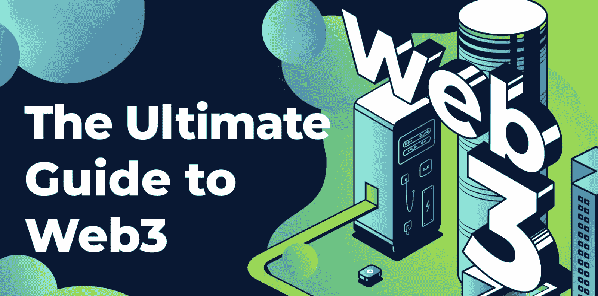
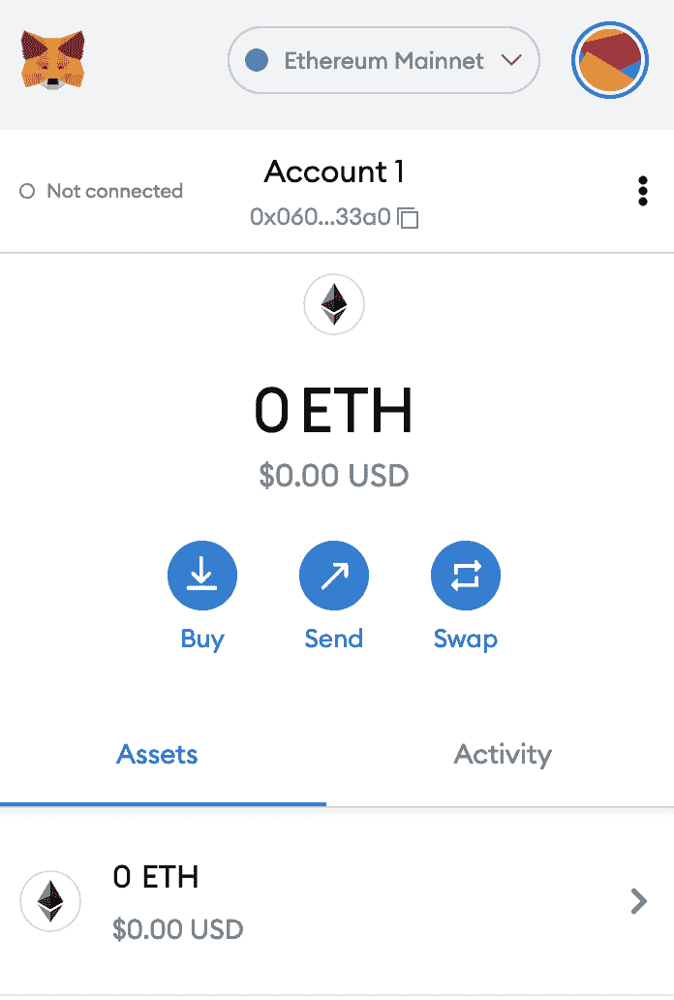
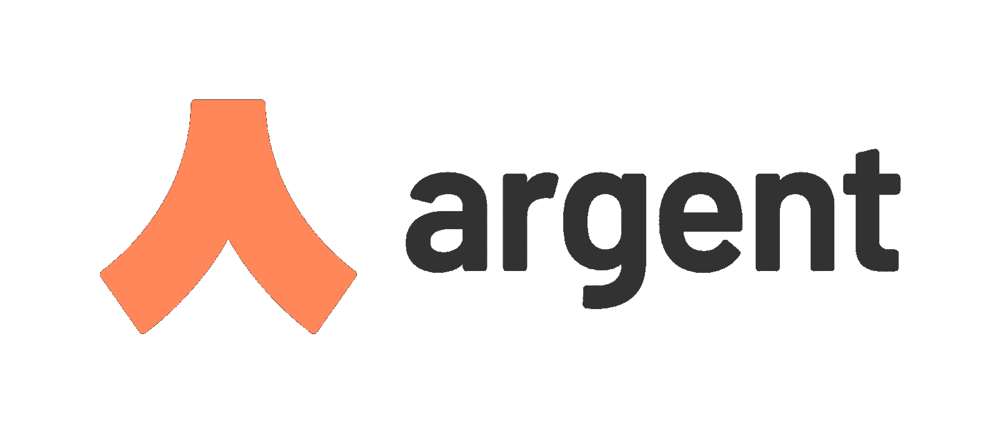
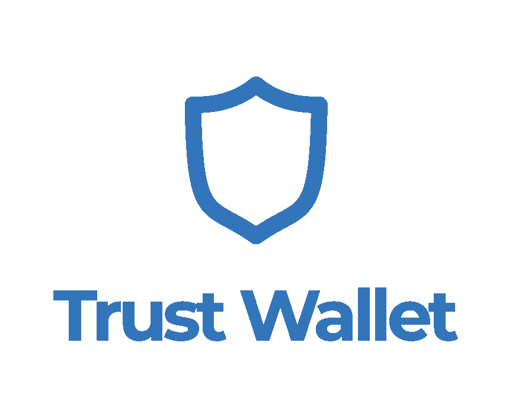

# 什么是 Web3 钱包？–web 3 钱包解释

> 原文：<https://moralis.io/what-is-a-web3-wallet-web3-wallets-explained/>

随着对 Web3 兴趣的升温，对各种生态系统的参与也在急剧增加。此外，如果你对这个领域不熟悉，进入门槛似乎很高，很难逾越。然而，随着对 crypto 和 [**Web3 开发**](https://moralis.io/how-to-build-decentralized-apps-dapps-quickly-and-easily/?utm_source=blog&utm_medium=post&utm_campaign=How%2520to%2520Connect%2520to%2520Avalanche%2520Nodes) **兴趣的增长，随着行业变得更加用户友好，这些障碍逐渐消失。随着变得更容易访问，加密空间也随着竞争的增长而发展，这意味着新的**[**dapp**](https://moralis.io/decentralized-applications-explained-what-are-dapps/)**(分散应用)、令牌、**[**NFTs**](https://moralis.io/non-fungible-tokens-explained-what-are-nfts/)**和 Web3 钱包不断开发。钱包对于进入加密领域至关重要，因为它们在 Web3 空间中实现了几个基本功能。因此，在本文中，我们将深入研究加密领域，并回答“什么是 Web3 钱包？”。**

随着对什么是 Web3 钱包有了更好的理解，我们也将更深入地研究市场上一些最受欢迎的替代品。此外，如果你对 Web3 开发感兴趣，并想创建自己的加密钱包，我们将为你指明正确的道路，这条道路从这里开始 [Moralis](https://moralis.io/) 。

有了 Moralis，你可以快速高效地开发自己的 Web3 钱包，因为你可以访问操作系统的底层后端基础设施。Moralis 是 Web3 开发的头号操作系统，除了后端基础设施，用户还可以访问广泛的工具箱。在这些工具中，你会发现一些解决方案，比如 [Moralis Speedy Nodes](https://moralis.io/speedy-nodes/) 、 [Moralis SDK](https://moralis.io/exploring-moralis-sdk-the-ultimate-web3-sdk/) 、 [Price API](https://moralis.io/introducing-the-moralis-price-api/) 、对 [IPFS](https://moralis.io/what-is-ipfs-interplanetary-file-system/) 的本地支持等等。

所以，如果你想成为一名区块链开发者，第一步就是和 Moralis 签约。这样做只需要几分钟，注册是完全免费的！

## 什么是 Web3 钱包？

如果你正在考虑参与加密，你旅程的第一步是获得一个 Web3 钱包。Web3 钱包是访问 Web3 空间、DeFi 和 crypto 的基本工具。你可能会偶然发现“Web3”或“加密钱包”这样的词。如果你是这个领域的新手，让我们先来回答这个问题“什么是 Web3 钱包？”。

首先，Web3 钱包本质上是数字钱包。因此，他们有能力存储数字资产。这包括从可替代到不可替代(NFTs)的所有令牌。其次，Web3 钱包也打开了加密领域的大门，允许你与各种区块链上的 dApps 进行交互。反过来，钱包帮助你进入一个庞大的 dApps 生态系统。

加密钱包通常具有非保管特性，这意味着作为钱包所有者，您可以存储数字资产，而不需要中介或中间人。这意味着，作为用户，您可以完全控制您的所有资产，因为其他人无法访问您的令牌。然而，在独占访问的情况下，所有的责任都由您承担，这意味着将私钥留给自己是至关重要的。

除了托管数字资产的能力，钱包通常还提供额外的功能。例如，这使得利用 Web3 钱包发送和交换令牌成为可能。因此，加密钱包可用于全面管理您的资产，包括获取额外令牌的方式。

市场上有各种各样不同的钱包，它们各有所长。其中最受欢迎的有 MetaMask、TrustWallet、Argent 等。然而，我们将在后面的另一节中更深入地探讨这些替代方案。此外，另一个值得仔细研究的话题是 [WalletConnect](https://moralis.io/what-is-walletconnect-the-ultimate-walletconnect-guide/) ，因为它与 Web3 钱包密切相关。

### 什么是 Web3？

随着区块链产业的出现，你很可能听说过“Web3”。然而，对于门外汉来说，这可能是一个陌生的术语，可能会有些混乱。因此，在本节中，我们将花时间解释和总结什么是 Web3。

一般来说，Web3 指的是互联网的“最新一代”或“阶段”。您可能已经猜到，前几代是您更熟悉的 Web1 和 Web2 阶段。三代互联网并非始于某个特定的时间点，也不是由某个单一实体发起的互联网革命。然而，每个阶段都有自己的特点，其中 Web1 是静态的，Web2 是动态的，Web3 是分散的。

随着去中心化成为互联网最新阶段的核心概念，数据去中心化占据了主导地位。不像 Web2，没有单一的集中实体拥有数据；相反，它是分布式和共享的。此外，Web3 还最终解决了公司拥有大量个人信息的问题，因为用户可以控制自己的数据。

在 Web3 生态系统中，我们还发现了另一个重要组件，即 dApps(去中心化应用程序)。这些都是分散的应用程序，通常位于区块链，最大的 dApps 生态系统目前位于区块链的[以太坊](https://moralis.io/full-guide-what-is-ethereum/)。有了 dApps 的去中心化特性，就有可能开发出强大的应用程序来消除中心化带来的各种问题，包括单点故障。

然而，如果你有兴趣了解互联网的最新阶段，我们推荐你阅读来自[Moralis 博客](https://moralis.io/blog/)的文章，更详细地解释 [Web3](https://moralis.io/the-ultimate-guide-to-web3-what-is-web3/) 。

## 你为什么需要一个 Web3 钱包？

在“什么是 Web3 钱包？”，我们简要介绍了为什么有人会需要这样一个钱包。然而，在文章的这一部分，我们将详细阐述这几点。那么，你为什么需要一个 Web3 钱包呢？

Web3 钱包的第一个用例是完全管理您的加密资产的能力。为了举例说明这一点，我们将仔细看看市场上最大的加密钱包 MetaMask。如果你有一个元掩码账户，你可能已经熟悉了钱包的工作方式；尽管如此，界面看起来是这样的:

如您所见，您有两个不同的选项卡，一个用于“资产”，一个用于“活动”。“活动”选项卡仅显示您的交易历史，您可以独立浏览。此外，在“资产”选项卡下，可以查看您的所有资产。此外，还有三个操作按钮:购买、发送、交换。这些按钮是不言自明的，我们将不再赘述。

然而，这表明作为一个加密钱包，您可以直接通过元掩码完全管理您的所有资产。此外，这不是唯一的，因为大多数其他钱包都允许你以类似的方式管理你的资产。

你需要一个 Web3 钱包的第二个原因是可访问性。加密钱包是各种区块链的入口。因此，Web3 钱包允许用户轻松访问 dApps，因为加密资产是与大多数应用程序交互所必需的。因此，用户可以使用他们的钱包来验证自己，确保他们有支付交易的手段。

如果你对用户认证更感兴趣的话，可以看看关于[如何使用元掩码认证](https://moralis.io/how-to-authenticate-with-metamask/)和[如何使用 WalletConnect 连接用户](https://moralis.io/how-to-connect-users-with-walletconnect/)的文章。

## Web3 钱包替代品

早些时候，我们提到随着越来越多的人进入加密领域，Web3 钱包的数量正在增长。这是简单的“供需”困境的结果，因为企业看到了在新兴市场发展的机会。然而，当用户试图在大量的选择中进行选择时，这可能会使用户感到困惑。

因此，我们将重点介绍五种可供选择的钱包，供您选择。它们中的大多数都服务于相同的目的；然而，它们会有些不同，并且它们以自己的方式是独特的。这五款 Web3 钱包是:

*   MetaMask
*   比特币基地钱包
*   阿尔根特
*   信任钱包
*   彩虹

所以，事不宜迟，让我们先来仔细看看 MetaMask！

### MetaMask

我们候选名单上的第一个 Web3 钱包是 [MetaMask](https://moralis.io/metamask-explained-what-is-metamask/) ，这是市场上最知名的钱包之一，在全球拥有超过 2100 万用户。钱包有两种不同的形式:移动应用程序或浏览器扩展。我们之前在强调为什么有人需要加密钱包时提到过元掩码。我们指出，通过元掩码以分散的方式完全管理加密资产是可能的。

但是，我们没有提到 MetaMask 是 dApps 以太坊生态系统的一个入口。此外，以太坊是最重要的发展区块链，这意味着有成千上万的应用程序可供 MetaMask 用户使用。因此，随着以太坊的不断发展，拥有一个 MetaMask 钱包将被证明是非常有益的。关于元掩码的更详细的指导，请看我们的[元掩码解释](https://moralis.io/metamask-explained-what-is-metamask/)文章。

### 比特币基地钱包

如果你对加密货币感兴趣，你可能听说过比特币基地。比特币基地是全球最大的加密货币平台之一，除了用户友好的平台，比特币基地现在还以[比特币基地钱包](https://www.coinbase.com/wallet)的形式提供 Web3 钱包。

比特币基地钱包是一个非托管的 Web3 钱包，独立于集中的比特币基地平台。因此，这为用户提供了一种独立于比特币基地中央控制体验 dApps 和密码世界的方式。此外，比特币基地钱包的一个独特之处在于，它可以根据用户名发送和接收加密资产。例如，当使用元掩码时，您只能根据钱包地址发送资产。这些是又长又难的单词和数字序列，这意味着它们容易出错，这可能会很成问题。

此外，如果你想了解更多关于发送代币的信息，你可以看看这篇关于如何发送 ERC-20 代币的文章。这凸显了与 Moralis 家合作时，送 [ERC-20 代币](https://moralis.io/erc20-exploring-the-erc-20-token-standard/)是多么容易。

### 阿尔根特

第三个钱包是 [Argent](https://www.argent.xyz/) ，它是市场上广泛的 Web3 钱包系列中相对较新的一个。Argent 迎合以太坊用户，因为它只与以太坊令牌兼容。此外，在使用 dApps 和 DeFi(去中心化金融)时，钱包专注于提供用户友好的客户体验。他们通过将 dApp 和协议原生集成到 Argent dApp 中来实现这一点。因此，可以通过他们的应用程序直接借入和借出资产，这表明可以避免使用应用程序内浏览器。

如果您想了解更多关于 DeFi 的信息，我们建议您查看"[什么是 DeFi？](https://academy.moralis.io/blog/defi-explained-an-easy-explanation-to-defi)文章来自[Moralis 学院](https://academy.moralis.io/)。而且，如果你想发展你的 DeFi 技能，你还可以仔细看看 [DeFi 101](https://academy.moralis.io/courses/defi-101) 和 [DeFi 201](https://academy.moralis.io/courses/defi-201) [区块链课程](https://academy.moralis.io/all-courses)。

然而，Argent 的一个主要挫折是钱包只迎合以太坊网络。因此，例如，不可能存储来自其他链(如比特币区块链)的令牌。

### 信任钱包

第四种选择是[信任钱包](https://trustwallet.com/)，与 Argent 不同，这种钱包有潜力存储任何类型的令牌。钱包是所谓的区块链不可知的，这意味着它支持来自各种链的资产。此外，由于 Trust Wallet 在全球拥有超过 1000 万用户，因此它在市场上的地位非常稳固。由于 Trust Wallet 支持多种资产和区块链，这使得该 Wallet 成为利用去中心化网络所提供的一切的合理选择。

### 彩虹

最后的选择是[彩虹](https://rainbow.me/)，是一款支持以太坊网络的非保管型钱包。而且 Rainbow 和 Argent 一样对以太坊网络的 dApps 有原生支持。这里的一个例子是 uni WAP V2，用于在应用程序中执行交换。彩虹钱包的另一个功能是支持 NFT。通过这个，钱包可以整齐地显示你所有的数字资产。

这些只是众多可供选择的方法中的五种，从简短的描述中你可能已经注意到了，它们彼此之间既相似又不同。因此，找到最适合你特定需求的钱包是你自己的事。

此外，如果你没有找到你喜欢的替代品，你也可以使用 Moralis 建立自己的 Web3 钱包。如果您对此感兴趣，请查看解释如何[构建加密钱包](https://moralis.io/how-to-build-a-crypto-wallet-in-4-steps/)的指南。此外，如果你更喜欢观看解释这一过程的视频，那么看看下面来自[Moralis YouTube 频道](https://www.youtube.com/channel/UCgWS9Q3P5AxCWyQLT2kQhBw)的剪辑:

https://www.youtube.com/watch?v=zd0pBsmJI8s

## 什么是 Web3 钱包？—摘要

如果你打算进入加密世界，那么你首先需要一个 Web3 钱包。加密钱包允许您管理您的所有数字资产，同时提供对 dApps 的分散生态系统的访问。此外，这一切都是可能的，同时保持对所有资产的完全控制，因为去中心化是 Web3 的本质特征。因此，不需要中介来执行交易、借贷和借入资产等操作。

随着人们对去中心化网络兴趣的增加，我们已经看到不同钱包替代品的数量大幅增加。然而，最受欢迎的五个选项是 MetaMask、比特币基地钱包、Argent、Trust Wallet 和 Rainbow。尽管这些备选方案有许多相似之处，但根据您的需求和情况，有些方案比其他方案更合适。

此外，借助 Moralis 的力量，可以轻松快速地开发出具有特定功能的专属钱包。这是可能的，因为 Moralis 用户可以利用操作系统的底层后端基础设施，使得在几分钟内创建一个全功能的 Web3 钱包成为可能。

然而，Moralis 的局限并不止于此。事实上，有可能大大缩短您未来所有区块链项目的开发时间。如果你还需要说服，看看博客上的文章，展示如何简单地[创建以太坊 dApps](https://moralis.io/how-to-create-ethereum-dapps/) 、[开发自己的 NFT 市场](https://moralis.io/develop-your-own-nft-marketplace-step-by-step-guide/)或[在五个步骤中创建 BSC 令牌](https://moralis.io/how-to-create-a-bsc-token-in-5-steps/)。

所以，如果你有野心提升你的 Web3 开发游戏，那么[马上和 Moralis](https://admin.moralis.io/register?utm_source=blog&utm_medium=post&utm_campaign=How%2520to%2520Create%2520a%2520BSC%2520Token%2520in%25205%2520Steps) 签约。这样做将提供对后端基础设施和 Moralis 工具的访问！