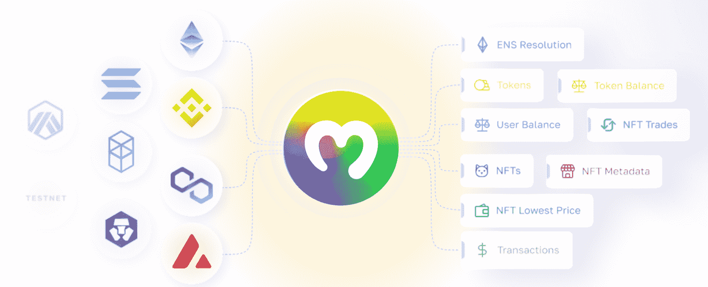

# 什么是以太坊 Dapp API？–轻松构建以太坊 Dapps

> 原文：<https://moralis.io/what-is-an-ethereum-dapp-api-build-ethereum-dapps-easily/>

如何快速构建 dapps 可能是传统程序员从 Web2 过渡到 Web3 开发时面临的最大障碍。不幸的是，不合标准的工具经常阻止有抱负的和有经验的开发人员在区块链上构建[**【dapps】**](https://moralis.io/decentralized-applications-explained-what-are-dapps/)**比如以太坊。因此，为了简化和使** [**以太坊开发**](https://moralis.io/ethereum-development-for-beginners/) **更容易理解，Moralis 创建了一个以太坊 dapp API。因此，无论是初学者还是专家开发者都可以轻松构建以太坊 dapps！然而，以太坊 dapp API 到底是什么？此外，Moralis 的以太坊 dapp 编程 API 如何帮助开发过程？请继续阅读，寻找答案！**

Moralis 是 Web3 开发的首要操作系统。作为用户，开发者有能力更高效地开发 dapps(去中心化应用)。Moralis 的力量部分来自于提供用户可以访问的强大的 web3 后端基础设施。此外，它还为开发人员提供了广泛的工具包，包括一些业界最好的开发工具。其中，你会发现 [Moralis Speedy Nodes](https://moralis.io/speedy-nodes/) ，Moralis 的 [Price API](https://moralis.io/introducing-the-moralis-price-api/) ，[元宇宙 SDK](https://moralis.io/metaverse/) ，对 [IPFS](https://moralis.io/what-is-ipfs-interplanetary-file-system/) 的原生支持，等等！

该平台的基础设施及其工具实现了更加无缝的 Web3 开发体验，允许您创建更加复杂的 dapps。例如，你可以学习如何创建一个 [Web3 Spotify](https://moralis.io/how-to-build-a-web3-spotify-clone/) 的克隆，甚至[创建自己的元宇宙](https://moralis.io/how-to-create-your-own-metaverse/)！此外，你可以通过查看[区块链开发的最佳语言](https://moralis.io/best-languages-for-blockchain-development-full-tutorial/)或 [Web3 前端](https://moralis.io/web3-frontend-everything-you-need-to-learn-about-building-dapp-frontends/)开发来了解更多关于如何进入 Web3 的信息。

与 Moralis 家合作的所有优势，注册免费是显而易见的。此外，您可以完全免费创建您的帐户，而且只需几秒钟就能启动！

## 什么是以太坊 Dapp API？–以太坊区块链

截至目前，[以太坊](https://moralis.io/full-guide-what-is-ethereum/)是众多区块链中的一个。然而，以太坊在许多开发者心中占有特殊的位置，因为它是第一个利用智能合约的可编程链。这种“先发优势”吸引了很多对去中心化概念感兴趣的开发商。随着以太坊的推出，该网络迅速成长为 Web3 开发的主要区块链。因此，该网络现在包括数千个 [ERC-20 代币](https://moralis.io/erc20-exploring-the-erc-20-token-standard/)、 [DeFi](https://moralis.io/what-is-defi-the-full-decentralized-finance-guide/) 项目、dapps、[NFT](https://moralis.io/non-fungible-tokens-explained-what-are-nfts/)等。，涵盖了行业内各种各样的部门。


以太坊使用一种叫做“ [Solidity](https://moralis.io/solidity-explained-what-is-solidity/) ”的编程语言，用于[创建智能合约](https://moralis.io/how-to-create-smart-contracts/)。Solidity 被称为第一种面向契约的语言，它同时受到了 [JavaScript](https://moralis.io/javascript-explained-what-is-javascript/) 和 C++的影响。因此，如果您想从事以太坊开发，最好有使用这两种语言的经验。更重要的是，有了 Solidity，你就可以构建与 EVM 兼容的智能合约，许多其他连锁店也支持这种合约。这表明学习 Solidity 不会将你限制在以太坊网络中。

以太坊网络的原生令牌是以太(ETH)，是市场上最大的加密货币之一。例如，ETH 用于支付在网络上进行交易所需的[以太坊燃气费](https://moralis.io/ethereum-gas-fees-the-ultimate-2022-guide/)。不幸的是，随着越来越多的人采用以太坊，这些费用飙升，使得开发以太坊 dapps 的成本更高。因此，如果你想在[建立以太坊](https://moralis.io/how-to-create-ethereum-dapps/)，你应该密切关注天然气成本。

这种推高天然气成本的拥堵问题部分源于以太坊使用的工作验证(PoW)共识机制。然而，随着以太坊逐渐实现特定的升级，如“[合并](https://moralis.io/ethereum-merge-what-is-ethereum-2-0-and-the-merge/)”(以太坊 2.0)，网络正寻求改为利益证明(PoS)。因此，它应该会减轻天文数字的天然气成本，并使以太坊的发展更实惠。

## 什么是以太坊 Dapp API？

在我们进一步了解什么是以太坊 dapp API 之前，我们需要更深入地了解 API 的概念。API 是“应用程序编程接口”的缩写，API 通过翻译指令来促进软件之间的通信，以便相互理解。因此，他们负责通过根据请求提供可靠和一致的功能，在安全和受控的开发环境中实现可靠的编程。


互联网的生态系统依赖于 API，当您使用任何设备时，都会不断地接触到这些接口。当在手机或电脑上使用 dapp 或应用程序时，该设备会连接到互联网，并将信息传输到服务器或数据库。然后，接收端需要解释数据，执行一些操作，并向您的设备发回一个响应。您的设备继续分析信息，并以可读的方式呈现出来。这整个过程通常由一个 API 来促进，确保两个软件可以成功地通信。

因此，在以太坊和分布式 web 的环境中，API 基本上确保了以太坊开发的上述功能。作为开发人员，您可以利用以太坊 dapp API 来使用已经准备好的代码片段，从而使以太坊开发变得更加容易。

您可以仔细看看其他的 API。一个例子是 Moralis 的 [NFT API](https://moralis.io/nft-api/) ，它使得 NFT 的开发更易于管理。此外，利用 NFT API 的跨链兼容特性，您可以轻松地为多个网络创建 NFT。例如，查看[以太坊 NFT API](https://moralis.io/what-is-an-ethereum-nft-api-ethereum-nft-apis-explained/) 来发现更多关于什么使你能够[用 Moralis 轻松创建以太坊 NFT](https://moralis.io/how-to-create-an-ethereum-nft-full-guide/) ！

### 为什么要用 Moralis 来开发以太坊 Dapps？

即使以太坊网络面临拥塞问题，它仍然是 Web3 开发的最主要的区块链。因此，在以太坊网络上开发 Web3 应用程序的一个最重要的原因是广大的开发者社区。此外，网络已经存在了一段时间，允许开发人员创建工具来简化 Web3 的开发。一个显著的例子是由松露、[加纳切](https://moralis.io/ganache-explained-what-is-ganache-blockchain/)和[毛毛雨](https://moralis.io/drizzle-explained-what-is-drizzle/)组成的[松露生态系统](https://moralis.io/truffle-explained-what-is-the-truffle-suite/)。诸如此类的工具使得以太坊开发对开发者很有吸引力——尤其是与强大的 Web3 开发平台结合使用。

这就是 Moralis 的用武之地，因为这个平台允许你作为开发者更有效地创建 dapps。首先，Moralis 允许您避免 RPC 节点的[限制，这意味着您可以更快更容易地启动 dapps。更重要的是，Moralis 支持跨链兼容。因此，您可以创建适用于多个网络的 dapps。反过来，您的 dapps 基本上是面向未来的！](https://moralis.io/exploring-the-limitations-of-rpc-nodes-and-the-solution-to-them/)



在支持的网络中，您会发现 Polygon、Cronos、Avalanche、BNB 链(BSC)、Fantom 和以太坊。此外，随着新网络的出现，Moralis 也在不断发展和增加。因此，一旦添加了新的链，只需简单点击几下，您就可以轻松地将 dapps 移植到其他链。因此，当与 Moralis 合作时，你不会把自己局限于一个连锁店，因此，可以迎合更多的观众。

## 什么是 Moralis 的以太坊 Dapp API？

除了平台的后端基础设施，Moralis 还提供了一套开发工具，其中之一就是 Moralis 的 Web3 API。此外，Web3 API 也是跨链兼容的，这意味着该接口适用于几种不同网络的开发工作，以太坊就是其中之一。


Web3 API 的以太坊支持使其成为一个完全可行的“以太坊 dapp API”。这意味着在为以太坊生态系统开发各种项目时，可以使用以太坊 dapp API。因此，如果你想[创建一个 NFT 市场](https://moralis.io/how-to-create-an-nft-marketplace/)、 [DeFi](https://moralis.io/what-is-defi-the-full-decentralized-finance-guide/) 项目、 [Web3 钱包](https://moralis.io/what-is-a-web3-wallet-web3-wallets-explained/)等等，都没关系。，API 将有助于所有的开发工作。

大多数 Web3 项目，就像我们刚刚提到的那些，通常都需要通用的功能。一些例子是用户认证、发送交易/令牌、获取链上数据等。由于这些是 dapps 的共同特征，在所有开发过程中重新发明它们是没有意义的。相反，可以通过复制和粘贴现成可用的代码片段，利用以太坊 dapp API 来实现这些类型的功能。

在下一节中，我们将仔细看看 Moralis Ethereum dapp API 在实践中是如何工作的。我们将提供三个例子，包括如何使用 MetaMask 进行[认证，获取交易/令牌数据，以及发送以太坊资产。所以，事不宜迟，让我们仔细看看如何认证用户，以及为什么这是有用的！](https://moralis.io/how-to-authenticate-with-metamask/)

## 以太坊 Dapp API–认证用户

大多数 dapps 需要的一个基本特性是认证用户的能力。一旦用户通过身份验证，就可以访问关于他们的加密货币钱包的信息，这在许多情况下非常有用。然而，即使作为一个基本特性，如果没有合适的工具来实现这一点，它也会相对麻烦。这就是 Moralis 的以太坊 dapp API 的用武之地，它只需两行代码就能让您使用[元掩码](https://moralis.io/metamask-explained-what-is-metamask/)对用户进行身份验证:

```js
Moralis.authenticate().then(function (user) {
    console.log(user.get(''))
})
```

这就是使用以太坊 dapp API 时所需要的一切，允许用户使用他们的 Web3 钱包登录。Moralis 的默认替代是元掩码；然而，这只是众多选择之一。例如，您可以在上面的代码中指定应该使用 [WalletConnect](https://moralis.io/what-is-walletconnect-the-ultimate-walletconnect-guide/) 。如果你想了解更多，请阅读我们的“[如何用 WalletConnect](https://moralis.io/how-to-connect-users-with-walletconnect/) 连接用户”文章。


那么，当用户进行身份验证时，到底会发生什么呢？当你用 Moralis 创建一个项目时，你只需点击几下鼠标就可以设置一个服务器。手边有一台服务器，它将额外为您提供对您自己的数据库的访问。一旦你的 dapp 的用户通过认证，它将自动填充你的 dapp 的数据库，你可以访问所有种类的链上信息。这些信息会不断更新，以确保您能够访问关于您的用户和受支持的区块链的状态的最相关的数据。

在接下来的部分中，我们将向您展示在使用 Moralis 时访问这些信息是多么容易。那么，让我们看看如何获取交易和令牌数据！

### 获取用户令牌和交易数据

一旦您的数据库被填充，通过您的代码获得对这些信息的访问是很有帮助的。手动设置可能相当麻烦；然而，使用 Ethereum dapp API，您可以只使用单行代码访问令牌/交易数据。取令牌数据；借助 Moralis，您可以轻松访问本地和 ERC-20 令牌数据:

1.  **本地令牌余额:**
    *   const balance =等待 Moralis。web 3 API . account . getnative balance()；
2.  **代币余额:**
    *   常数余额=等待 Moralis。web 3 API . account . gettokenbalances()；

此外，您还可以访问所有用户的交易历史数据。这就像获取令牌信息一样简单；所需要的只是一段代码:

```js
const transaction = await Moralis.Web3API.account.getTransaction();
```

### 发送以太坊资产

获取链上数据只是创建 dapps 的一部分；在许多情况下，允许用户通过 dapp 的 UI 发送以太坊资产也是必不可少的。此外，使您的 dapp 能够代表用户进行交易也非常有用。像查询链上数据一样，如果您必须手动设置，这将是一个麻烦的过程。然而，使用 Moralis 的以太坊 dapp API，您只需几行代码就可以发送各种资产。它可能是这样的:

**发送本机令牌:**

```js
const options = {
  type: "native",
  amount: Moralis.Units.ETH("0.5"),
  receiver: "0x..",
};
let result = await Moralis.transfer(options);
```

**发送 ERC-20 代币:**

```js
// sending 0.5 tokens with 18 decimals
const options = {
  type: "erc20",
  amount: Moralis.Units.Token("0.5", "18"),
  receiver: "0x..",
  contractAddress: "0x..",
};
let result = await Moralis.transfer(options);
```

**传输 NFTs:**

```js
// sending a token with token id = 1
const options = {
  type: "erc721",
  receiver: "0x..",
  contractAddress: "0xc02aaa39b223fe8d0a0e5c4f27ead9083c756cc2",
  tokenId: 1,
};
let transaction = await Moralis.transfer(options);
```

这就是关于什么是以太坊 dapp API 以及为什么需要 API 的教程。然而，关于以太坊 dapp API 的更多信息，请查看 Moralis 的官方 [Web3 API](https://docs.moralis.io/moralis-dapp/web3-api) 文档。

我们也强烈建议你仔细看看我们关于如何创建以太坊 dapp 的指南。这将为您提供如何启动自己的 dapp 的快速教程，以及以太坊 dapp API 如何工作的实践经验。因此，这将有望进一步展示与 Moralis 合作的力量！

## 什么是以太坊 Dapp API？–总结

随着对以太坊开发越来越多的关注，开发者需要一个以太坊 dapp API。API 提供了更无缝的开发者体验，这些接口允许更高效的 [Web3 开发](https://moralis.io/how-to-build-decentralized-apps-dapps-quickly-and-easily/)。这就是 Moralis 的舞台，它提供了一个跨链兼容的 Web3 API，支持以太网。这个来自 Moralis 的 API 充当了一个完美的以太坊 dapp API，允许开发人员轻松高效地创建 dapp。

有了这个以太坊 dapp API，您可以选择使用已经开发的代码片段。例如，这允许访问链上数据、[发送 ERC-20 令牌](https://moralis.io/how-to-send-erc-20-tokens/)，以及仅用几行代码验证用户。此外，Moralis 允许开发人员以更高的效率创建 dapps，提供了巨大的竞争优势。

更重要的是，Moralis Ethereum dapp API 只是众多开发工具中的一个，它提供了更加无缝的开发体验。您可能还会对 Moralis 的 web3uikit 感兴趣，它可以让您轻松创建美观的用户界面(ui)。要了解更多信息，你可以看看我们的教程[如何创建一个伟大的 dapp UI](https://moralis.io/web3-ui-how-to-create-a-great-dapp-ui/) ！

所以，如果你想创造 dapps，你绝对应该考虑 Moralis！你[可以完全免费与 Moralis](https://admin.moralis.io/register) 签约，[成为区块链开发者](https://moralis.io/how-to-become-a-blockchain-developer/)！