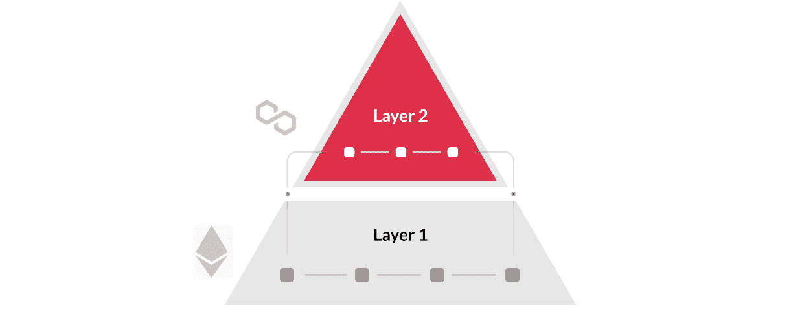
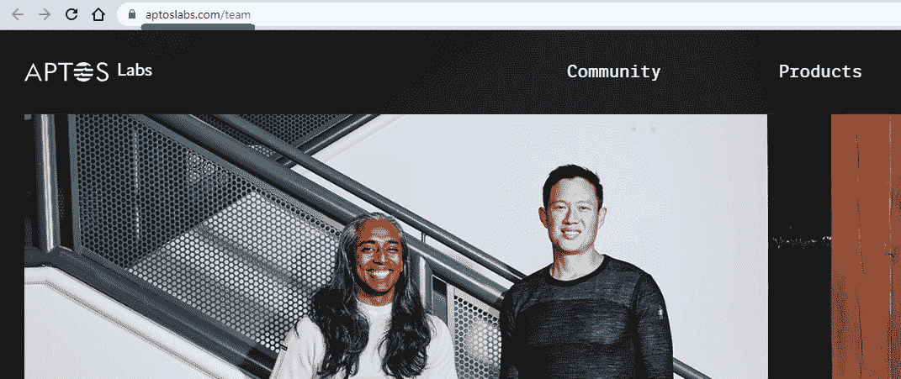
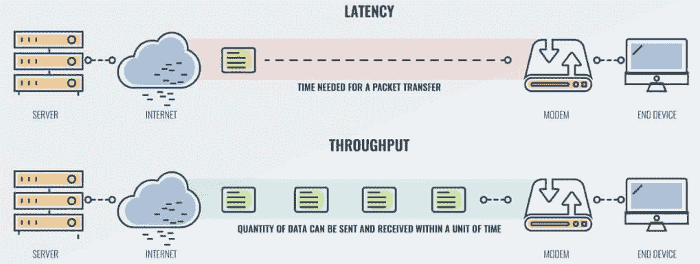
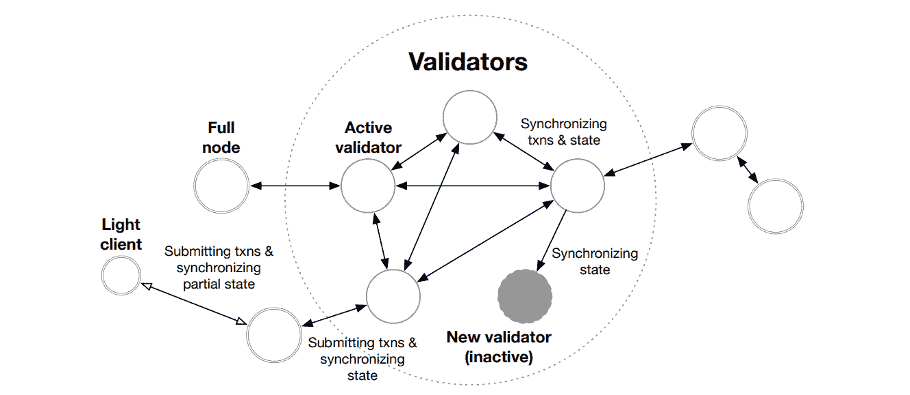
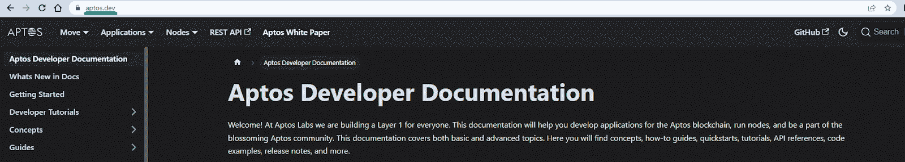
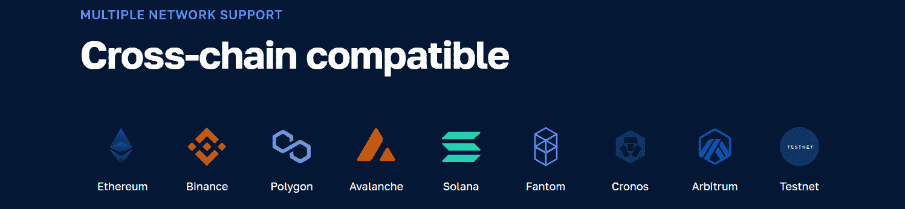
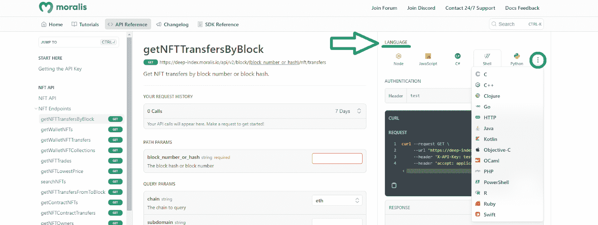
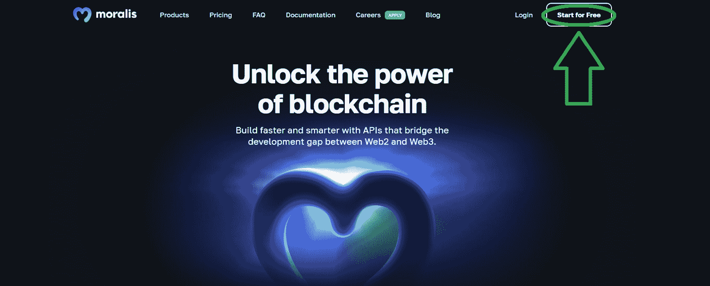

# Aptos 是什么？Aptos 区块链完整指南

> 原文：<https://moralis.io/what-is-aptos-full-guide-to-the-aptos-blockchain/>

区块链工业从未停滞不前，新的创新技术项目不断涌现。其中一个新项目是 Aptos 基金会——Aptos 区块链领先的关键增长计划。但是 Aptos 是什么呢？区块链是如何工作的？如果你一直在想这些问题，那你来对地方了。顾名思义，这本 Aptos 区块链的完整指南将为您提供决定是否要在这个第 1 层区块链上使用和开发所需的所有信息。

在谈到区块链网络和开发时，我们还将在本文中告诉您成为 dapp 开发人员的最简单快捷的方法。我们将快速概述当前 Web3 技术栈的顶峰——Moralis。此外，我们将向您介绍由 Moralis 为您带来的最先进的解决方案。此外，这个最终的 Web3 API 提供者连接了 Web2 和 Web3。因此，它使您能够使用遗留开发工具在广泛的支持链上构建杀手级 dapps。但是不用担心；我们还是会坚持这篇文章的主题。那么，让我们开始我们的“Aptos 是什么？”L1 区块链之旅！

## 什么是第 1 层区块链？

在回答“Aptos 是什么？”问题，我们必须确保你们都知道什么是第一层(L1)区块链。如导言中所述，这个新网络是第 1 层链。你应该记住，第一层网络都是“基地区块链”。甚至第一个区块链比特币也是第一层。因此，L1 充当生态系统的主要网络。

此外，从技术上讲，第 1 层协议是区块链，可以在自己的链上处理和完成事务。相反，第二层(L2)扩展解决方案依赖于 L1 的安全性和一致性。除了比特币，最受欢迎的 L1 包括以太坊、BNB 链、索拉纳、卡尔达诺、波尔卡多特、雪崩、阿尔格兰德、Near、Fantom 和宇宙。另一方面，目前最流行的 L2 缩放解决方案是 Polygon，它建立在以太坊之上。然而，你可能也听说过 Arbitrum、Loopring、Immutable X 等等。

*注:如果你想了解更多关于 L1、L2 和 L3 的知识，请务必查看 Moralis 学院的* [*第二层 vs 第三层*](https://academy.moralis.io/blog/layer-2-vs-layer-3-what-is-the-difference) *对比。或者，如果您是 crypto 新手，请参加“* [*区块链和比特币基础*](https://academy.moralis.io/courses/blockchain-bitcoin-101) *”课程，了解更多信息。*

## Aptos 是什么？

注意:首先，Aptos 区块链刚刚上线。因此，我们必须等待一段时间，看看它的表现如何。此外，请记住，您在本文中阅读的所有信息仅与 Aptos 的白皮书、文档和官方网站一样可靠。

白皮书称，其联合创始人莫谢赫和艾弗里程对区块链寄予厚望。这个可编程链旨在实现让所有人公平获得权力下放的愿景。此外，它应该通过一个安全、可升级、可扩展的区块链网络来实现。联合创始人创建了 Aptos 基金会和 Aptos 实验室来支持这些崇高的目标。基金会是专注于网络发展的力量。另一方面，Aptos 实验室致力于在 Aptos 区块链上开发产品和应用。Aptos 品牌使用“ *Aptos 是为人们设计的*”口号。

此外，值得一提的是，该组织选择该网络的名称是有原因的。毕竟，“aptos”来自奥龙语，意思是“人民”。

### Aptos 团队

就团队而言，唯一公开的名字是之前列出的联合创始人。值得指出的是，谢赫和程是梅塔(原脸书)的前雇员。他们负责试图创造的 Diem 区块链和诺维加密钱包。你可能知道，这些项目被取消了。尽管如此，这两位区块链专家在 Meta 学到了很多，并在 Aptos 项目中实现了他们的想法和技能。

尽管如此，根据 Aptos 实验室的团队页面，该团队由高度成功的工程师、研究人员、战略家、设计师和建筑商组成。他们共同致力于为数十亿用户提供能够扩展的普遍和公平的权力下放。此外，该团队的大部分人都被认为开发了驱动 Aptos 区块链的核心技术创新。

## 天才区块链 101

根据白皮书，该团队在过去三年中开发了 Aptos 区块链。全球有超过 350 名开发人员参与了这个新的第 1 层区块链的开发。此外，该链包括几个方面的新的和新颖的创新。Aptos 在共识、智能合约设计、系统安全、性能和去中心化方面有一些独特的变化。下面，我们将讨论 Aptos 链的六个独特的核心方面。但是，如果您对更多的技术细节感兴趣，请确保浏览该链的白皮书和项目文档。

### Aptos 编程语言是什么？

该链的一个独特之处是名为“Move”的编程语言。Aptos 团队发明了 Move，并将其原生集成到区块链中。除了其他好处之外，Aptos 链的这种本地语言提高了事务执行的速度和安全性。此外，Aptos 还为用 Move 编写的智能契约提供了一个正式的验证器，称为“Move prover”。这个形式验证器为契约不变量和行为提供了额外的保护。此外，这使得开发人员能够更好地保护他们基于 Aptos 构建的 dapps 免受恶意实体的攻击。

### Aptos 数据模型

Aptos 的第二个主要的独特方面是它的数据模型，它支持灵活的密钥管理。它还引入了混合保管选项。Aptos 还支持签名前的事务透明性和实用的轻客户端协议。根据白皮书，所有这些功能都提供了额外的安全性和总体上更值得信赖的用户体验。

### 流水线和模块化事务处理

该团队的目标之一是实现高吞吐量和低延迟。为了实现这一点，他们为事务处理的主要阶段实施了流水线和模块化方法。这种方法包括块元数据排序、并行事务执行、事务分发、分类帐认证和同时操作的批量存储。通过这样做，供应链能够充分利用所有可用的资源。此外，Aptos 团队认为这将提高硬件效率和并行执行。

### 任意复杂的交易

大多数并行执行引擎破坏了事务的原子性。它们通过要求预先了解执行引擎想要读写的数据来做到这一点。然而，Aptos 链对于开发者来说没有这样的限制。相反，它能够有效地支持原子性。它通过任意复杂的事务来实现。因此，这为实际应用提供了更高的吞吐量和更低的延迟。此外，这也简化了区块链上的开发。

### 客户端灵活性和即时升级

由于模块化架构设计，网络支持客户端的灵活性。这也优化了频繁和即时的升级。此外，Aptos 链提供嵌入式链上变更管理协议。这有助于 Aptos 开发人员快速部署新技术创新和支持新的 Web3 用例。

### 尝试未来的扩展计划

Aptos 链的第六个独特方面是，该链从一开始就在尝试未来的扩展解决方案。该团队希望能够超越单个验证器的性能。这就是链的模块化设计和并行执行引擎发挥重要作用的地方。毕竟，它们支持验证器的内部分片和同构状态分片。因此，存在水平吞吐量可伸缩性的潜力。此外，Aptos 开发人员认为，他们可以在不增加节点运营商复杂性的情况下实现这一目标。

## Aptos 开发人员文档——是什么？

像所有主要的协议和开发项目一样，Aptos 附带了相当广泛的文档。后者可以带你超越“Aptos 是什么？”我们在本文中涉及的概述。“开发者”这个词告诉你，它关注的是决定在这个区块链上构建的 Web3 开发者。因此，当您访问项目文档页面时，“Aptos 开发人员文档”是您可以访问有关即将推出的第 1 层区块链的所有信息的地方。此外,“入门”部分是一个起点。在这里，您可以找到获取 Aptos CLI(命令行界面)的链接以及各种工作流的链接。这些包括“运行本地测试网”、“管理帐户”、“生成密钥”、“编译移动包”、“运行完整节点”、“运行验证器节点”等等。

此外，文档分为四个主要部分:“节点”、“工具”、“白皮书”和“杂项”。此外，在“Aptos 区块链部署”页面的“节点”部分，您可以看到有关连接到 Aptos 区块链的四种方式的详细信息。这些包括 mainnet、devnet、长寿命测试网和 Aptos 激励测试网(AIT)。

### 使用跨链和跨平台系统开发 Dapps

由于 Aptos 链还没有时间来证明自己，我们很难建议你完全沉浸在网络中。当然，这并不意味着 Aptos 没有成为下一个以太坊的潜力。事实上，我们不建议关注任何单一的链。这就是为什么 Moralis 的 Web3 API 支持所有领先的可编程链。这种跨链的互操作性使您的工作经得起未来的考验。这也意味着你不会被任何特定的链条所束缚。

如果 Aptos 成功了，你可以期待它得到 Moralis 的支持。因此，你不会错过任何东西。也就是说，Moralis 目前支持以太坊、BNB 链、雪崩、多边形、Fantom、Solana、Arbitrum、雪崩、Cronos 以及它们各自的测试网。此外，其他连锁店也在 Moralis 的管道中。

此外，Moralis 还具有跨平台互操作性。因此，您可以使用遗留的编程语言和开发平台来加入 Web3 革命。此外，Moralis 文档中的 API 引用允许您选择想要关注的语言:

选择您喜欢的语言后，您可以简单地从“请求”框中复制相关的代码片段。此外，Moralis 还提供了与 Firebase、Supabase、Parse Server、Unity 和 PlayFab 的无缝集成。

Moralis 的核心产品包括:

*   [EVM API](https://moralis.io/evm-api/)
*   [索拉纳 API](https://moralis.io/solana-api/)
*   [NFT API](https://moralis.io/nft-api/)
*   [授权 API](https://moralis.io/authentication/)
*   [流 API](https://moralis.io/streams/)
*   [Token API](https://moralis.io/token-api/)

这些产品是轻松创建各种 dapps(分散式应用程序)的关键。事实上，你只需要[创建你的免费 Moralis 账户](https://admin.moralis.io/register)。然后，您将能够获得您的 Moralis Web3 API 密钥并开始“构建”。

## Aptos 是什么？Aptos 区块链完整指南——摘要

在这里，我们从基础开始，你有机会了解什么是第 1 层区块链。然后，我们仔细研究了回答“Aptos 是什么？”问题。这是我们解释 Aptos 是一个新的第 1 层(L1)区块链的地方。我们还通知你，当谈到 Aptos 团队时，我们只知道其联合创始人的名字，即莫谢赫和艾弗里·程。他们是 Meta 的前雇员，负责 Diem 区块链和 Novi Web3 钱包。这些项目最终被取消；然而，谢赫和清能够带着作为 Aptos 基础的技能和概念离开。除此之外，我们还关注 Aptos 链的六个独特的核心方面。最后，我们向您介绍了 Moralis 的特性，以帮助您采取 Web3 开发的最佳方法。

本质上，本文为您提供了两种选择。一方面，你可以潜得更深，远远超出“Aptos 是什么？”问题，通过使用 Aptos 文档。另一方面，您可以用简单的方法开始开发 dapps。在这种情况下，你应该浏览一下[Moralis 文件](https://docs.moralis.io/)、[Moralis YouTube 频道](https://www.youtube.com/c/MoralisWeb3)和[Moralis 博客](https://moralis.io/blog/)。这三个出口是你免费成为 dapp 开发者所需要的。除了许多优秀的教程，这些资源也可以作为您的免费持续加密教育。例如，一些最新的主题向您展示了如何将[动态 Web3 认证](https://moralis.io/add-dynamic-web3-authentication-to-a-website/)添加到网站，如何[使用 Firebase 作为 Web3](https://moralis.io/how-to-use-firebase-as-a-proxy-api-for-web3/) 的代理 API，如何集成[基于区块链的认证](https://moralis.io/blockchain-based-authentication-how-to-integrate/)，如何使用 [NodeJS Web3 模板](https://moralis.io/nodejs-web3-tutorial-create-dapps-using-a-nodejs-web3-example/)创建 dapps，等等。

如果你想进一步扩大你的 Web3 知识，成为区块链认证是一条路要走。这就是 Moralis 学院支持你的地方。

