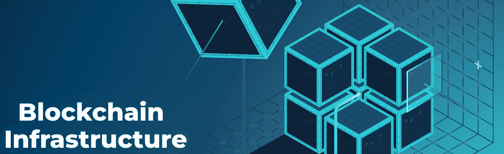
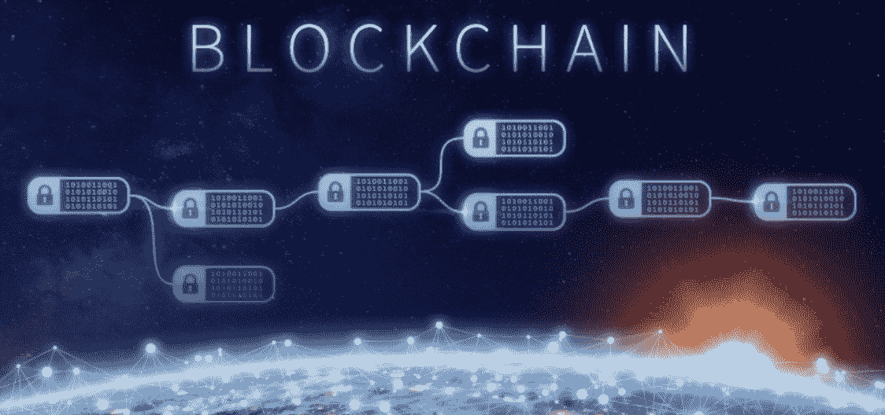
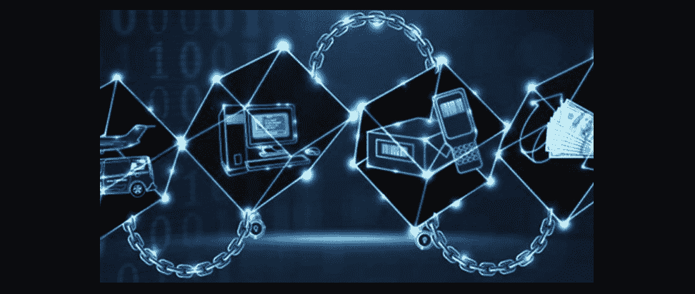
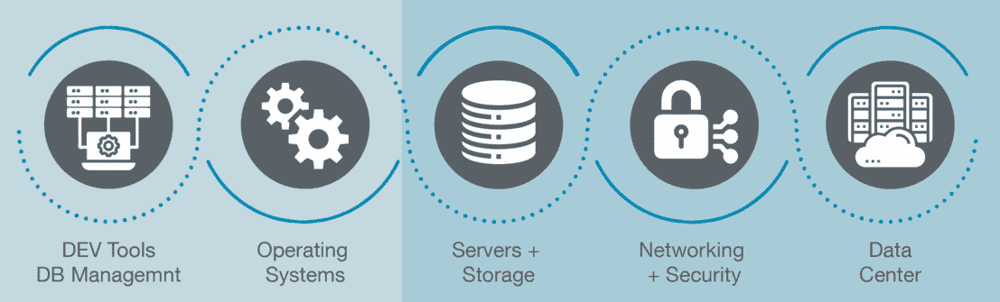
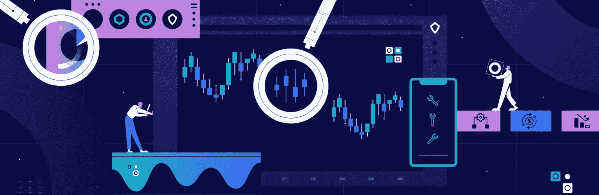
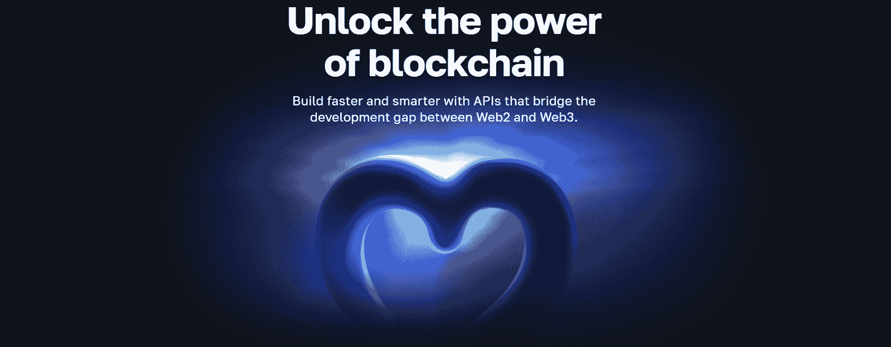
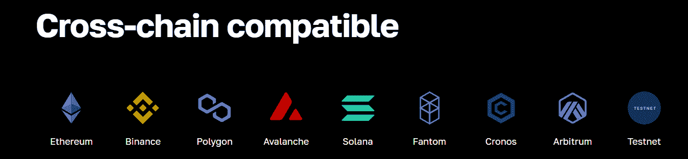

# 什么是区块链基础设施即服务？

> 原文：<https://moralis.io/what-is-blockchain-infrastructure-as-a-service/>

各种区块链基础设施服务的发展令人印象深刻。我们现在有数不清的公司、组织、项目和社区将区块链的发展推向了一个新的高度，Web3 比以往任何时候都更接近主流采用。此外，一个适当的区块链基础设施服务使开发者能够获得加密领域的核心优势，并毫不费力地实现 Web3。如果你想使用区块链基础设施即服务将你的业务或项目带入 Web3，这篇文章正适合你！

在今天的文章中，我们将为您提供关于当前区块链基础设施服务的所有信息。当然，我们将从基础开始，解释区块链基础设施需要什么。后者将帮助您理解区块链基础设施即服务的概念。此外，我们还将进一步了解一些领先的区块链基础设施服务。因此，您将能够确定应该进一步探索哪些解决方案。然而，有一个解决方案提供了市场上最好的 web 3 API——Moralis！由于 Moralis 是领先的 Web3 API 提供商，我们将讨论 Moralis 的区块链基础设施即服务解决方案必须提供什么。假设您想了解 Moralis 的工具如何立即帮助您的开发工作。在这种情况下，我们建议[创建你的免费 Moralis 账户](https://admin.moralis.io/register)并处理 [Moralis 文档](https://docs.moralis.io/docs)中的许多教程。

[**Explore Moralis’ Scalable Web3 Infrastructure**](https://moralis.io/scale/)

## 什么是区块链基础设施？

区块链基础设施由许多不同的部分组成。例如，区块链、dapps、智能合约平台、节点提供商、API 提供商和硬件组件都有助于基础架构。也就是说，让我们回到开始，看看是什么开始了这一切。

2009 年推出的比特币是第一个区块链。然而，虽然这个区块链网络有许多优点，但它对开发人员能做什么有限制。因此，一个区块链开发团队创造了以太坊——第一个完全可编程的区块链。如今，我们有几个其他著名的发展区块链(又名“区块链基础设施”)，新的定期出现。这些网络是所有区块链应用的基础层。没有这些网络，就没有 dapps(分散式应用程序)。此外，[区块链基础设施景观](https://moralis.io/blockchain-infrastructure-the-tech-and-landscape-empowering-developers/)包括物理设备、软件和当前[区块链技术栈](https://moralis.io/the-ultimate-blockchain-tech-stack-guide/)的所有其他层(见下图)。

然而，在本文中，我们可以将注意力放在 dapp 开发人员需要关注的技术、工具和解决方案上。毕竟，在创建 dapp 的时候，你肯定不想直接和区块链打交道。

### 增加清晰度——部门、行业团体和行业

除了以上对区块链技术栈的简洁描述，CoinDesk 的“*数字资产分类标准*”(DACS)可能是更好地了解区块链基础设施服务的一个很好的工具。这种数字资产分类为相对“混乱”的区块链产业带来了一定程度的清晰和统一。尽管如此，请务必花些时间来正确分析以下 DAC 的图形表示:

如上所述，DACS 定义了六个主要领域:计算、货币、DeFi、文化和娱乐、智能合约平台和数字化。虽然这六个领域都有各种各样的区块链基础设施服务，但“计算”和“智能合约平台”在区块链基础设施即服务中占据主导地位。

## 区块链基础设施即服务——它是什么，如何工作？

区块链基础设施即服务是一个受管理的区块链开发平台或工具，允许用户在现有区块链网络的基础上进行构建。此外，这意味着区块链的基础设施服务覆盖面很广。一方面，他们可以专注于帮助开发人员构建第二层区块链，并解决基础设施的底层问题。另一方面，区块链基础设施服务可以帮助开发人员构建和部署 dapps，从而直接接触用户。此外，区块链基础设施服务还包括所有后端工具，如数据存储，使 dapps 的创建成为可能。

一个合适的 Web3 提供商提供基础设施和区块链开发工具。如你所知，最初的区块链应用完全围绕加密货币。因此，“区块链即服务”(BaaS)一词是为货币部门保留的(正如您在 DACS 图表中看到的)。因此，它将 BaaS 定义为通常更加集中的协议，并为狭义定义的目的利用许可的区块链。因此，我们避免互换使用 BaaS 和“区块链基础设施即服务”。毕竟，大多数领先的区块链基础设施服务都与加密货币无关，也不是区块链协议。

尽管如此，将区块链基础设施即服务视为 Web3 的“软件即服务”可能会有所帮助。最终，可靠的区块链基础设施服务可以帮助企业轻松启动并运行应用程序。后者确保更高的敏捷性和更快的区块链采用。毕竟，如果企业要开发自己的与区块链相关的后端，他们会浪费大量的金钱和时间。当然，在特定的情况下，这种方法是有意义的；然而，在大多数情况下，应用程序通过使用已经建立的后端基础设施来关注前端的特定用例。

### 区块链基础设施服务

通过查看一些区块链基础设施服务，您将更好地理解区块链基础设施即服务的概念。因此，让我们看看计算部门的五个行业组(也是独立的新行业)。我们还将介绍在塑造区块链基础设施方面已经发挥重要作用的其他重要技术。

#### 计算机行业

根据 DACS 文档，计算领域包括侧重于分散和消除计算、云存储、数据库和网络等服务中介的协议。此外，DACS 还将计算行业分为五个行业组，所有行业组都提供重要的区块链基础设施服务:

*   **物联网**–物联网产业集团专注于通过将区块链网络融入现实世界来开发“物联网”和 Web3。本质上，这些类型的协议有助于物联网网络和区块链之间的互操作性。

*   **Oracle 协议**–Oracle 协议专注于收集、组织和传输数据。他们通过实时支持“链上对链上”和“链下对链上”数据来做到这一点。oracles 通常利用其网络的本地令牌来支付交易成本和治理权。

*   **私有计算**–这些协议都是关于建立一个自由的、分散的云计算能力、安全即服务、剩余带宽和其他计算服务的市场。

*   **共享网络**–这些分布式云计算的开放网络允许参与者以不同的价格向匿名买家提供能源和计算资源。

*   **共享存储**–共享存储协议旨在革新传统的集中式存储服务器。他们通过在一个由矿工/利益相关者组成的开源网络中分配存储责任来实现这一点。

#### 其他重要的区块链基础设施服务技术和工具

在下一部分中，您将了解到有关构建 dapps 的最佳区块链基础设施服务的更多信息。然而，即使是最终的解决方案也只能涵盖某些方面。因此，您将希望探索前面列出的协议和下面的技术和工具，以最终找到您的最终 Web3 技术堆栈。以下是领先的区块链基础设施服务技术和工具列表:

*   **节点提供商**–所有与区块链(分散式数字总账)的通信都通过节点进行。但是作为一名 dapp 开发人员，您希望避免运行节点，因为这是一项全职工作，面临许多挑战。相反，您可以使用节点运行公司来满足这些需求。当您决定开始部署智能合约时，您很可能希望使用一个或两个可靠的节点提供者(用于冗余)。

*   **Web3 API 提供者**–这可以说是最基本的“区块链基础设施即服务”工具/技术。毕竟，Web3 APIs 可以在稳定的环境中实现一致的编码。此外，有各种 Web3 API 提供者提供不同的 API。在大多数情况下，这些提供商连接到节点，并创建自己的区块链后端基础设施，您可以利用。因此，您可以使用简短的代码片段获得各种有用的预编译和预先计算的链上数据。

*   智能合约编程语言–这些语言使开发人员能够编写智能合约，它们在不同的可编程链中有所不同。

*   智能合同开发框架和 ide–框架和 ide 支持智能合同编码、编译、部署、验证和测试。

*   **Web3 钱包**——主要用于管理、发送、接收和存储加密货币。然而，它们在 Web3 认证、执行链上交易、测试 dapps 等方面也起着至关重要的作用。

*   **区块链探索者**——这些特殊类型的 dapps 使用户和开发人员能够探索链上数据，甚至与智能合同互动。

#### 区块链领先的基础设施服务项目

以下是上述每种技术解决方案和工具的领先项目列表。

**计算界代表**:

*   Helium (IoT)
*   Chainlink (oracle)
*   共享存储器
*   IPFS(分散存储解决方案，但不在区块链)

**节点提供商**:

*   魔力
*   Infura
*   快速笔记
*   山羊块
*   链板
*   运行节点
*   袖珍网络

**Web3 API 提供者**:

*   图表
*   共价的
*   魔力
*   快速笔记
*   肖像学
*   bigquery
*   Moralis

**专注于智能合同开发的项目/工具**:

*   Solidity(以太坊和 EVM 兼容链的智能契约编程语言)
*   truffle(EVM 兼容链的开发环境、测试框架和资产管道)
*   以太坊开发环境
*   Ganache(测试环境)
*   OpenZeppelin (Solidity 智能合同模板提供商)
*   Metaplex (Solana 智能合同模板和工具解决方案)
*   Remix Online IDE(编译、部署和验证 EVM 兼容链的智能对比)

**Web3 钱包**:

*   元掩码(以太坊和 EVM 兼容链)
*   彩虹
*   信任钱包
*   比特币基地钱包
*   阿尔根特
*   幻影(索拉纳)
*   分类帐

**区块链探索者**:

*   以太扫描(以太坊)
*   BNB 连锁超市
*   多边形扫描
*   雪迹(雪崩)

## 探索最佳区块链基础设施即服务解决方案

根据定义，适当的“区块链基础设施即服务”解决方案可以协调和维护对区块链设施的访问。它还开发在分散网络上构建的代码，并提供平台、开发工具、指标和分析、容器服务和社区支持，使开发人员的生活变得更加轻松。如果有一个项目能做到这一切甚至更多，那就是 Moralis。

这个最终的 Web3 API 提供者使遗留开发者能够弥合 Web2 和 Web3 之间的开发差距。它凭借令人印象深刻的跨平台互操作性实现了这一点。因此，您可以使用熟悉的编程语言、框架和平台加入 Web3 革命。此外，通过完全的跨链互操作，您可以创建多链 dapps，或者通过调整一行代码轻松地从一个链切换到另一个链。

此外，Moralis 的企业级 API 包含高功能。它们可以让您覆盖大量的呼叫，以快速访问所有 NFT、DeFi、交易和令牌数据。此外，由于 Moralis 的 Streams API，您可以通过 webhooks 将所有受支持的链的区块链数据传输到您的后端。因此，这使得 Moralis 成为最具[扩展性的 Web3 基础设施](https://moralis.io/scale/)工具之一。

由于其可靠的企业级工具，许多领先的 Web3 项目，包括 MetaMask、Delta 和 Polygon，都将 Moralis 的 [Web3 用于业务](https://moralis.io/web3-for-business-how-and-why-you-can-integrate-web3-into-your-enterprise/)解决方案。此外，借助 Moralis，企业可以将其项目的上市时间缩短 87%，并节省超过 8600 万美元的工程成本。使用 Moralis 满足您的“ [Web3 for enterprise](https://moralis.io/web3-for-enterprise-business-applications-in-web3/) ”需求的另一个明显优势是它的全天候全球支持和业界领先的[业务培训计划](https://academy.moralis.io/business)。总而言之，由于它的终极 [NFT API](https://moralis.io/nft-api/) 、[验证 API](https://moralis.io/authentication/) 、[令牌 API](https://moralis.io/token-api/) 和流 API，Moralis 是获取链上数据并以简单的方式创建 dapps 的终极工具。

## 区块链基础设施即服务？–总结

如果您花了一些宝贵的时间来讨论以上部分，那么您已经了解了关于区块链基础架构即服务的所有信息。你现在知道这项颠覆性新技术的主干有很多方面。您了解了一些工具是以链上协议的形式出现的，而另一些是以链外项目的形式出现的。事实上，您甚至有机会探索哪些是领先的计算协议和区块链基础设施服务项目。最后但并非最不重要的一点是，由于 Moralis——最好的区块链基础设施即服务解决方案，您发现您可以利用您的传统开发技能加入 Web3 革命。

如果你想简单地开始创建 dapps，你首先需要创建你的免费 Moralis 账户。接下来，您需要完成 Moralis 文档中的一些教程来掌握它的窍门。另一方面，你可能已经有了一些广泛的想法，你想以最小的麻烦来实现。在这种情况下，请务必遵循上面的“可扩展的 Web3 基础设施”链接，并联系我们的支持人员。

此外，您可能有兴趣进一步拓展您在区块链的发展视野。如果是这样的话，一定要访问[Moralis 的 YouTube 频道](https://www.youtube.com/c/MoralisWeb3)和[Moralis 的博客](https://moralis.io/blog/)。这两个出口涵盖各种加密主题，可以支持您正在进行的区块链教育。例如，一些最新的文章教你[AWS Lambda 如何工作](https://moralis.io/how-aws-lambda-works-functions-and-architecture-explained/)，如何创建一个 [AWS Lambda 函数](https://moralis.io/creating-a-lambda-function-learn-how-to-create-an-aws-lambda-function/)，所有你需要知道的关于 [ultimate ERC20 token API](https://moralis.io/exploring-the-ultimate-erc20-token-api/) ，什么是 [GameSparks](https://moralis.io/aws-gamesparks-guide-what-is-gamesparks/) 等等。当然，你也可以通过报名参加[Moralis 学院](https://academy.moralis.io/)来获得更专业的区块链教育，在那里你可以[在 2022 年](https://academy.moralis.io/courses/master-defi)掌握 DeFi。