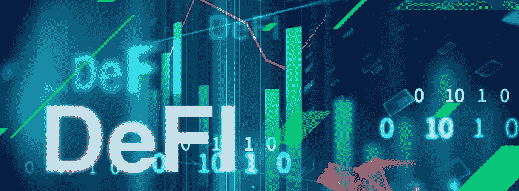
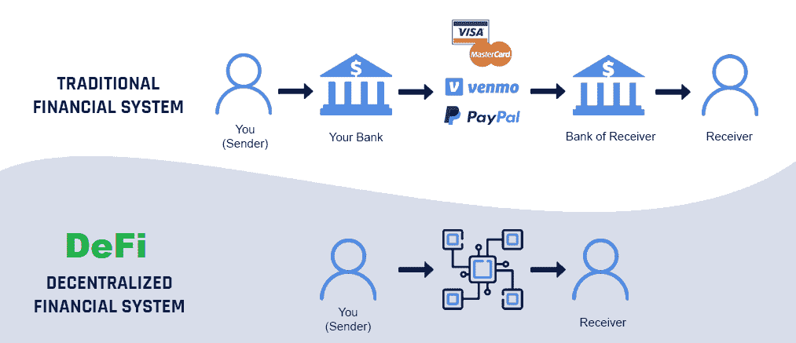
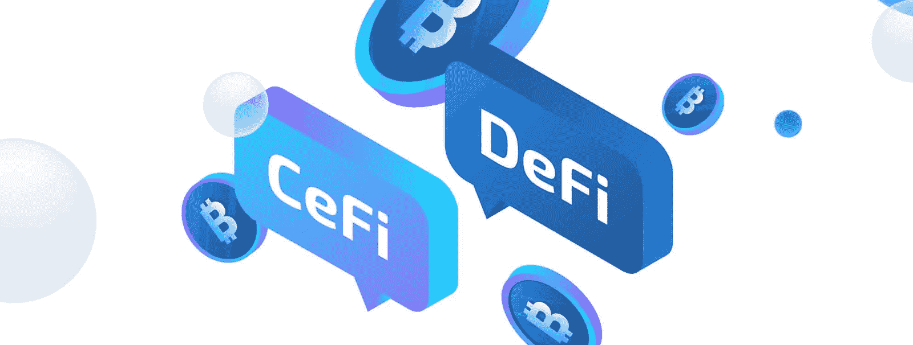
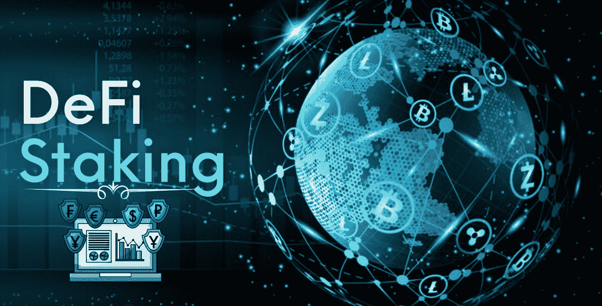
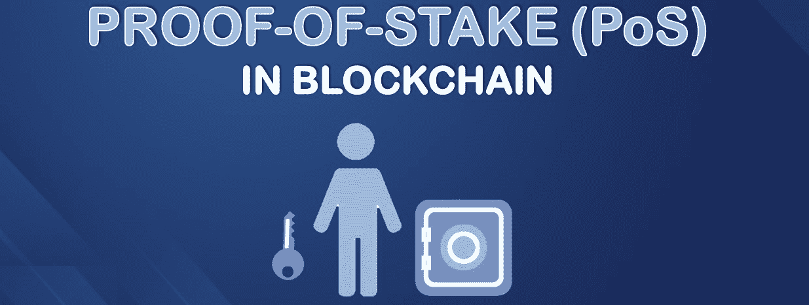
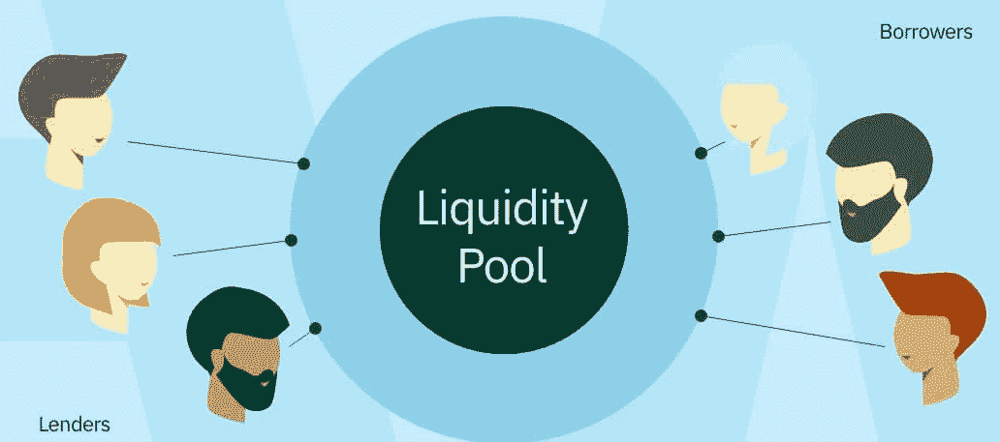
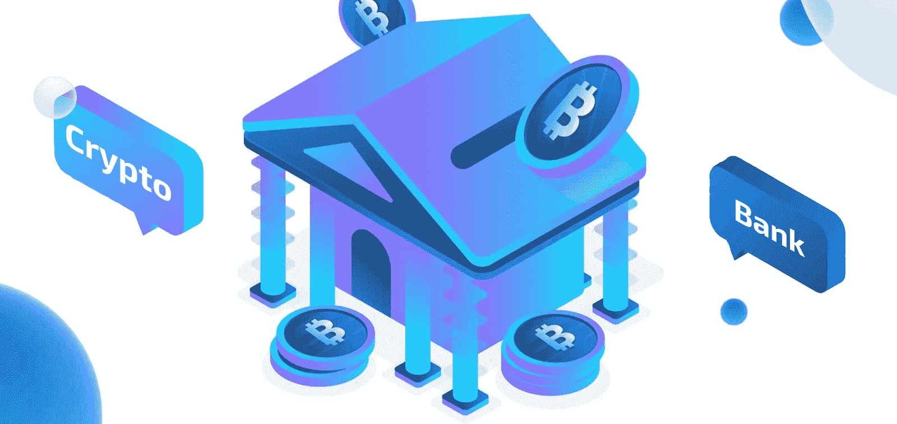
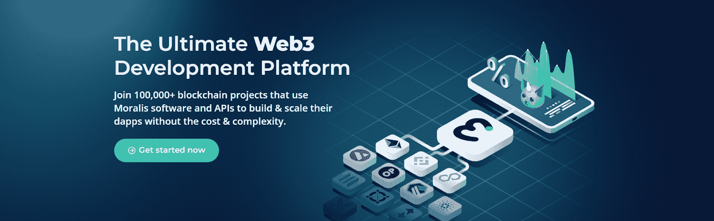

# 什么是定义赌注？–完整指南

> 原文：<https://moralis.io/what-is-defi-staking-full-guide/>

你很可能听说过 DeFi。DeFi staking 怎么样？你很有可能熟悉这些术语。然而，事实证明，大多数人对这些相对较新的金融概念缺乏正确的理解。此外，这个领域仍然存在许多不确定性和灰色地带。因此，我们决定创建这个完整的指南，并回答许多人思考的问题，“什么是定义赌注？”。几分钟后，您将对 DeFi 的潜在未来有一个更清晰的了解。那么，什么是定义赌注？让我们找出答案，好吗！

我们想指出，涉及 DeFi 的投资机会数不胜数。但是，最重要的潜力等待着区块链的开发人员，他们将帮助构建 dapps ( [去中心化应用](https://moralis.io/decentralized-applications-explained-what-are-dapps/))以确保 DeFi 成为主流。利用本文中获得的知识，您可以轻松地测试您的前端开发技能，并开始构建 DeFi staking dapps。有了终极 [Web3](https://moralis.io/the-ultimate-guide-to-web3-what-is-web3/) 开发平台， [Moralis](https://moralis.io/) ，就可以开门见山了。这个" [Firebase for crypto](https://moralis.io/firebase-for-crypto-the-best-blockchain-firebase-alternative/) "操作系统可以让你在几分钟内创建非凡的 Web3 应用程序。此外，这个先进的 [Web3 后端平台](https://moralis.io/exploring-the-best-web3-backend-platform/)涵盖了您所有的后端需求。因此，你可以专注于创造最好的 Web3 UI。因此，[今天就创建你的免费 Moralis 账户](https://admin.moralis.io/register)！然而，今天指南的任务是告诉你 DeFi 和 DeFi staking 涉及什么。此外，我们还将讨论定义堆栈的机制及其现有用例。

## 什么是 DeFi？

在我们讨论 DeFi staking 之前，我们需要确保大家都了解基础知识。分散金融(DeFi)是一个相对较新的术语，它于 2018 年 8 月问世。然而，尽管这个术语是在以太坊开发者和企业家之间的一次电报聊天中诞生的，DeFi 的概念却可以追溯到 2009 年。这是比特币的诞生，比特币是第一个公共分布式账本(区块链)。此外，比特币(链)也伴随着其本土加密货币 BTC(比特币)而来。尽管如此，比特币的诞生是为了支持点对点(P2P)交易。此外，由于交易是金融生态系统中相当重要的一部分，我们可以认为这是 DeFi 的开始。

然而，直到第一个可编程的区块链以太坊，DeFi 的全盛时期才成为可能。如你所知，使与可编程区块链交互成为可能的软件是[智能合同](https://moralis.io/smart-contracts-explained-what-are-smart-contracts/)和 dapps。智能合约的存在是为了确保链上交易按照标准和协议运行。因此，当满足预定义的条件时，预定义的操作就会执行。此外，dapps 确保用户能够与连锁店互动。

考虑到这一点，DeFi 的主要思想是提供所有传统金融(TradFi)的有用概念，并使它们去中心化。也就是说，让它们由分布式硬件推动，并消除与传统金融体系相连的无数中间商。当然，并不是所有的 DeFi 应用都是同等分散的；因此，中央集权财政也是一个东西。还有工作证明(PoW)与利益证明(PoS)区块链机制的问题。不过，这些细节还是留到以后讨论吧。因此，由于 DeFi 使用了现有的金融概念，所以对传统金融做一个快速概述似乎是公平的。

### 传统金融概览

银行是传统金融体系的核心。这些中央集权的公司，他们的目标是赚更多的钱，掌握着大多数人的钱。除了银行，传统金融领域还有很多第三方服务商。后者参与在双方之间转移资金。你猜对了——它们都是收费的。

让我们来看一个交易的例子。假设你用信用卡在当地商店买了一条面包。交易从商家转到收单银行。后者将卡的详细信息转发给信用卡网络，信用卡网络需要清除费用并向您的银行请求付款。接下来，您的银行批准收费，并通过收单银行将批准发送回网络给商户。当然，在这个过程中，所有相关的实体都要收取费用。因此，所有的交易都要花钱。更不用说这个过程可能相当缓慢。其他类型的交易和与传统金融的互动也是如此。当我们考虑贷款申请时，尤其如此。

抛开传统金融无数中间商的问题，银行是完全控制你的钱的。他们可以随时冻结你的账户。此外，由于不同的制度和政策，您的卡在某些国家可能无法使用。然而，贷款、借款、交易、储蓄和购买衍生品都是传统金融的机制。事实上，整个华尔街都是传统金融的一部分。因此，理想情况下，DeFi 将会把所有这些概念提供给任何一个有网络连接和钱包的人。这一理论已经有很多实例在实践，定义堆栈是其中的一个重要部分。

## 什么是定义赌注？

现在，我们对 DeFi 有了一个很好的理解，是时候来关注 DeFi staking 了。那么，什么是定义赌注？这个概念显然与分散融资和赌注有关。此外，对定义桩有两种不同的解释。如果我们从最“切中要害”的定义来考虑这个概念，它集中在为了成为第一层区块链或 DeFi 协议中的验证器而对加密资产进行标记。通过“标记加密资产”，我们指的是将可替换或[不可替换的令牌](https://moralis.io/non-fungible-tokens-explained-what-are-nfts/) (NFTs)锁定到智能合约中。此外，作为赌注加密资产的交换，用户因其赌注执行的职责而获得奖励。另一方面，如果我们从更广泛的角度来看 DeFi staking，它指的是涉及加密资产临时承诺的各种 DeFi 活动。

## defi starking 的机制

最纯粹的定义赌注形式是指用户锁定特定数量的本地代币或硬币，以成为 PoS(赌注证明)区块链网络中的验证者。此外，PoW consensus 算法需要计算能力来验证交易，这消耗能量并具有更大的碳足迹。另一方面，PoS 机制依赖于在给定链中有既得利益的验证者。以资产为赌注的验证者倾向于正确地履行他们的职责，以避免失去部分甚至全部股份的风险。当然，也有赌注奖励，进一步鼓励验证者创建和验证块。

有许多 PoS 区块链(例如，Polkadot、Algorand、Solana、Cardano 等。).然而，即使是最引人注目的可编程区块链以太坊也正在从 PoW 向 PoS(以太坊 2.0)过渡。此外，如果我们把它归结为基础，DeFi staking 过程需要一个有兴趣成为网络验证者的团体。该方需要提交“保证金”(赌注)，使其有资格获得赌注奖励。

不幸的是，这种直接下注方法通常具有相对较高的下注要求，这对于许多投资者来说是可望而不可及的。然而，一些赌注服务提供商提出了“赌注池”形式的解决方案。后者也可通过各种集中和分散的交易所获得。因此，用户可以形成更大的群体，反过来，较小的投资者可以参与赌注。

## 为什么使用 DeFi 铆接？

现在，您已经仔细了解了 DeFi staking 的核心概念，您已经知道它是用来为网络提供安全性的。通过随机选择 DeFi staking 参与者，他们基本上验证或“挖掘”有问题的块。但是，PoS 机制的细节在不同的链中有所不同。此外，我们必须考虑定义打桩的更广泛定义。在这种情况下，赌注可以为特定的交易密码对提供流动性。它还可以用来确保某个项目或加密货币的价值不会下降。此外，当平台出现问题时，押记资产可以用于其他目的。因此，不同 DeFi 平台的“为什么使用 DeFi staking”范围会有很大不同。

## defi starking 的好处

由于我们对 DeFi staking 的讨论是基于对 DeFi 原则的两种不同看法，因此好处也各不相同。例如，如果我们关注与 PoS 链的验证器相关的 staking，主要的好处是安全性和链正常工作。当然，大量的赌注本地代币也有助于防止加密货币的价格过度下跌。此外，与 PoW 相比，PoS 带来了对环境影响较低的优势。

好处也因视角不同而不同。因此，让我们看看 DeFi 标桩对那些标桩、标桩平台和 DeFi 生态系统的好处:

*   **定义打桩对打桩者的好处:**
    *   赚取被动收入的简单方法。
    *   赌注登记者通常获得较低的入场费。
    *   开始通常很简单。
    *   考虑到利率，回报通常会高于预期。
    *   在使用适当的智能合同的地方，利益相关者是高度安全的。
*   **打桩平台的 DeFi 打桩优势:**
    *   流动性增加。
    *   他们向用户提供的有吸引力的服务。
    *   来自赌注者和网络的收入。
*   **定义令牌/协议/区块链网络的好处:**
    *   相当动态的代币市值和流动性。
    *   验证模块的能耗低得多。
    *   DeFi staking 也有助于保持流动性。

### 从 TradFi 到 CeFi 和 DeFi

尽管 DeFi staking 有许多明显的好处，但认为所有现有的公司都会允许平稳过渡到 DeFi 将是愚蠢的。此外，许多用户害怕新技术带来的未知。因此，在不久的将来，我们最有可能期待传统金融和 DeFi 之间的某种混合。事实上，我们已经可以看到这一点用几个集中交易所来表达，这是 CeFi 的核心。在某种程度上，你可以把它们视为区块链的银行。

目前 DeFi 和 CeFi 用户不到全球人口的 5%。因此，我们离主流采用还很远。未来，不希望对其财务进行最高级别控制的用户很可能会继续使用现代化的银行或集中交易所，这将是 CeFi 的核心。另一方面，将有许多人喜欢最大限度地控制自己的生活，他们将选择接受 DeFi 服务。

在我们看来，我们都应该把 DeFi 作为未来金融的主导形式。至少在理论上，这个概念提供了一个更加“公正”的世界。因此，创建用户友好的 DeFi 平台就取决于您了，我们的下一代区块链开发人员。请记住，无缝的用户体验是主流采用 DeFi 的关键。幸运的是，Moralis 让你将最大的注意力和资源投入到创建最好的前端成为可能。因此，请确保您了解如何毫不费力地[创建 DeFi 仪表板](https://moralis.io/how-to-create-a-defi-dashboard-in-5-steps/)。使用 Moralis，成为改变世界的金融和互联网发展的一部分！

## 什么是定义赌注？–完整指南–摘要

您现在知道了定义堆栈是 PoS 共识机制的核心部分。您还了解了其他 DeFi staking 用例。此外，您还发现了定义赌注的好处。尽管如此，沿着这条路，你已经简要地看了 Moralis，当前的 [Web3 技术栈](https://moralis.io/exploring-the-web3-tech-stack-full-guide/)的顶峰。因此，你知道从哪里开始你创造非凡的 DeFi dapps 或其他类型的 Web3 应用程序的旅程。如果您想进一步了解 DeFi 知识，我们推荐您了解一下[闪贷](https://moralis.io/how-do-flash-loans-work-full-walkthrough/)和[道智能合约](https://moralis.io/dao-smart-contract-example-dao-guide/)的例子。

让我们提醒你，[进入 Web3](https://moralis.io/how-to-get-into-web3-in-2022/) 的最好方法是[成为一名区块链开发者](https://moralis.io/how-to-become-a-blockchain-developer/)，尤其是如果你精通 [JavaScript](https://moralis.io/javascript-explained-what-is-javascript/) 或 Unity。如果是这样，你可以立即用 [Moralis 的 SDK](https://moralis.io/exploring-moralis-sdk-the-ultimate-web3-sdk/) 处理更高级的项目。此外，如果你想继续你的免费加密教育，Moralis 博客和 YouTube 频道是你应该去的地方。这两个出口都提供了大量高质量的内容，包括许多示例项目。例如，一些最新的话题集中在[如何建立一个元宇宙游戏](https://moralis.io/how-to-build-a-metaverse-game-in-25-minutes/)，如何[与来自 Unity 的 Web3 数据库](https://moralis.io/how-to-communicate-with-a-web3-database-from-unity/)，[为什么 Web3 很重要](https://moralis.io/why-is-web3-important-a-beginners-guide/)，如何[存储离线数据](https://moralis.io/how-to-store-off-chain-data-unity-web3-database/)，如何[降低固体气体成本](https://moralis.io/how-to-reduce-solidity-gas-costs-full-guide/)，如何[创建一个以太坊 NFT](https://moralis.io/how-to-create-an-ethereum-nft-full-guide/) ，如何建立一个 [2D Web3 游戏](https://moralis.io/how-to-build-a-2d-web3-game-full-guide%ef%bf%bc/)，如何创建一个

然而，如果你想尽快成为一名 Web3 开发者，你可以考虑报名参加 T2 Moralis 学院。除了获得高质量的[课程](https://academy.moralis.io/all-courses)，你将成为一个了不起的社区的一部分，获得个性化的学习路径，并获得专家指导。