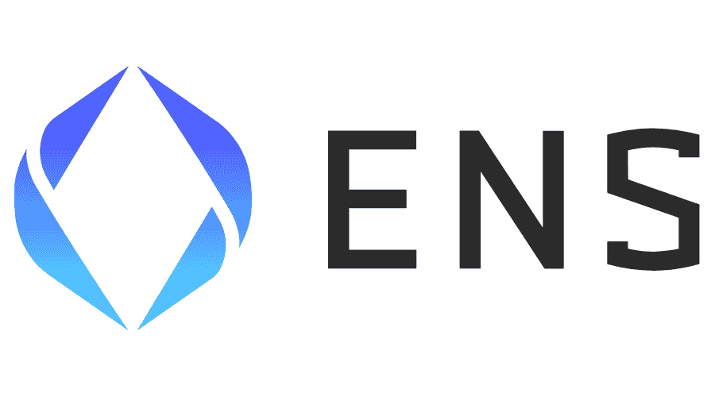
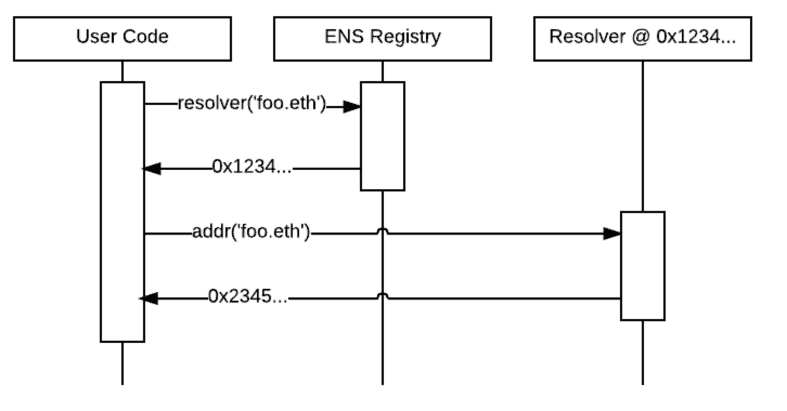
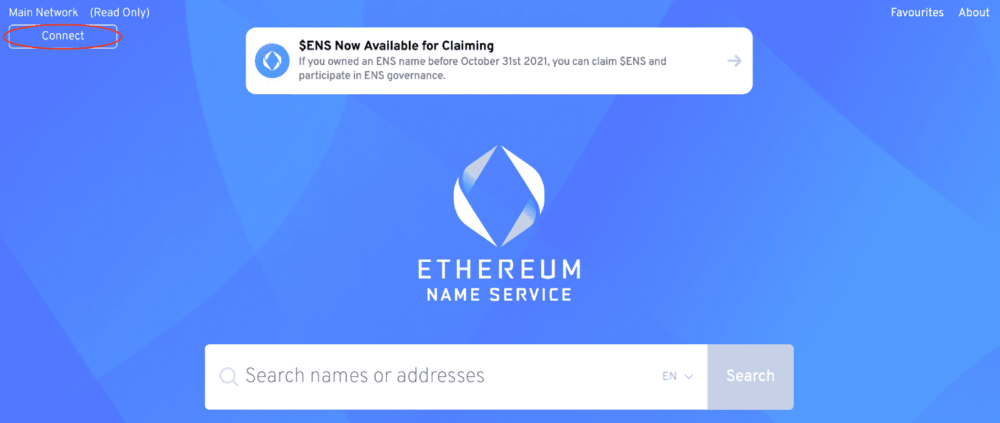

# 以太坊名称服务是什么？–完整的 ENS 指南

> 原文：<https://moralis.io/what-is-ethereum-name-service-full-ens-guide/>

**为了加速 Web3 的主流采用，查看 Web3 中用户摩擦的所有潜在来源并简化它们至关重要。其中一个例子就是** [**Web3 钱包**](https://moralis.io/what-is-a-web3-wallet-web3-wallets-explained/) **的又长又难记的地址。这些地址是为计算机设计的，而不是为了方便最终用户。然而，随着** [**Web3**](https://moralis.io/the-ultimate-guide-to-web3-what-is-web3/) **变得越来越普遍，开发者将专注于提高可用性和客户体验。一个旨在解决长钱包地址问题以实现更无缝的 Web3 用户体验的协议是 ENS(以太坊名称服务)。但是，以太坊名称服务到底是什么，它是如何工作的？**

在本文中，我们将深入研究 ENS，了解它是如何工作的，以及这项服务为什么如此重要。当我们这样做时，我们将更仔细地研究服务的两个主要组件:ENS 注册中心和解析器。此外，我们将简要介绍协议的[治理令牌](https://moralis.io/what-are-governance-tokens-full-guide/)以及 ens 的 DAO(去中心化自治组织)。最后，我们将以一个关于如何从以太坊域名服务获得自己的域名的简短教程来结束一切。

如果你已经熟悉 ENS 或者想了解更多关于 [Web3 开发](https://moralis.io/how-to-build-decentralized-apps-dapps-quickly-and-easily/)的信息，请继续浏览 [Moralis 博客](https://moralis.io/blog/)。在那里，您可以找到与区块链发展相关的高质量内容。例如，你可以了解更多关于如何让[成为区块链开发者](https://moralis.io/how-to-become-a-blockchain-developer/)或[区块链开发的最佳语言](https://moralis.io/best-languages-for-blockchain-development-full-tutorial/)来启动你的旅程。

你会很快注意到 [Moralis](https://moralis.io/) 是 Web3 开发的首要操作系统。此外，创建一个帐户是免费的，所以马上注册 Moralis！

## 以太坊名称服务是什么？–ENS 解释道

先简单回答一下“以太坊名称服务是什么？”。以太坊名称服务于 2017 年初开始，最初与以太坊基金会相连。然而，在 2018 年，ENS 作为一个独立的组织从基金会中挣脱出来。名为“真名有限公司”的非营利组织现在管理 ENS 的开发。那么，以太坊名称服务到底是什么？

ENS 是一个分布式、可扩展、开放的命名服务，基于[以太坊](https://moralis.io/full-guide-what-is-ethereum/)网络。ENS 的主要目的是将人类可读的名称(如“john.eth ”)映射到机器可读的标识符(如 MetaMask wallet、Ethereum 或任何其他加密货币地址)。这些标识符通常由冗长乏味的字母和数字组合而成。因此，ENS 将加密地址如“0xb76F25…”连接到更容易理解的名称或域。此外，ENS 支持反向解析。这使得将接口描述或规范名称等元数据与以太坊地址相关联成为可能。

ENS 的目的类似于“域名系统”(DNS)，目的是促进更无缝的用户体验。这意味着 ENS 为 Web3 提供与 DNS 为 Web2 提供的服务相同的服务。因此，ENS 简化了 Web3，并使区块链技术更适合大规模采用。

然而，尽管它们有着共同的目标，但在结构和体系结构上却有很大的不同。这种差异源于以太坊区块链的独特功能和限制。例如，ENS 作为一个分散的协议没有单点故障，这使得它更加安全和抗审查。

现在，对以太坊名称服务有了更好的理解，我们将在接下来的部分提供 Web3 协议如何工作的简要解释。因此，请跟随我们深入探讨这个问题，“以太坊名称服务是如何工作的？”。

## 以太坊名称服务是如何工作的？

正如我们在上一节中提到的，ENS 和 DNS 之间有一些相似之处。首先，它们满足了对两个不同空间的相同需求。然而，它们的工作方式也很相似，因为它们都是基于“点分隔”的分层名称结构，即“域”。

顶级域名，如“.测试“和”。eth”由社区称为“注册商”的[智能合同](https://moralis.io/smart-contracts-explained-what-are-smart-contracts/)控制和拥有。这些注册商规定了管理任何子域分配的规则和条例。任何人都可以遵循注册商合同的规则来获得自己的域名。ENS 的一个很大的附加特性是该服务支持用户已经拥有的 DNS 域名的导入。

基于 ENS 的这种层次结构，任何级别的域所有者都可以完全控制子域的配置。因此，如果 John 拥有“john.eth”域名，他就有能力创建“pay.john.eth”并进行任何所需的配置。此外，这些配置可以是用户自己的，也可以是其他人的，为所有者自由分配域提供了高度的自由度。

以太坊名称服务存在于以太坊主网和其他类似的测试网上。这意味着，如果你使用 ENS.js [JavaScript](https://moralis.io/javascript-explained-what-is-javascript/) 库或任何终端用户应用程序，它将自动检测你正在交互的网络。因此，它确保 ENS 部署用于特定的网络。

此外，该系统使用两个主要组件:注册表和解析器。我们将在接下来的章节中更深入地探讨这些，因为这将使我们更容易理解 ENS 是如何工作的。

### ENS 架构:注册中心

ENS 注册中心由一个智能合同组成，负责维护所有域和子域的列表。此外，为了跟踪域，注册中心需要存储三条重要信息:

*   域所有者
*   域的解析程序
*   缓存域下所有记录的“生存时间”

域所有者可以是智能合同或外部帐户。注册商本质上是一个拥有域名的智能合同。这些合同能够向遵守合同规则的用户发布子域。因此，这意味着域的所有者可以采取以下行动:

*   指定域的解析器和 TTL
*   转让域名的所有权
*   更改子域的所有权

此外，ENS 注册中心相对简单，它的存在只是为了将一个名称映射到负责该域的特定解析器。那么，什么是解析器呢？

### ENS 架构:解析器

解析器是 ENS 的组件，负责将名称转换为地址的过程。任何实现相关标准的契约都可以充当系统中的解析器。每个标识符类型，如 [IPFS](https://moralis.io/what-is-ipfs-interplanetary-file-system/) 内容哈希、加密货币地址等。定义了冲突解决程序必须应用的方法，以便为该特定类型提供记录。此外，通过 EPI 标准化过程，可以在任何给定时间定义新的标识符类型。

ENS 中名称的解析过程包括两个步骤。首先，我们需要在注册表中查询负责特定名称的解析器。接下来，我们需要做的就是向解析器请求您的请求的答案。因此，这是该过程的一个示例:

如果你想了解更多关于 ENS 如何工作的信息，我们建议你查看官方的 ENS [文档](https://docs.ens.domains/)。在这里，您可以找到关于服务、注册中心和解析器的更深入的信息。

## 以太坊名称服务是什么？–治理令牌和 DAO

来回答“什么是以太坊名称服务？”问题，我们还必须探讨 ENS 的治理令牌和道。以太坊区块链托管 ENS 治理令牌。作为 ENS 治理令牌的持有者，您可以成为 ENS' DAO(去中心化自治组织)的成员。此外，这些治理令牌在 ens 社区中提供了特定的权限。

DAO 是特定项目或协议的治理主体，该组织的成员就有关协议未来的重要事项进行投票。这意味着 DAO 的成员可以使用他们的令牌来交流他们希望在以太坊名称服务中看到的变更。

“道”成员可以对三种主要类型的提案进行表决:

1.  **社会建议**–社会建议是提交给 DAO 的链外建议。一个例子是 ENS 在 OpenSea 上二级市场版税百分比的可能变化。这些提案需要 1%的法定人数和 50%的批准率才能通过。
2.  **宪法修正案**——宪法修正案是一种特殊类型的“社会提案”。然而，这些是特殊的，因为它们是改变协议构成的建议。例如，这涉及改变 ENS 执行任务方式的建议。宪法中规定了修改宪法的规则，目前这些规则要求 1%的法定人数和三分之二的批准。
3.  **可执行建议—**这些是由 DAO 控制的账户执行的智能合约操作的建议。例如，这些可以是任意的智能合约调用。与社会提案一样，这些提案需要 1%的法定人数，并且需要至少 50%的法定人数才能通过。

假设您对 Dao 感兴趣，并且想了解更多关于这些组织如何工作的信息。在这种情况下，我们推荐看看 Moralis 的以下文章，它提供了如何自己创建 DAO 的教程。

## 如何获取自己的 ENS 域名？

在本文的这一部分，我们将简要介绍如何购买 ENS 域名。这个过程相对简单，我们将把它分成以下三个步骤:

1.  **获取加密钱包**
2.  **购买 ETH**
3.  **选择一个 ENS 域**

#### 获取加密钱包

首先你需要购买一个 ENS 域名是一个加密钱包。ENS 支持几种不同的选择；然而，在这个实例中，我们将使用[元掩码](https://moralis.io/metamask-explained-what-is-metamask/)作为例子。对钱包的需求是双重的。首先，你需要一个钱包来支付域名的费用。其次，您还需要域指向某个地方，在本例中，它将是您的加密钱包。

#### 购买 ETH

有了 MetaMask 钱包，第二步就是收购 ETH(以太)。你可以通过比特币基地这样的集中交易所或任何分散交易所(DEX)获得乙醚。你需要的 ETH 数量取决于，例如，域名的长度和当前的油价。因此，这取决于你保持跟踪[以太坊燃气费](https://moralis.io/ethereum-gas-fees-the-ultimate-2022-guide/)，并确保你有足够的资金支付该域名。

#### 选择 ENS 域

最后一步是选择一个 ENS 域。为此，您需要导航到 ENS dapp。然后，您需要通过按 ENS 界面左上方的“连接”按钮将 MetaMask 钱包连接到 dapp。

连接钱包后，您可以搜索所需的域名以确保其可用。如果是，您可以简单地按照 dapp 提供的步骤来获取您的域名！但是，要记录汽油成本，因为这些成本占总成本的绝大部分，而且可能会有很大差异。

## 以太坊名称服务是什么？–完整的 ENS 指南:摘要

从传统的角度来看，阻碍 Web3 大规模采用的一个主要问题是可用性。这方面的一个例子是长而复杂的加密地址，对于新用户来说，这可能会令人望而生畏。然而，这是很自然的，因为它们是为计算机设计的。为了解决这个问题，引入了 ENS 作为 DNS(域名系统)的 Web3 版本。ENS 是以太坊名称服务的缩写，该服务将“john.eth”等人类可读的名称映射到加密钱包地址等复杂的机器可读标识符。

在文章中，我们开始解释 ENS 和服务是如何工作的。在此过程中，我们研究了 ENS 的两个主要组件:ENS 注册中心和解析器。注册中心负责将名称映射到解析器；同时，解析器负责将名称翻译成地址的过程。

我们还简要说明了如何通过以下三个步骤获得自己的 ENS 域名:

1.  **设置加密钱包**
2.  **购买 ETH**
3.  **选择了一个 ENS 域**

如果你对 Web3 有进一步的兴趣，想了解更多关于这个领域的信息，请点击 Moralis 查看更多文章。例如，你可以了解更多关于 [Web3 合约](https://moralis.io/what-are-web3-contracts-exploring-smart-contracts/)、[可靠性](https://moralis.io/solidity-explained-what-is-solidity/)、[元宇宙](https://moralis.io/what-is-the-metaverse-full-guide/)等等。

此外，请务必[向 Moralis](https://admin.moralis.io/register) 报名！创建一个账户是完全免费的，你将获得非凡的开发工具，如[Moralis 利斯快速节点](https://moralis.io/speedy-nodes/)、Moralis 利斯 [NFT API](https://moralis.io/ultimate-nft-api-exploring-moralis-nft-api/) 、[价格 API](https://moralis.io/introducing-the-moralis-price-api/) 等。结合支持 Moralis 的基础设施，这些工具将允许您将所有未来区块链项目的开发时间平均减少 87%。因此，现在就创建您的帐户；你没什么可失去的！