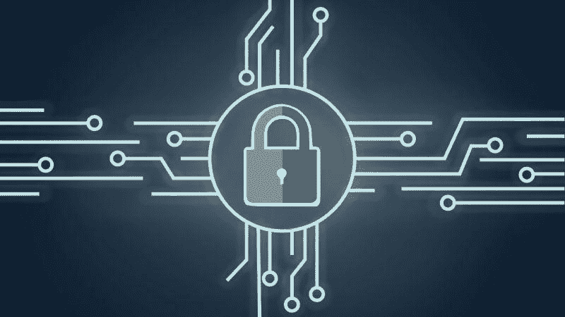
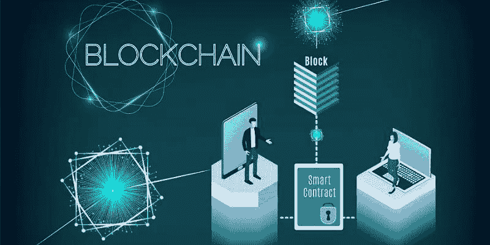
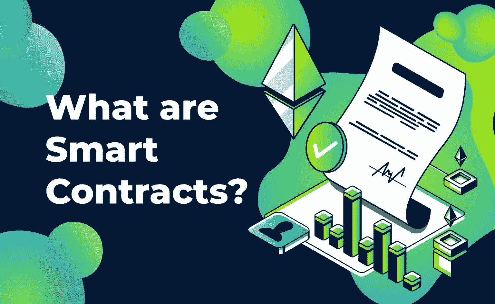

# 什么是 OpenZeppelin？终极指南

> 原文：<https://moralis.io/what-is-openzeppelin-the-ultimate-guide/>

**去中心化应用(**[**【dApps】**](https://moralis.io/decentralized-applications-explained-what-are-dapps/?utm_source=blog&utm_medium=post&utm_campaign=Want%2520the%2520Latest%2520in%2520%253Cspan%253EBlockchain%2520Development%253F%253C%252Fspan%253E)**)空前火热。然而，尽管分散式应用程序具有相当大的安全优势，但它们仍然容易受到一些安全漏洞的攻击。这是**[**open zeppelin**](https://openzeppelin.com/)**看起来要弥补的东西。这份完整的指南回答了“什么是 OpenZeppelin？”我们将进一步了解在使用 Moralis 时如何集成 OpenZeppelin 的特性。此外，我们将了解与流行的 ERC-20 令牌标准相关的 OpenZeppelin** [**智能合约**](https://moralis.io/smart-contracts-explained-what-are-smart-contracts/) **。**

根据 Statista 的一份报告，2020 年，银行业占据了区块链近 30%的市场份额。此外，可通过以太坊访问的分散金融(DeFi)平台最近越来越受欢迎。这意味着人们经常使用 dApps 转移大量资金，在这种情况下，安全性至关重要。此外，DeFi 平台的主要吸引力之一是它们不需要中介。相反，他们使用智能合约，我们将在本指南的后面解释这一点。OpenZeppelin 是一套经过审查的智能合同。它帮助你为你的 [Web3](https://moralis.io/the-ultimate-guide-to-web3-what-is-web3/?utm_source=blog&utm_medium=post&utm_campaign=Want%2520the%2520Latest%2520in%2520%253Cspan%253EBlockchain%2520Development%253F%253C%252Fspan%253E) 应用程序采取预防性安全措施。使用其审计服务，您可以确保您的实践将符合一套既定的标准。这样，犯罪分子就不会危及您系统的安全。



## 什么是 OpenZeppelin？

OpenZeppelin 是一个用于构建安全 dApps 的开源平台。该框架提供了创建和自动化 Web3 应用程序所需的工具。此外，任何规模的公司都可以参考 OpenZeppelin 的审计服务，找到行业内的最佳实践。此外，OpenZeppelin 的客户中有一些知名人士，如以太坊基金会和比特币基地。它为以太坊项目提供安全性、可靠性和风险管理，其使命是“保护开放经济”。它根据您的需求进行安全审计，并实施安全措施来确保您的 dApps 是安全的。在认识到代码中的潜在问题后，他们会提供一份包含最佳实践和建议的报告，以消除系统中的弱点。

而且，OpenZeppelin Defender 是 OpenZeppelin 的 web 应用之一。这是一个保护和自动化智能合同操作的平台。使用 Defender，您可以与您的团队协作，定义不同的工作流，手动与合同交互，以及进行财务交易。此外，Defender 还提供了一个用户友好的 UI，以及发送事务和创建自动化脚本所需的基础设施。此外，OpenZeppelin 还建立了一个令人印象深刻的库，用于开发智能合同，目前为 3000 多个公共项目提供支持。

OpenZeppelin 开发人员使用 [Solidity](https://moralis.io/solidity-explained-what-is-solidity/) 的编程语言在其库中开发模块化和可重用的合同，包括与 ERC 20 相关的 OpenZeppelin 合同。此外，社区还测试和审查了 OpenZeppelin 称之为业内最受欢迎的合同。既然我们已经回答了“什么是 OpenZeppelin”这个问题，那么是时候深入研究它的功能了。最后，我们将详细说明如何将其与[Moralis](https://moralis.io/)web 3 平台集成。



### 如何安装 OpenZeppelin？

要使用智能合约创建新的 OpenZeppelin 项目，您必须首先在系统上安装“命令行界面”(CLI)。因为 CLI 依赖于您的节点项目，所以您需要安装 npm(节点包管理器)。OpenZeppelin 建议开发人员在本地安装 CLI，而不是全局安装。这样，他们可以为每个项目使用不同版本的 CLI，并避免潜在的全局依赖问题。

要安装 CLI，请输入以下命令:

```js
$ npm install @openzeppelin/cli
```

要初始化一个新的 OpenZeppelin 项目，请在终端中(在节点项目中)键入以下命令:

```js
$ npx openzeppelin init
```

如果你想更深入地了解如何安装 CLI，请访问 OpenZeppelin 的文档。

在下一步中，指定项目的名称和版本，然后设置一些文件和目录来运行新项目。前面说过，OpenZeppelin 的智能合约都是用 Solidity 写的，所以文件名会有“sl”这个词缀。要检查错误并编译合同，请使用命令“oz compile”。如果您忘记编译您的合同，CLI 将会完成它，因为它会不断监视您的合同的更改。每当您运行命令并更改协定时，它都会自动管理编译。

接下来，为以太坊上的 dApp 开发创建一个本地区块链。最好的模拟器之一是 [Ganache](https://moralis.io/ganache-explained-what-is-ganache-blockchain/) ，我们有一篇关于它的详细文章。只需使用命令行“npm install ganache-cli”来安装它。要使用 Ganache 启动新的开发网络，请在单独的终端中键入以下命令:

```js
 $ npx ganache-cli  --deterministic
```

在 Ganache 上建立新的开发网络之后，您可以使用命令“oz create”创建一个新的合同。



### 什么是智能合约？

在讨论 OpenZeppelin 契约之前，我们必须了解智能契约的概念。计算机科学家和密码学家 Nick Szabo 在 1997 年首次创造了“智能合同”这个术语。它指的是存储在分布式分类帐中的合同。智能合约与真实世界的合约相同，但它是用编程语言编写的，并存储在区块链中。众筹网站将是一个很好的例子来说明现实世界和智能合同之间的区别。根据他们的商业模式，筹款网站在项目所有者和金融赞助者之间扮演着中间人的角色。

项目所有者将指定一个资金目标，并开始从财务支持者那里收集资金。筹款网站将位于项目所有者和资金支持者之间。它会把它的佣金和钱拿给产品团队，双方都需要信任网站。如果他们实现了目标，它会把钱转给项目业主；否则，把钱退还给赞助商。在智能合同中，没有第三方，程序本身管理筹资。每当它达到筹资目标时，它就停止这个过程，并将资金转移给产品团队。当项目无法筹集到所需资金时，它会退还给支持者。在这些合同中，不需要法律制度或执法当局。开发人员将协议的条款插入到合同的代码中，合同会自动执行。

### 什么是 OpenZeppelin 合同？

使用智能合约在匿名方之间进行的交易是可信的、不可变的、分布式的、可跟踪的和不可改变的。换句话说，发送交易后，任何人都不能操纵合同。那么，什么是 OpenZeppelin 合同？类似地，OpenZeppelin 契约是用 Solidity 为以太坊和其他 DLT(分布式账本技术)编写的智能契约库。这些合同是由社区审查的计算机程序，是 dApps 开发的安全选项。这些合同是完全模块化和可重用的，包含了最常用的 ERC (ERC 代表“以太坊请求注解”)标准的实现。这意味着公司不需要为智能合同开发安全特性和工具。相反，他们可以专注于部署存储在 OpenZeppelin 归档中的预打包智能合同。

OpenZeppelin 合同向导是一个在线交互式生成器，你可以在其中引导你的合同。该向导包含五个不同的部分，包括令牌选择、设置、功能、访问控制和交互式代码显示。目前，该向导支持三种 ERC 标准:

*   [**ERC 20**](https://moralis.io/erc20-exploring-the-erc-20-token-standard/)——遵循 EIP-20 的可替代代币标准，如法定货币。
*   [**ERC 721**](https://moralis.io/erc-721-token-standard-how-to-transfer-erc721-tokens/)**–**是遵循 EIP-721 的 NFT 令牌标准。
*   [**ERC 1155**](https://moralis.io/erc1155-exploring-the-erc-1155-token-standard/)**–**代表可替代和不可替代的代币。它被称为多令牌合同，遵循 EIP-1155。

每个 OpenZeppelin 合同都有一个稳定的 API，您可以将它们全部导入到您的以太坊项目中。该平台的开发者建议他们的用户不要修改代码，而是从 OpenZeppelin 获取并保留代码。


## 令牌标准和 ERC-20 相关的 OpenZeppelin 合同

令牌是智能合约中实现的一组规则和标准。用户可以在以太坊的区块链生态系统中出售、购买和交易这些代币。它们代表了多种多样的资产，包括借据、代金券、时间、虚拟宠物，甚至是金钱和服务等有形物品。

ERC-20 是以太坊社区为可替代资产开发的流行令牌标准之一。可替换令牌与不可替换令牌正好相反( [NFT](https://moralis.io/non-fungible-tokens-explained-what-are-nfts/) )。你用另一个可替换的代币交换可替换的代币，例如用一个比特币交换另一个比特币，因为它们价值相等。但是，对于唯一的不可替换令牌，您不能用其他令牌替换它们。举个例子，你的画是无形的，你找不到和它们一模一样的东西。一个基于 ERC 20 的 OpenZeppelin 合约跟踪可替换的令牌，并适用于涉及投票权和赌注的智能合约。来自 OpenZeppelin 的 ERC-20 合同代表了具有各种扩展的 ERC-20 接口的基本实现。每个扩展都有不同的功能。例如,“ERC20Detailed”合同向来自 OpenZeppelin 的 ERC-20 合同添加了包括名称、符号和小数在内的细节。另一个是“ERC20Capped ”,用于指定关于具有最大限制的令牌的地址。

## OpenZeppelin 示例用例

一旦你安装了 OpenZeppelin，你就可以在各种以太坊项目中使用它的审核过的合同。OpenZeppelin 示例用例包括但不限于以下项目:

*   **访问限制**–控制访问是 OpenZeppelin 的主要用例之一。该契约允许您确定谁可以访问系统中的特定资源和功能。由于这种能力，您可以限制投票，铸造，发送交易等。，到具体的实体。
*   **所有权**–“Ownable”是另一个 OpenZeppelin 契约，您可以在契约中定义所有权。换句话说，部署这个契约将帮助特定的实体获得某些功能。使用基础合同的扩展，您还可以将所有权从一个帐户转移到另一个帐户。由于本合同的再次延期，您可以放弃以前的所有权。
*   **计算**–“safe math”是一个有用的 OpenZeppelin 合同，有助于进行精确的计算。这个库对于防止 Solidity 编码时的操作溢出特别有用。当给定算术运算中的值不在允许的范围内时，就会出现这种情况。
*   **代币**–open zeppelin 为开发人员创建了所需的基础设施，以制作可交易的代币并将其分配给网络内的参与者。使用此合同，您可以监控价格、指定令牌转移方法、认证购买等。
*   **支付**–您是否正在开发一个有各种受益人的 dApp？使用 OpenZeppelin“paymentSplitter”合同，您可以将购买 dApp 的收入发送给不同的方。
*   **加油站网络**–该合同帮助您开发 dApps，您将在其中代表您的用户付款。在这种方法中，用户不需要把 ETH 放在钱包里，而是由你来支付。

## 将 OpenZeppelin 库与 Moralis 集成

如前所述，OpenZeppelin 为在以太坊网络或其他区块链上构建 dApps 的开发者提供经过审查的合同。由于 Moralis 与以太坊完全兼容，所以您可以在 Moralis 项目中使用所有模块化的 OpenZeppelin 契约。Moralis 的优秀平台提供了构建区块链应用程序所需的工具和服务。得益于该平台，你可以访问 UI、用户认证、数据管理工具、云存储和 [Web3](https://moralis.io/web3-and-javascript-what-is-javascript-and-web3-js/) 。通读我们的[文档](https://docs.moralis.io/)以获得关于如何[使用来自 OpenZeppelin 的 ERC-20 合同部署和跟踪 ERC-20 事件](https://docs.moralis.io/guides/deploy-and-track-erc20-events#deploy-smart-contract)的更多细节。

对于用户认证，您还需要在浏览器中设置[元掩码](https://moralis.io/metamask-explained-what-is-metamask/)。如果您没有钱包地址，请从 https://metamask.io/[下载元掩码。当一切都设置好并准备好了，您就可以部署与 Moralis 的 OpenZeppelin 契约了。此外，你需要利用](https://metamask.io/) [Remix](https://moralis.io/remix-explained-what-is-remix/) 来编写、编译和调试代码，这是用 Solidity 编写的。你可以在你的浏览器中打开它，或者直接去以太坊的官方网站。

## 什么是 open zeppelin–摘要

这个时候，你就知道了“什么是 OpenZeppelin”这个问题的答案了。你也明白什么是开放齐柏林合同。我们查看了与 ERC-20 令牌标准相关的 OpenZeppelin 合同，并详细阐述了 OpenZeppelin 示例用例。现在是时候开始了，通过将 OpenZeppelin 库集成到 Moralis 中来构建您的项目。

此外，请务必查看 [Moralis 的博客](https://moralis.io/blog/)和 [YouTube 频道](https://www.youtube.com/channel/UCgWS9Q3P5AxCWyQLT2kQhBw)，我们在那里发布高质量的内容，将全程指导您的区块链之旅。使用它，你将能够掌握从[以太坊测试网](https://moralis.io/ethereum-testnet-guide-connect-to-ethereum-testnets/)到如何[创建 NFT 市场](https://moralis.io/how-to-create-an-nft-marketplace/)，创建[移动以太坊应用](https://moralis.io/create-mobile-ethereum-dapp-with-react-native-template/)，了解 [BEP20](https://moralis.io/what-is-bep20-full-binance-smart-chain-token-guide/) 以及如何[创建 BSC 令牌](https://moralis.io/how-to-create-a-bsc-token-in-5-steps/)的一切。