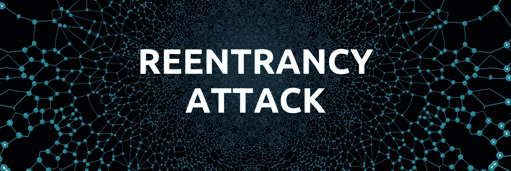
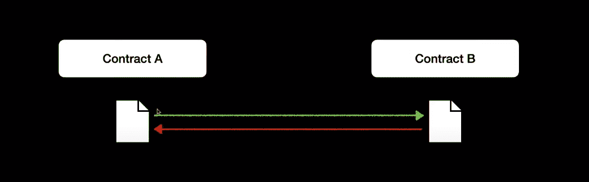
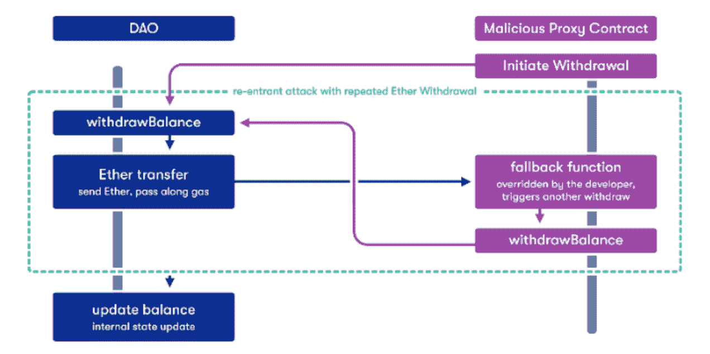
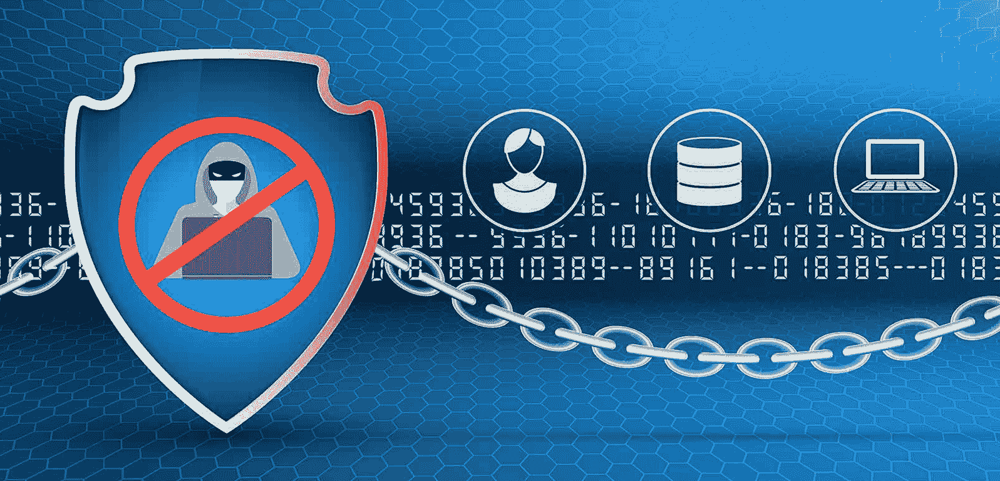
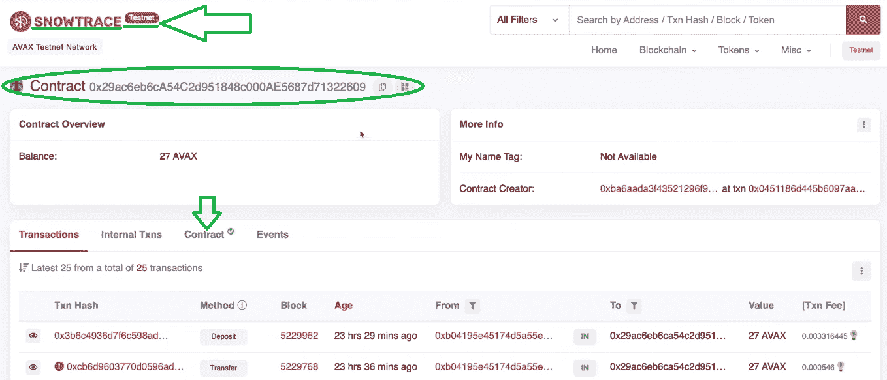
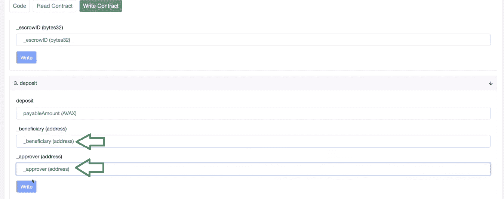

# 什么是可重入？–可重入智能合同示例

> 原文：<https://moralis.io/what-is-reentrancy-reentrancy-smart-contract-example/>

毫无疑问，区块链技术和智能合约有许多优秀的用例。然而，尽管有很多优点，智能合约仍然有漏洞。例如，在经历开发阶段时，攻击可能不幸发生。在本文中，我们将仔细研究一种特殊的危险——可重入智能契约攻击。首先，我们将通过回答“什么是可重入性”的问题来探索基础知识。有了这些基础知识，我们将分析一些可重入性智能契约示例攻击。现在，您可能想知道是否可以保护自己免受重入攻击。不要让这种令人担忧的怀疑阻碍你成为区块链开发商的[](https://moralis.io/how-to-become-a-blockchain-developer/)****。通过了解你的 Web3 应用的潜在弱点，你可以将你的**[**dapp**](https://moralis.io/decentralized-applications-explained-what-are-dapps/)**放在安全的地方，远离重入的可能性。****

**此外，为了让您更清楚地理解可重入性，我们自己将承担一个可重入性智能契约示例项目。因此，您将直接看到漏洞在哪里。此外，为了您的准确理解，我们还将利用我们的示例智能合约的漏洞。此外，我们将创建一个测试仪表板，它将帮助我们修复可重入性智能契约示例。在这里，你将有机会利用 [Moralis](https://moralis.io/) (又名 [Firebase for crypto](https://moralis.io/firebase-for-crypto-the-best-blockchain-firebase-alternative/) )提供的终极捷径。此外，我们将通过三种不同的方式来修复可重入性智能契约示例。除了 Moralis，我们还将使用一些其他有价值的工具，即 [MetaMask](https://moralis.io/metamask-explained-what-is-metamask/) 和 [Remix](https://moralis.io/remix-explained-what-is-remix/) 。那么，什么是可重入性？事不宜迟，让我们开始吧！**

**

## 什么是可重入？

根据其定义，“再入”一词的意思是“再次进入(再入)的行为”。然而，这个词几乎只用于计算。从这个意义上说，当软件或子程序支持多个调用/请求安全地并发运行时(在多个处理器或单个处理器系统上)，它被称为可重入的。在这样的系统中，可重入过程可以在执行过程中被中断。在中断之后，该过程可以在其之前的调用完成执行之前被再次调用(“重新进入”)。

上面的定义告诉您，在有些应用程序中，可重入可能是一件好事。然而，使用[智能合约](https://moralis.io/smart-contracts-explained-what-are-smart-contracts/)，它可能是一个巨大的漏洞。因此，现在让我们来回答“什么是可重入性？”智能合约中的问题。每当一个智能协定对另一个智能协定进行外部调用时，可重入性漏洞就可能发生。此外，当智能合约发出外部调用时，EVM 的执行从发出调用的智能合约传递到被调用的智能合约(下图中的绿线)。因此，除非发出调用的智能合约完全了解被调用的智能合约的代码，否则存在潜在的危险。被调用的智能契约可能会随心所欲地处理外部代码。



在其他操作中，被调用的智能合约可以回调初始智能合约(重新输入调用[上图中的红线])。此外，如果最初的智能契约有一些漏洞，那么重新输入调用可以利用这一点。当初始智能协定在调用时没有正确更新时，这些漏洞就会出现。也就是说，这些类型的利用被称为可重入智能契约攻击是有道理的。



## 可重入智能契约攻击

在过去几年中，已经发生了几次重入智能合约攻击。虽然这种攻击在 2016 年引起了最多的不满，但去年(2021 年)也发生了几起。一些最著名的可重入智能合约示例包括:

*   **道黑客**–*这是 2016 年发生的最著名的以太坊黑客事件。不幸的是，* [*DAO 的智能契约*](https://moralis.io/dao-smart-contract-example-dao-guide/) *的传输机制被设置为在更新其内部状态之前将 ETH 传输到外部地址。因此，法院确实注意到余额已经迅速转账。后者为攻击者提供了一种利用可重入性的方法，并从契约中获取比他们有资格获得的更多的 ETH。*
*   Uniswap/Lendf。我–*回到 2020 年 4 月，这次可重入黑客攻击导致 2500 万美元被抢走。*
*   **奶油财经**–*2021 年 9 月，这个 DeFi 协议遭受了沉重的打击。reentrancy 攻击背后的黑客窃取了价值超过 3400 万美元的 AMP and ETH。*
*   **BurgerSwap**–*这个令牌互换协议，基于* [*币安智能链*](https://moralis.io/create-nft-on-binance-smart-chain-full-guide/)*(*[*BSC*](https://moralis.io/bsc-programming-guide-intro-to-binance-smart-chain-development-in-10-minutes/)*)，于 2021 年 5 月被攻击。攻击者使用一个伪造的令牌地址和一个可重入漏洞，窃取了价值约 720 万美元的令牌。*
*   这是另一个值得注意的重入攻击，价值 400 万美元。事情发生在 2021 年 8 月。
*   **警报器协议**–*回到 2021 年 9 月，攻击者利用可重入性弱点，成功从 AMM 池中取走了价值 350 万美元的代币。*

这些只是一些最著名的可重入智能合约攻击。此外，大多数攻击的日期表明许多团队没有在“可重入性”主题上投入足够的时间。因此，[道](https://moralis.io/how-to-create-a-dao-in-10-minutes/)黑客提供的五年教训有重演的趋势。然而，通过认真对待这篇文章，你应该是安全的。



## 可重入智能合同示例

既然你可以回答“什么是可重入性？”有了信心并且知道可重入性攻击不仅仅是过去的事情，是时候承担一个示例项目了。因此，您将有机会近距离观察漏洞。为了这个示例项目的目的，我们将在 Avalanche 的 testnet 上工作。因此，我们也将使用 SnowTrace，它相当于以太坊的 Etherscan 或 BSC 的 BscScan。此外，为了您的方便，我们也在 [GitHub](https://github.com/DanielMoralisSamples/30_Exploit_Sample) 上提供了完整的代码。因此，您可以访问我们的[不安全智能合约](https://github.com/DanielMoralisSamples/30_Exploit_Sample/blob/master/contracts/Unsafe/EscrowUnsafe.sol)及其[固定对应合约](https://github.com/DanielMoralisSamples/30_Exploit_Sample/tree/master/contracts/Fixed)。

这是我们在 Avalanche testnet 上部署后的不安全合同:



通过点击“合同”标签，我们可以查看合同的代码。*如上所述，你也可以在 GitHub 上访问它。请记住，这个智能合约是* *为了这个可重入的智能合约的例子而故意不安全* *。而且，如果你更多的是一个视频人，就用本文末尾的视频吧。在那里，一位经验丰富的开发人员将从 2:43 开始引导您了解我们的示例智能合约的细节。*

### 主要的弱点

这个可重入性智能契约示例的主要漏洞是它接收地址作为函数参数:

```js
function deposit(address _beneficiary, address _approver) external payable
```

后者是极其危险的，因为它让一个潜在有害的外部合同去做我们不希望它做的事情。此外，通过来自“withdrawFunds”函数的调用(如下所示)，我们将 [EVM](https://moralis.io/evm-explained-what-is-ethereum-virtual-machine/) 的执行传递给外部智能契约，这为可重入攻击打开了大门。

```js
(bool result,) = caller.call{value: escrowRegistry[_escrowID].amount}("");
```

换句话说，外部智能合约有可能再次调用“取款”功能。如果这在我们的智能契约的状态被更新之前完成，可重入攻击将会成功。


### 利用我们的智能合同

在这里，您可以更深入地理解我们的可重入性智能契约示例的漏洞。使用智能合同部署工具，如 Remix，您可以立即采取行动。使用上面的智能合同示例，它可以作为样板文件。因此，我们可以很容易地创建一个新的合同，利用我们的“不安全”的弱点。同样，为了您的方便，GitHub 上的"[attack . sol](https://github.com/DanielMoralisSamples/30_Exploit_Sample/blob/master/contracts/clients/attacker.sol)"智能合约由您支配。*如果您对详细的指导感兴趣，请参考 14:19 开始的视频。* *这样，您还将看到如何创建"*[*escrowinterface . sol*](https://github.com/DanielMoralisSamples/30_Exploit_Sample/blob/master/contracts/clients/interfaces/EscrowInterface.sol)*"契约。后者将在“攻击者”智能契约中使用。*

准备好部署“攻击者”合同后，我们将按照以下步骤利用我们的初始智能合同:

1.  送少量代币给受害者的合同。我们将使用 SnowTrace 来访问我们的界面。我们在这里输入受益人的地址，并将自己定义为批准人:



2.  我们使用上一步中存放的金额在“攻击者”合同中执行“攻击”功能。这将执行“提款”功能。如您所知，该函数有一个外部执行，这意味着我们可以劫持它。这就是我们使用可重入性的地方。根据我们的“攻击者”合同，提款将重复进行，直到资金耗尽。
3.  最后一步是将被劫持的余额转移到另一个地址。

*注* *:要想看到以上三个步骤的动作，请看下面的视频(21:30)。因此，它将帮助您加深对“什么是可重入性”的理解。*

### 修复问题

上一节展示了可重入性漏洞非常容易被利用。攻击者不需要特别熟练。公开可用的工具，如区块链扫描仪、 [Web3 钱包](https://moralis.io/what-is-a-web3-wallet-web3-wallets-explained/)和智能合约部署平台，都是一个人所需要的。因此，能够修复这些类型的漏洞至关重要。这正是你将在这里学到的。

然而，为了使过程更整洁，我们决定使用 Moralis 创建一个测试仪表板。如果你对此感兴趣，请观看 24:45 的视频。还有，自己用 GitHub 上的“ [*前端*](https://github.com/DanielMoralisSamples/30_Exploit_Sample/tree/master/frontend) *”文件夹。*准备好测试仪表板后，我们将创建一个无辜用户智能契约("[user . sol](https://github.com/DanielMoralisSamples/30_Exploit_Sample/blob/master/contracts/clients/user.sol)")(29:12 的视频)。一旦我们准备好了测试环境和示例用户智能契约，我们就可以开始应用补丁了。


您需要注意三个修复问题(见下面的视频):

*   特殊的“transfer()”修复，开始于 30:17 *(修复智能合约:“*[*escrowfixed 00 . sol*](https://github.com/DanielMoralisSamples/30_Exploit_Sample/blob/master/contracts/Fixed/EscrowFixed00.sol)*”)*
*   检查和效果模式修复，开始于 37:53 *(修复智能合约:"*[*. escrowfixed 01 . sol*](https://github.com/DanielMoralisSamples/30_Exploit_Sample/blob/master/contracts/Fixed/EscrowFixed01.sol)*"*
*   不可重入修饰符 fix，开始于 44:34*(fixed smart contract:"*[*escrowfixed 02 . sol*](https://github.com/DanielMoralisSamples/30_Exploit_Sample/blob/master/contracts/Fixed/EscrowFixed02.sol)*)*

可重入攻击的三种可能的解决方案各有利弊。但是，使用检查和效果模式修复漏洞被认为是最佳实践。因此，你可能需要额外关注它(37:53 的视频)。此外，我们鼓励您也仔细看看其他两种修复方法，以拓宽您的“什么是可重入性？”地平线。

*这是我们在整篇文章中引用的视频* *:*

https://www.youtube.com/watch?v=hIOoM9KO3fw

## 什么是可重入？–可重入智能合同示例–摘要

那么，什么是可重入性？此时，您应该能够毫无问题地回答这个问题。此外，您知道可重入性可能是有意或无意的特性。此外，虽然某些应用程序可以从中受益，但在智能合约的情况下，这可能是有害的。通过考虑一些主要的重入智能合约攻击，您知道这是一个代价高昂的漏洞。为了深入探讨可重入性问题，您还有机会参与一个示例项目。

此外，通过跟随我们的视频，您还有机会创建一个简单的测试仪表板。因此，你可能已经看到了最终的 Web3 开发平台——Moralis 的威力。这个不可替代的工具可以让你将 dApps 和 [Web3](https://moralis.io/the-ultimate-guide-to-web3-what-is-web3/) 项目推向市场的时间平均减少 87%。[Moralis SDK](https://moralis.io/exploring-moralis-sdk-the-ultimate-web3-sdk/) 包括几个令人印象深刻的特性。从终极的[以太坊 API](https://moralis.io/ethereum-api-develop-ethereum-dapps-with-moralis/) ，包括 [NFT API](https://moralis.io/ultimate-nft-api-exploring-moralis-nft-api/) ，到高级的数据库和“同步”功能，它们共同使你能够[索引区块链](https://moralis.io/how-to-index-the-blockchain-the-ultimate-guide/)。此外，Moralis 支持大多数主要的可编程区块链，并完全跨链互操作。反过来，您可以让您的工作经得起未来考验，并且无需额外资源就能处理多个链。

尽管如此，Moralis 的 YouTube 频道和 T2 的 Moralis 博客都提供了大量有价值的内容。因此，许多程序员将它们作为免费密码教育的基础。一些最新的话题探索了[元宇宙](https://moralis.io/what-is-the-metaverse-full-guide/)、 [Web3 通过电子邮件认证](https://moralis.io/how-to-do-web3-authentication-via-email/)、 [Web3 后端平台](https://moralis.io/exploring-the-best-web3-backend-platform/)、 [React Native Web3](https://moralis.io/react-native-web3-full-react-native-web3-dev-guide/) 、 [Web3 游戏化](https://moralis.io/web3-gamification-creating-a-coinmarketcap-diamonds-dapp/)和 [NFT 游戏角色](https://moralis.io/nft-game-characters-how-to-mint-in-game-nft-characters/)。然而，如果你有兴趣采取更专业的方法，推进你在区块链的职业生涯，你需要考虑报名参加[Moralis 学院](https://academy.moralis.io/)。在那里，你会发现无数的专业水平的课程，一个善良和支持的社区，和专家导师。

**