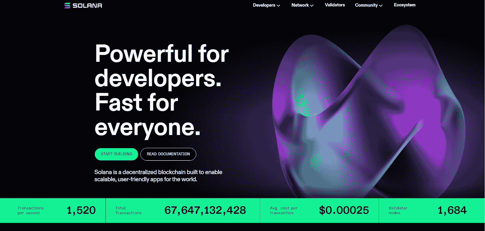
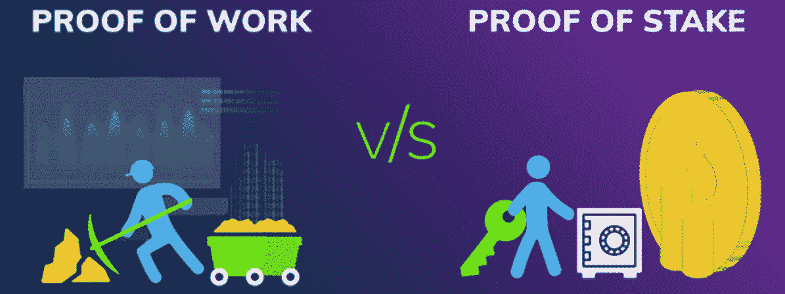
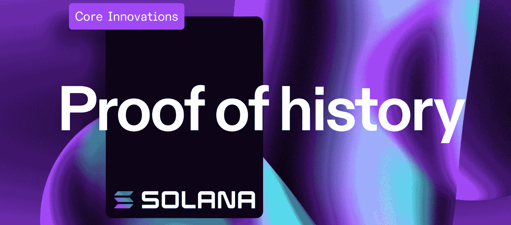
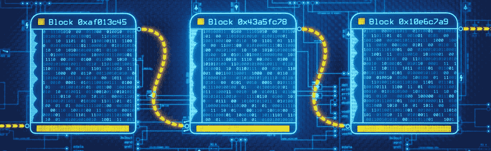
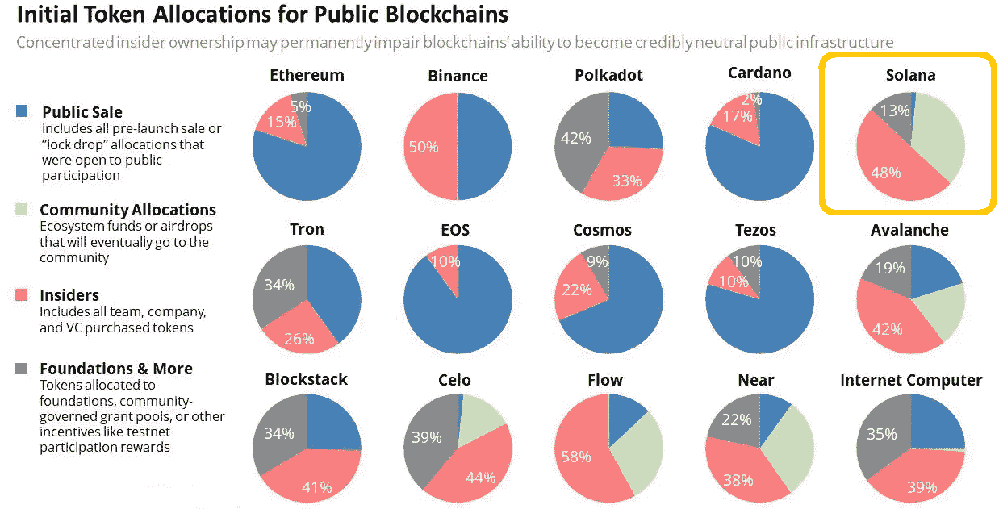
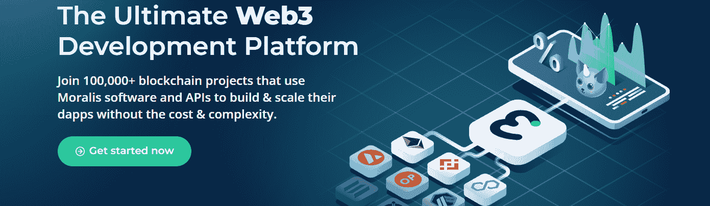

# 索拉纳是什么？–完整的 2022 指南

> 原文：<https://moralis.io/what-is-solana-the-full-2022-guide/>

2021 年 7 月底至 11 月初，索拉纳的价格大幅上涨，成为几大头条新闻。因此，许多人想知道，“索拉纳是什么？”。被贴上巨人“ [**【以太坊】**](https://moralis.io/full-guide-what-is-ethereum/) **杀手”的标签之一，索拉纳在 2021 年崭露头角，并将在 2022 年及以后继续这样做。凭借其速度和低廉的交易费用，Solana 吸引了众多开发者。如你所知，哪里有开发者，哪里就有进步。众多的** [**去中心化应用**](https://moralis.io/decentralized-applications-explained-what-are-dapps/)**(dapps)**[**NFTs**](https://moralis.io/non-fungible-tokens-explained-what-are-nfts/)**、SPL 令牌、DeFi 协议活在 Solana 上，新的项目在这个“利益证明/历史证明”的混合区块链上不断涌现。因此，你可能要考虑建立在索拉纳。使用正确的工具比你想象的要容易得多。然而，如果你的项目处于初始阶段，你正在考虑索拉纳，但需要一个“什么是索拉纳？”的答案问题，你会发现这个指南是为你量身定做的！**

随着我们的前进，你将了解索拉纳的来龙去脉。通过发现“什么是索拉纳？”，你会变得见多识广，充满力量。因此，对你来说，决定是否要在这个难以置信的链条上进行构建是很容易的。你们中那些决定给索拉纳一个机会的人将能够立即开始建设。有了 [Moralis](https://moralis.io/) 、[最好的 Web3 后端平台](https://moralis.io/exploring-the-best-web3-backend-platform/)，以及它的 [Solana API](https://moralis.io/moralis-releases-solana-api/) ，你可以在几分钟内创建 Solana dapps。此外，一位 Moralis 专家创造了一个精彩的教程，我们稍后将与你分享。在教程中，你将学会如何毫不费力地使用 [Moralis 的 SDK](https://moralis.io/exploring-moralis-sdk-the-ultimate-web3-sdk/) 。此外，当使用这个" [Firebase for crypto](https://moralis.io/firebase-for-crypto-the-best-blockchain-firebase-alternative/) "平台时，您可以通过利用终极 [Web3 样板](https://moralis.io/web3-boilerplate-beginners-guide-to-web3/)来进一步加快进度。然而，现在让我们把注意力集中在“索拉纳是什么？”。

## 索拉纳是什么？

在其核心，索拉纳是一个公共和开源的可编程区块链。这意味着它支持智能合同，这是区块链发展的一个重要方面。此外，Solana 支持开发可替代和不可替代的令牌(NFT)和各种 dapps。像所有可编程链一样，Solana 有自己的硬币或令牌，称为“SOL”。后者有双重目的。首先，它通过混合 [DeFi staking](https://moralis.io/what-is-defi-staking-full-guide/) consensus 提供网络安全。第二，它是在索拉纳链上转移价值的一种手段。

索拉纳由阿纳托利·亚科文科和拉杰·戈卡尔在 2017 年推出。他们仍然积极参与索拉纳实验室的工作，亚科文科是现任首席执行官，戈卡尔是首席运营官。

索拉纳属于证据链(PoS)的范畴。此外，Solana 理论上支持每秒大约 65，000 个事务的吞吐量。除了速度之外，它还提供不到 1 美分的交易费。相比之下，可编程连锁店以太坊的费用高达数百美元。正因如此，你就明白索拉纳为什么吸引用户了。此外，后者也是许多开发人员专注于在 Solana 之上构建的主要原因之一。尽管如此，许多怀疑论者仍然怀疑索拉纳的分权程度。

## 索拉纳是什么？我们来深入挖掘一下！

上面的概述给了你一个关于索拉纳的概念，但是正如前面提到的，我们在这里是为了更深入地挖掘“索拉纳是什么？”问题。因此，我们将仔细看看索拉纳链及其核心协议。此外，我们将探索是什么让索拉纳与众不同。此外，我们还将简要回顾索拉纳的母语索尔的记号组学。最后但同样重要的是，我们将涵盖索拉纳的利弊。

### 什么是索拉纳区块链？

既然我们已经讨论了“什么是索拉纳？”问题，让我们探索索拉纳区块链。正如介绍中提到的，Solana 能够通过运行混合协议来提供如此低的交易费用。后者包括一个众所周知的 PoS 协议，其中 staked SOL 进行“挖掘”。因此，它确保索拉纳区块链维护所有节点的准确信息。然而，他们混合协议的第二部分是一个鲜为人知的概念。索拉纳称之为“历史的证明”(PoH)。让我们仔细看看这两个协议，因为它们是“什么是索拉纳？”话题。

### Solana 的 PoS 概述

PoS 是工作证明(PoW)协议的常见替代方案。然而，与使用计算能力来确保安全和验证交易的 power 不同，PoS 是基于标记令牌来实现的。这意味着 SOL 代币的某些所有者将他们的硬币抵押给验证者。后者是一台计算机(节点)，运行索拉纳的软件及其最新版本的链的副本。因此，PoS 验证器就像是 power 的挖掘器。此外，Solana 验证器不是解决一个困难的数学问题，而是根据它们的定位细节添加下一个块。在几个标准中，这些细节包括确认者的 SOL 的金额和期限。

如您所见，在 PoS 中，这完全取决于网络参与者的承诺水平。当然，他们的贡献会得到相应的回报。此外，分散化程度与验证者的分布和股份流通供给比率明显相关。这就是索尔的象征经济学发挥作用的地方。

### 索拉纳的历史证明概述

提出“什么是索拉纳”是不公平的却没有仔细研究它的核心创新之一。索拉纳的 PoH(历史证明)协议，正如他们命名的那样，是使用 PoS 概念的一种特殊方式。PoH 方法证明交易是按照正确的顺序进行的。而且，交易还需要找到合适的“领导”。

为了理解这个概念，你需要知道索拉纳区块链被分解成时间段(槽)。正是在这些槽中，验证器处理事务并创建新的块。此外，为了节省时间，提前为每个时间段选择所谓的“领导者”。此外，该机制基于他们的 PoS 协议选择领导者。这主要是通过计算溶胶的量来实现的。此外，每个领导者必须对时间的流逝进行计数或记录(也称为历史证明序列)。除此之外，领导者还负责清点他们职位的下一批交易。如果你有兴趣了解更多关于 Solana 的 PoH 机制的细节，我们建议查看他们的文档。

PoH 协议减少了延迟并增加了吞吐量。它通过允许领导者将交易实时传输给其他验证者来实现这一点。这样，领导者就不必等着用事务填满整个块后再发送该块。此外，PoH 值(时间戳)也使其他验证器能够在事务进来时对其进行验证。

## 比较索拉纳和其他区块链——索拉纳有什么不同？

虽然这篇文章的主要焦点是回答“什么是索拉纳？”这将是有益的，看看如何索拉纳比较其他区块链。除了 SOL 的 tokenomics，Solana 和其他 PoS 链的核心区别在于其一致性。因此，上述 PoH 机制再次成为中心点。虽然 PoH 让事情变得更快，但也有一些担心。尤其是围绕索拉纳的投票方法，根据怀疑论者的说法，这种方法导致了集权。

在典型的 PoS 区块链中，选择节点或验证器来创建下一个事务块。一旦被选择的节点创建了一个块，它就向整个节点网络广播细节。然后，这些节点通过将其与自己的分类帐版本进行比较来审计最新的块。他们通过将自己的分类帐版本和新块与所有其他节点进行比较来实现这一点。最后，由每个节点决定新块是否有效。此外，如果大多数验证器确认新的块是合法的，它就被添加到链中。

如果将这与 Solana 的 PoH 方法进行比较，您会看到它们的节点在创建整个事务块之前验证事务。此外，索拉纳的节点通过将他们的选票发送给领导人来对新街区的合法性进行投票。然后，负责计票的是领导者一人。因此，这就提出了权力下放程度是否足够的问题。我们让你来做进一步的调查。

## SOL 和 Solana Tokenomics

您可以使用 CoinMarketCap 或 Solana 的白皮书详细探索 Solana 的 tokenomics。但是，以下是关键指标:

*   溶胶总供应量:511，616，946
*   溶胶的最大供应量:未定义
*   溶胶的流通供应量:326，352，527.93
*   Solana 上市时的年通货膨胀率:8%
*   承诺的通货膨胀率下降:每年 15%
*   目标年通货膨胀率:1.5%

此外，我们已经解释过，SOL 是用来转移价值和进行赌注的。“转移价值”还包括支付与索拉纳智能合约和其他交易相关的交易费用。此外，我们必须指出，索拉纳的验证者获得了基于通胀的奖励。Solana 通过权衡单个验证器的赌注与总赌注 SOL 令牌的数量来做到这一点。此外，为了确定产量，根据总的代币供应量来测量所下注的总 SOL 量。

尽管如此，让我们也看看上面的图像。这清楚地表明，索拉纳最初的令牌分配中有近 50%给了内部人士。这意味着风险投资公司和其他大公司控制了 SOL 代币的大部分。因此，公众可以获得相对少量的溶胶，这是索拉纳权力下放的另一个黄旗。现在，让我们进入“什么是索拉纳？”文章通过看索拉纳的利弊。

## 索拉纳是什么？–优点和缺点

如你所见，像大多数事情一样，索拉纳有起有落。因此，让我们把它们列在这里，这样你就可以在决定是否在 Solana 的基础上构建时参考它们。

### 索拉纳的优点

*   **速度**–Solana 的吞吐量约为每秒 65，000 笔交易。因此，它是最快的连锁店之一。
*   **低交易费用**–索拉纳每笔交易的平均成本为 0.00025 美元。此外，Solana 的可伸缩性确保开发者和用户的交易成本都低于 0.01 美元。
*   **扩展解决方案**–Solana 通过在网络扩展时保持单一的全局状态，确保生态系统项目之间的可组合性。
*   **快速增长的网络**——感谢以上三位专家，Solana 吸引了许多开发者，发展迅速。因此，来自全球各地的团队正在索拉纳上启动各种 NFT 项目、dapps 和 DeFi 协议。

### 索拉纳的缺点

*   SOL 供应–SOL 没有定义最大供应的事实是唯一的缺点之一。然而，早在 2021 年，围绕 SOL 供应也有一些争议，当时索拉纳显然借给了做市商超过 1000 万个 SOL 令牌，而没有向公众披露。
*   集中化的迹象–正如我所指出的，索拉纳可能有一些集中化的方面。这包括不成比例的节点分布和某种程度上的集中打桩系统。因此，如果分散化是您的核心关注点，您需要进一步研究这个区块链。因此，我们让你来决定你是否愿意相信索拉纳官方网站上的“分散和不可阻挡”的声明。
*   **Solana 的中断**–到目前为止，Solana 已经经历了许多网络问题。其中一些包括网络完全关闭。例如，在 2021 年 9 月，索拉纳有 17 个小时处于离线状态。

## 超越“索拉纳是什么？”

既然你可以回答“什么是索拉纳？”问题带着自信，你准备好卷起袖子开始建设了。通过创建非凡的 dapps，你可以立刻成为全职加密员。你只需要决定你想利用哪条链来构建。如果索拉纳的速度和低交易费说服了你，一定要用下面的视频教程。在这篇文章中，Moralis 专家将向您展示如何[创建一个 SOL 令牌](https://moralis.io/how-to-create-a-solana-token-in-5-steps/)以及如何在几分钟内构建一个 Solana dapp。然而，如果您发现 Solana 过于集中，您可以在其他链的基础上构建。当你[创建你的免费 Moralis 账户](https://admin.moralis.io/register)时，你也可以在以太坊和其他流行的 [EVM](https://moralis.io/evm-explained-what-is-ethereum-virtual-machine/) 兼容链上构建。此外，因为 Moralis 是关于跨链互操作性的，所以 Moralis 团队会定期添加新的有信誉的链。

https://www.youtube.com/watch?v=IsTFNOedPkk

## 索拉纳是什么？–完整的 2022 指南–摘要

我们已经讨论了很多内容。在我们的“什么是索拉纳？”节目中，你已经对索拉纳有了相当多的了解 quest，你现在可以做出一个明智的决定，索拉纳是否值得你的关注。在我们看来，它的速度、低费用和受欢迎程度足以使它成为一个有效的选择。因此，创造 SPL 代币或索拉纳 dapps 给你提供了很多机会。幸运的是，你可以让当前的 [Web3 技术栈](https://moralis.io/exploring-the-web3-tech-stack-full-guide/)覆盖你的后端需求。尽管如此，即使索拉纳不是你想要关注的链条，Moralis 仍然是你的工具。它支持以太坊、[、雪崩](https://moralis.io/how-to-connect-to-avalanche-nodes/)、[多边形](https://moralis.io/how-to-connect-to-polygon-nodes/)、 [BNB 链](https://moralis.io/how-to-create-a-bnb-chain-token-in-5-minutes/)和 Fantom，以及其他知名链在管道中。

所以，如果你精通 JavaScript 或者了解 Unity，你今天就可以[成为 Web3 开发者](https://moralis.io/how-to-become-a-web3-developer-full-guide/)。开始吧，使用[Moralis YouTube 频道](https://www.youtube.com/c/MoralisWeb3)和[Moralis 博客](https://moralis.io/blog/)上的一些教程。

除了无数的示例项目之外，上述两个出口还提供了各种加密方面的易于理解的解释。因此，它们可以满足您的免费加密教育需求。例如，一些最新的话题集中在[如何建立 BNB 钱包](https://moralis.io/binance-coin-wallet-guide-how-to-set-up-a-bnb-wallet/)，如何[创建 Web3 视频流媒体服务](https://moralis.io/how-to-create-a-web3-video-streaming-service/)或 [Web3 网飞克隆](https://moralis.io/how-to-develop-a-web3-netflix-clone/)，如何[创建 ETH 钱包](https://moralis.io/how-to-create-an-eth-wallet-full-guide/)或[多链钱包](https://moralis.io/how-to-build-a-multi-chain-wallet-in-5-steps/)，Web3 游戏的[web 3 元宇宙](https://moralis.io/web3-metaverse-how-do-web3-and-the-metaverse-fit-together/)，如何[创建元宇宙游戏](https://moralis.io/how-to-build-a-metaverse-game-in-25-minutes/)， [NFT 然而，如果你对专业的区块链发展教育感兴趣，](https://moralis.io/develop-a-web3-game-with-nft-power-ups-in-9-minutes/)[Moralis 学院](https://academy.moralis.io/)是首选平台！