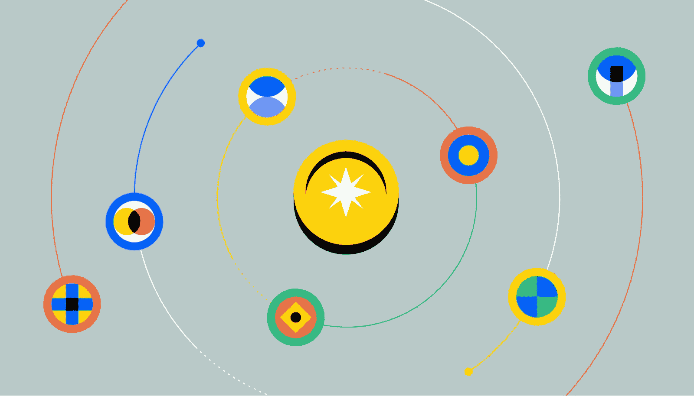
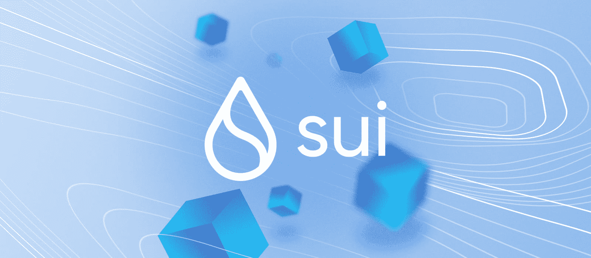
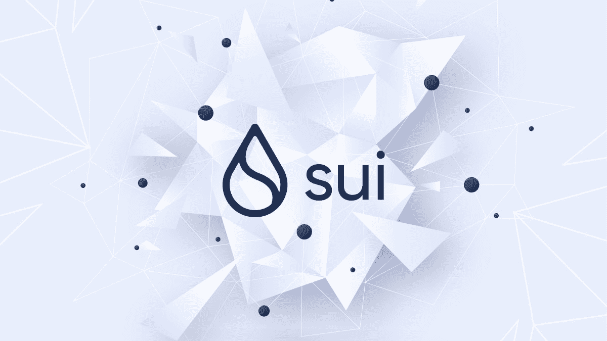
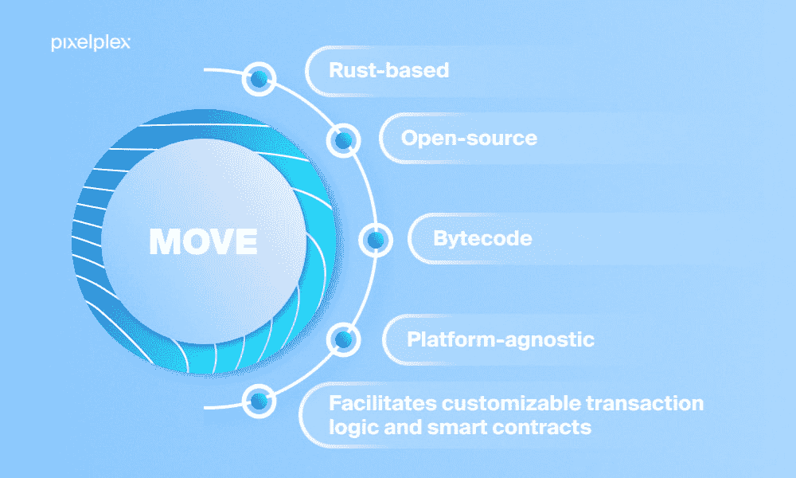

# 什么是 Sui 区块链？–终极指南

> 原文：<https://moralis.io/what-is-sui-blockchain-the-ultimate-guide/>

新的第 1 层(L1)区块链网络以更高的频率不断涌现，而确定哪些网络会继续存在一直是一项挑战。今年早些时候，越来越多的可编程智能合约平台中加入了 Sui 区块链。隋看起来很有趣，因为有一套独特的功能，使平台脱颖而出。此外，隋最近宣布成功获得 3 亿美元的 B 轮融资(T2)，这表明区块链平台暂时不在这里。因此，探索这个错综复杂的网络比以往任何时候都更有趣。如果您想了解更多信息，请跟随本指南回答"*什么是隋区块链？*“问题！

本指南将涵盖几个方面来充分回答上述问题。首先，本文将从对隋的简要概述开始。一旦您更好地理解了网络，前面的部分将探索平台如何工作的复杂性以及它的独特之处。接下来，本指南将概述 Sui 的优势和特点。最后，我们将探讨更多关于 Sui 开发的内容，其中我们将简要介绍名为“Move”的编程语言！

此外，如果你对区块链的总体发展感兴趣，一定要去看看《Moralis》。Moralis 通过促进更无缝的开发者体验来释放区块链的力量。例如，阅读更多关于最近发布的 Moralis 的 [Streams API](https://moralis.io/streams/) 的信息，它弥合了 Web2 和 Web3 开发之间的差距，使您能够立即创建复杂的 Web3 项目！

所以，如果你想进入区块链发展公司，请立即与 Moralis 家公司签约。加入 Moralis 是免费的，所以你不会有任何损失！

## 什么是 Sui 区块链？

Mysten Labs 是 Sui 区块链背后的 Web3 基础设施组织，它最初是在今年早些时候推出的。Mysten 实验室由领先的密码学、编程语言和分布式系统专家组成。此外，创始人曾经领导 Meta 的 Novi 研究，并帮助开发 Move 编程语言。

Sui 将自己标榜为第一个从零开始建立的无许可第一层(L1)利害关系证明(PoS)区块链，允许开发者和创作者建立 Web3 项目，服务于 Web3 的下一波用户。此外，Sui 是下一代智能合约平台，专注于吞吐量和低延迟。区块链利用基于智能契约语言 Move 的面向资产的编程模型。然而，本指南将在“*Move Explained-Sui 是什么？”中进一步探讨 Move 的复杂性*下面一节。

该平台声称为简单的用例提供了前所未有的低延迟和可扩展性。这是可以实现的，因为该平台支持并行事务的能力。因此，Sui 可以更有效地使用处理资源。

当涉及到资产转移和支付交易等简单用例时，该平台会绕过共识。相反，它利用了更简单和低延迟的原语，根据文档，这在区块链工业中是闻所未闻的过程。此外，这种策略有助于开发人员在从零售支付到游戏的各个领域构建新的延迟敏感型 dapps！

区块链平台是由一个未经许可的验证者集合来维护的，这些验证者扮演着与其他著名的区块链系统中的矿工或验证者相同的角色。此外，平台的本地令牌被称为“SUI”，它在网络的功能性中起着至关重要的作用。

### 隋令牌解释道

隋是隋的本土代币，它有一百亿代币的固定供应量。Sui 的目的是多方面的，并且令牌在 SUI 生态系统中实现了几种功能。

具体来说，隋有以下四个主要功能:

*   首先，SUI 用于支付交易和其他连锁经营中发生的天然气费用。
*   第二，为了参与平台的 PoS 机制，可以下注令牌。
*   第三，SUI 是一种资产，可以作为交换/存储价值的媒介。
*   最后，隋在隋区块链的治理中起着至关重要的作用。因此，代币持有者获得了参与链上投票的权利。

## Sui 区块链是如何工作的？

根据他们的文件，区块链确实以前所未有的速度和规模在工作。效率的提高部分是由于 Sui 的假设，即许多区块链交易与供应链的其他部分没有复杂的相互依赖关系。因此，该平台将区块链交易视为简单的转账，并对其平台进行了相应的优化。

区块链能够优化速度和可扩展性，因为该平台保持网络连接开放的时间更长，使每个请求幂等，并确保交易完成没有任何延迟。对于简单的交易，用户通常只想将资产发送给接收者。在这些情况下，平台锁定发送者的地址，而不是整个区块链。因此，网络可以绕过直接交易的共识机制。

此外，该平台单独验证事务，而不是将它们累积在传统的块中。这种策略的主要优点是低延迟，使每个成功的交易几乎可以立即获得最终证书。这种高速度和可伸缩性是 Sui 本质上在验证者和请求者之间建立双向握手的结果。

### Sui 组件

为了更好地理解平台是如何工作的，有必要探究以下三个核心概念:对象、事务和验证器。这是 Sui 生态系统的三个重要概念，我们将从对象开始逐一介绍:

*   **对象**–Sui 的基本存储单元称为*对象，*平台的存储以对象为中心，而不是像其他更传统的区块链系统那样以账户为中心。例如，智能合约是被称为*移动包*的对象。这些包可以反过来操纵*移动物体。*

*   **交易**–Sui 的所有分类账更新和变更都通过交易进行。此外，所有交易都有一组元数据，包括发送者地址、天然气输入、天然气价格、认证者等。

*   验证器–Sui 由各种独立的验证器运行，它们在不同的机器上运行自己的软件实例。Sui 验证器通过处理客户端发送的“读和写”请求，为 Sui 区块链网络做出贡献。

分布式分类帐存储一组可编程对象，所有这些对象都有唯一的 ID。此外，所有对象都由单个地址拥有，这些地址可以容纳任意数量的对象。通过由特定地址发送的交易来更新分类账。此外，每个事务都可以写、创建和销毁对象，并将它们转移到其他地址。

涵盖了隋区块链的基本概念和架构。如果你想了解更多关于 Sui 是如何工作的，查看官方文档[这里](https://docs.sui.io)！

## Sui 区块链好处——Sui 是什么？

根据文档，该网络的主要卖点是区块链的高性能。此外，本节将从以下三个要点介绍与传统区块链网络相比，Sui 的一些主要优势:

*   正如上一节所探讨的，Sui 能够绕过关于直接交易的共识。这种策略允许 Sui 并行执行简单的事务。因此，它极大地减少了延迟，并允许验证器利用其全部 CPU 内核。
*   Sui 平台可以以网络速度运行，而无需在协议步骤之间等待系统超时。此外，为了更好地理解这一点，可以将 Sui 与例如传统 power(工作证明)区块链进行比较，后者需要在验证和提交事务之前等待预定义的超时。
*   Sui 可以利用每个验证器更多的机器或设备来提高性能。更传统的区块链系统通常每个验证器只能在一台机器上运行。

## Sui 区块链特性

根据隋团队的说法，该平台具有独特的技术特征。在这一节中，我们将深入探讨隋的一些最激动人心的核心特征。更具体地说，本节涵盖了 Sui 独特的安全方法、该平台如何创建更直观的开发人员体验，以及 Sui 如何改进 Web3 解决方案的 UX(用户体验)!

### 独特的安全方法

与许多其他区块链网络不同，Sui 不关注平台上的强异步假设。因此，即使在不利的环境或条件下，如 DoS 攻击或网络分裂，链也能保持其安全属性。

### 简化的开发者体验

该平台采用了 Move 面向区块链的编程语言，为开发者提供了更便捷的体验。因此，开发人员将能够编写更少的样板代码，从而在基本概念上犯更少的错误。

### 改进了 Web3 项目的 UX

Sui 建议，通过提供基于 Sui SDK(软件开发工具包)的各种工具，他们将使软件工程师能够制作具有增强 UXs 的 dapps 和其他 Web3 项目。因此，例如，该平台将促进以下功能的开发:

*   链上金融和 DeFi(分散金融)原语
*   高级游戏和商业逻辑
*   奖励和忠诚度计划
*   资产虚拟化服务
*   可升级的 NFT

此外，如果你对 NFT 的发展感兴趣，一定要去看看 Moralis 的 [NFT API](https://moralis.io/nft-api/) 。这是 Moralis 提供的众多[web 3 API](https://moralis.io/web3-apis-exploring-the-top-5-blockchain-apis/)中的一个，有助于显著提高开发者体验。例如，看看我们的指南如何[创造你自己的索拉纳 NFT](https://moralis.io/solana-nft-mint-tools-create-your-own-solana-nft/) ！因此，如果你想利用 Web2 的可访问性来利用 Web3 的能力，请立即注册 Moralis ！

## 移动解释-隋是什么？

如果你想进入穗区块链发展，你需要了解更多关于移动。此外，Move 是一种用于构建 Sui 兼容的 [Web3 契约](https://moralis.io/what-are-web3-contracts-exploring-smart-contracts/)的编程语言。此外，Sui 的 Move 编程语言是基于受到良好支持的 Rust 编程语言，它实际上与 Move 有细微而明显的不同。

为了更好地理解 Move 和这种语言的优势，最好将它与另一种重要的编程语言 Solidity 进行比较。此外，随着区块链理工学院的进一步发展和进步，很明显，各种区块链语言的主要目的是适应数字资产的运营。这些语言的主要品质或特征是可验证性和安全性。

此外，为了提供更多的保护，Move 与 Move Prover 一起开发，这是一个验证工具。反过来，Move 开发人员可以为他们的 dapps(分散式应用程序)和 Web3 项目的中央正确性属性编写正式规范，并使用 Prover 来确保这些属性适用于所有可能的未来输入和事务。

## 总结——什么是 Sui 区块链？

本指南通过回答“*什么是隋来分析隋的错综复杂。*”问题。为了全面回答这个问题，该指南深入研究了区块链的几个不同方面，并介绍了该平台的工作原理及其主要优势/特性。

区块链网络是 Mysten 实验室的成果。此外，它被认为是第一个从头开始构建的无权限第 1 层(L1)解决方案。此外，Sui 是一个专注于速度和可扩展性的智能合约平台。该平台可以通过应用并行事务执行和绕过简单区块链事务的共识来实现更高的效率。

Sui 的一些主要特性是平台独特的安全方法、Sui 促进更无缝的开发人员体验的能力，以及改进的 Web3 项目的 UX。此外，本文还涵盖了 Sui 开发的一个重要方面——独特的、基于 Rust 的编程语言“Move”。此外，Move 是一种用于创建与 Sui 兼容的智能合约的编程语言。此外，该语言是与 Move Prover 一起开发的，Move Prover 是一个提供增强保护和安全性的验证工具。

如果你觉得这个指南很有帮助，请点击 Moralis 的 [Web3 博客](https://moralis.io/blog/)查看更多内容。该博客提供了新鲜和令人兴奋的区块链开发相关内容，可以帮助您成为一名更出色的区块链开发人员。例如，了解更多关于 [Solana 智能合约构建](https://moralis.io/solana-smart-contract-building/)或者如何使用 [Firebase 作为代理 API](https://moralis.io/how-to-use-firebase-as-a-proxy-api-for-web3/) ！此外，请确保查看其他 Moralis 工具，例如 [Web3 Auth API](https://moralis.io/authentication/) 。这个工具使得在您未来的所有区块链项目中实现各种身份验证机制变得快速而简单。如果这听起来令人兴奋，你可以，例如，学习如何[立即添加比特币基地钱包登录功能](https://moralis.io/how-to-add-coinbase-wallet-login-functionality/)！