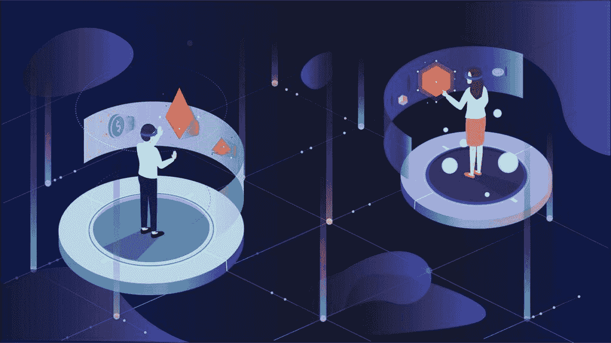
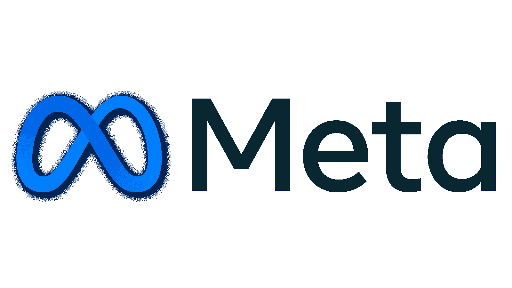
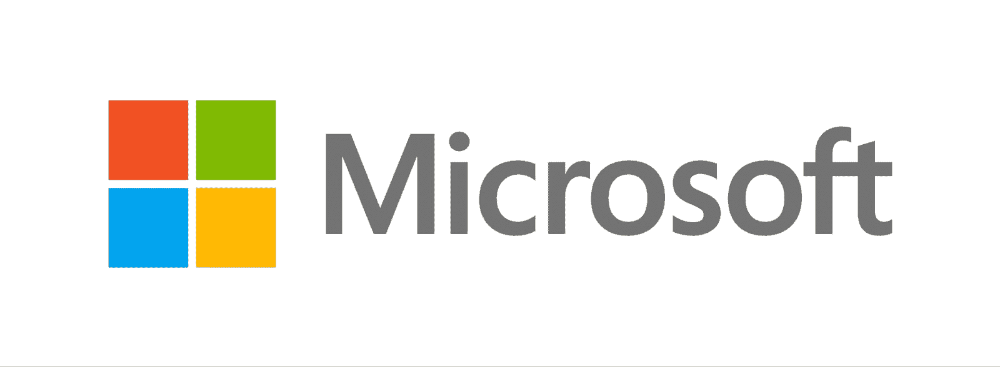
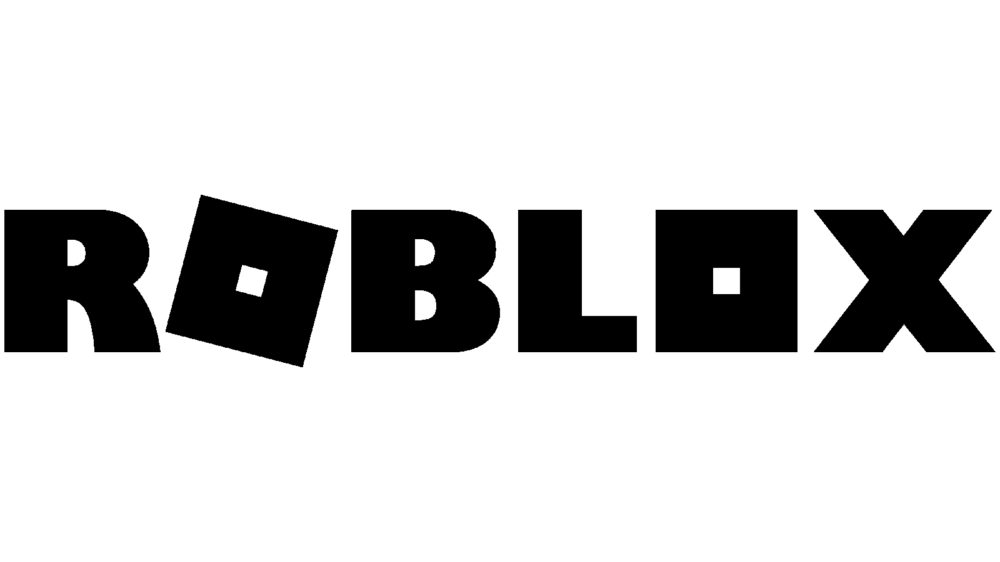
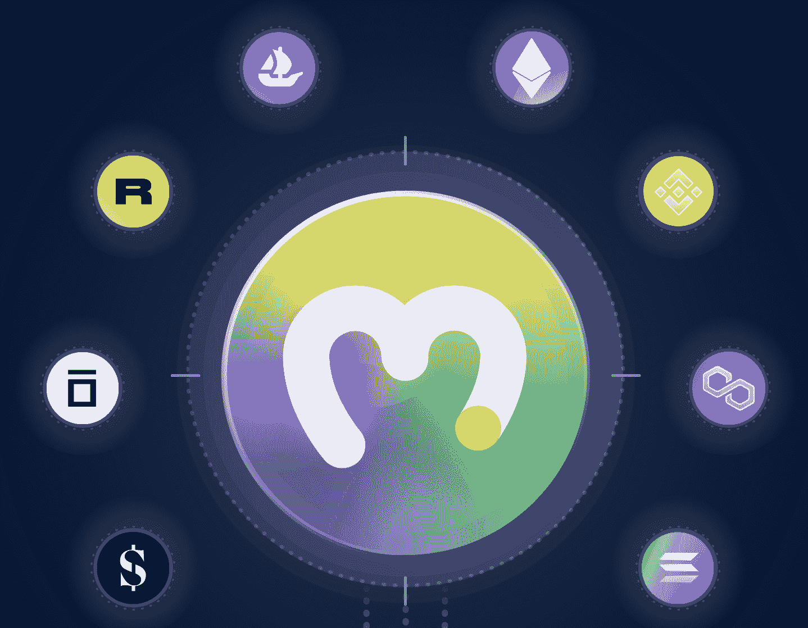

# 什么是元宇宙？–完整指南

> 原文：<https://moralis.io/what-is-the-metaverse-full-guide/>

你现在很可能听说过“元宇宙”这个词，因为它在新闻和社交媒体上获得了极大的关注。兴趣增加的部分原因是脸书更名为梅塔，这一案例得到了媒体的大量报道，并引发了对元宇宙的兴趣。然而，即使人们听说过元宇宙，对于这一现象实际上意味着什么，它可能仍然是一个谜。鉴于这种情况，我们将在本文中回答“什么是元宇宙？”。

在下一节中，我们将进一步了解元宇宙并探索其使用案例。接下来，我们还将深入探讨一些最受欢迎的元宇宙公司及其正在进行的项目。这将有助于更好地理解当前形势，并指明其发展方向。最后，我们将探讨 Moralis 的首要选项，您可以利用它来构建自己的元宇宙项目。

Moralis 是开发元宇宙项目的最简单的方法，如 dApps(分散应用)、游戏和其他创造性和创新性的想法。此外，总的来说，Moralis 是区块链开发的最佳操作系统，它通过提供一个更易访问的开发过程来帮助扩展分散式网络。

Moralis 提供了一个无限可扩展的底层后端基础设施，让您在创建 Web3 项目时避免“重新发明轮子”。该平台还提供了一个广泛的解决方案工具箱，如 [Moralis Speedy Nodes](https://moralis.io/speedy-nodes/) ，对 [IPFS](https://moralis.io/what-is-ipfs-interplanetary-file-system/) 的本地支持， [NFT API](https://moralis.io/ultimate-nft-api-exploring-moralis-nft-api/) 等等。

那么，你想成为一名区块链开发商，建立自己的元宇宙项目吗？好吧，那么正确方向的第一步就是和 Moralis 签约。您可以免费创建一个帐户，并且您将立即获得该平台的所有工具！

## 什么是元宇宙？

脸书更名为 Meta 可能增加了人们最近对元宇宙的兴趣；然而，这个术语实际上从 90 年代早期就在文学作品中出现了。此外，这是一个在游戏、书籍、电视节目和电影中孜孜不倦探索的概念。然而，由于我们没有必要的技术，这些描述经常严重偏离我们的现实。那么，在我们的情况下，这个概念实际上意味着什么呢？

尽管元宇宙正在获得越来越多的关注，但仍然很难给这个概念下一个准确的定义。然而，广义地说，元宇宙指的是另一个虚拟世界，用户通过数字化身“生活”。因此，这是一种连接来自不同地方和平台的人的方式。

就目前的技术状况而言，这实质上表明元宇宙是互联网的新版本。一个人们可以互动的空间，提供更身临其境的社交体验。它由 3D 化身、dApps、虚拟世界/现实组成，有时由加密和 NFTs 等技术驱动。

作为不同虚拟世界和现实的“宇宙”，元宇宙的各种平台通过可互操作的资产和体验相互连接和交织。这为元宇宙提供了在几个方面革新和改变世界的巨大潜力。例如，它可以积极影响人们工作、交流、经营企业和消费商品的方式。

此外，尽管元宇宙远离流行文化中描绘的宇宙，但它正随着技术的进步快速加速和发展。尽管如此，元宇宙的未来仍不明朗，因为它是一个在现实世界中形成的相对较新的概念。这使得很难预测它对人们的实际影响，只有时间才能证明这一点。

## 元宇宙公司

虽然很难预测这个概念将在多大程度上影响个人的日常生活，但很明显，元宇宙具有巨大的潜力。然而，为了更好地说明元宇宙的现状，并为“什么是元宇宙？”这个问题提供一个更容易理解的答案，我们将深入探讨一些目前最著名的元宇宙公司和平台。

在接下来的四个部分中，我们将进一步了解微软、沙盒、Roblox 等公司，当然还有脸书/Meta，该公司旨在成为开发元宇宙的领先公司。然而，这只是几个例子，市场上还有成千上万的其他优秀平台。但是事不宜迟，让我们继续近距离观察脸书吧！

### 什么是脸书元宇宙？

原名脸书的 Meta ，旨在将元宇宙带入生活。从脸书更名部分源于这一使命，使元宇宙成为现实。

Meta 试图让元宇宙成为现实的方式是帮助开发空间。因此，他们开始创造技术，帮助人们连接、探索和扩展这一新的数字现实。

这里的一个例子是 Meta 的地平线世界——最初被称为脸书地平线。地平线世界本质上是数字世界，人们可以在那里互动和交流。可以通过各种设备访问这个世界，其中既有 Oculus Rift，也有 Oculus Quest。当在这个世界中航行时，人们将能够玩游戏，探索，并与来自世界各地的其他玩家互动。

### 微软的数字宇宙是什么？

就像 Meta 一样，[微软](https://www.microsoft.com/)也对这一现象表现出兴趣。他们还希望创造一种更具互动性和沉浸感的互联网体验，人们可以在其中探索、玩耍和相互交流。

微软认为，元宇宙的一些主要思想，例如通过虚拟形象与在线用户互动，已经在游戏领域存在了很长时间。此外，他们进一步表示，他们拥有来自游戏行业的必要经验，可以帮助构建元宇宙的下一代平台。此外，最近以 700 亿美元收购动视暴雪有助于这种扩张，微软认为这不仅仅是一个附带赌注。

### 什么是沙盒元宇宙？

沙盒是一个虚拟的元宇宙，用户可以在这里建立自己的世界，将他们的游戏体验货币化，并让其他人来玩。此外，还可以通过使用 NFTs(不可替代的代币)在平台上出售/购买土地和资产。

如果用户在沙盒的宇宙中拥有土地，他们可以以多种方式定制和开发他们的资产。一些人利用他们的土地来创建艺术画廊，在那里他们可以出售非艺术作品；与此同时，其他人创造令人兴奋的游戏。这表明仅仅是想象力限制了用户。

### 什么是 Roblox 虚拟宇宙？

Roblox 元宇宙已经非常繁荣，人口众多，每天大约有 5000 万活跃用户和 950 万开发人员帮助创建和扩展 Roblox 世界。事实上，Roblox 高度依赖其用户，因为玩家创造了该平台的游戏内体验。因此，他们的主要任务是提供一个地方，让创作者可以追求他们的愿景，并为其他玩家创造身临其境的体验。

Roblox 拥有超过 2400 万个用户创建的项目或体验，玩家可以深入其中，这表明该平台是巨大的。然而，允许用户创建元宇宙的一个问题是设置规则。很难防止人们滥用该平台的机会，例如，实施图形暴力。因此，该平台有超过 4000 名版主帮助规范该平台以解决这一问题。

此外，Roblox 开发该平台的目的是利用现有的技术。他们认为 VR 和 AR 方面的技术进步并不是真正必要的。相反，他们提倡沉浸式互动体验，而不是强调社会创新。

## 什么是 NFT 元宇宙？

现在，没有一个具体的“NFT·元宇宙”；然而，国家森林小组很可能在元宇宙的未来发挥重要作用。因此，要理解为什么 NFT 有如此大的潜力，我们首先需要准确理解它们是什么。因此，我们将简要介绍非功能性测试，并回答问题"[什么是非功能性测试？](https://moralis.io/non-fungible-tokens-explained-what-are-nfts/)”。

NFTs 是不可替换令牌的缩写，那里的关键词是“不可替换”。术语“不可替代”描述具有独特属性和价值的资产，如房地产。例如，大多数房子都是独一无二的，这意味着如果没有金钱补偿，一处房产不能直接与另一处交换。这意味着不可替代资产是完全独特的，不可互换的。

基于这一点，它本质上意味着 NFT 是不可互换的唯一令牌。然而，它们的独特性确实允许 NFT 代表不可替代资产的所有权。这使得 NFTs 非常适合代表元宇宙资产的所有权，如武器、土地、财产等。例如，沙盒平台上的一块土地由一个 NFT 代表。所以，如果你持有这个令牌，你就是那块特定土地的所有者。

然而，一个关键的区别是，NFT 只代表某些东西的所有权。因此，令牌本身通常不包含任何资产，而是指向一些特定的东西，如数字艺术、虚拟土地或这些数字世界中的其他项目。

这表明，作为一种使用户能够持有独特资产的机制，NFTs 可能会在元宇宙中发挥重要作用。它变得势在必行，因为一些数字资产，如以 NFTs 为代表的数字艺术，售价高达数百万美元，这意味着像令牌这样的安全机制是理想的。

### 什么是 Moralis 元宇宙 SDK？

所以，现在我们明白了元宇宙需要什么，我们可以发现更多关于创造元宇宙体验和 Web3 游戏。开发这些经验和项目最简单的方法是利用 Moralis。

Moralis 向所有用户提供已经开发的后端基础设施，使 [Web3 开发](https://moralis.io/how-to-build-decentralized-apps-dapps-quickly-and-easily/)更加容易。事实上，有了 Moralis，开发区块链和元宇宙的项目变得明显更快，因为操作系统允许您将开发时间平均减少 87%。

除了后端基础设施，Moralis 还提供了几个有用的开发工具。其中之一是 Moralis 元宇宙 SDK。Moralis 元宇宙 SDK 允许开发人员在市场上的各种区块链中快速轻松地开发 Web3 游戏和元宇宙体验。

此外，Moralis 元宇宙 SDK 具有与 Unity 的集成功能，这意味着您可以为 Xbox，PlayStation，任天堂，Windows，macOS，甚至 iOS 和 Android 构建项目，因为 [Moralis 的 React 本机支持](https://moralis.io/moralis-introduces-react-native-support/)。

因此，如果你想开发 dApps、游戏或其他项目，仔细看看 Moralis 元宇宙 SDK 是非常值得的。你所要做的就是注册 Moralis 来获得这个开发包的全部权限！

## 什么是元宇宙总结

“元宇宙”一词在过去的几个月里爆炸式增长，这在一定程度上与脸书更名为 Meta 有关。然而，尽管元宇宙正成为一个越来越受欢迎的概念，引起了全世界人们的兴趣，但关于这一现象实际上意味着什么仍有疑问。

术语“元宇宙”已经存在了 30 年，这是一个在流行文化中经常出现的概念。然而，关于这一概念的电影和文献展示了一幅不同的画面，一幅由更先进的技术主导的画面。事实上，元宇宙本质上是互联网的新版本。这是一个人们可以相互交流的空间，提供了更加身临其境的社交体验。它围绕 3D 化身、dApps、虚拟现实/世界构建，有时由区块链和加密技术驱动。

元宇宙有可能彻底改变互联网以及人们工作、交流、消费、创业等方式。随着元宇宙的扩张和变得更加令人身临其境，观察它的发展方向将会非常有趣。

如果你对开发元宇宙项目感兴趣，你一定要看看 Moralis 元宇宙 SDK。SDK 是开发 dApps、游戏和其他元宇宙项目最简单的方法。此外，有了 Moralis，你将有无限的机会，因为操作系统使 Web3 开发变得更加容易。

如果你想了解更多关于 Moralis 的信息，请仔细看看 Moralis 的博客。这个博客提供了关于区块链发展的最好和最相关的信息。如果你有兴趣，可以看看[如何创造 10，000 个 NFT](https://moralis.io/how-to-mint-10000-nfts-full-walkthrough/)、[如何创造一个伟大的 dApp UI](https://moralis.io/web3-ui-how-to-create-a-great-dapp-ui/) 和 [Web3 认证](https://moralis.io/web3-authentication-the-full-guide/)的指南。

那么，希望[成为区块链的开发者](https://moralis.io/how-to-become-a-blockchain-developer/)？然后[今天就跟 Moralis 家](https://admin.moralis.io/register)报名吧！