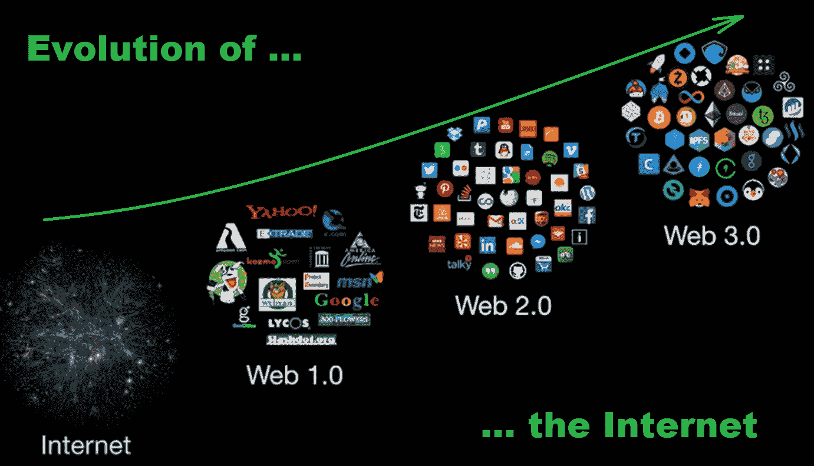
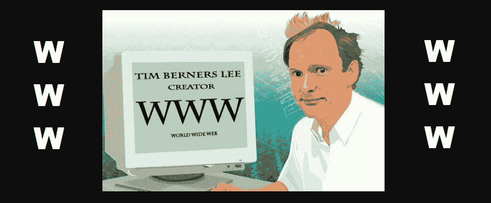
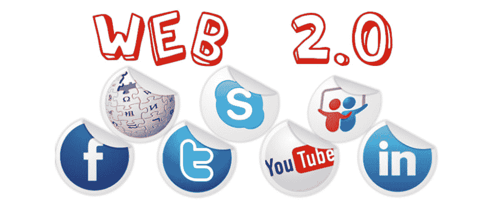
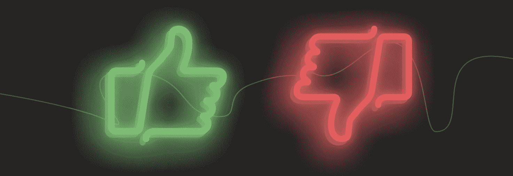
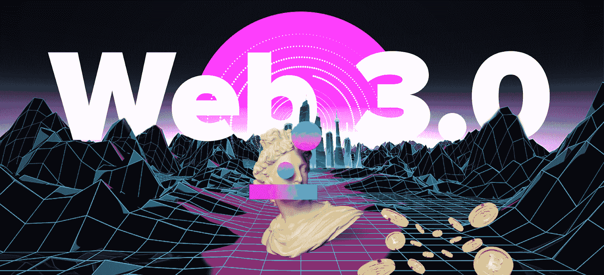
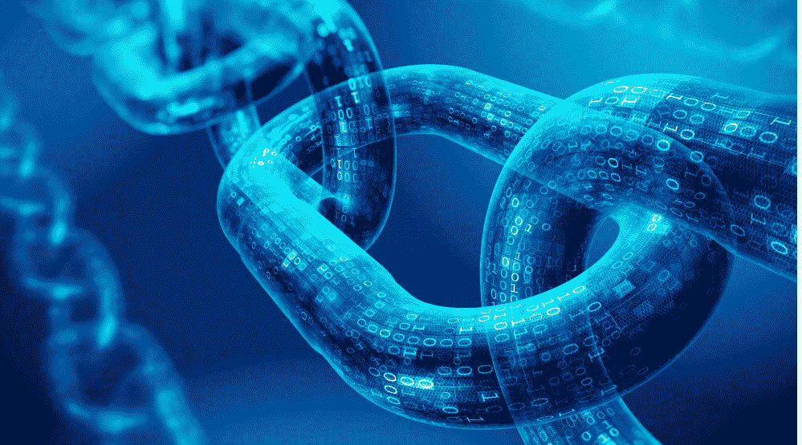
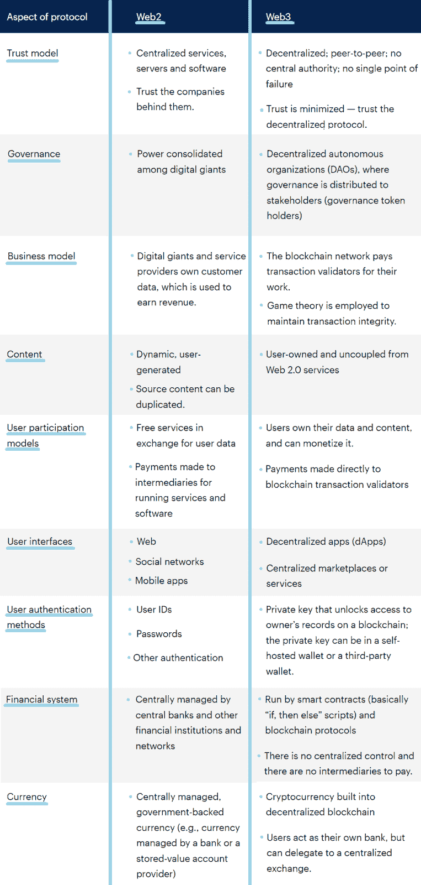
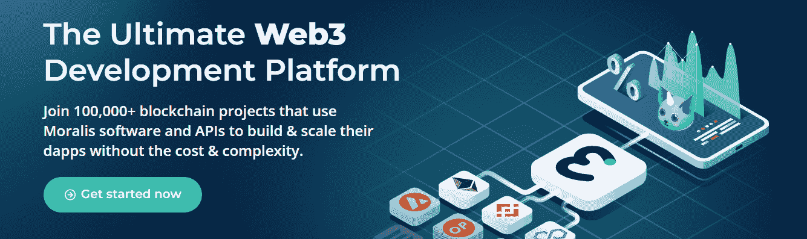

# 什么是 Web2 和 Web3？解释网站 3

> 原文：<https://moralis.io/what-is-web2-and-web3-explaining-web3/>

Web2 和 Web3 都深刻地改变了他们以前的互联网版本。在当今时代，Web3 变得越来越受欢迎，其去中心化的本质正在改变我们在线互动的方式。自比特币和以太坊推出以来，从 Web2 到 Web3 的过渡成为现实。因此，越来越多的人开始问，“什么是 Web3？”。Web3 最近取得了很多进展，每天都有许多令人兴奋的新 [**【区块链】用例**](https://moralis.io/use-cases-for-solidity-smart-contracts/) **涌现。然而，许多个人最近发现，互联网包含不同的所谓“版本”。结果，人们开始疑惑，“什么是 Web2 和 Web3？”。因此，解释 Web3 和 Web2 是我们在这里要解决的问题。此外，我们将为初学者和精通 JavaScript 的程序员提供如何使用本文介绍的 Web3 基础知识轻松地成为区块链开发者的信息。**

在继续之前，我们将首先从一些关于 Web1 的基本信息开始。然后，我们将重点讨论“什么是 Web2 和 Web3？”问题。在回答了这个问题之后，“什么是 Web3？”将不再是一个谜。此外，通过对“今日互联网”和新兴版本的正确理解，我们将能够更密切地比较这两个版本。因此，你将能够看到 Web3 相对于 Web2 的优势。此外，您还将了解当前 [Web3 技术栈](https://moralis.io/exploring-the-web3-tech-stack-full-guide/)的一些重要细节。你将有机会探索一个“ [Firebase for crypto](https://moralis.io/firebase-for-crypto-the-best-blockchain-firebase-alternative/) ”平台来创建你自己的[分散应用](https://moralis.io/decentralized-applications-explained-what-are-dapps/) (dapps)。因此，这篇文章有能力让你不再问“什么是 Web2 和 Web3？”到[成为 Web3 开发者](https://moralis.io/how-to-become-a-web3-developer-full-guide/)。

## 什么是 Web1？

现在，在深入探讨“什么是 Web2 和 Web3？”主题，让我们探索 Web1。互联网的概念始于 20 世纪 60 年代，当时政府研究人员需要一种共享信息的方式。然而，我们认为 1983 年 1 月 1 日是第一代互联网的正式生日。当然，在当时，它被认为是“互联网”。直到 Web2 的诞生，才出现了“Web1”的标签。你可能知道，与今天相比，那时的计算机非常原始和缓慢，只有精通技术的人才知道如何使用它们。因此，在 Web1 时代开始时，用户数量是最少的，更不用说拥有电脑的人了。因此，Web1 主要被大公司使用。

使用 Web1 也相当昂贵，因为用户是按浏览量收费的。除了技术上的障碍，还有一个谁能负担得起的问题。

此外，我们必须指出，Web1 是只读的，静态页面代表核心内容。因此，主页是第一代互联网的基础。这段时间内容创作者非常少。然而，这是电子邮件被引入的时候。然而，当时它只支持文本，这意味着它不支持附件。此外，Web1 时代还产生了 1995 年至 2000 年间的所谓“网络”泡沫。直到 2005 年，互联网才得以发展，Web2 才开始出现。这也是对我们解决“什么是 Web2 和 Web3？”第一部分的提示讨论。

## 什么是 Web2 和 Web3？

既然你知道这一切是从哪里开始的，是时候看看互联网接下来经历了什么阶段了。因此，这就是我们的“什么是 Web2 和 Web3？”旅程开始。尽管如此，我们必须首先确保你们都知道大多数人现在认为互联网是什么。通过这样做，我们将打下坚实的基础，在此基础上，我们可以揭开“什么是 Web3？”。此外，由于 Web3 还没有完全成熟，所以最好将其与 Web2 进行比较。这样，你可以很容易地看到它提供的优点、缺点和机会。

## 什么是 Web2？

如上图所示，Web2 引入了用户对用户的交互。互联网不再是只读的，但它也使用户能够写作。因此，静态网站提供输入，甚至变得互动。这也意味着内容创作比 Web1 简单得多。因此，突然之间有了更多的内容创造者，尤其是当博客开始流行的时候。2005 年后，支持互联网运行的基础设施继续增长。因此，互联网变得更加便宜和普遍。然而，更先进和更便宜的电脑也有助于采用不断发展的网络世界。

除此之外，独特的网站或在线应用程序，如脸书(现为 Meta)吸引了大量用户的关注。事实上，这就是社交媒体的诞生，没过多久，这种在线社交形式就变得广泛起来。在许多方面，Web2 都带有社交媒体应用的标志。如果我们现在将视频流添加到图片中，我们可以看到，这个曾经的“技术”工具突然变得更加丰富。当然，许多用户继续将互联网用于教育目的。然而，Web2 仍然是全球无数用户的娱乐中心。是的，Web 2.0 就是许多人所说的“今天的互联网”。

博客、播客、标签、网络内容投票、社交网络等等都是 Web2 的产物。此外，这一代互联网也塑造了“网络平台”的概念。当桌面软件应用被 web 应用取代时，我们谈论后者。此外，Web2 还为我们提供了新的网络浏览器技术，如 AJAX 和 JavaScript (JS)。此外，我们看到了应用程序编程接口(API)的出现，它提供了一个新的交互海洋。

### Web2 的利弊

意识到 Web2 的主要优势和劣势将有助于你更好地理解“什么是 Web2 和 Web3？”话题。让我们从优点开始:

*   任何能上网的人都可以使用 Web2。用户不需要权限。
*   用户通常只需点击一下鼠标，就可以获得难以想象的广泛信息。
*   Web 2.0 很好办。
*   它使用户能够根据最近的情况进行搜索。
*   搜索引擎支持多种语言。
*   电子邮件、社交媒体和其他实用的 Web2 服务使人们能够互动和保持联系，无论他们实际在哪里。
*   Web2 还允许人们纠正错误的信息。
*   它使人们能够轻松地相互共享文件。
*   Web2 是一种非常高效、廉价和简单的在线促销方式。
*   它精心打造了动态学习社区，并继续提供实时讨论。

以下是 Web2 的主要缺点:

*   搜索结果有时会偏离目标。
*   取决于几个因素，Web 2.0 有时可能需要相当长的时间来显示搜索结果。
*   自动翻译还不可靠。
*   网络上有很多错误的信息。
*   没有中间代理，用户就无法在对等的基础上进行连接。
*   通常，隐私是很成问题的。
*   欺诈、垃圾邮件和病毒攻击的风险仍然很高。

你同意上面的列表吗？你会添加或删除什么吗？毕竟，你很有可能多年来一直是 Web2 的活跃用户。此外，既然我们已经回答了“什么是 Web2？”问题和分析了 Web2 的利与弊，是时候解决“什么是 Web3？”。

## 什么是 Web3？

“什么是 Web2 和 Web3？”中的一个主要话题是文章是 Web3。因此，让我们来解决“什么是 Web3？”本节中的问题。未来的互联网、读写执行 web、可执行 web 和语义 web 都是 Web3 或 Web 3.0 的不同名称。以太坊的联合创始人之一加文·伍德推广了后一个术语。他认为中央集权从长期来看是站不住脚的。事实上，许多人认为去中心化和对点对点(P2P)交互的本地支持是 Web 3.0 的本质。然而，我们必须指出，Web3 还没有达到全盛时期。因此，机器完全像人类一样处理内容的网络还不存在。然而，人工智能和人工智能的某些方面已经在实施了。尽管如此，我们可以期待 Web3 的未来会带来更多的动态应用、机器对机器的交互和交互式服务。

此外，在未来的互联网上，数据将不再被拥有，而是被共享。高德纳公司著名副总裁兼分析师阿维瓦·谭力认为，Web3 创新将把互联网带入新的领域。他预测互联网的新时代将支持以前不可能的应用。此外，我们已经看到许多 dapps。此外，Gartner 的另一位著名副总裁分析师 Whit Andrews 指出，Web3 旨在赋予其参与者自己的自主权力和控制权。你觉得你能给“什么是 Web3？”这个问题一个可靠的答案吗现在提问？如果是，我们继续或者“什么是 Web2 和 Web3？”探索！

### 区块链是 Web3 的开端

大多数专家都认为区块链是 Web3 的核心，这个新版本的互联网应该使用基于去中心化区块链的一系列技术。后者支持新的社交和商业模式。例如，区块链理工大学允许用户拥有自己的数据、身份和内容。其算法允许用户通过拥有[治理令牌](https://moralis.io/what-are-governance-tokens-full-guide/)或加密货币作为“股东”参与其中。后者以可替代和[不可替代令牌](https://moralis.io/non-fungible-tokens-explained-what-are-nfts/) (NFTs)的形式出现，这为 Web3 的经济发展提供了动力。这也支持了无数新的商业机会，并增加了高度的透明度。

此外，已经有多个可编程区块链开始运行，以太坊是其中的佼佼者。如果我们专注于“什么是 Web3”主题的去中心化和 P2P 交易，那么您可以使用 [MetaMask](https://moralis.io/metamask-explained-what-is-metamask/) 并在今天进入 Web3 领域，参与到它的去中心化生态系统中。因此，早期采用者已经能够对互联网的未来有所了解。虽然，要记住很多 dapps 还是类似于一个真正的“狂野西部”。这就是为什么让尽可能多的先进开发者来帮助创建一个让后代感到自豪的 Web3 是非常重要的。

你也许想知道 Web3 和元宇宙 T1 是如何结合在一起的？最重要的是，[元宇宙](https://moralis.io/what-is-the-metaverse-full-guide/)是一个数字原生世界的进化视觉。预测认为，我们将参与各种类型的活动，甚至在这个数字世界中工作。另一方面，Web3 更多的是提供去中心化的技术栈和协议。当然，后者将用于建设元宇宙的特定部分。

## 什么是 Web2 和 Web3？并排比较

下图对 Web2 和 Web3 进行了很好的对比。这基本上是“什么是 Web2 和 Web3？”讨论。

高德纳公司杰出的副总裁兼分析师阿维瓦·谭力很好地指出了 Web3 的一些关键问题。这些主要包括缺乏客户保护和一些新的安全威胁。目前，规模、客户服务和客户保护仍在 Web2 一边。

## 使用“什么是 Web2 和 Web3？”知识与 Moralis

[Moralis](https://moralis.io/) 是终极 [Web3 后端平台](https://moralis.io/exploring-the-best-web3-backend-platform/)。它是帮助你把“什么是 Web2 和 Web3？”轻松使用的知识。多亏了 [Moralis 的 SDK](https://moralis.io/exploring-moralis-sdk-the-ultimate-web3-sdk/) ，你可以通过从 [Moralis 的文档](https://docs.moralis.io/)中复制并粘贴简短的代码来满足你与区块链相关的后端需求。因此，你可以节省大量的时间并投入更多的资源来创建一个令人印象深刻的 Web3 UI。而且，有了 [Moralis 的元宇宙 SDK](https://moralis.io/metaverse/) ，还可以攻关 [Web3 游戏设计](https://moralis.io/web3-game-design-explaining-the-web3-game-design-process/)。

通过使用 Moralis，您可以避免处理 RPC 节点的[限制。此外，你会接触到许多 Web3 工具，包括 MetaMask、](https://moralis.io/exploring-the-limitations-of-rpc-nodes-and-the-solution-to-them/) [WalletConnect](https://moralis.io/what-is-walletconnect-the-ultimate-walletconnect-guide/) 和 [IPFS](https://moralis.io/what-is-ipfs-interplanetary-file-system/) 。因此，您可以轻松地[使用 MetaMask](https://moralis.io/how-to-authenticate-with-metamask/) 进行身份验证，或者[使用 WalletConnect](https://moralis.io/how-to-connect-users-with-walletconnect/) 连接用户，以满足您的 dapps 的 [Web3 身份验证](https://moralis.io/web3-authentication-the-full-guide/)需求。附加的 Moralis 工具还支持 [Web3 社交登录](https://moralis.io/web3-social-login-sign-in-dapp-users-with-google-email-or-twitter/)，方法是[将 Web3 钱包连接到 Twitter 账户](https://moralis.io/connecting-web3-wallet-to-twitter-account/)以及[通过电子邮件进行 Web3 认证](https://moralis.io/how-to-do-web3-authentication-via-email/)。后者可以真正帮助你[提升 Web3 用户的参与度](https://moralis.io/how-to-boost-web3-user-onboarding-success-rates/)。通过 Moralis 的 [Web3 登录](https://moralis.io/connecting-a-unity-game-with-web3-login/)工具，你还可以管理用户会话，包括跨链身份。通过 Moralis 仪表板(数据库)，您可以[索引区块链](https://moralis.io/how-to-index-the-blockchain-the-ultimate-guide/)和[存储链外数据](https://moralis.io/how-to-store-off-chain-data-unity-web3-database/)。所以，如果你准备好帮助塑造“什么是 Web3”的话题，今天就[创建你的免费 Moralis 账户](https://admin.moralis.io/register)。

## 什么是 Web2 和 Web3？解释 web 3–总结

至此，您已经了解了 Web1、Web2 和 Web3 的来龙去脉。因此，你知道我们仍然处于 Web2 时代，正在慢慢过渡到 Web3。然而，你也知道，由于区块链的技术，Web3 在一些最重要的方面已经成为现实。此外，您还有机会了解更多关于 Moralis 的知识，以及它如何成为 Web3 开发的跳板。此外，我们还鼓励您查看 Web3 的[终极指南，并探索诸如“](https://moralis.io/the-ultimate-guide-to-web3-what-is-web3/)[为什么 Web3 很重要](https://moralis.io/why-is-web3-important-a-beginners-guide/)”之类的话题以及“【Web3 如何工作？”。通过这样做，你将了解“什么是 Web3？”话题。

我们建议浏览[Moralis 博客](https://moralis.io/blog/)和[Moralis YouTube 频道](https://www.youtube.com/c/MoralisWeb3)。这将让你有机会承担各种示例项目。这样，你会提出“什么是 Web2 和 Web3？”理论到实践。一些最新的话题回答了诸如“[什么是索拉纳？](https://moralis.io/what-is-solana-the-full-2022-guide/)”。此外，商店还深入探讨了将 Web3 钱包连接到网站的[、](https://moralis.io/how-to-connect-a-web3-wallet-to-a-website/)、 [NFT 实用程序](https://moralis.io/nft-utility-exploring-nft-use-cases-in-2022/)、如何设置 [BNB 钱包](https://moralis.io/binance-coin-wallet-guide-how-to-set-up-a-bnb-wallet/)、[多链钱包](https://moralis.io/how-to-build-a-multi-chain-wallet-in-5-steps/)或 [ETH 钱包](https://moralis.io/how-to-create-an-eth-wallet-full-guide/)、 [Web3 网飞克隆](https://moralis.io/how-to-develop-a-web3-netflix-clone/)、Web3 游戏的[好处](https://moralis.io/benefits-of-web3-gaming-full-breakdown/)等等。尽管如此，对于那些想尽快成为全职加密员的人，我们建议你报名参加[Moralis 学院](https://academy.moralis.io/)。