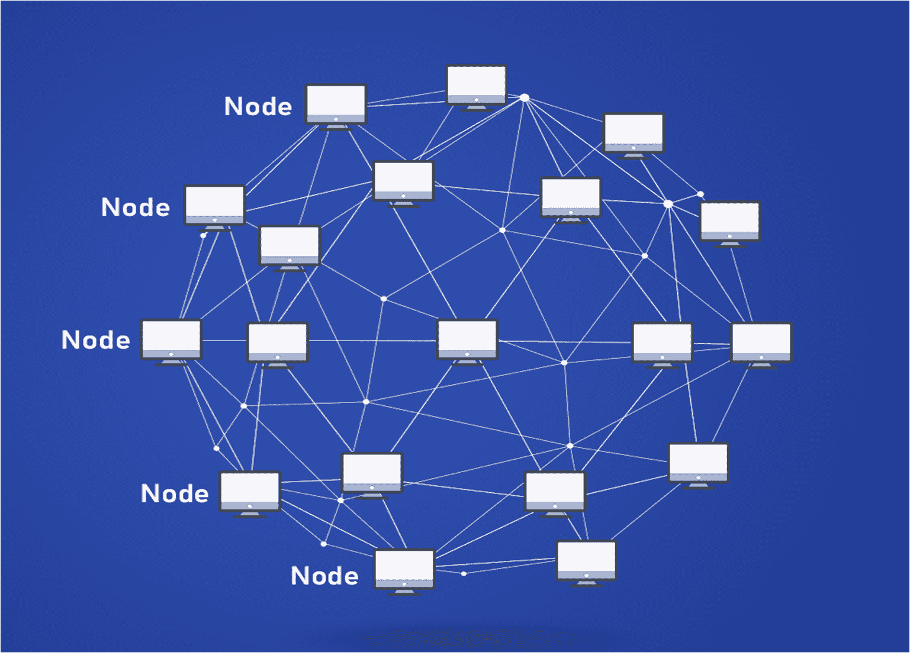
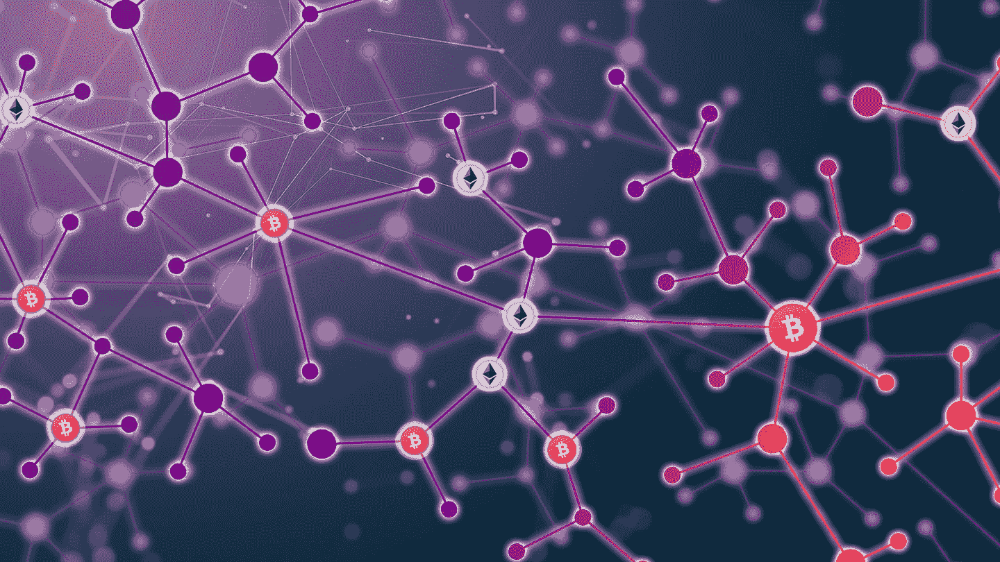
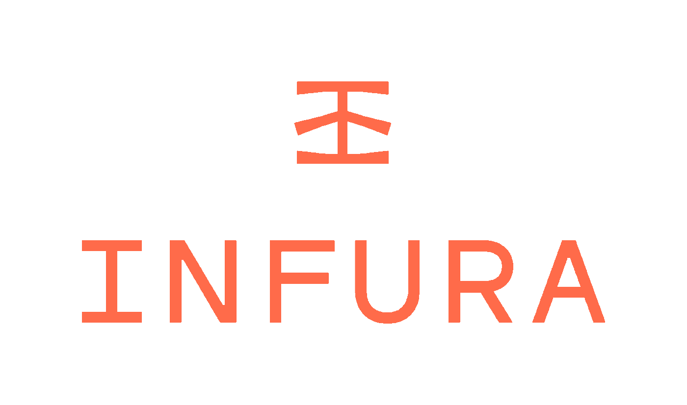
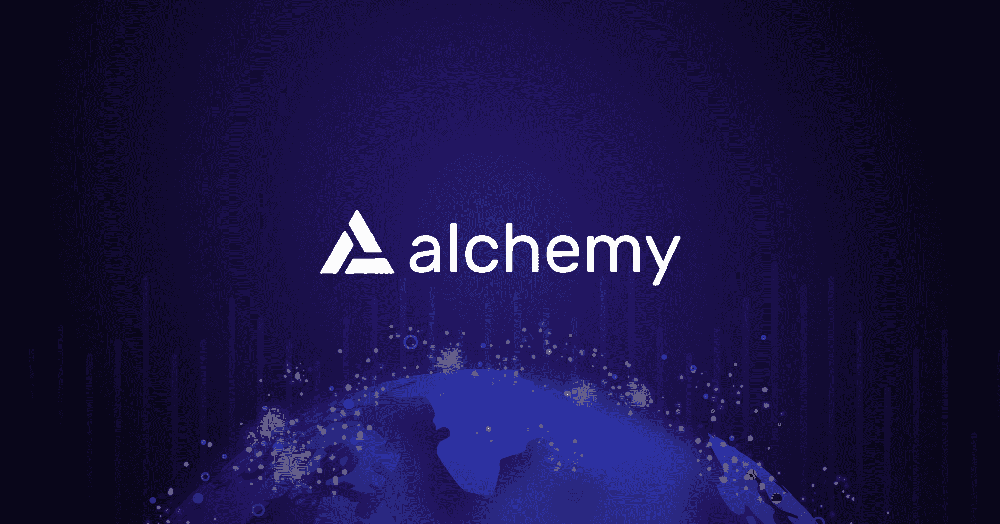
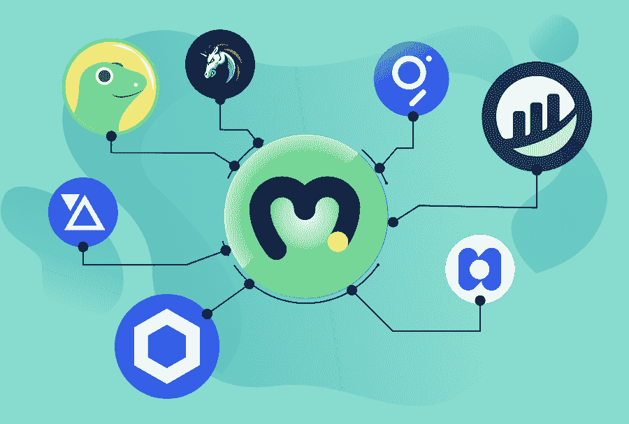
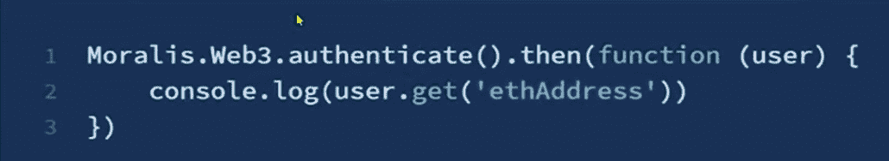
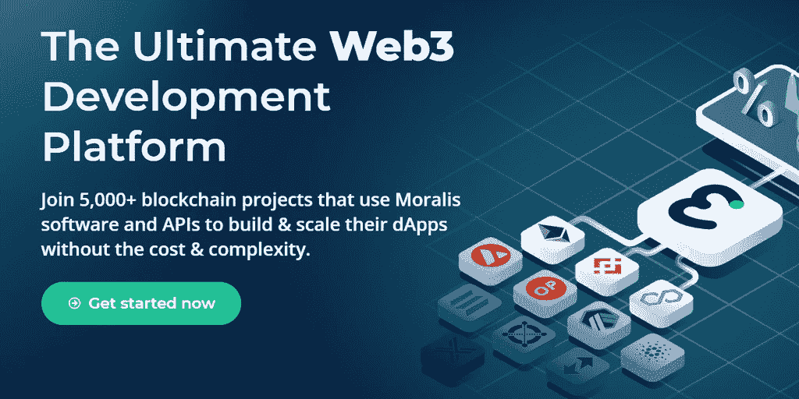

# Moralis、炼金术和因陀罗有什么区别？

> 原文：<https://moralis.io/whats-the-difference-between-moralis-alchemy-and-infura/>

**构建**[**【web 3】**](https://moralis.io/the-ultimate-guide-to-web3-what-is-web3/)**应用如果按照传统的路径，从连接到一个** [**RPC 节点**](https://moralis.io/ethereum-rpc-nodes-what-they-are-and-why-you-shouldnt-use-them/) **开始，可能会很困难。如果您决定设置并运行您自己的节点，尤其如此，这是一项具有挑战性的、耗时的工作，并且您最终会使用大量的计算机存储。因此，许多开发人员发现这种“传统途径”在连接以太坊的区块链时不切实际**、**而且很麻烦，因为同步时间很慢。因此，许多开发者转而依赖** [**区块链节点提供商**](https://moralis.io/infura-alternatives-and-blockchain-node-providers/) **。这些节点提供商充当了克服所有上述障碍的桥梁。此外，我们还将了解您是否应该使用区块链节点提供商，或者像 Moralis 这样更完整的解决方案。因此，我们将看看一些最流行的节点提供者，并回答“Moralis、炼金术和 Infura 之间有什么区别？”。**

然而，区块链节点提供者假定您仍然遵循围绕 RPC 节点构建的耗时路径。因此，我们还将研究您是否应该使用节点提供者——很可能，您最好使用一个全面的 SDK 来进行 dApp 开发，例如 Moralis SDK。继续阅读，找到适合你的，并找出节点提供者之间的区别，如 Alchemy 和 Infura 或简单地使用 Moralis！

尽管 Moralis 也提供了对节点的简单访问，但它也使得构建 dApps 成为一个简单直接的过程。这个终极的 Web3 开发平台提供了最令人印象深刻的 [Web3 SDK](https://moralis.io/exploring-moralis-sdk-the-ultimate-web3-sdk/) ，它给所有精通 [JavaScript](https://moralis.io/javascript-explained-what-is-javascript/) 的开发者一个参与这个快速增长行业的机会。所以，事不宜迟，继续读下去，了解 Moralis，炼金术和 Infura 之间的区别！如果你想要更深入的 Moralis 观内容，一定要阅读我们的深入研究 [NFT 编程](https://moralis.io/nft-programming-for-beginners/)、[以太坊开发](https://moralis.io/ethereum-development-for-beginners/)，或者我们的[对雪崩的全面支持](https://moralis.io/moralis-announces-full-support-for-avalanche/)！

## 什么是区块链节点提供商？

由于我们有许多新的 Web3 开发读者，我们觉得有义务在讨论“Moralis、炼金术和 Infura 之间的区别是什么？”问题。通过了解什么是区块链节点和区块链节点提供商，您将能够更好地选择最适合您需求的节点提供商。

### 什么是区块链节点？

您可能已经熟悉这样一个事实，即一些区块链节点(完整节点)包含特定分布式分类帐的完整副本，即区块链。此外，区块链节点充当通信点，支持与实际的区块链进行交互。此外，区块链节点提供了许多功能目的，包括执行拒绝或接受事务、存储加密链接块、管理事务和控制事务的有效性等任务。此外，区块链节点与其他节点通信，从而了解整个网络的状态。由于这种互连，同一网络的节点通常被称为“对等体”。如上所述，您还应该记住有不同类型的节点，比如完整节点、轻型节点和[归档节点](https://moralis.io/what-are-full-archive-nodes/)。

知道了什么是区块链节点，就很容易理解区块链节点提供商。正如“提供者”一词所暗示的，区块链节点提供者本质上是提供区块链节点的服务。虽然有几个著名的节点提供商，但在本文中，我们将重点关注 Infura、Alchemy 和 Moralis。使用区块链节点提供者的主要优点是，您能够跳过设置和管理您自己的区块链节点的必要过程。因此，您可以节省时间和资源。然而，重要的是要记住，并非所有的区块链节点提供商都提供相同的功能。因此，您应该确保选择符合您的用例及特定需求的提供商。事实上，您很可能会发现，在构建 dApp 时，您需要的不仅仅是一个节点提供者！

# 对于区块链开发者来说，Moralis，Alchemy，Infura 有什么区别？

现在你知道了什么是区块链节点提供者，是时候回答“Moralis、炼金术和 Infura 之间有什么区别了？”。然而，在我们能够解决这三个项目之间的关键差异之前，有必要对它们中的每一个进行简要的概述。此外，值得记住的是，它们都属于不同的类别 Infura 和 Alchemy 主要是区块链节点提供商。另一方面，Moralis 是一个完整的区块链中间件，它提供了比区块链节点更多的功能。因此，与单纯的节点提供者相比，使用 Moralis 构建是根据下一个范式转变来构建的。

## 什么是 Infura？

Infura 是 ConsenSys 拥有的服务提供商，致力于为 Web3 应用程序开发提供必要的工具和基础设施。这包括通过提供对以太坊和 [IPFS](https://moralis.io/what-is-ipfs-interplanetary-file-system/) 的简单可靠的访问来测试和部署功能。

Infura 提供的最重要的解决方案示例包括:

*   为开发人员提供了到对等网络的快速连接，从而消除了长时间的初始化。
*   帮助开发者避免存储整个以太坊区块链和扩展基础设施的相关费用。这样，它基本上消除了全职站点可靠性工程师和 DevOps 团队帮助开发人员维护基础设施的需要。
*   提供基础设施和工具，方便开发者连接以太坊和 IPFS。因此，他们可以尽早开始构建分散的应用程序。

此外，除了以太坊的 mainnet 和 testnet(Rinkeby，Ropsten，Kovan，gorli)，Infura 还支持一系列其他相关技术。例如，这包括 Arbitrum Rollup、Filecoin (beta)、Polygon PoS (beta)、Eth2 Beacon Chain (beta)和乐观以太坊。

Infura 对以太坊开发者有吸引力的原因是它有相对较长的历史记录，因为他们早在 2016 年就公开推出了。此外，在 Infura 的官方网站上，Infura 声称，它提供的请求响应时间比大多数其他服务或自托管解决方案快 20 倍。此外，他们还提供全天候的专家支持团队服务。

## 什么是炼金术？

Alchemy 是另一家著名的区块链节点提供商。它在 2020 年向公众推出了全套产品。这个区块链开发平台的使命是为开发人员提供他们创造未来技术所需的基本构件。此外，他们以提供对高度可伸缩、一致和可靠的节点的访问而自豪。此外，它们还提供了一套用于原型开发、调试和测试的开发工具。此外，他们的平台附带“Monitor”产品，该产品可提供全面的性能和用户洞察，从而改善应用程序的运行状况和性能。尽管如此，Alchemy 还包括“Notify ”,它使您能够立即向您的产品添加通知。

和 Infura 一样，Alchemy 支持以太坊的 mainnet 和 testnets (Rinkeby，Ropsten，Kovan，gorli)。炼金术也支持 Arbitrum Rollup，乐观以太坊，多边形。在这些网络之上，它还为开发者提供了建立在流量和 Crypto.org 链之上的平台。

Alchemy 强调的吸引以太坊开发者的一些要点是:

*   99.9%的可靠性。
*   即时测试网。
*   增强的 API。
*   产品开发速度加快 25%。
*   98%的客户满意度得分(CSAT)。

## 什么是 Moralis？

Moralis 是最终的 Web3 开发平台。它是一个完全托管的、无限可扩展的后端基础设施，用于分散式应用程序开发。因此，Moralis 不仅仅是一个区块链节点提供商。相反，Moralis 属于不同的范式。此外，它使开发人员能够专注于 dApps 的前端，而 Moralis 则处理繁重的后端工作。这为开发人员节省了大量的时间和资源，从而加快了 dApps 的部署。

Moralis 提供了一长串功能，包括 [Moralis Web3 SDK](https://moralis.io/exploring-moralis-sdk-the-ultimate-web3-sdk/) 、 [Moralis Web3 API](https://moralis.io/introducing-the-moralis-web3-api-v2/) 和[Speedy Node API](https://moralis.io/speedy-nodes/)(Moralis Speedy Nodes)。这样，它基本上涵盖了 dApp 开发人员创建非凡的 Web3 应用程序所需的一切。

虽然 Infura 和 Alchemy 主要关注以太坊的 mainnet 和 testnets(尽管它们支持其他链)，但 Moralis 是在跨链支持下从头开始构建的。因此，它提供了完整的跨链互操作性，这使得它 100%面向未来。在撰写本文时，Moralis 已经支持四个备受瞩目的区块链:以太坊、币安智能链、Polygon(原 Matic)和 Avalanche。此外，Moralis 还支持其他声誉良好的连锁店。这种跨链的互操作性使您能够在一个链上构建一个项目，然后简单地将它部署到其他链上，而不需要从头开始。

此外，考虑到 Moralis 于 2021 年 6 月 1 日推出测试版，随着“[Moralis 1.0 启蒙更新](https://moralis.io/moralis-1-0-released-introducing-the-moralis-enlightenment-update/)”的发布，Moralis 已经获得了社区的大量增长和采用。目前，已经有超过 5000 个区块链项目使用了 Moralis 的软件和 API。此外，Moralis 正在与几个大型项目合作，包括 Chainlink、1inch、SuperFarm、共价和 Utrust。

## Moralis、炼金术和因陀罗有什么区别？–范式转变

完全由您来决定哪个节点提供商最适合您的需求。所有三个节点提供者都在这篇“Moralis、炼金术和 Infura 之间有什么区别？”单件是有信誉选择。然而，Moralis 从已经在使用 Moralis 的 5000 多个项目中获得了反馈。因此，很明显，当谈到 dApp 开发时，Moralis 是一个全新范式的一部分。

虽然 Infura 和 Alchemy 让您可以访问 RPC 节点，但 Moralis 提供了构建 dApps 的完整包。虽然围绕 RPC 节点构建仍然是最常见的方式，但它不是最佳的方式。围绕 RPC 节点构建有一些缺点。这包括 RPC 节点导致缓慢的迭代和上市时间表的事实。此外，RPC 节点很难测试，会导致错误和更高的失败率。

另一方面，使用 Moralis 和用 Moralis 的 SDK 构建比仅仅围绕 RPC 节点构建提供了更多的功能。因此，它提供了一种建造现代 dApps 的最佳方式。主要是因为它确保了以这种方式构建的 Web3 应用程序可以轻松快速地部署。

此外，Moralis 的准入门槛并不存在，因为它目前完全免费。虽然 Infura 和 Alchemy 也提供免费账户，但这些账户的功能很少。另一方面，Moralis 为免费用户提供了几乎所有 Moralis 的强大工具。

## Moralis、炼金术和因陀罗有什么区别？–超越围绕 RPC 节点的构建

大多数 Web3 开发人员在开始开发 dApp 时都会犯一个错误，即连接到一个 RPC 节点，然后围绕它构建一个基础设施。然而，许多开发人员越来越认为这是构建分散应用程序的过时方法。为什么？首先，RPC 节点是低级技术，数据库选项有限。此外，要真正在 RPC 节点上创建有趣的东西，您需要构建很多。这包括构建 API、验证签名、创建套接字、构建数据库等。

如果没有创造出你的 dApp 可能提供的任何独特的东西，那就需要做大量的工作。除了创建这些基本组件，您还必须不断地提供、维护、调试和扩展这些方面。因此，这部分需要几个月的工作来构建，并将持续消耗大量的时间和资源。最疯狂的是，基本上，所有的 dApps 都需要这些相同的组件。

所以，你的目标是为你的用户创造一些独特而实用的东西，你可能最终会把时间花在后端基础设施上。这说不通吧？此外，围绕 RPC 节点进行构建可能很困难。例如，测试任何功能都很困难，你需要很长时间才能将产品推向市场。在此之上，开发可能包括缓慢的迭代和增加的失败率。因此，您可能会同意，当速度和灵活性很重要时，dApps 不应该围绕 RPC 节点构建。

### moralis–不仅仅是一个节点提供商

幸运的是，有一个包解决方案已经包含了围绕 RPC 节点构建的所有基础设施。是的，这就是 Moralis 引入的范式转变。它使您能够完全专注于创建最好的前端和高质量的用户体验，只需插入后端。正因为如此，Moralis 被称为“密码的燃烧基地”。

那么，它是如何工作的呢？你首先创建你的免费 Moralis 账户。登录后，您只需点击一下鼠标即可创建您的服务器。接下来，在您的应用中初始化 Moralis SDK，然后通过从 [Moralis 的文档](https://docs.moralis.io/)中复制和粘贴简单(大多数情况下是单行)的代码行。这样，您就可以将原本复杂的后端基础设施整合到 dApp 中。是的，就这么简单。因此，您可以使用您的 JavaScript 知识和[元掩码](https://moralis.io/metamask-explained-what-is-metamask/)开始部署令人难以置信的分散式应用程序。

例如，这个简单的代码片段负责用户登录过程:

要查看使用 Moralis SDK 带来的强大功能的更多示例，请确保[查看此视频](https://youtu.be/txHnWDRB728)，其中我们将介绍 Moralis 数据库、获取令牌余额、发送资产等等。

你需要注意的另一个重要事实是，Moralis 不会存储你或你的用户的任何数据。该平台不会记录用户的 IP 地址或你的请求。这样，你就知道你的用户在使用 Moralis 时是安全可靠的。开发人员在选择节点提供者时经常会忽略这一点。因此，请记住，在选择节点提供商时，一定要检查项目的隐私政策，并确保您和您的用户的数据不会被利用。

## Moralis、炼金术和因陀罗有什么区别？–总结

我们怎么强调 Alchemy 和 Infura 都是可靠的区块链节点提供商，并且很好地服务于许多用户都不为过。然而，如果你准备好接受范式转变，这将使你能够构建 dApps，而无需处理 Web3 开发的乏味的后端方面，Moralis 是你的正确选择。此外，Moralis 的 SDK 可以让您访问所有 dApps 已经为您构建好的整个基础架构。只需创建您的服务器，启动 Moralis SDK，然后粘贴 Moralis 文档提供给您的简单代码行。这是最简单的。[立即创建您的免费 Moralis 账户](https://admin.moralis.io/login),加入简单 dApp 创建的革命！

