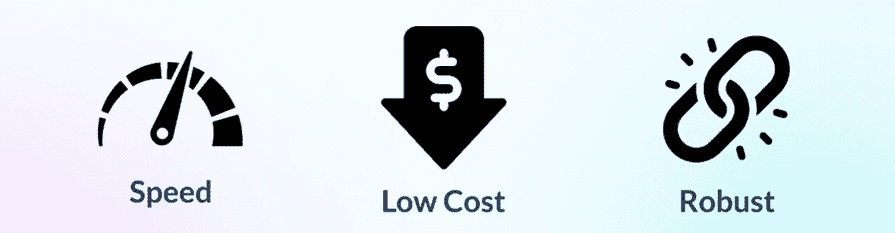
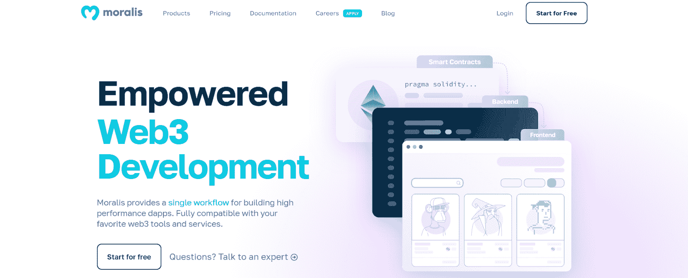
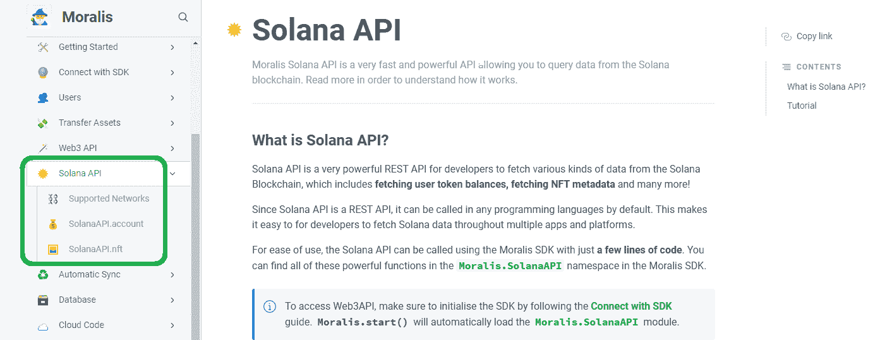
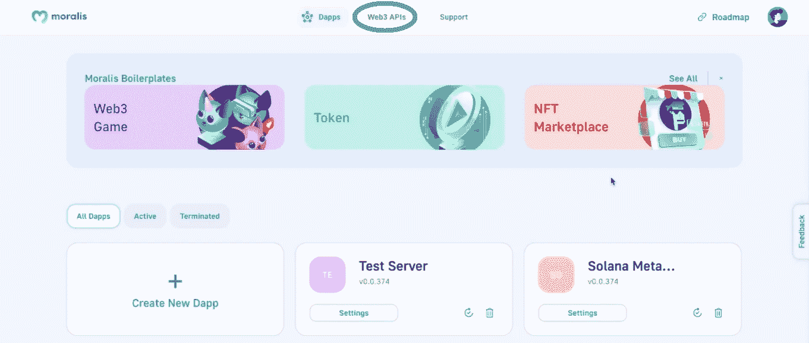
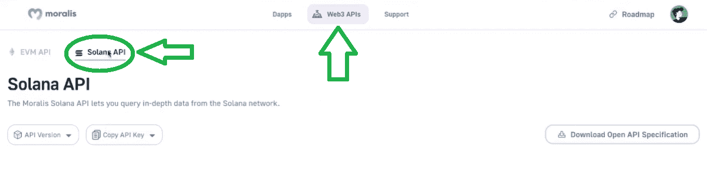
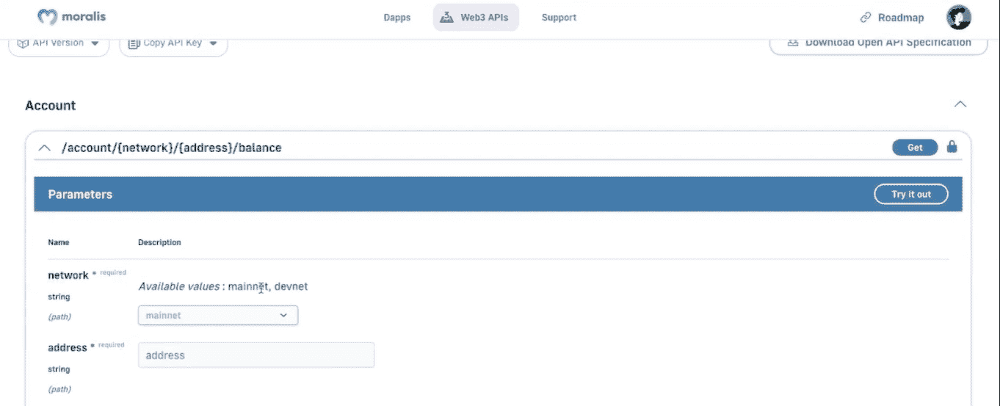
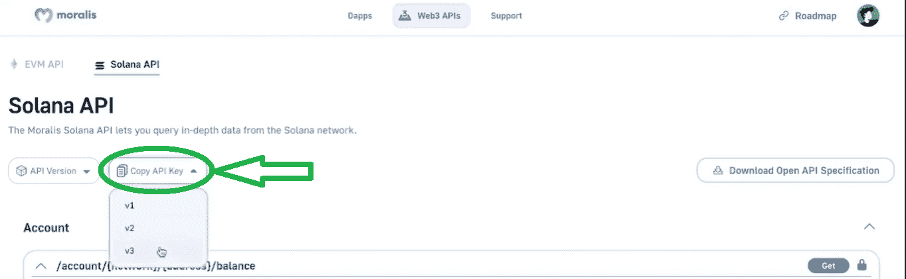
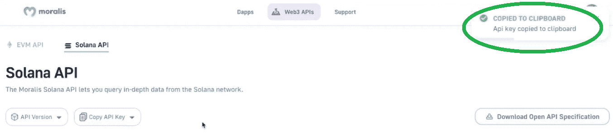

# 为什么要建立在索拉纳身上？索拉纳发育解释说

> 原文：<https://moralis.io/why-build-on-solana-solana-development-explained/>

如果你刚刚进入加密行业，想成为一名 Web3 开发者，事情可能会变得难以应对。有太多的东西要学，太多的决定要做。其中之一就是决定关注哪一条链。而且，正如标题所暗示的，在这里我们将看看为什么要建立在索拉纳的一些主要原因。这家受欢迎的连锁店只是众多信誉良好的连锁店之一。然而，这个网络有一些令人印象深刻的特性，使它成为开发人员的热门选择。此外，鉴于目前的市场状况，现在是专注于建设的最佳时机。此外，知道为什么要建立索拉纳将有助于你在选择网络时做出明智的决定。

除了学习为什么要在 Solana 上构建之外，本文还将让您了解最终的 Web3 开发平台—[Moralis](https://moralis.io/)。这个 Firebase for crypto 工具可以让你在 Solana 上的开发工作尽可能简单明了。此外，由于 Moralis 完全是关于跨链的互操作性，它使您的工作经得起未来的考验。所以，即使你今天有足够的理由支持索拉纳，条件或你的观点在未来可能会改变。然后，能够切换到任何其他信誉良好的连锁店，这是 Moralis 提供的，将是无价的。有了 universal Moralis 的 SDK，你也可以在各种熟悉的平台上工作。此外，当你使用 Moralis 的力量时，你的前端技能和一些 Web3 基础知识是你创建杀手级 dapps(去中心化应用)所需要的。说了这么多，让我们更详细地看看为什么要在索拉纳身上做文章。

## 索拉纳是什么？

如果你不知道索拉纳是什么，讨论“为什么要建立在索拉纳之上”似乎很有挑战性。所以，如果你还没有掌握基本知识，一定要把重点放在下面的段落上。但是，如果你已经可以自信地回答出 [*索拉纳是什么*](https://moralis.io/what-is-solana-the-full-2022-guide/) *了，那就放心跳到下一节吧。*

索拉纳由两位开发者阿纳托利·亚科文科和拉吉·戈卡尔于 2017 年推出。作为索拉纳实验室的现任首席执行官和首席运营官，亚科文科和戈卡尔仍然在开发这个经常被称为“以太坊杀手”的重要角色。此外，Solana 是一个公共和开源的可编程区块链。因此，它支持智能合约，在 Solana 的例子中，智能合约被称为“程序”。因此，索拉纳程序是索拉纳编程的支柱。他们还确保在索拉纳上可替换和不可替换的令牌被正确地铸造。除了支持令牌，Solana 还支持各种 dapps。

此外，为了支付这个链上的交易费用，您需要 Solana 的本地令牌——SOL。除了支付交易费用之外，SOL 还通过 Solana 的混合 DeFi staking consensus 提供网络安全。这种本地货币也被用来转移索拉纳的价值。此外，虽然 Solana 使用了一种混合共识机制，但从技术上来说，它仍然属于利益证明(PoS)链的范畴。毕竟，这是 Solana 的 PoS 协议，staked SOL 在其中进行“挖掘”。因此，Solana 的 PoS 确保了所有 Solana 节点的准确信息。

如果你有兴趣了解 Solana 的混合共识机制和 SOL 的令牌组学的更多细节，请使用上面的“什么是 Solana”链接。

# 为什么要建立在索拉纳身上？

建立在 Solana 基础上的原因有很多——在这里，我们将集中讨论三个主要原因。这些是速度、低成本和鲁棒性。接下来，我们将仔细研究这三个原因。

### 索拉纳的速度

索拉纳是最快的区块链之一，如果不是最快的话。它的理论输出是每秒 65，000 次交易。由于这个数字本身可能不能告诉你很多，让我们比较一下两个最受欢迎的区块链和一个最受欢迎的跨国金融服务的速度。与比特币平均每秒 3 至 7 笔交易相比，索拉纳的速度快了约 1 万倍。此外，它比以太坊每秒 15 次交易的平均速度快 4000 多倍。

而且，即使我们将 Solana 的速度与 Visa 的速度进行比较，它仍然快 2.5 倍。后者尤其令人印象深刻，因为速度通常是集中式系统相对于分散式系统的主要优势之一。

索拉纳能够输出这样的速度多亏了它的混合共识系统。特别是，索拉纳的原始检查保持计数或计数的时间流逝。这是索拉纳实验室所谓的“历史证明”(PoH)协议的核心。正是由于这一核心创新，Solana 上的交易可以并行运行。

### 索拉纳的低交易费

我们所有人都必须为以太坊的许多东西喝彩，尽管它们极高的交易费并不在其中。它们是一个大麻烦，特别是对于预算紧张的用户和开发人员。而且，即使你有一个庞大的预算，花费数百美元进行交易仍然是痛苦的。因此，索拉纳的低交易费就像炎炎夏日的一缕清风。

Solana 的平均交易费用为每笔 0.00025 美元。让我们再和其他受欢迎的连锁店比较一下。以太坊上，平均气 24.48 美元；然而，我们已经看到这些价格远远超过 100 美元。在 BNB 连锁(前币安智能连锁)，交易费平均约为 0.15 美元。即使与 Polygon 的 0.0005-0.2 美元相比，Solana 也是最便宜的。

### 索拉纳的忠诚

当然，这里有讨论的余地；然而，大多数人认为索拉纳非常健壮。然而，索拉纳不是一个 EVM 兼容链。因此它不是用 Go 而是用 Rust 编程语言构建的。如你所知，后者被认为是一门相当难学的语言。然而，这导致开发人员减少，但是了解 Rust 的开发人员通常非常熟练。因此，用 Rust 构建的程序往往质量更高。尤其是从安全角度来看。不是每个人都同意，但是根据精通这两种语言的开发人员的说法，Rust 比 Solidity 提供了更多的安全性。

现在我们已经介绍了 Solana 链的三个主要优势，您已经知道为什么要在 Solana 上构建。因此，是时候仔细看看在 Solana 上编程时的工作流了。

## 从为什么到如何——构建 Solana Dapps 的工作流程

如果你已经在其他区块链上构建了 dapp，那么在构建 Solana dapps 时，你需要遵循相同的工作流程。如果是更高级的 Web3 应用，你通常会从创建智能合同(程序)开始。然而，有各种各样的 dapps(例如:探险者，NFT 仪表板等。)来创建，而无需部署自己的智能合约。在创建程序时，你可以使用 Rust，或者通过使用 Anchor 框架让事情变得简单一些。后者相当于索拉纳的安全帽。尽管如此，在铸造 Solana NFTs(不可替换的令牌)时，您也可以使用 Metaplex。

此外，除了智能合约，您还需要有一个适当的后端。这就是索拉纳指数发生的地方——索尔余额、SPL 令牌(可替代和不可替代)余额、NFT 元数据等等。但是你可能知道，给区块链做指数是很有挑战性的。因此，从头开始构建后端是非常耗时的。

最后，您需要确保您的 Web3 应用程序是用户友好的，并提供良好的用户体验。因此，你需要创建一个质量前端。通常，您可以通过使用 SDK 和抽象来实现这一点。最典型的就是 Solana Web3.js 库。此外，参考资料中有许多教程可以让创建合适的前端变得相当容易。因此，后端部分往往是在 Solana 或任何其他链上创建 dapps 的难点。而且，更令人沮丧的是，基本上，所有的 dapps 都需要类似的后端功能。因此，如果你自己去做，你需要重新发明轮子。

但幸运的是，您可以利用 Moralis 的 Solana API，这将带来一个不同的世界。它使你只用几行代码就能做索拉纳索引。

### 使用 Moralis 家的索拉纳 API

使用 [Moralis 的 Solana API](https://docs.moralis.io/moralis-dapp/solana-api) 使得构建 Solana 变得非常容易。此外，开始使用这个强大的工具也非常简单。此外，您有两种方法可以做到这一点:

1.  使用 SDK 调用 Solana API
2.  将 Solana API 称为 REST APIs

要了解如何使用 Moralis SDK 调用 Solana API，请访问 Moralis 文档。在那里，选择“Solana API”部分:

在那里，你会看到两个主要的类别，“SolanaAPI.acount”和“SolanaAPI.nft”。前者包括“balance”、“getSPL”、“getNFTs”和“getPortfolio”，它同时处理前面三种方法。但是，如果您想围绕 NFTs 构建您的 Solana dapps，那么“SolanaAPI.nft”是您需要关注的。这是获取想要索引的 NFT 元数据的最简单方法。

#### 如何像调用 REST APIs 一样调用 Solana API

另一方面，您可以将 Solana API 称为 REST APIs。这种方法的伟大之处在于，您可以使用任何您想要的语言编程语言。您可以通过创建您的免费 Moralis 帐户，然后点击您的管理区域中的“Web3 APIs”选项卡来访问详细信息:

接下来，确保选择“Solana API”:

在那里，您将能够看到您可以使用的链接。当然，你需要输入正确的参数。因此，要了解每个链接的参数，只需点击它:

尽管如此，要使用 Moralis 的 Solana API 作为 REST APIs，您还需要复制 API 密钥。您可以在 Moralis admin 的“Web3 APIs”选项卡的“Solana API”窗口中完成此操作:

只要您单击想要使用的版本，就会看到通知，告诉您 API 密钥已经复制到您的剪贴板:

然后，您只需将 API 密钥粘贴到代码头中，就万事大吉了。

如果你是一个视频爱好者，请务必观看我们的内部专家解释为什么要在 Solana 上构建:

https://www.youtube.com/watch?v=TTdcs7EYfcw

## 为什么要建立在索拉纳身上？Solana 开发说明–摘要

在这一点上，你知道有三个主要原因，为什么要建立在索拉纳。这些是索拉纳的速度，低交易费，和鲁棒性。而且，在今天的文章中，你也了解到了构建 Solana dapps 的工作流程与构建以太坊 dapps 的工作流程基本相同。因此，您需要智能合同(程序)，您可以自己创建或使用现有的合同。然后，你需要创建后端，最后构建一个合适的前端，给用户一个与你的 dapps 交互的方法。此外，您还了解了创建后端是非常费力和耗时的。然而，幸运的是，有一种方法可以利用现有的基础设施。有了 Moralis 的支持，你可以将所有的精力和资源集中在提供最有吸引力的前端上。

最后但同样重要的是，您还了解了如何通过 SDK 或 REST API 使用 Moralis 的 Solana API。因此，现在轮到你卷起袖子，把你在这里获得的信息付诸实践了。如果你已经有了自己的想法，并想继续努力，那很好。然而，如果你想先通过一些示例项目来提升你的技能和信心，一定要去看看 Moralis 的博客。在那里，你可以学习如何在普通 JavaScript 中使用索拉纳 API，如何用 Metaplex 制作索拉纳 NFT，如何用 Phantom 钱包验证索拉纳用户，等等。

另一方面，Moralis 家的博客也是探索其他区块链发展话题的地方。结合 [Moralis 的 YouTube 频道](https://www.youtube.com/c/MoralisWeb3)，你可以利用它成为一名真正的区块链开发者。使用 Moralis 的 NFT API，例如[在几分钟内开始生成 NFT](https://nftcoders.com/begin-generating-nfts-in-15-minutes/)，或者[如何创建一个 NFT 铸造网站](https://nftcoders.com/create-an-nft-minting-website-in-5-steps/)。然而，如果你喜欢更专业的方式来接受加密教育，那么[Moralis 学院](https://academy.moralis.io/)是你应该去的地方。