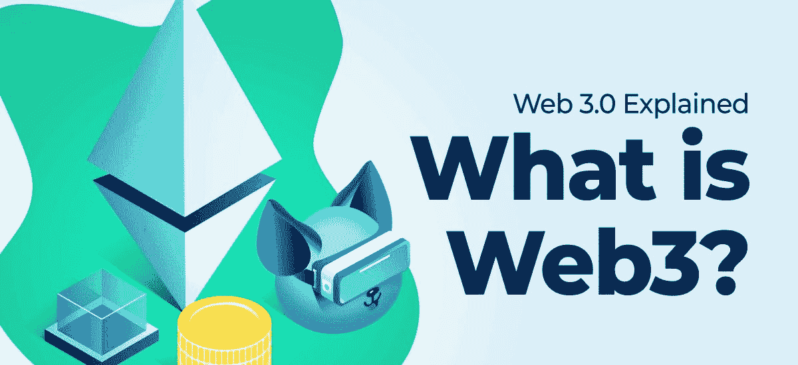
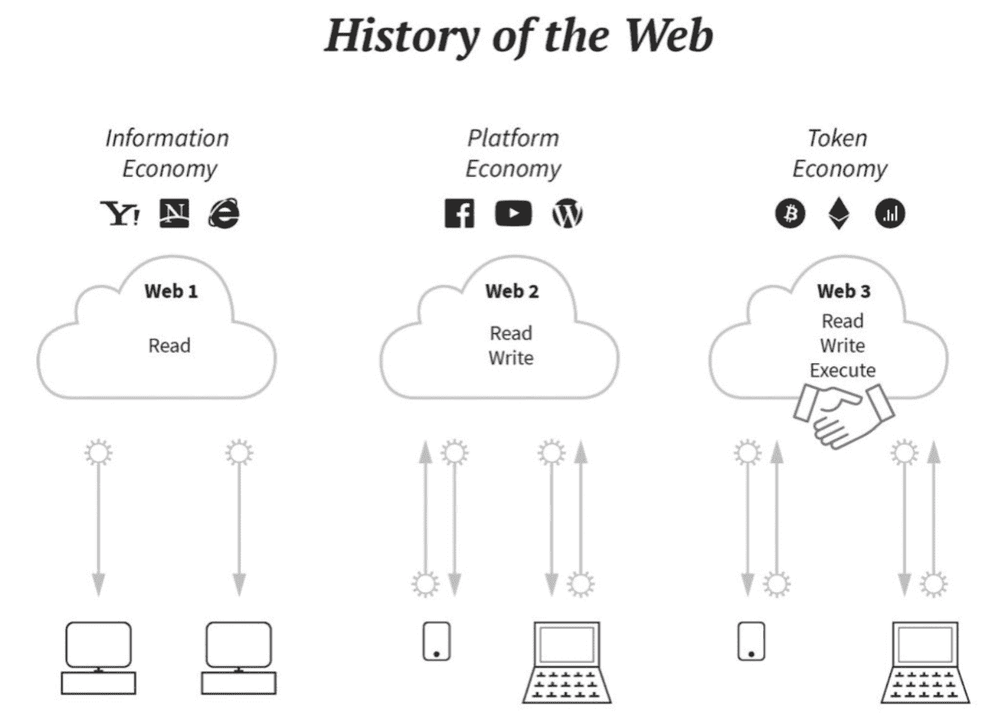

# 为什么 Web3 很重要？初学者指南

> 原文：<https://moralis.io/why-is-web3-important-a-beginners-guide/>

即使你是区块链行业的新手或者不熟悉这个行业，你也很可能偶然发现了“Web3”这个术语。主流媒体越来越多地使用这个术语，这意味着 Web3 正在成为普通人词汇的一部分。然而，尽管这个概念受到越来越多的关注，但并不是每个人都熟悉 Web3 需要什么。鉴于这种情况，我们将在本文中更深入地探讨去中心化的 web，并提供一个可以理解的解释，说明为什么 Web3 如此重要。

首先，我们将提供 Web3 的概述，并将其与我们更熟悉的概念 Web1 和 Web2 进行比较。接下来，我们将深入探究为什么 Web3 最近获得了越来越多的关注。最后，我们将通过描述 Web3 的当前状态及其与元宇宙的连接来结束一切。

此外，我们不能谈论 Web3 而不提到 Moralis，因为操作系统对区块链的发展是必不可少的。Moralis 使 [Web3 开发](https://moralis.io/how-to-build-decentralized-apps-dapps-quickly-and-easily/)民主化，让任何人都能够构建强大的区块链应用程序，而无需手动设置自己的 Web3 后端。此外，Moralis 允许他们在几分钟和几小时内创建 [dapps](https://moralis.io/decentralized-applications-explained-what-are-dapps/) 和 Web3 项目，而不是几周和几个月。例如，你可以使用 Moralis 在 15 分钟内[创建一个 NFT 市场](https://moralis.io/how-to-create-an-nft-marketplace/)！

因此，如果你想成为一名区块链开发者，注册 Moralis 是对你最有利的。通过这样做，您不仅可以使用 Moralis 的高级 Web3 后端基础设施，还可以使用其他类似的开发工具。例如，你会发现 [Moralis Speedy Nodes](https://moralis.io/speedy-nodes/) 、对 [IPFS](https://moralis.io/what-is-ipfs-interplanetary-file-system/) 的本地支持、 [Moralis Price API](https://moralis.io/introducing-the-moralis-price-api/) 以及更多这些工具。

尽管如此，让我们通过仔细看看去中心化网络需要什么来开始这篇关于为什么 Web3 是重要的指南。

## 什么是 Web3？

在试图理解 Web3 为什么重要之前，我们需要定义这个概念。这说起来容易做起来难，因为人们对 Web3 到底需要什么存在矛盾，并且存在许多定义。简而言之，第三代网络是以去中心化区块链技术为核心的新版互联网。

区块链是一些最著名的加密货币背后的相同技术，如比特币或[以太坊](https://moralis.io/full-guide-what-is-ethereum/)，它是去中心化网络的一个核心方面。那么，什么是区块链？

区块链是一个分布式数据库或分类帐，在一个庞大的节点网络中共享。这些节点对于网络至关重要，因为它们通过保持链上发生的所有事件和交易的不变记录来确保区块链的安全性。因此，区块链技术允许更高程度的去中心化，这是这种新版本互联网的一个重要方面。此外，该系统使数据流透明，因为所有信息都是公开的。因此，它限制了误用和欺诈行为，使得欺骗系统更加困难。

人们认为，这种新版本的互联网将采取多种形式。这包括“玩到赚”视频游戏、NFT 平台、去中心化社交网络、DeFi(去中心化金融)平台等。此外，技术和创新的新解决方案表明，Web3 可能会改变我们所知的互联网，创造一个没有中介的新数字经济。

建立这样的项目并为去中心化网络做贡献的最简单快捷的方法就是使用 Moralis。一个明显的例子是 Moralis 关于如何建立一个 Web3 亚马逊市场的文章。

然而，为了让事情更容易理解，并说明为什么 Web3 很重要，将 Web3 与我们已经知道的 Web1 和 Web2 进行比较是有益的。

### Web3 与 Web1 和 Web2 相比如何？

一般来说，我们可以将互联网的历史分为三个阶段:Web1、Web2 和 Web3。你可能对这两个术语都不熟悉；然而，你肯定已经和网络的前两个版本交互过了。

顾名思义，Web1 指的是互联网的第一阶段。在这一阶段，网络的主要目的是促进信息的供应和消费。这意味着 Web1 缺乏交互元素，使得互联网相对静止。因此，人们大多是在网上阅读内容，没有办法投稿。

然而，随着大型社交媒体公司的崛起，网络变得更加互动。这是互联网过渡到第二阶段的时候:Web2。有了 Web2，网络体验变得更加动态。这意味着人们可以通过提供自己的内容来参与和贡献。

Web2 催生了世界上一些最杰出的组织，如脸书(现在的 Meta)、YouTube、Twitter 等。这些公司最终分发和货币化了大部分网络活动，以集中的方式为自己保留资金和控制权。

然而，Web2 的集中化带来了隐私、透明度、单点故障等问题。现在，Web3 的目标是用开放协议和社区运营的分散网络取代大型的集中式企业平台。此外，这意味着它保留了 Web1 的开放基础设施和 Web2 的公众参与，同时将这些特征与去中心化相结合。因此，Web3 有可能让互联网摆脱一些最重要的集中化问题。

## 分散式网络的优势

在上一节中，我们讨论了去中心化和当前集中式互联网的问题。然而，去中心化网络有什么好处呢？

首先，Web3 平台为用户提供了更多的机会来将他们的活动货币化，并为不同的平台做出贡献。这是今天的大型平台不允许或没有能力促成的事情。

一个例子是大量的数据聚集，比如 Meta 从中获利。他们积累用户数据来销售定向广告，这是一种非常有利可图的商业模式。然而，分散的元替代方案可能允许用户将他们自己的数据货币化。

另一个令人兴奋的项目可能是 Spotify 的 Web3 版本，例如使用 Web3 登录或以 NFTs 为特色。用户本质上可以作为赞助人工作，以换取流媒体版税的股份。如果您对此感兴趣，您可以了解更多关于使用 Moralis 构建 Web3 就绪项目的信息，比如一个 [Web3 Spotify](https://moralis.io/how-to-build-a-web3-spotify-clone/) 克隆！

Web3 的第二个好处是平台可以被民主管理，这在 Web2 中并不明显。Meta 和 Twitter 等社交媒体集团基本上是专制的。这意味着负责人可以随心所欲地禁止账户和改变规则。一个现代的替代方案可以将这种权力民主化，并将这些决定权委托给用户。反过来，不是一个人或一个实体拥有最终的权力，用户可以对重要事项进行投票。

最后，去中心化的网络很可能会减少对基于广告的商业模式的依赖。这为用户提供了更多的隐私，因为较少的追踪器和有针对性的广告困扰着他们。然而，这些只是解释为什么 Web3 如此重要的几个好处的例子。

## 为什么 Web3 很重要，为什么人们在讨论 Web3？

一些人声称对 Web3 的大肆宣传是市场营销和 FOMO(害怕错过)的结果；然而，这还不是故事的全部！对去中心化网络越来越多的关注也受到了涌入区块链和加密初创公司的人才、资本和精力的影响。

仅在 2021 年，投资公司就向加密项目投入了超过 270 亿美元，其中大部分资金被用于资助 Web3 项目。此外，一些最大的社交媒体平台，包括 Twitter 和 Reddit，也在尝试使用 Web3 来分一杯羹。

目前，更广泛的 Web3 行业正在吸收大量技术人才。具体来说，一些最著名的科技公司的员工离开稳定舒适的工作，去分散的网络中寻求新的冒险。

另一个凸显 Web3 重要性的有趣领域是 NFTs(不可替代令牌)。NFTs 目前正在蓬勃发展，并呈现出一些行业内最有趣的项目。这些代币已经被主流媒体采用，并成为头条新闻已经有一段时间了。随着大量的宣传，您可能已经熟悉了 NFTs。然而，如果不是这样，你绝对应该看看 Moralis 的文章，回答问题"[什么是 NFT？](https://moralis.io/non-fungible-tokens-explained-what-are-nfts/)”。

投入这个领域的资金、人才和精力显示了 Web3 现在有多火。因此，如果你有兴趣，你应该在[Moralis 博客](https://moralis.io/blog/)上关注 Web3！

## Web3 和元宇宙

最近另一个广为人知的时髦词是元宇宙。你很可能偶然发现了这个术语。然而，这是什么意思，Web3 和它有什么关系？

元宇宙是我们目前用来描述沉浸式数字世界的术语，在这个世界中，人们可以玩游戏、社交、参加会议和进行其他活动。随着脸书更名为 Meta,“元宇宙”一词获得了越来越多的关注。然而，这个术语在 90 年代早期就已经出现了，在电影、文学和游戏中也有所涉及。

许多人认为，Web3 是促进元宇宙的重要组成部分，因为它允许创建不受大型实体控制的去中心化数字世界，这是说明 Web3 为什么重要的另一点。此外，加密令牌(如 NFTs)也有可能代表元宇宙中的项目。例如，这些类型的令牌可能代表一个化身、数字世界中的一块土地或其他项目。

分散式网络和元宇宙的可能性是无限的。此外，建立元宇宙和区块链项目的最简单方法是与 Moralis 合作。Moralis 的元宇宙 SDK 让创建 Web3 游戏和平台变得超级简单。例如，你可以看看我们关于[如何用 Unity 创建一个元宇宙 dapp】或者](https://moralis.io/how-to-create-a-metaverse-dapp-with-unity/)[如何构建一个中世纪的元宇宙游戏](https://moralis.io/how-to-build-a-medieval-metaverse-game/)的文章！

## 为什么 Web3 很重要？–总结

Web3 变得越来越流行，很可能是大多数人很快就会知道的一个术语。这是互联网的下一个阶段，它的特点是去中心化。此外，这是一个使用区块链技术构建的生态系统，与加密货币背后的技术相同。

那么，Web3 为什么重要？嗯，仅在 2021 年，风险资本家就向加密项目投入了超过 270 亿美元，其中许多都与去中心化的网络有关。除了投资，该领域还吸引了一些最大公司的技术人才。因此，我们肯定会在 2022 年看到 Web3 的进一步发展。这表明这是你在不久的将来应该密切关注的事情。

如果你有兴趣了解为什么 Web3 如此重要，并且想成为一名区块链开发者，那你来对地方了。Moralis 是区块链开发的首要操作系统。此外，如果你[与 Moralis](https://admin.moralis.io/register) 签约，你将能够为所有未来的区块链项目减少平均 87%的开发时间！

Moralis 进一步提供了独特的内容，为您指明成为开发人员的正确方向，并强调了 Web3 的重要性。例如，你可以阅读更多关于[区块链开发的最佳语言](https://moralis.io/best-languages-for-blockchain-development-full-tutorial/)和[以太坊初学者开发](https://moralis.io/ethereum-development-for-beginners/)的内容，这两本指南对区块链开发有更多的启发。